# 2016年江苏省公务员录用考试《行测》题（B类）

> 资料分析 · 20 题 · 江苏 2016

## 材料 1

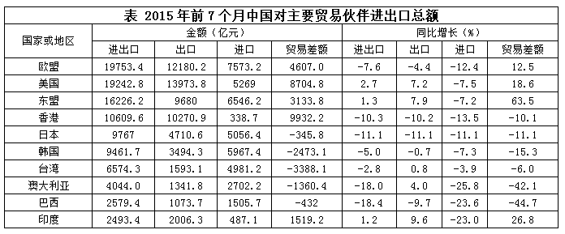

### 第 1 题　qid 2033788 · 增长

2015年前7个月，中国对其贸易顺差同比增长最快的主要贸易伙伴是：

- **A**. 香港
- **B**. 东盟　✅
- **C**. 台湾
- **D**. 巴西

**答案**：B

**官方解析**

贸易顺差即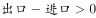，即表格中贸易差额大于0。2015年前7个月，中国对其实现贸易顺差的有欧盟、美国、东盟、香港、印度，对应的增长率分别为，，，，。对东盟的贸易差额增长最快。

故正确答案为B。

---

### 第 2 题　qid 2033790 · 增长

2015年前7个月，中国对其贸易逆差同比减少的主要贸易伙伴有：

- **A**. 3个
- **B**. 4个
- **C**. 5个　✅
- **D**. 6个

**答案**：C

**官方解析**

贸易逆差即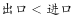，对应表格中，定位表格可得，中国对其实现贸易逆差的有日本、韩国、台湾、澳大利亚、巴西，其对应的增长率均小于0。因此5个贸易伙伴的贸易差额均同比减少。

故正确答案为C。

---

### 第 3 题　qid 2033794 · 综合

2014年前7个月，中国对澳大利亚的出口额是：

- **A**. 1290.2亿元　✅
- **B**. 1341.8亿元
- **C**. 1395.5亿元
- **D**. 3648.5亿元

**答案**：A

**官方解析**

由问题所求“2014年前7个月，中国对澳大利亚的出口额是”，可判定此题为基期计算问题。定位表格可得，2015年前7个月，中国对澳大利亚的出口额为1341.8亿元，同比增长，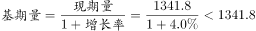，仅A项满足。

故正确答案为A。

---

### 第 4 题　qid 2033796 · 增长

2015年前7个月，中国对欧盟和美国的出口额同比平均增长：

- **A**. 

- **B**. 
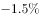

- **C**. 

　✅
- **D**. 

**答案**：C

**官方解析**

由问题所求“2015年前7个月，中国对欧盟和美国的出口额同比平均增长”，选项为百分数，可判定此题为混合增长率问题。定位表格可得，2015年前7个月，中国对欧盟的出口额为12180.2亿元，同比增长，对美国的出口额为13973.8亿元，同比增长，则2014年前七个月，中国对欧盟的出口额为亿元，中国对美国的出口额为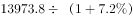亿元。根据混合增长率口诀“居中但不中，偏向基期较大的”，则混合增长率应略大于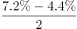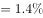，排除A、B选项。C、D选项相差较小，考虑线段法，因，基期量即为分母，所以增速差与基期量成反比（因选项差距小，不能用现期量近似替代基期量计算，否则会误选D选项）。设2015年前7个月，中国对欧盟和美国的出口额同比平均增长，则根据线段法“增速差与基期量成反比”，可得，直接求解比较复杂，代入C选项成立，而D选项差距较大。

故正确答案为C。

---

### 第 5 题　qid 2033798 · 综合

下列判断正确的是：

- **A**. 2014年前7个月，中国对日本的贸易总额比对韩国的少
- **B**. 2015年前7个月，中国对主要贸易伙伴的贸易顺差同比均有所增长
- **C**. 2015年前7个月，中国对其出口额超过5000亿元的主要贸易伙伴数是4　✅
- **D**. 2015年前7个月，中国对其进口额和出口额同比变动方向一致的主要贸易伙伴数不足一半

**答案**：C

**官方解析**

A项：定位表格可得，2015年前7个月，中国对日本的进出口额为9767.0亿元，同比增长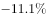，对韩国的进出口额为9461.7亿元，同比增长，则2014年前7个月，中国对日本的进出口额为，对韩国的进出口额为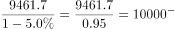，故中国对日本的贸易总额比对韩国的多，错误；

B项：定位表格可得，2015年前7个月，中国对香港实现贸易顺差，但贸易差额同比下降，错误；

C项：定位表格可得，2015年前7个月，中国对其出口额超过5000亿元的主要贸易伙伴为欧盟、美国、东盟、香港，共4个，正确；

D项：定位表格可得，主要贸易伙伴共10个，2015年前7个月，中国对其进口额和出口额同比变动方向一致的主要贸易伙伴为欧盟、香港、日本、韩国、巴西，共5个，恰好占一半，错误。

故正确答案为C。

---

## 材料 2

        2014年末全国就业人员77253万人，比上年末增加276万人。其中，城镇就业人员39310万人，比上年末增加1070万人。

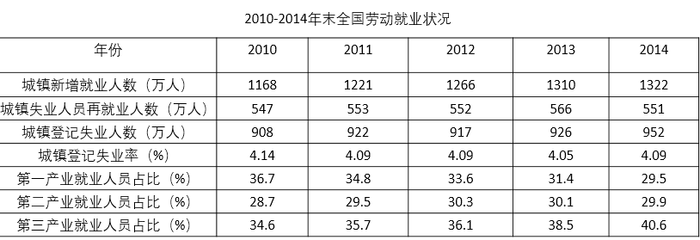

### 第 6 题　qid 2032198 · 增长

2014年末全国城镇新增就业人数比2013年末增长：

- **A**. 

- **B**. 

　✅
- **C**. 

- **D**. 

**答案**：B

**官方解析**

由题干“比…增长”，结合选项都为百分数，可判定该题是求一般增长率问题。定位表格数据可得，2013年末全国城镇新增就业人数1310万人，2014年末全国城镇新增就业人数1322万人。，因此2014年末全国城镇新增就业人数比2013年末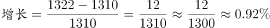。

故正确答案为B。

---

### 第 7 题　qid 2032200 · 综合

2013年末全国就业人员中从事第三产业的人数为：

- **A**. 23170万
- **B**. 24171万
- **C**. 29636万　✅
- **D**. 31365万

**答案**：C

**官方解析**

由题干“2013年…从事第三产业的人数为”，可判定该题是基期计算问题。定位文字材料和表格数据，2014年末全国就业人员77253万人，比上年末增加276万人，2013年末第三产业就业人员占比，因此，那么2013年末全国就业人员中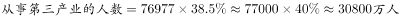，略大于答案C。

故正确答案为C。

---

### 第 8 题　qid 2032202 · 比重

和2010年末相比，2014年末全国第一产业就业人员占比提高了：

- **A**. -7.2个百分点　✅
- **B**. 1.2个百分点
- **C**. 6.0个百分点
- **D**. 7.2个百分点

**答案**：A

**官方解析**

由题干“占比提高”，结合材料中已经给出了2010和2014年全国第一产业就业人员占比，可判定该题属于简单加减计算问题。定位表格数据，2010年末全国第一产业就业人员占比，2014年末全国第一产业就业人员占比，因为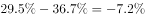，所以和2010年末相比，2014年末全国第一产业就业人员占比提高了-7.2个百分点。

故正确答案为A。

---

### 第 9 题　qid 2032204 · 比重

2011-2014年，全国城镇失业人员再就业人数占上年末全国城镇登记失业人数比重的最大值是：

- **A**. 
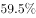

- **B**. 

- **C**. 
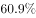

- **D**. 

　✅

**答案**：D

**官方解析**

由题干“2011—2014年···比重的最大值”，可判定该题是比值计算问题。

方法一：定位表格中数据，列表可得:

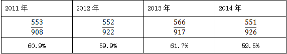

最大值为2013年的。

方法二：2011—2014年，全国城镇失业人员再就业人数占上年末全国城镇登记失业人数比分别为：2011年，2012年，2013年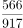，2014年，可得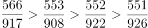，因此2011—2014年，全国城镇失业人员再就业人数占上年末全国城镇登记失业人数比重的最大值是2013年。

故正确答案为D。

---

### 第 10 题　qid 2032206 · 综合

下列判断正确的是：

- **A**. 2014年末全国第二产业就业人数比上年末有所增加
- **B**. 2014年末全国城镇就业人员比上年末增加1322万人
- **C**. 2011—2014年末，全国第三产业就业人员占比逐年增加　✅
- **D**. 2011—2014年末，全国城镇登记失业率和城镇登记失业人数的变化趋势相同

**答案**：C

**官方解析**

A项：，因为2014年末国第二产业就业人数，，错误；

B项：2014年城镇就业人员39310万人，比上年末增加1070万人，不是1322万人，错误；

C项：2011—2014年末全国第三产业就业人员占比分别为，，，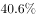，占比逐年增加，正确；

D项：2011—2014年末，全国城镇登记失业率变化趋势为：减-增；城镇登记失业人数的变化趋势为：增-减-增，错误。

故正确答案为C。

---

## 材料 3

        2015年1—6月我国火力、水力发电量及其增长情况

### 第 11 题　qid 1789652 · 综合

2015年1-6月我国火力发电量少于上年同期的月度个数是（    ）

- **A**. 3
- **B**. 4
- **C**. 5　✅
- **D**. 6

**答案**：C

**官方解析**

由题目问少于上年同期的月度个数，即增长率小于零的个数，可判定本题为直接找数问题，根据折线图可知，2月、3月、4月、5月、6月火力发电量同比增长率均小于零，即有5个月发电量同比减少。
故正确答案为C。

---

### 第 12 题　qid 1789628 · 增长

2014年我国季度发电量同比增长最慢的是：

- **A**. 第一季度
- **B**. 第二季度
- **C**. 第三季度
- **D**. 第四季度　✅

**答案**：D

**官方解析**

由题目所问“同比增长最慢”是哪一季度，判定本题为一般增长率比较问题。定位表格材料，2014年4个季度的同比增长率分别为：、、、，故增长最慢的是第四季度。

故正确答案为D。

---

### 第 13 题　qid 1789630 · 增长

2015年第二季度我国火力发电量比上年同期少：

- **A**. 232亿千瓦小时
- **B**. 240亿千瓦小时
- **C**. 340亿千瓦小时
- **D**. 365亿千瓦小时　✅

**答案**：D

**官方解析**

由题目所问“发电量比上年同期少”，可判定本题为增长量计算问题。因选项和条件精度相同，可采用尾数法。2014年第二季度我国火力发电量亿千瓦小时，由图中数据可得2015年第二季度火力发电量=亿千瓦小时。二者之差=，计算尾数得5，只有D项满足。

故正确答案为D。

---

### 第 14 题　qid 1789634 · 增长

如果2015年7月-11月我国水力发电量的月平均增速与2015年2月-6月保持相同，则2015年11月我国水力发电量可达：

- **A**. 1390亿千瓦小时
- **B**. 1870亿千瓦小时　✅
- **C**. 2063亿千瓦小时
- **D**. 2239亿千瓦小时

**答案**：B

**官方解析**

由题干给定“月平均增速”求现期，判定为年均增长率问题，定位图中数据，假设2015年7月-11月的月均增长速度为，则565，则2015年11月我国水力发电量为=。

故正确答案为B。

---

### 第 15 题　qid 1789640 · 综合

下列判断不正确的是：

- **A**. 
2014年有三个季度的水力发电量占发电总量的比重不超过

- **B**. 
2013年—2014年我国各季度火力发电量占发电总量的比重均超过

- **C**. 
2015年上半年我国水力与火力发电量各月同比增长的方向均相反
　✅
- **D**. 
2013年第二季度到2015年第二季度我国水力发电量有四个季度环比减少

**答案**：C

**官方解析**

A项：2014年一、二、三、四季度水力发电量占发电总量的比重分别为：、、、，即2014年一、二、四季度比重不超过，正确；

B项：2013年各个季度火力发电占总发电量的比重分别为：、、、；2014年各个季度火力发电占总发电量的比重分别为：、、、，即2013年-2014年我国各季度火力发电量占发电总，正确；

C项：2015年1月，水力和火力发电量同比增长率均大于零，二者方向相同，错误；

D项：由表格材料可知，2015年一、二季度水力发电量分别为：、，则2015年第一季度水力发电量小于2014年第四季度，共有四个季度环比减少，分别为2013年第四季度、2014年第一季度、2014年第四季度、2015年第一季度，正确。

本题为选非题，故正确答案为C。

---

## 材料 4

        2015年某市统计局进行了一次有关该市控制吸烟状况的调查。

        对“公共场所控烟状况改善效果”问题的调查结果显示：的受访市民表示效果明显，的表示效果一般，的表示没有效果，的表示效果很差。当对认为控烟“没有效果”“效果很差”的受访市民询问原因时，的女性受访市民认为“购买香烟过于方便”，比男性市民高出5.0个百分点；的市民认为“禁烟执法不严”（其它原因见图1），其中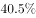的老年市民选择“禁烟执法不严”，比中年、青年市民分别高出2.9和5.6个百分点。

        对“公共场所全面禁烟最有效的方法与途径”问题的调查结果显示：的受访市民表示应该“加大处罚力度”（其他调查结果见图2）。其中，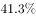的中年市民表示应该加大处罚力度，比青年和老年市民分别高出1.0和3.9个百分点。

        对“公共场所控烟条例修订及立法”问题的调查结果显示：的受访市民表示支持，的表示不支持，的表示无所谓；的女性受访市民表示支持，的男性市民表示支持。

### 第 16 题　qid 2033800 · 综合

对该市公共场所控烟改善效果，认为“效果明显”与“效果很差”的受访市民数之比是：

- **A**. 

- **B**. 
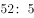
　✅
- **C**. 

- **D**. 
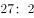

**答案**：B

**官方解析**

由问题所求“…与…之比是”，可判定此题为比值计算问题。定位材料第二段可得，对“公共场所控烟状况改善效果”问题的调查结果显示：的受访市民表示效果明显，的表示效果很差。二者之比为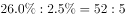。

故正确答案为B。

---

### 第 17 题　qid 2033802 · 比重

当对认为控烟“没有效果”“效果很差”的市民询问原因时，中年市民选择“禁烟执法不严”的比重比青年市民：

- **A**. 低2.9个百分点
- **B**. 高2.7个百分点　✅
- **C**. 低5.6个百分点
- **D**. 高8.5个百分点

**答案**：B

**官方解析**

由问题所求“…的比重比…”，选项为百分点，可判定此题为现期比重问题。定位材料第二段可得，的老年市民选择“禁烟执法不严”，比中年、青年市民分别高出2.9和5.6个百分点。则中年市民选择“禁烟执法不严”的比重比青年市民高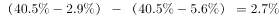，即高2.7个百分点。

故正确答案为B。

---

### 第 18 题　qid 2033804 · 综合

对于“公共场所全面禁烟最有效的方法与途径”表示“加大处罚力度”的受访市民人数比表示“扩大媒体宣传”的受访市民人数多：

- **A**. 

　✅
- **B**. 
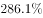

- **C**. 
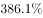

- **D**. 
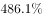

**答案**：A

**官方解析**

由问题所求“······的受访市民人数比······的受访市民人数多”，选项为百分数，可判定本题为增长率问题。定位图2可得，表示“加大处罚力度”的受访市民人数占，表示“扩大媒体宣传”的受访市民人数占，则前者比后者多，仅A项满足。

故正确答案为A。

---

### 第 19 题　qid 2033806 · 比重

本次调查中受访女性市民人数占受访总人数的比重是：

- **A**. 

- **B**. 

- **C**. 

　✅
- **D**. 

**答案**：C

**官方解析**

由问题所求“本次调查中受访女性市民人数占受访总人数的比重”，可判定此题为混合比重问题。定位文字材料第四段可得，的受访市民表示支持，的女性受访市民表示支持，的男性市民表示支持。则距离之比为，根据线段法，距离与量成反比，则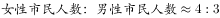，，C项最接近。

故正确答案为C。

---

### 第 20 题　qid 2033808 · 综合

关于本次调查，下列判断不正确的是：

- **A**. 
受访市民对“公共场所控烟条例修订及立法”表示不支持的占

- **B**. 
认为控烟“没有效果”“效果很差”的受访青年市民中，选择“禁烟执法不严”的比重为

- **C**. 
认为控烟“没有效果”“效果很差”的原因是“禁烟执法不严”和“公众对吸烟危害认识不足”的受访市民合计占受访市民的比重为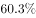
　✅
- **D**. 
在认为控烟“没有效果”“效果很差”的受访市民中，认为“购买香烟过于方便”的男性的比重小于女性

**答案**：C

**官方解析**

A项：定位文字材料第四段可得，“公共场所控烟条例修订及立法”问题的调查结果显示：的受访市民表示支持，的表示不支持，正确；

B项：定位文字材料第二段可得，的老年市民选择“禁烟执法不严”，比青年市民高出5.6个百分点，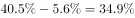，正确；

C项：定位文字材料第二段和图形材料可得，当对认为控烟“没有效果”“效果很差”的受访市民询问原因时，“禁烟执法不严”占比为，“公众对吸烟危害认识不足”占比为，合计占认为控烟“没有效果”“效果很差”的受访市民的比重为。

然而本项说法将“占认为控烟‘没有效果’‘效果很差’的受访市民的比重”偷换为“占受访市民的比重”，两个比重的分子相同但分母不同，错误；

D项：定位文字材料第二段和图形材料可得，在对认为控烟“没有效果”“效果很差”的受访市民询问原因时，分别有的女性受访市民和的男性受访市民认为“购买香烟过于方便”，合计有的受访市民认为“购买香烟过于方便”。

设认为控烟“没有效果”“效果很差”的男性和女性受访市民分别是和，则其中认为“购买香烟过于方便”的男性和女性受访市民分别是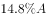和，合计为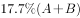，有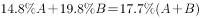，化简可得，所以，进而推出，即：在认为控烟“没有效果”“效果很差”的受访市民中，认为“购买香烟过于方便”的男性受访市民（）少于女性受访市民（），所以认为“购买香烟过于方便”的男性的比重小于女性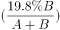，正确。

本题为选非题，故正确答案为C。

---
