# 2016年江苏省公务员录用考试《行测》题（C类）

> 资料分析 · 20 题 · 江苏 2016

## 材料 1

        2015年5月，国家统计局调查队在江苏省某市开展了农村养老现状专项调研。受访老人中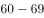岁的占，岁的占，80岁及其以上的占。受访老人中有一个子女的占，有两个子女的占，无子女的占。受访老人中与配偶同住的占，与未婚子女同住的占，与某个已婚子女同住的占，在子女家轮流住的占，独居的占。的受访老人为男性。从不同住子女探望老人的频率看，的受访老人表示每天来探望，的表示每周来探望，的表示每月来探望，其余的表示子女遇事或根据要求来探望。

        调查显示，看电视（）、串门聊天（）、打牌（）、散步（）、听广播（）和读书看报（）是农村老人的主要闲暇活动。当问及“你想不想参加集体活动”时，的受访老人表示“想参加”，的老人表示“可参加可不参加”，还有的老人表示“不想参加”。关于受访老人对当前生活状态的满意度，从年龄层看，岁、岁，80岁及其以上的老人对当前生活状态的满意度分别为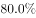、、；从居住状态看，与子女同住、与配偶同住、独居的老人对当前生活状态的满意度分别为、、；从与村委会互动的频率看，经常互动、偶尔互动、基本不互动的老人对当前生活状态的满意度分别为、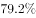、。

### 第 1 题　qid 1791862 · 比重

受访老人中有三个及以上子女的占比（    ）。

- **A**. 

- **B**. 
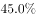
　✅
- **C**. 
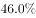

- **D**. 
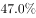

**答案**：B

**官方解析**

根据题干中“有三个及以上子女的占比”和文字材料第一段中“受访老人中有一个子女的占，有两个子女的占，无子女的占。”的数据可知，受访老人中有三个及以上子女的占比为：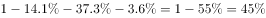。

故正确答案为B。

---

### 第 2 题　qid 1791864 · 综合

设与村委会经常互动、偶尔互动、基本不互动的受访老人对当前生活状态的满意度分别为a、b、c，则有（    ）。

- **A**. 

- **B**. 

- **C**. 

　✅
- **D**. 

**答案**：C

**官方解析**

根据文字材料第二段中“从与村委会互动的频率看，经常互动、偶尔互动、基本不互动的老人对当前生活状态的满意度分别为、、。”可知，，，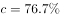。那么，。

故正确答案为C。

---

### 第 3 题　qid 1791866 · 比重

从不同住子女探望老人的频率看，占全体受访老人比重最大的是（    ）。

- **A**. 子女每月来探望的老人群体
- **B**. 子女每周来探望的老人群体
- **C**. 子女每天来探望的老人群体
- **D**. 子女遇事或根据要求来探望的老人群体　✅

**答案**：D

**官方解析**

根据文字材料第一段中“从不同住子女探望老人的频率看，的受访老人表示每天来探望，的表示每周来探望，的表示每月来探望，其余的表示子女遇事或根据要求来探望。”可知，子女遇事或根据要求来探望的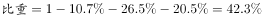，对比起来，此为占全体受访老人比重最大的部分。

故正确答案为D。

---

### 第 4 题　qid 1791868 · 平均数

受访老人对当前生活状态的平均满意度为（    ）。

- **A**. 

　✅
- **B**. 

- **C**. 

- **D**. 

**答案**：A

**官方解析**

根据文字材料第一段“受访老人中6069岁的占，7079岁的占，80岁及其以上的占。”和文字材料第二段“关于受访老人对当前生活状态的满意度，从年龄层看，6069岁、7079岁、80岁及其以上的老人对当前生活状态的满意度分别为、、；”数据可以计算出受访老人对当前生活状态的平均满意度为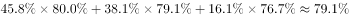。

故正确答案为A。

---

### 第 5 题　qid 1791870 · 综合

下列判断正确的是（  ）。

- **A**. 
受访老人中喜欢读书看报的多于喜欢打牌的

- **B**. 
在子女家轮流住的受访老人占

- **C**. 
喜欢看电视的受访老人都不喜欢听广播

- **D**. 
受访老人中女性占
　✅

**答案**：D

**官方解析**

A项：根据文字材料第二段“调查显示，打牌（）、读书看报（）是农村老人的主要闲暇活动。”可知，读书看报（）＜打牌（），错误；

B项：根据文字材料第一段“在子女家轮流住的占”可知，错误；

C项：根据文字材料第二段“调查显示，看电视（）、串门聊天（）、打牌（）、散步（）、听广播（）和读书看报（）是农村老人的主要闲暇活动。”可知，无法判断喜欢看电视的受访老人都不喜欢听广播，错误；

D项：根据文字材料第一段“的受访老人为男性。”可知，受访老人中女性占，正确。

故正确答案为D。

---

## 材料 2

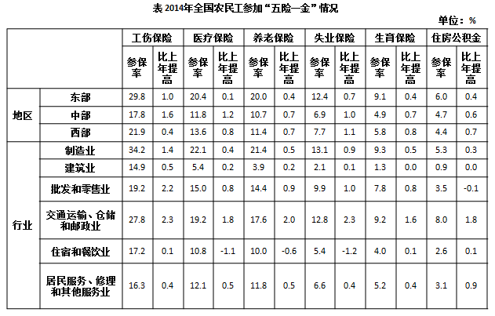

### 第 6 题　qid 1791872 · 综合

2013年东部地区农民工工伤保险参保率比中部地区高（  ）。

- **A**. 12.6个百分点　✅
- **B**. 12.0个百分点
- **C**. 11.7个百分点
- **D**. 10.0个百分点

**答案**：A

**官方解析**

定位表格，2013年东部地区农民工工伤保险参保率为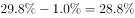，中部地区农民工工伤保险参保率为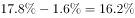，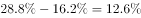，即提高了12.6个百分点。

故正确答案为A。 

---

### 第 7 题　qid 1791874 · 综合

2014年住宿和餐饮业的农民工医疗保险参保人数是失业保险参保人数的（  ）。

- **A**. 2倍　✅
- **B**. 1.5倍
- **C**. 0.8倍
- **D**. 0.5倍

**答案**：A

**官方解析**

根据“2014年农民工医疗保险参保人数是失业保险参保人数的”并结合选项，判定此题为现期倍数问题。定位表格，2014年住宿和餐饮业农民工医疗保险参保人数为，失业保险为，则参保人数前者是后者的。

故正确答案为A。 

---

### 第 8 题　qid 1791876 · 增长

下列行业中，2014年农民工失业保险参保率比上年提高最少的是（  ）。

- **A**. 建筑业
- **B**. 住宿和餐饮业　✅
- **C**. 制造业
- **D**. 批发和零售业

**答案**：B

**官方解析**

定位表格，对应选项2014年农民工失业保险参保率分别提高了、、、，提高最少的为住宿和餐饮业。

故正确答案为B。 

---

### 第 9 题　qid 1791878 · 综合

若以V工、V失、V医、V养、V生，分别表示2014年全国农民工“工伤保险”“失业保险”“医疗保险”“养老保险”“生育保险”参保率，则有（  ）。

- **A**. 
V工V失V养

- **B**. 
V医V失V养

- **C**. 
V工V生V养

- **D**. 
V工V养V生
　✅

**答案**：D

**官方解析**

根据选项为全国农民工各类保险参保率的排序，结合材料给出的是东部、中部、西部各地区农民工各类保险参保率，可判定此题为混合比重问题。观察表格，东部、中部、西部每个地区都是按照工伤、医疗、养老、失业、生育的顺序排列的，并且比重都是从大到小呈现的。三个地区各类保险的参保率混合后，其顺序还是这样从大到小排列，即2014年全国农民工各类保险的参保率从高到低排列的是工伤保险、医疗保险、养老保险、失业保险、生育保险，只有D项满足排序。
故正确答案为D。

---

### 第 10 题　qid 1791880 · 综合

下列判断错误的是（  ）。

- **A**. 
2014年制造业农民工养老保险参保率是建筑业的5倍以上

- **B**. 
2013年交通运输、仓储和邮政业农民工失业保险参保率是

- **C**. 
2014年西部地区农民工各项保险的参保率提升幅度均大于东部地区
　✅
- **D**. 
2014年农民工住房公积金缴纳率增幅最大的行业是居民服务、修理和其他服务业

**答案**：C

**官方解析**

A项：定位表格，2014年制造业、建筑业农民工养老保险参保率分别为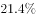、，倍数为 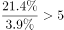，正确；

B项：定位表格，2013年交通运输、仓储和邮政业农民工失业保险参保率为，正确；

C项：定位表格，以工伤保险为例，东部、西部参保率提升幅度分别为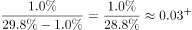、，东部大于西部，错误；

D项：定位表格，2014年农民工住房公积金缴纳率除“交通运输、仓储和邮政业”“居民服务、修理和其他服务业”外，增长较少，可排除。直接比较“交通运输、仓储和邮政业”“居民服务、修理和其他服务业”，其增长率分别为、，后者大于前者，正确。

本题为选非题，故正确答案为C。 

---

## 材料 3

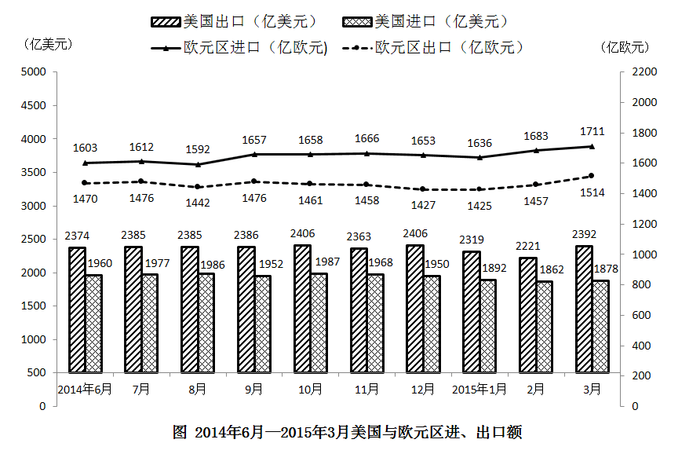

### 第 11 题　qid 2032186 · 平均数

2014年7月至2015年3月美国出口额月平均增量是：

- **A**. 0.8亿美元
- **B**. 0.9亿美元
- **C**. 1.8亿美元
- **D**. 2.0亿美元　✅

**答案**：D

**官方解析**

由问题所求“2014年7月至2015年3月······月平均增量”，可判定此题为年均增长量问题。这里是月份，时间换为月份。定位柱状图可得，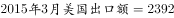，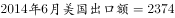。2014年7月至2015年3月共9个月的，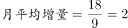。

故正确答案为D。

---

### 第 12 题　qid 2032188 · 综合

2014年7月至2015年3月欧元区进口额与出口额变动方向相反的月份个数有：

- **A**. 2个　✅
- **B**. 3个
- **C**. 4个
- **D**. 5个

**答案**：A

**官方解析**

 定位折线图可得，2014年7月至2015年3月欧元区进口额与出口额变动方向如下：

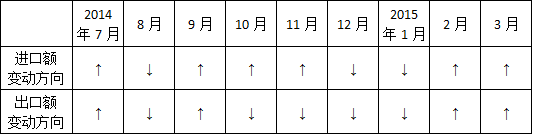

变动方向相反的为：2014年10月、11月，共2个月份。

故正确答案为A。

---

### 第 13 题　qid 2032190 · 综合

2014年6月至2015年3月美国贸易顺差最大的月份是：

- **A**. 2014年12月
- **B**. 2015年1月
- **C**. 2015年2月
- **D**. 2015年3月　✅

**答案**：D

**官方解析**

贸易顺差=出口额-进口额，定位柱状图可得：

A.；B.；

C. ；D.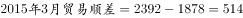；

D项2015年3月的贸易顺差最大。

故正确答案为D。

---

### 第 14 题　qid 2032194 · 增长

2014年7月至2015年3月美国与欧元区进、出口额月平均增速最快的是：

- **A**. 欧元区出口额
- **B**. 欧元区进口额　✅
- **C**. 美国出口额
- **D**. 美国进口额

**答案**：B

**官方解析**

由问题所求“2014年7月至2015年3月······月平均增速最快的是”，可判定此题为年均增长率比较问题。当时间段相同，比较月均增速时，只需比较 的大小。定位统计图可得，2014年7月至2015年3月，四选项的分别为：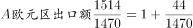，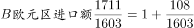，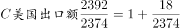，，明显B项最大。

故正确答案为B。

---

### 第 15 题　qid 2032196 · 综合

下列判断不正确的是：

- **A**. 2015年第1季度欧元区进口额环比有所增加
- **B**. 2015年1—3月美国进、出口额变动态势相同
- **C**. 2014年7月至2015年3月欧元区贸易逆差呈逐月增大的态势　✅
- **D**. 2014年6月至2015年3月美国月度最低进口额为1862亿美元

**答案**：C

**官方解析**

A项：定位折线图可得，2015年1、2、3月欧元区进口额分别为1636、1683、1711，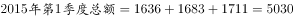；2014年10、11、12月欧元区进口额分别为1658、1666、1653，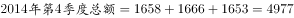，因此，2015年第1季度欧元区进口额环比增加，说法正确；

B项：定位柱状图可得，2014年12月、2015年1-3月，美国各月进口额为1950、1892、1862、1878，变动态势为先降后升；各月出口额为2406、2319、2221、2392，变动态势也为先降后升，说法正确；

C项：贸易逆差=进口额-出口额，定位折线图可以发现，,，贸易逆差小于上月，说法错误；

D项：定位柱状图可得，2014年6月至2015年3月美国进口额最低的为2015年2月的1862亿美元，说法正确。

本题为选非题，故正确答案为C。

---

## 材料 4

        2014年末全国就业人员77253万人，比上年末增加276万人。其中，城镇就业人员39310万人，比上年末增加1070万人。

### 第 16 题　qid 2032198 · 增长

2014年末全国城镇新增就业人数比2013年末增长：

- **A**. 

- **B**. 

　✅
- **C**. 

- **D**. 

**答案**：B

**官方解析**

由题干“比…增长”，结合选项都为百分数，可判定该题是求一般增长率问题。定位表格数据可得，2013年末全国城镇新增就业人数1310万人，2014年末全国城镇新增就业人数1322万人。，因此2014年末全国城镇新增就业人数比2013年末。

故正确答案为B。

---

### 第 17 题　qid 2032200 · 综合

2013年末全国就业人员中从事第三产业的人数为：

- **A**. 23170万
- **B**. 24171万
- **C**. 29636万　✅
- **D**. 31365万

**答案**：C

**官方解析**

由题干“2013年…从事第三产业的人数为”，可判定该题是基期计算问题。定位文字材料和表格数据，2014年末全国就业人员77253万人，比上年末增加276万人，2013年末第三产业就业人员占比，因此，那么2013年末全国就业人员中，略大于答案C。

故正确答案为C。

---

### 第 18 题　qid 2032202 · 比重

和2010年末相比，2014年末全国第一产业就业人员占比提高了：

- **A**. -7.2个百分点　✅
- **B**. 1.2个百分点
- **C**. 6.0个百分点
- **D**. 7.2个百分点

**答案**：A

**官方解析**

由题干“占比提高”，结合材料中已经给出了2010和2014年全国第一产业就业人员占比，可判定该题属于简单加减计算问题。定位表格数据，2010年末全国第一产业就业人员占比，2014年末全国第一产业就业人员占比，因为，所以和2010年末相比，2014年末全国第一产业就业人员占比提高了-7.2个百分点。

故正确答案为A。

---

### 第 19 题　qid 2032204 · 比重

2011-2014年，全国城镇失业人员再就业人数占上年末全国城镇登记失业人数比重的最大值是：

- **A**. 

- **B**. 

- **C**. 

- **D**. 

　✅

**答案**：D

**官方解析**

由题干“2011—2014年···比重的最大值”，可判定该题是比值计算问题。

方法一：定位表格中数据，列表可得:

最大值为2013年的。

方法二：2011—2014年，全国城镇失业人员再就业人数占上年末全国城镇登记失业人数比分别为：2011年，2012年，2013年，2014年，可得，因此2011—2014年，全国城镇失业人员再就业人数占上年末全国城镇登记失业人数比重的最大值是2013年。

故正确答案为D。

---

### 第 20 题　qid 2032206 · 综合

下列判断正确的是：

- **A**. 2014年末全国第二产业就业人数比上年末有所增加
- **B**. 2014年末全国城镇就业人员比上年末增加1322万人
- **C**. 2011—2014年末，全国第三产业就业人员占比逐年增加　✅
- **D**. 2011—2014年末，全国城镇登记失业率和城镇登记失业人数的变化趋势相同

**答案**：C

**官方解析**

A项：，因为2014年末国第二产业就业人数，，错误；

B项：2014年城镇就业人员39310万人，比上年末增加1070万人，不是1322万人，错误；

C项：2011—2014年末全国第三产业就业人员占比分别为，，，，占比逐年增加，正确；

D项：2011—2014年末，全国城镇登记失业率变化趋势为：减-增；城镇登记失业人数的变化趋势为：增-减-增，错误。

故正确答案为C。

---
