# 2016年江西省法检系统招录考试《行测》题

> 资料分析 · 15 题 · 江西 2016

## 材料 1

        2015年，在监测的我国338个城市中，城市空气质量达标的城市占，未达标的城市占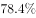。

        在监测的321个城市中，城市区域声环境质量好的城市占，较好的占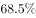，一般的占，较差的占，差的占。

        2015年末，城市污水处理厂日处理能力达到13784万立方米，比上年末增长；城市污水处理率达到。城市生活垃圾无害处理率达到，提高0.7个百分点。城市集中供热面积64.2亿平方米，增长。城市建成区绿地面积189万公顷，增长；建成区绿地率达到；人均公园绿地面积13.16平方米，增加0.08平方米。

### 第 1 题　qid 2255785 · 平均数

2014年人均公园绿地面积多少平方米？

- **A**. 13.1
- **B**. 13.08　✅
- **C**. 13.24
- **D**. 0.08

**答案**：B

**官方解析**

由题干“2014年······多少平方米”结合材料时间为2015年，判定本题为基期计算问题。定位文字材料第三段可得，2015年，人均公园绿地面积13.16平方米，增加0.08平方米。代入公式平方米。

故正确答案为B。

---

### 第 2 题　qid 2255786 · 综合

2015年，在监测的338个城市中，城市空气达标的城市约有多少个？

- **A**. 106
- **B**. 73　✅
- **C**. 132
- **D**. 8

**答案**：B

**官方解析**

由题干“2015年，在监测的338个城市中，城市空气达标的城市约有多少个”，判定本题为现期比重问题。定位文字材料第一段可得，2015年，在监测的我国338个城市中，城市空气质量达标的城市占。根据公式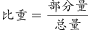，可推出公式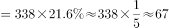个，与B项最接近。

故正确答案为B。

---

### 第 3 题　qid 2255787 · 综合

2015年，在监测的321个城市中，城市区域声环境质量较好以上的城市有多少个？

- **A**. 13
- **B**. 220
- **C**. 233　✅
- **D**. 268

**答案**：C

**官方解析**

由题干“2015年，在监测的321个城市中，城市区域声环境质量较好以上的城市有多少个”，判定本题为现期比重问题。定位文字材料第二段可得，2015年，在监测的321个城市中，城市区域声环境质量好的城市占，较好的占。根据公式，可推出公式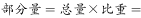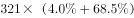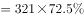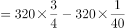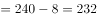个，与C项最接近。

故正确答案为C。

---

### 第 4 题　qid 2255788 · 综合

根据上述资料，不能推出的是：

- **A**. 2015年城市污水处理厂日处理能力比2014年有所提高
- **B**. 2015城市生活垃圾无害化处理能力比2014年稍有提高
- **C**. 2014年城市集中供热面积超过60亿平方米
- **D**. 2015年在监测的321个城市中，城市区域声环境质量差的超过5个　✅

**答案**：D

**官方解析**

A项：定位文字材料第三段可得，2015年末，城市污水处理厂日处理能力比上年末增长，正确，排除；

B项：定位文字材料第三段可得，2015年末，城市生活垃圾无害处理率比2014年提高0.7个百分点，正确，排除；

C项：定位文字材料第三段可得，2015年末，城市集中供热面积64.2亿平方米，增长，2014年城市集中供热面积超过了60，正确，排除；

D项：定位文字材料第二段可得，2015年，在监测的321个城市中，城市区域声环境质量差的占，根据公式，可推出公式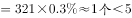，错误，当选。

本题为选非题，故正确答案为D。

---

### 第 5 题　qid 2255789 · 增长

根据上述资料，可以推出：

①2014年城市建成区绿地率为

②2015年城市污水处理率比2014年提高0.8个百分点

③2014年城市生活垃圾无害化处理率高于

- **A**. ①
- **B**. ①②
- **C**. ②③
- **D**. ③　✅

**答案**：D

**官方解析**

①：定位文字材料第三段可得，2015年末，建成区绿地率达到，只给出现期未给出增长量，无法求出基期，无中生有，错误。

②：定位文字材料第三段可得，2015年末，城市污水处理率达到，只给出现期未给出增长量，无法求出基期，无中生有，错误。

③：定位文字材料第三段可得，2015年末，城市生活垃圾无害处理率达到，提高0.7个自分点，则2014年城市生活垃圾无害化处理率为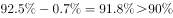，正确。

故正确答案为D。

---

## 材料 2

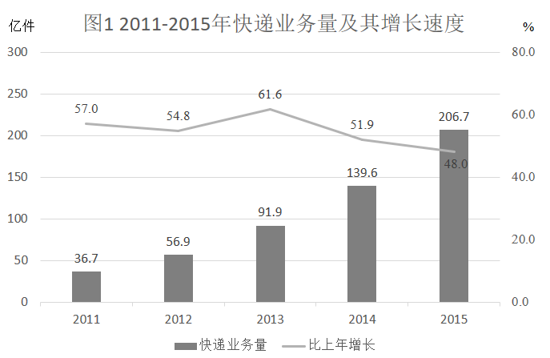

### 第 6 题　qid 2255816 · 增长

2012-2015年，哪年相比上一年快递业务增长量最多？

- **A**. 2013
- **B**. 2012
- **C**. 2014
- **D**. 2015　✅

**答案**：D

**官方解析**

根据题干“2012-2015年，······增长量最多”，判定本题为增长量比较问题。定位柱状图，快递业务量分别为36.7亿件、56.9亿件、91.9亿件、139.6亿件、206.7亿件。根据公式可得，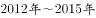快递业务增长量分别为亿件、亿件、亿件、亿件，增长量最多的为2015年。

故正确答案为D。

---

### 第 7 题　qid 2255818 · 综合

2015年快递业务量约是2010年的多少倍？

- **A**. 5.6
- **B**. 5.1
- **C**. 8.3　✅
- **D**. 4.2

**答案**：C

**官方解析**

根据“2015年······约是2010年的多少倍”，判定本题为现期倍数问题。定位柱状图，2011年快递业务量为36.7亿件，2015年快递业务量为206.7亿件；定位折线图，增长率为。根据公式可得，2010年快递业务量为，则2015年快递业务量约是2010年的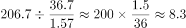倍。

故正确答案为C。

---

### 第 8 题　qid 2255823 · 综合

下列说法正确的是：

- **A**. 
，每年的快递业务量比上年增长均超出

- **B**. 
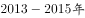，快递业务量的年均增长率低于
　✅
- **C**. 
，年平均快递业务量约为86.4亿件

- **D**. 
2015年的快递业务量比2011年翻了四番以上

**答案**：B

**官方解析**

A项：定位折线图可得，2015年快递业务量增长率为，错误，排除；

B项：定位柱状图可得，2015年快递业务量为206.7亿件，2013年快递业务量为91.9亿件，代入年均增长率公式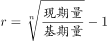，正确，当选；

C项：定位柱状图可得，快递业务量分别为36.7亿件、56.9亿件、91.9亿件、139.6亿件、206.7亿件。年平均快递业务量约为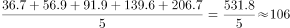亿件，错误，排除；

D项：定位柱状图可得，2011年快递业务量为36.7亿件，2015年快递业务量为206.7亿件，，错误，排除。

故正确答案为B。

---

### 第 9 题　qid 2255826 · 综合

2010年的快递业务量是：

- **A**. 23.4亿件　✅
- **B**. 16.7亿件
- **C**. 18.2亿件
- **D**. 28.5亿件

**答案**：A

**官方解析**

根据题干“2010年的快递业务量是”，结合材料时间为，判定本题为基期计算问题。定位柱状图，2011年快递业务量为36.7亿件，增长率为。根据公式可得，2010年快递业务量为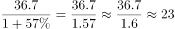亿件，与A项最接近。

故正确答案为A。

---

### 第 10 题　qid 2255828 · 增长

快递业务量增长幅度最大的是：

- **A**. 2011年至2012年
- **B**. 2012年至2013年　✅
- **C**. 2013年至2014年
- **D**. 2014年至2015年

**答案**：B

**官方解析**

增长幅度即增长率，定位折线图可得，2012年～2015年快递业务增长速度分别为、、、，增长幅度最大的是2013年，即2012年至2013年。

故正确答案为B。

---

## 材料 3

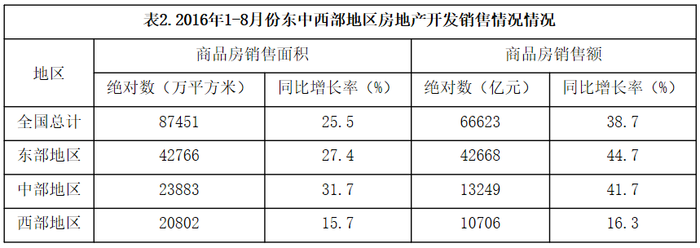

### 第 11 题　qid 2255857 · 比重

2016年1-8月份，中西部地区房地产开发投资额占全国房地产开发投资额的比重是：

- **A**. 

　✅
- **B**. 

- **C**. 

- **D**. 

**答案**：A

**官方解析**

根据题干“2016年1-8月份······占······的比重”，可判定本题为现期比重问题。定位表1，2016年1-8月份，中部地区房地产开发投资额14078亿元，西部地区房地产开发投资额14394亿元，全国房地产开发投资额64387亿元。则所求比重。

故正确答案为A。

---

### 第 12 题　qid 2255860 · 增长

2016年1-8月份，东中西部地区房地产开发投资同比增长最快的地区是：

- **A**. 东部地区
- **B**. 中部地区　✅
- **C**. 西部地区
- **D**. 无法判断

**答案**：B

**官方解析**

定位表1，2016年1-8月份，东部地区房地产开发投资额增长率为，中部地区房地产开发投资额增长率为，西部地区房地产开发投资额增长率为。则增长最快的地区是中部地区。

故正确答案为B。

---

### 第 13 题　qid 2255861 · 综合

2016年1-8月份，中部地区的商品房销售额比东部地区少多少亿元？

- **A**. 14376
- **B**. 50309
- **C**. 63568
- **D**. 29419　✅

**答案**：D

**官方解析**

定位表2，2016年1-8月份，中部地区的商品房销售额为13249亿元，东部地区的商品房销售额42668亿元。则中部地区的商品房销售额比东部地区少亿元。

故正确答案为D。

---

### 第 14 题　qid 2255863 · 平均数

2016年1-8月份，全国商品房平均每平方米售价约：

- **A**. 5300元
- **B**. 6000元
- **C**. 7600元　✅
- **D**. 8200元

**答案**：C

**官方解析**

根据题干“2016年1-8月份，全国商品房平均每平方米售价”，可判定本题为现期平均数问题。定位表2，2016年1-8月份，全国商品房销售额66623亿元，商品房销售面积87451万平方米。代入公式：元。

故正确答案为C。

---

### 第 15 题　qid 2255865 · 综合

根据上面表格，下列说法不正确的是：

- **A**. 2016年1-8月份，东部地区是全国房地产开发投资额度最大的地区
- **B**. 2016年1-8月份，东部地区的房地产投资额占总投资额一半以上
- **C**. 2016年1-8月份，东部地区的商品房每平方米售价最高
- **D**. 2016年1-8月份，东部地区的商品房销售面积占了一半以上　✅

**答案**：D

**官方解析**

A项：定位表1，2016年1-8月份，东部地区房地产开发投资额35915亿元，中部地区房地产开发投资额14078亿元，西部地区房地产开发投资额14394亿元，则投资额最大的地区是东部地区，正确；

B项：定位表1，2016年1-8月份，东部地区房地产开发投资额35915亿元，全国房地产开发投资额64387亿元，则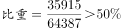，正确；

C项：定位表2，2016年1-8月份，东部地区商品房销售面积为42766万平方米，销售额为42668亿元；中部地区商品房销售面积为23883万平方米，销售额为13249亿元；西部地区商品房销售面积为20802万平方米，销售额为10706亿元，根据公式，东部地区为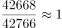，中部地区为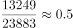，西部地区为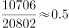，则商品房每平方米售价最高的地区是东部地区，正确；

D项：定位表2，2016年1-8月份，东部地区商品房销售面积为42766万平方米，全国商品房销售面积为87451万平方米，则，错误。

本题为选非题，故正确答案为D。

---
