# 2016年河南省公务员录用考试《行测》题

> 资料分析 · 20 题 · 河南 2016

## 材料 1

        2015年年末全国公路总里程457.73万公里，其中技术等级公路里程404.63万公里，占公路总里程的比重比上一年提高1.0个百分点。

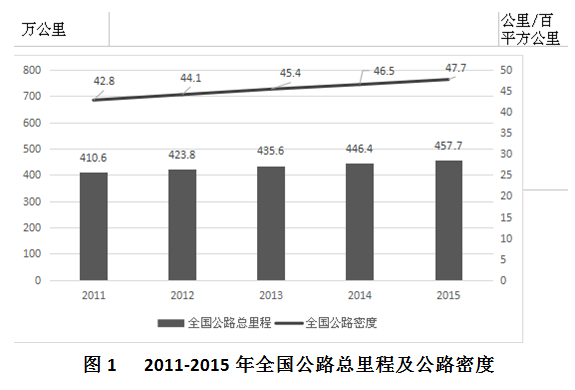

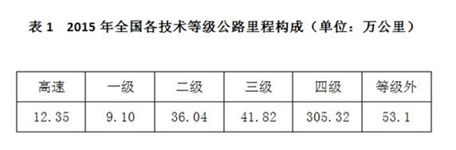

        各行政等级公路里程分别为：国道18.53万公里、省道32.97万公里、县道55.43万公里、乡道111.32万公里、专用公路8.17万公里，比上年末分别增加0.61万公里、0.69万公里、0.23万公里、0.81万公里和0.14万公里。

         全国高速公路里程12.35万公里，比上年末增加1.16万公里。其中，国家高速公路7.96万公里，增加0.65万公里。全国高速公路车道里程54.84万公里，增加5.28万公里。

### 第 1 题　qid 2033368 · 增长

2012~2015年，全国公路密度同比增量最低的年份是：

- **A**. 2012
- **B**. 2013
- **C**. 2014　✅
- **D**. 2015

**答案**：C

**官方解析**

由题干“同比增量最低的年份是”，可判定该题是增长量比较问题。定位图1数据，增长量=现期量-基期量，因此全国公路密度同比增长：

2012年：；2013年：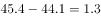；

2014年：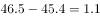；2015年：。

所以2014年全国公路密度同比增量最低。

故正确答案为C。

---

### 第 2 题　qid 2033378 · 增长

2015年全国公路总里程比2014年增长：

- **A**. 
不到
　✅
- **B**. 
~之间

- **C**. 
~之间

- **D**. 
超过

**答案**：A

**官方解析**

由题干“2015年······比2014年增长”，结合选项都为百分数，可判定本题是一般增长率计算问题。定位图1数据，2014年全国公路总里程446.4万公里，2015年全国公路总里程457.7万公里，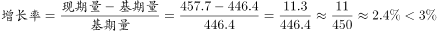。

故正确答案为A。

---

### 第 3 题　qid 2033382 · 比重

2015年三级及以上技术等级公路里程占公路总里程的比重为：

- **A**. 两成以下
- **B**. 两成多　✅
- **C**. 三成多
- **D**. 四成多

**答案**：B

**官方解析**

由题干“2015年······占······比重为”，可判定本题是现期比重问题。定位文字材料第一段和表1，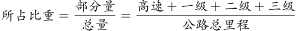，比重为两成多。

故正确答案为B。

---

### 第 4 题　qid 2033388 · 增长

2015年各行政等级公路里程同比增量由低到高排序正确的是：

- **A**. 专用公路、县道、省道、国道、乡道
- **B**. 专用公路、县道、国道、乡道、省道
- **C**. 县道、专用公路、国道、省道、乡道
- **D**. 专用公路、县道、国道、省道、乡道　✅

**答案**：D

**官方解析**

由题干“由低到高排序正确的是”，可判定该题是排序类问题。定位文字资料第二段，可知国道、省道、县道、乡道、专用公路的同比增量分别为0.61万公里、0.69万公里、0.23万公里、0.81万公里、0.14万公里，故2015年各行政等级公路里程同比增量由低到高排序为：专用公路、县道、国道、省道、乡道。
故正确答案为D。

---

### 第 5 题　qid 2033392 · 综合

关于2015年全国公路状况，能够从上述材料中推出的是：

- **A**. 
国家高速公路里程增加了以上

- **B**. 
全国高速公路平均车道数在5~6之间

- **C**. 
等级外公路里程占公路总里程的一成以下

- **D**. 
国道里程增速快于省道里程增速
　✅

**答案**：D

**官方解析**

A项：，错误；

B项：最后一段，全国高速公路里程12.35万公里，全国高速公路车道里程54.84万公里。每个车道的平均里程等于高速公路里程，所以平均车道数，错误；

C项：，错误；

D项：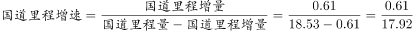，首数商3；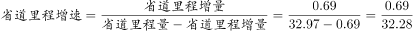，首数商2，明显前者大于后者，正确。

故正确答案为D。

---

## 材料 2

        2015年全国发电量为56184亿千瓦时，其中，火力发电量为42102亿千瓦时，占全部发电量的；水力发电量为9960亿千瓦时，同比增长。 

        2015年12月份，全国重点电厂供煤11240万吨，环比增长，同比下降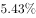，耗煤11211万吨，环比增长，同比减少。

### 第 6 题　qid 2033330 · 增长

2009~2015年，全国发电量增速最高和最低的年份，其发电量增速相差几个百分点？

- **A**. 13.81　✅
- **B**. 13.15
- **C**. 12.93
- **D**. 12.71

**答案**：A

**官方解析**

定位表格可得，2009~2015年，全国发电量增速最高年份为2010年，增速为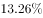；增速最低年份为2015年，增速为，增速差。

故正确答案为A。

---

### 第 7 题　qid 2033334 · 综合

2009年~2015年，全社会发电量超过用电量300亿千瓦时的年份有几个？

- **A**. 6
- **B**. 5
- **C**. 4　✅
- **D**. 3

**答案**：C

**官方解析**

定位表格可得，2009~2015年每年的发电量与用电量差值分别为：

2009年：；2010年：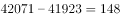；2011年：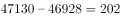；

2012年：；2013年：；2014年：；

2015年：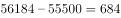。

超过300亿千瓦时的年份有4个，分别是2009、2013、2014、2015年，共4个年份。

故正确答案为C。

---

### 第 8 题　qid 2033338 · 增长

2013年火力发电量约比上年增长：

- **A**. 

- **B**. 

- **C**. 

　✅
- **D**. 

**答案**：C

**官方解析**

由问题所求“2013年火力发电量比上年增长”，且选项为百分数，可判定本题为增长率计算问题。定位表格可得，2013年火力发电量为42470亿千瓦时，2012年火力发电量为38928亿千瓦时，增长率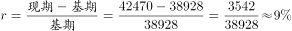，C项最接近。

故正确答案为C。

---

### 第 9 题　qid 2033340 · 综合

2015年12月份全国重点电厂供煤量约比11月多多少亿吨？

- **A**. 0.2　✅
- **B**. 0.4
- **C**. 0.7
- **D**. 0.9

**答案**：A

**官方解析**

由问题所求“2015年12月······比11月多多少亿吨”可判定本题为增长量计算问题。定位文字材料第二段可得，2015年12月，全国重点电厂供煤量为11240万吨，环比增长。增长率介于与之间，约等于，故增长量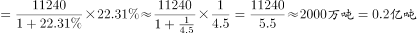。

故正确答案为A。

---

### 第 10 题　qid 2033342 · 综合

根据材料，下列说法正确的是：

- **A**. “十二五”期间发电量增速高于上年水平的年份有2个
- **B**. 2012年火力发电量占全国发电量比重高于上年水平
- **C**. 2015年12月末全国重点电厂煤库存高于11月末水平　✅
- **D**. 表中全国发电量环比下降的年份，全社会用电量也环比下降

**答案**：C

**官方解析**

A项：“十二五”即2011~2015年，定位表格可得，发电量增速高于上年的只有2013年，错误；

B项：两期比重比较，只需比较部分增长率与整体增长率的大小关系。定位表格可得，2012年火力发电量为38928亿千瓦时，2011年火力发电量为38337亿千瓦时，则2012年火力发电量增长率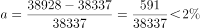；2012年全国发电量增长率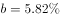，，因此2012年比重比2011年下降，错误；

C项：12月末库存11月末库存12月供煤量12月耗煤量，比较12月末库存与11月末库存，仅需计算12月供煤量12月耗煤量，定位文字材料第二段可得，12月供煤量12月耗煤量万吨，因此2015年12月末库存比11月末库存多，正确；

D项：定位表格可得，全国发电量环比下降的年份为2015年，2015年全社会用电量高于2014年，环比上升，错误。

故正确答案为C。

---

## 材料 3

        2015年中国电子商务市场交易规模16.4万亿元，增长。其中网络购物增长，在线旅游增长，本地生活服务O2O增长。2015年中国移动网购市场交易规模达2.1万亿元，同比增长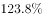。

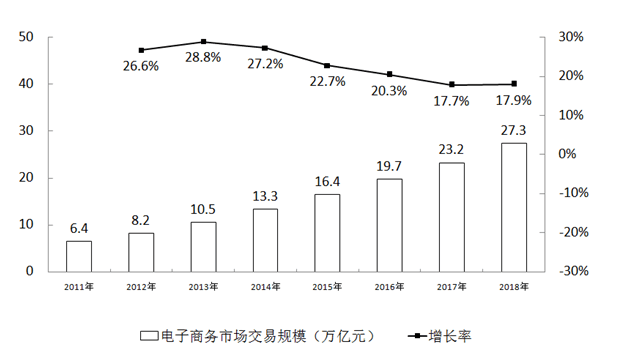

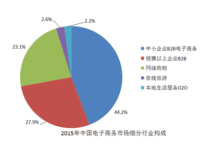

### 第 11 题　qid 2033402 · 综合

2014年网络购物交易规模在以下哪个范围内？

- **A**. 超过7万亿元
- **B**. 5~7万亿元
- **C**. 3~5万亿元
- **D**. 不到3万亿元　✅

**答案**：D

**官方解析**

根据“2014年网络购物交易规模在以下哪个范围内”可知，判断本题为基期计算问题。定位文字材料和图表，2015年中国电子商务市场交易规模16.4万亿元，2015年网络购物所占比重为，且网络购物增长，则2014年网络购物交易规模为，首数商不到3，因此低于3万亿元。

故正确答案为D。

---

### 第 12 题　qid 2033404 · 综合

2015年中小企业B2B电子商务交易规模约是网络购物的多少倍？

- **A**. 1.1
- **B**. 1.4
- **C**. 1.9　✅
- **D**. 2.5

**答案**：C

**官方解析**

根据“2015年中小企业B2B电子商务交易规模约是网络购物的多少倍”可知，判定此题为现期比重问题。定位图表，2015年中小企业B2B电子商务交易规模占中国电子商务市场的比重为，2015年网络购物占中国电子商务市场的比重为，则前者为后者的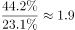倍。

注意：在整体量一致的前提下，各部分量之比等于比重之比。

故正确答案为C。

---

### 第 13 题　qid 2033408 · 比重

2015年中国移动网络购物市场交易规模占网络购物比重约为：

- **A**. 

- **B**. 

- **C**. 

　✅
- **D**. 

**答案**：C

**官方解析**

根据“2015年中国移动网购市场交易规模占网络购物的比重”可知，判定此题为现期比重的计算问题。定位文字材料，2015年中国电子商务市场交易规模16.4万亿元，······2015年中国移动网购市场交易规模达2.1万亿元；定位饼状图2015年网络购物占中国电子商务市场交易规模的比重为。则2015年网络购物交易规模为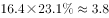万亿元，故所求比重为。

故正确答案为C。

---

### 第 14 题　qid 2033410 · 增长

2015年在线旅游市场交易规模约增长了多少万亿元？

- **A**. 0.12　✅
- **B**. 0.22
- **C**. 0.33
- **D**. 0.43

**答案**：A

**官方解析**

根据“2015年在线旅游市场规模约增长了多少”可知，判定此题为增长量计算问题。定位文字材料和图表，2015年中国电子商务市场交易规模16.4万亿元，在线旅游所占比重为，且增长，则在线旅游市场规模增长量为，直除有效数字首位为1，只有A项满足。

故正确答案为A。

---

### 第 15 题　qid 2033414 · 综合

能够从上述材料中推出的是：

- **A**. 2018年中国电子商务市场交易规模将超过2016年的1.5倍
- **B**. 2015年在线旅游市场交易规模增长率高于本地生活服务O2O市场　✅
- **C**. 本地生活服务O2O市场2015年交易规模增长率低于网络购物市场
- **D**. 2012~2015年电子商务市场交易规模增长率均高于网络购物市场

**答案**：B

**官方解析**

A项：定位图表，2016、2018年电子商务市场交易规模为19.7万亿元、27.3万亿元，则后者是前者的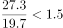倍，错误；

B项：定位文字材料，2015年在线旅游交易市场规模增长，本地生活服务O2O交易规模增长，前者高于后者，正确；

C项：定位文字材料，本地生活服务O2O交易规模增长，网络购物市场增长，前者高于后者，错误；

D项：定位文字材料，以2015年为例，中国电子商务市场交易规模增长，网络购物市场增长，前者低于后者，错误。

故正确答案为B。

---

## 材料 4

       2015年，全国文化及相关产业增加值27235亿元，比上年增长（未扣除价格因素）。在2014年增长的基础上继续保持两位数增长，呈快速增长态势。2015年文化及相关产业增加值占GDP的比重为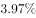，比上年提高0.16个百分点。

       2015年，代表文化内容的“文化产品的生产”创造的增加值为17071亿元，而“文化相关产品的生产”创造的增加值为10165亿元；且“文化产品的生产”作为我国文化产业的主体，增速达，远高于“文化相关产品的生产”的的增速。从产品类型看，文化制造业增加值11053亿元，比上年增长，占，文化批发零售业增加值2542亿元，增长，占；文化服务业增加值13640亿元，增长，占。

       2015年文化休闲娱乐服务业和以“互联网+”为主要形式的文化信息传输服务业实现增加值分别为2044亿元和2858亿元，增速分别达和，占文化及相关产业的比重分别为和，均比上年提高0.5个百分点；广播电视电影服务业实现增加值1227亿元，占比，比上年提高0.2个百分点，文化创意和设计服务业实现增加值4953亿元，增长，占比，比上年提高0.4个百分点。

### 第 16 题　qid 2033352 · 增长

2013年全国文化及相关产业的增加值约为多少万亿元？

- **A**. 1.8
- **B**. 2.0
- **C**. 2.2　✅
- **D**. 2.5

**答案**：C

**官方解析**

根据题干“2013年……增加值”结合材料年份可判定此题为间隔基期量问题。定位文字材料第一段“2015年，全国文化及相关产业增加值27235亿元，比上年增长（未扣除价格因素），在2014年增长的基础上…”，间隔增长率,万亿元。

故正确答案为C。

---

### 第 17 题　qid 2033354 · 比重

2015年，“文化产品的生产”创造的增加值占全国文化及相关产业增加值的比重比“文化相关产品的生产”创造的增加值所占比重高出约：

- **A**. 

- **B**. 

　✅
- **C**. 

- **D**. 

**答案**：B

**官方解析**

根据题干“2015年……所占比重”可判定此题为现期比重问题。定位文字材料第一段“2015年，全国文化及相关产业增加值27235亿元”和文字材料第二段“2015年，‘文化产品的生产’创造的增加值为17071亿元，‘文化相关产品的生产’创造的增加值为10165亿元”可知比重差为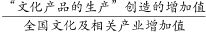。

故正确答案为B。

---

### 第 18 题　qid 2033360 · 比重

2014年，文化休闲娱乐服务业和文化信息传输服务业增加值占文化及相关产业增加值的比重约为：

- **A**. 

- **B**. 

　✅
- **C**. 

- **D**. 

**答案**：B

**官方解析**

定位文字材料第三段“2015年文化休闲娱乐服务业和文化信息传输服务业增加值分别为…，占文化及相关产业的比重分别为和，均比上年提高0.5个百分点”，则2014年，文化休闲娱乐服务业和文化信息传输服务业增加值占文化及相关产业的比重约为。

故正确答案为B。

---

### 第 19 题　qid 2033362 · 增长

下列各项中，2015年增加值增速最高的是：

- **A**. 文化制造业
- **B**. 文化服务业　✅
- **C**. 文化相关产品
- **D**. 文化产品的生产

**答案**：B

**官方解析**

定位文字材料第二段“文化制造业比上年增长”“文化服务业增长”“文化相关产品的增速”和“文化产品的生产增速达”可知，B项文化服务业增长最大。

故正确答案为B。

---

### 第 20 题　qid 2033372 · 综合

能够从上述材料中推出的是：

- **A**. 
2014年文化及相关产业的增加值占GDP比重超过

- **B**. 
2015年文化制造业增加值占文化及相关产业的比重高于2014年

- **C**. 
2015年文化创意和设计服务业增加值占文化服务业的比重高于2014年 

- **D**. 
2015年文化服务业增加值增量高于文化制造业增量 
　✅

**答案**：D

**官方解析**

A项：根据文字材料第一段可知，，错误；

B项：根据文字材料第一段“2015年，全国文化及相关产业增加值27235亿元，比上年增长”和文字材料第二段“文化制造业比上年增长”可知，，即部分量的增长率总体量的增长率，故比重下降，错误；

C项：根据文字材料第三段“文化创意和设计服务增加值增长”和文字材料第二段“文化服务业增长”可知，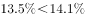，即部分量的增长率总体量的增长率，故比重下降，错误；

D项：根据文字材料第二段“文化服务业增加值13640亿元，增长”和“文化制造业增加值11053亿元，比上年增长”可知，文化服务业现期量13640亿元文化制造业11053亿元，文化服务业增长率文化制造业，大大则大，2015年文化服务业增加值增量高于文化制造业增量，正确。

故正确答案为D。

---
