# 2016年深圳市公务员录用考试《行测》题

> 资料分析 · 15 题 · 深圳市考 2016

## 材料 1

        根据《国务院关于开展第三次全国经济普查的通知》(国发〔2012〕60号)要求，我国进行了第三次全国经济普查，这次普查的标准时点为2013年12月31日，普查时期资料为2013年年度资料，普查对象是在我国境内从事第二产业和第三产业的全部法人单位、产业活动单位和有证照个体经营户，相关调查显示，2013年末，全国共有从事第二产业和第三产业的法人单位1085.7万个，比2008年末(2008年是第二次全国经济普查年份，下同)增加375.8万个；产业活动单位1303.5万个，增加417.1万个；有证照个体经营户3279.1万个，增加405.4万个。

        从行业角度看，2013年末，在第二产业和第三产业的法人单位中，位居前三位的行业是：批发和零售业281.1万个，占25.9%；制造业225.3万个，占20.7%；公共管理社会保障和社会组织152万个，占14%。在第二产业和第三产业的有证照个体经营户中，位居前三位的行业是：批发和零售业1642.7万个，交通运输仓储和邮政业878.6万个，住宿和餐饮业240.8万个。

        从单位性质看，2013年末，在第二产业和第三产业的法人单位中，企业法人单位占75.6%，比2008年末提高了5.7个百分点；机关事业法人单位占9.6%，比2008年末下降了3.9个百分点；社会团体和其他法人占14.8%，比2008年末下降了1.8个百分点。

        从登记注册类型看，2013年末，在第二产业和第三产业企业法人单位中，内资企业法人、外商投资企业法人和港澳台商投资企业法人分别为800.6万个、10.6万个和9.7万个。在内资企业法人中，国有企业法人占全部企业法人单位的1.4%，私营企业法人占全部企业法人单位的68.3%。

### 第 1 题　qid 1772350 · 综合

2008年末，列入上述资料所示的普查对象的数量合计为（  ）。

- **A**. 4072.1万
- **B**. 4845.8万
- **C**. 4470.0万　✅
- **D**. 5262.9万

**答案**：C

**官方解析**

定位文字材料第一段可得，“普查对象是在我国境内从事第二产业和第三产业的全部法人单位，产业活动单位和有证照个体经营户”，“2013年末，全国共有从事第二产业和第三产业的法人单位1085.7万个，比2008年末增加375.8万个，产业活动单位1303.5万个，增加417.1万个，有证照个体经营户3279.1万个，增加405.4万个”。故2008年普查对象数量合计为，计算尾数，尾数为0。

故正确答案为C。

---

### 第 2 题　qid 1772356 · 比重

2013年末，在第二产业和第三产业的有证照个体经营户中，批发和零售业、交通运输仓储和邮政业、住宿和餐饮业三者合计所占比重约为（  ）。

- **A**. 50.1%
- **B**. 26.8%
- **C**. 67.3%
- **D**. 84.2%　✅

**答案**：D

**官方解析**

根据题干所求 “2013年末······所占比重”，可判定本题为现期比重问题。定位文字材料第一、二段可得“2013年末有证照个体经营户3279.1万个”，定位文字材料第二段可得“批发和零售业1642.7万个、交通运输仓储和邮政业878.6万个、住宿和餐饮业240.8万个”。故所求比重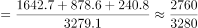，与D项最接近。

故正确答案为D。

---

### 第 3 题　qid 1772358 · 增长

与第二次全国经济普查时相比，第三次经济普查时，下列普查对象数量增长最快的是（  ）。

- **A**. 第二产业和第三产业法人单位数
- **B**. 第二产业和第三产业有证照个体经营户数
- **C**. 第二产业和第三产业企业法人单位数　✅
- **D**. 第二产业和第三产业活动单位数

**答案**：C

**官方解析**

根据题干所求“增长最快的是”，可判定本题为一般增长率比较问题。定位材料可得各普查对象现期量与增长量，由增长率，分别代入数据可得各项增长率。

A项：定位文字材料第一段可得，2013年末，第二产业和第三产业的法人单位1085.7万个，比2008年末增加375.8万个。故所求增长率；

B项：定位文字材料第一段可得，有证照个体经营户3279.1万个，增加405.4万个。故所求增长率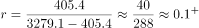；

C项：定位文字材料第三段可得，2013年末第二产业和第三产业的法人单位中，企业法人单位占，比2008年末提高了5.7个百分点。根据两期比重比较口诀“部分增长率高于整体增长率，比重上升”，,2013年末企业法人单位数占法人单位数的比重比2008年末提高了5.7个百分点，则企业法人单位数的增长率必然高于法人单位数的增长率，所求增长率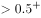；

D项：定位文字材料第一段可得，产业活动单位1303.5万个，增加417.1万个。故所求增长率。 

比较可知增长最快的是第二产业和第三产业企业法人单位数。

故正确答案为C。

---

### 第 4 题　qid 1772360 · 综合

下列法人单位中，数量最多的是（  ）。

- **A**. 2013年末，港澳台商投资企业法人单位数
- **B**. 2013年末，外商投资企业法人单位数
- **C**. 2013年末，国有企业法人单位数
- **D**. 2008年末与2013年末间，社会团体和其他法人单位增加数　✅

**答案**：D

**官方解析**

A、B项，定位文字材料第四段可得：2013年末，港澳台商投资企业法人单位数9.7万，外商投资企业法人单位数10.6万；

C项，定位文字材料第四段可得：国有企业法人占全部企业法人单位的；定位材料第三段可得：在第二产业和第三产业的法人单位中，企业法人单位占；定位材料第一段可得：2013年末，全国共有从事第二产业和第三产业的法人单位1085.7万个，故国有企业法人单位数万；

D项，定位材料第一、三段可得：2013年末，共有从事第二产业和第三产业的法人单位1085.7万个，比2008年末增加375.8万个，2013年末社会团体和其他法人占，比2008年末下降了1.8个百分点。故社会团体和其他法人单位增加数万。

比较可知四类法人单位中，数量最多的为社会团体和其他法人单位增加数。

故正确答案为D。

---

### 第 5 题　qid 1772362 · 综合

根据上述材料，下列说法错误的是（  ）。

- **A**. 2013年末，第二产业和第三产业法人单位中，批发和零售业单位数比制造业多约24.8%
- **B**. 与2008年相比，2013年第二产业和第三产业法人单位中，企业法人、机关事业法人、社会团体和其他法人单位数均有不同幅度的增长
- **C**. 2013年末，第二产业和第三产业有证照个体经营户中，批发和零售业个体经营户占据一半以上
- **D**. 2008年末至2013年末间，第二产业和第三产业法人单位数平均增长率超过10%　✅

**答案**：D

**官方解析**

A项：定位文字材料第二段数据可得，2013年末，批发和零售业单位数281.1万个，制造业225.3万个，则批发和零售业单位数多，正确。

B项：若均呈现增长，则2013年各法人单位数大于2008年法人单位数，定位材料第三段数据可得，2013年与2008年比较，企业法人 ；机关事业法人；社会团体和其他法人单位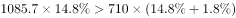，故三者均有不同幅度的增长，正确。

C项：定位文字材料第一、二段可得，“2013年有证照个体经营户3279.1万个，批发和零售业1642.7万个”，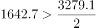，正确。

D项：定位文字材料第一段可得，“2013年末，法人单位1085.7万个，比2008年末增加375.8万个”，故2008年法人单位数约为710万个。根据年均增长率公式，得到，若，则，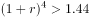，，不满足，错误。

本题为选非题，故正确答案为D。

---

## 材料 2

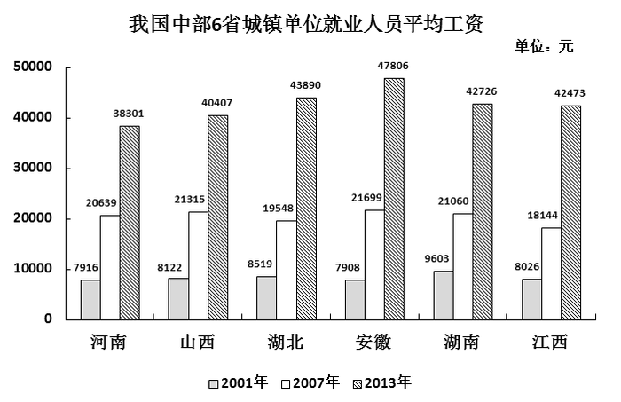

### 第 6 题　qid 1772364 · 平均数

2013年中部六省城镇单位就业人员平均工资的算术平均值与2001年相比，（  ）。

- **A**. 增长了32583元
- **B**. 翻了两番
- **C**. 增长了5倍以上
- **D**. 增长了4.2倍　✅

**答案**：D

**官方解析**

根据题干所求“2013年与2001年相比”，结合选项多为增长了几倍，可判定本题为一般增长率问题。定位柱状图材料中2013年数据可得，2013年六省算术平均值；定位柱状图可得，2001年六省算术平均值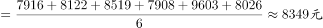。，，与D项最接近。

故正确答案为D。

---

### 第 7 题　qid 1772366 · 平均数

以下省份中，2007年和2001年相比城镇单位就业人员平均工资增加值最大的是（  ）。

- **A**. 山西
- **B**. 湖北
- **C**. 安徽　✅
- **D**. 湖南

**答案**：C

**官方解析**

根据题干所求“增加值最大的是”，可判定本题为增长量比较问题。定位柱状图材料数据可得2007年与2001年各省平均工资。则增加值分别为山西：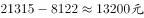；湖北：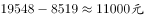；安徽：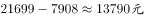；湖南：，比较可知增加值最大的是安徽。

故正确答案为C。

---

### 第 8 题　qid 1772368 · 增长

2013年和2007年相比，下列省份中，城镇单位就业人员平均工资增长率最高的省份是（  ）。

- **A**. 河南
- **B**. 安徽
- **C**. 湖北　✅
- **D**. 湖南

**答案**：C

**官方解析**

根据题干所求“增长率最高的省份是”，可判定本题为增长率比较问题。定位柱状图材料数据可得2013年与2007年各省平均工资，则可根据增长率计算公式求出各项增长率。

A项河南：2013年平均工资38301元，2007年20639元，故所求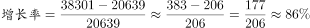；

B项安徽：2013年平均工资47806元，2007年21699元，故所求；

C项湖北：2013年平均工资43890元，2007年19548元，故所求；

D项湖南：2013年平均工资42726元，2007年21060元，故所求

。 

比较可知C项湖北增长率最高。

故正确答案为C。

---

### 第 9 题　qid 1772370 · 平均数

2007年中部六省城镇单位就业人员平均工资中位数为（  ）。

- **A**. 20849.5元　✅
- **B**. 20639元
- **C**. 21060元
- **D**. 20400.8元

**答案**：A

**官方解析**

定位柱状图材料中2007年数据可得，2007年中部六省城镇单位就业人员平均工资从大到小排列为：21699、21315、21060、20639、19548、18144。故所求中位数为位于中间两数的平均数，中位数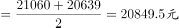。

故正确答案为A。

---

### 第 10 题　qid 1772372 · 综合

根据上述材料，下列说法正确的是（  ）。

- **A**. 所有统计年份中，河南省单位就业人员平均工资均为中部六省最低
- **B**. 假设年均增长率不变，按照2007-2013年均增长率来计算，2015年江西省城镇单位就业人员平均工资超过6万元
- **C**. 湖南省2001-2007年城镇就业人员平均工资平均增速快于2007-2013年　✅
- **D**. 2001年，中部六省城镇单位就业人员平均工资超过8000元的省份不到50%

**答案**：C

**官方解析**

A项：定位柱状图材料中2001年数据可得，2001年河南城镇单位就业人均工资大于安徽，错误。

B项：定位柱状图材料中数据可得，2007年江西平均工资18144元，2013年42473元。根据年均增长率公式可得，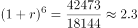，若2015年人均工资超过6万，即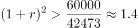，则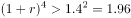，，故假设不成立，即2015年时未超6万，错误。

C项：定位柱状图材料中数据可得，2001年湖南平均工资9603元，2007年21060元，2013年42726元。根据年均增长率公式，2001-2007年平均增速为，2007-2013年平均增速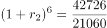，前者大于后者，即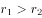，正确。

D项：定位柱状图材料中数据可得，2001年，中部六省城镇单位就业人员平均工资超过8000元的省份有山西、湖北、湖南、江西，六省中四省满足条件，占比，错误。

故正确答案为C。

---

## 材料 3

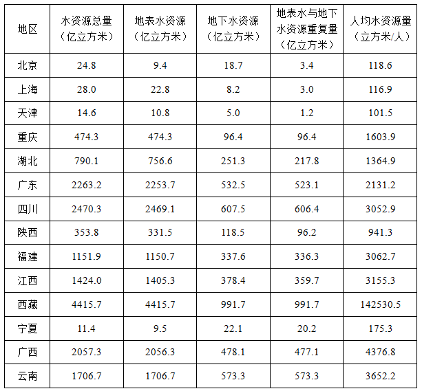

### 第 11 题　qid 1772374 · 综合

根据上述数据，不能得出的结论是（  ）。

- **A**. 我国上述省（市）的水资源分布不平衡
- **B**. 我国上述省（市）的地下水资源分布不平衡
- **C**. 我国上述省（市）的江河数量分布不平衡　✅
- **D**. 我国上述省（市）的地表水资源分布不平衡

**答案**：C

**官方解析**

定位表格材料可知，没有相关涉及江河的数据，故江河数量分布不平衡不能推出。
本题为选非题，故正确答案为C。

---

### 第 12 题　qid 1772376 · 平均数

上表中，所有直辖市的人均水资源量为（  ）。

- **A**. 无法计算
- **B**. 480立方米/人
- **C**. 550立方米/人
- **D**. 610立方米/人　✅

**答案**：D

**官方解析**

根据题干所求“人均水资源量”，可判定本题为平均数计算问题。直辖市有北京、上海、天津、重庆。定位表格材料可得各直辖市水资源总量及人均水资源量，故城市人数分别为：、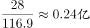、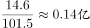、。所有直辖市人均水资源量立方米/人，与D项最接近。

故正确答案为D。

---

### 第 13 题　qid 1772378 · 综合

关于上述省（市）的水资源情况，下列说法正确的是（  ）。

- **A**. 地表水资源都比地下水资源丰富
- **B**. 四川的地表水资源量与地下水资源量的差距最大
- **C**. 地表水资源量最小的省（市）为宁夏
- **D**. 西藏的地表水资源与地下水资源储量均居各省（市）之首　✅

**答案**：D

**官方解析**

A项：定位表格材料数据可得，北京市和宁夏地表水资源都没有地下水资源丰富，错误。

B项：定位表格材料数据可得，四川地表水资源量比地下水资源量的差距，西藏地表水资源量比地下水资源量的差距，可见四川并非差距最大的，错误。

C项：定位表格材料数据可得，宁夏地表水资源量大于北京，错误。

D项：定位表格材料数据可得，西藏的地表水资源与地下水资源储量在表中对应列里均为最大值，正确。

故正确答案为D。

---

### 第 14 题　qid 1772380 · 综合

下列四个省份中，人数最少的是（  ）。

- **A**. 云南
- **B**. 江西　✅
- **C**. 广西
- **D**. 湖北

**答案**：B

**官方解析**

根据题干所求“人数最少的是”，表格给出水资源总量与人均水资源量，，可判定本题为平均数计算比较问题。定位表格材料数据可得各省水资源总量与人均水资源量，则人数分别为：云南、江西、广西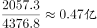、湖北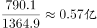，故人数最少的是江西。

故正确答案为B。

---

### 第 15 题　qid 1772382 · 平均数

根据上表数据，下列说法正确的是（  ）。
①  地表水资源量越大的省（市），水资源总量越大
②  水资源总量越大的省（市），人均资源量越大
③  人口越多的省（市），人均水资源量越小

- **A**. ①、②、③均不正确　✅
- **B**. 仅有①正确
- **C**. 仅有②、③正确
- **D**. 仅有③正确

**答案**：A

**官方解析**

①定位表格材料数据可得，天津地表水资源量大于北京，但天津的水资源总量却小于北京,错误；

②定位表格材料数据可得，上海水资源总量大于北京，但上海人均水资源量却小于北京，错误；

③定位表格材料数据可得，人口和人均水资源量并非成反比。根据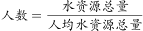，北京人数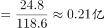、天津人数。北京的人数多于天津，但北京的人均水资源量也多于天津；故①②③均错误。

故正确答案为A。

---
