# 2016年重庆市公务员录用考试《行测》题（下半年）

> 资料分析 · 20 题 · 重庆 2016

## 材料 1

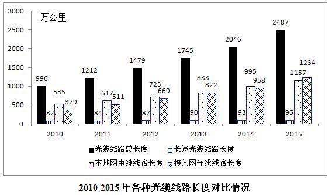

### 第 1 题　qid 2024176 · 增长

2011-2015五年期间光缆线路总长度共增加了：

- **A**. 441万公里
- **B**. 1491万公里　✅
- **C**. 892万公里
- **D**. 8969万公里

**答案**：B

**官方解析**

根据图表及图解文字可知，2011-2015五年期间增加的光缆总长度等于2015年光缆长度减去2010年光缆长度，即万公里。

故正确答案为B。

---

### 第 2 题　qid 2024182 · 增长

与2014年相比，2015年本地网中继光缆净增线路长度是长途光缆净增线路长度的：

- **A**. 12倍
- **B**. 23倍
- **C**. 38倍
- **D**. 54倍　✅

**答案**：D

**官方解析**

由题干“2015年······是······的”可判定该题是现期倍数问题。定位柱状图中数据可得：

；

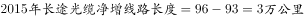。

因此倍。

故正确答案为D。

---

### 第 3 题　qid 2024184 · 增长

2011-2015年接入网光缆线路长度同比增速超过的年份有几个：

- **A**. 2
- **B**. 3
- **C**. 4　✅
- **D**. 5

**答案**：C

**官方解析**

由“…同比增速超过…”，判断题型为一般增长率问题。

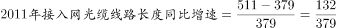，首位商3，故；

，首位商3，故；

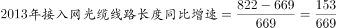，首位商2，故；

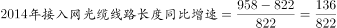，首位商1，故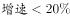；

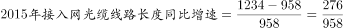，首位商2，故。

共有4个年份增速大于。

故正确答案为C。

---

### 第 4 题　qid 2024186 · 比重

2015年全国新建光缆中，接入网光缆线路长度所占比重为：

- **A**. 
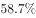

- **B**. 

　✅
- **C**. 
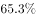

- **D**. 
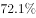

**答案**：B

**官方解析**

由题干“2015年…接入网光缆线路长度所占比重为”，可判定该题属于现期比重问题。定位柱状图中数据，2015年全国新建光缆为万公里；2015年新建接入光缆为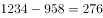万公里。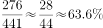，接近答案B。

故正确答案为B。

---

### 第 5 题　qid 2024188 · 综合

关于光缆线路长度变化情况，下列说法错误的是：

- **A**. 2011-2015年线路长度增长速度最快的是接入网光缆
- **B**. 2011-2015年光缆线路总长度净增值最大的是2015年
- **C**. 2011-2015年接入网光缆线路长度净增值超过同期长途光缆
- **D**. 2011-2015年接入网光缆与本地网中继光缆线路长度差距逐年缩小　✅

**答案**：D

**官方解析**

由题干“下列说法错误的是”，可判定该题属于综合分析问题。

A项：增速比较只需比即可，则2011-2015年长途光缆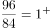，2011-2015年本地网中继光缆，2011-2015年接入网光缆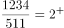，正确。

B项：定位柱状图中数据，2015年光缆线路长度净增值为万公里，其余年份均小于400万公里，正确。

C项：定位柱状图中数据，2011-2015年接入网光缆线路长度净增值为万公里，2011-2015年长途光缆线路长度净增值为万公里，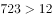，正确。

D项：定位柱状图中数据，接入网光缆与本地网中继光缆线路长度2012年差距为万公里，2013年差距为万公里，2014年差距为万公里，因此不是逐年缩小的，错误。

本题为选非题，故正确答案为D。

---

## 材料 2

        2005年全国人口抽样调查主要数据公报显示，同2000年第五次全国人口普查相比，2005年具有大学教育程度的人口增加2193万人；具有高中教育程度的人口增加974万人；具有初中教育程度的人口增加3746万人，具有小学教育程度的人口减少4485万人。

        2015年全国人口抽样调查主要数据公报显示，同2010年第六次全国人口普查相比，2015年每10万人中具有大学教育程度的人口由8930人上升为12445人；具有高中教育程度人口由14032人上升为15350人；具有初中教育水平人口由38788人下降到35633人；具有小学教育程度人口由26779人下降为24356人。

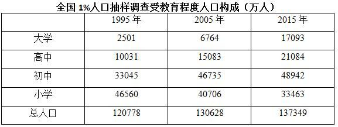

### 第 6 题　qid 2024190 · 增长

1995-2015年受教育程度人数平均增速最快的人群是：

- **A**. 大学　✅
- **B**. 高中
- **C**. 初中
- **D**. 小学

**答案**：A

**官方解析**

根据“增速最快······”， 可知此题为一般增长率问题。根据增长率公式： ，因各教育程度现期、基期年份相同，则总数越大平均数越大，可知仅比较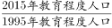即可。定位表格，在各教育程度中，2015年教育程度与1995年的比值分别为：、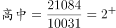、、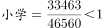，比较发现6.8最大，即1995～2015年大学教育程度的人数的平均增速最快。

故正确答案为A。

常识判断：根据政府曾出台的大学扩招政策，可推测大学人口年平均增速可能为最高。

---

### 第 7 题　qid 2024192 · 综合

2015年初中教育程度人口相比2000年：

- **A**. 
下降了

- **B**. 
提高了
　✅
- **C**. 
下降了

- **D**. 
提高了

**答案**：B

**官方解析**

根据“2015年···比2000年提高/下降···”，判断本题为一般增长率计算问题。定位表格和第一段文字材料，2015年初中教育程度人口为48942万人，2005年初中教育程度人口为46735万人，比2000年增加3746万人。

方法一：。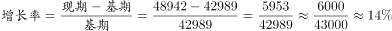 。B项最接近。

方法二：2015年初中教育程度人口相比于2005年增加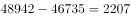。所以2015年比2000年增加。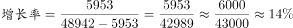。B项最接近。

故正确答案为B。

---

### 第 8 题　qid 2024194 · 比重

2015年未接受教育的文盲、半文盲的人口比例约为：

- **A**. 

　✅
- **B**. 

- **C**. 

- **D**. 

**答案**：A

**官方解析**

根据“2015年…的人口比例为…”，判断本题为现期比重问题。定位表格材料，有各种教育程度的人口构成，因此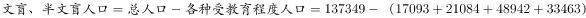 。，A选项最接近。

故正确答案为A。

---

### 第 9 题　qid 2024196 · 综合

相比于2005年，2010年每10万人中具有高中教育程度的人口：

- **A**. 上升了1318人
- **B**. 减少了1051人
- **C**. 上升了2485人　✅
- **D**. 减少了2185人

**答案**：C

**官方解析**

根据选项“上升（减少）了……人”，可知此题为增长量计算问题。定位文字材料第二段，可知2010年每10万人中具有高中教育程度的人口为14032人；定位表格，可知2005年，高中教育程度人口为15083万人，总人口130628万人，因，则有，，结果与C项最接近。

故正确答案为C。

---

### 第 10 题　qid 2024198 · 综合

能够从上述资料推出的是：

- **A**. 2015年小学教育程度人口比例高于2005年
- **B**. 2010年高中教育程度人口相比于2005年出现下降
- **C**. 小学教育程度人口在抽样年份中所占比例持续下降　✅
- **D**. 初中教育程度人口在抽样年份中所占比例高于同期其他受教育人口

**答案**：C

**官方解析**

A项： ，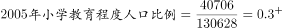，2015年数据小于2005年，错误。

B项：2005年高中教育程度人口为15083万人，2010年每10万人中具有高中教育程度人口有14032人。材料中没有2010年的总人口数据，所以无法从上述材料推断，错误。

C项：1995年：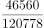，2005年：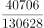，两者相比，前者分子大分母小，故1995年数据大于2005年。2015年：，与2005年相比，2005年的分子大分母小，故2005年数据大于2015年。因此小学教育人口所占比例持续下降，正确。

D项：在1995年中，小学教育程度人口大于初中，所以1995年初中教育程度人口比例小于小学，错误。

故正确答案为C。

---

## 材料 3

        2015年保险公司原保险保费收入24282.52亿元，同比增长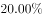，比上一年高。其中，产险业务原保险保费收入7994.97亿元，同比增长；寿险业务原保险保费收入13241.52亿元，同比增长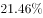；健康险业务原保险保费收入2410.47亿元，同比增长；意外险业务原保险保费收入635.56亿元，同比增长。

        2015年保险公司赔款和给付支出8674.14亿元，同比增长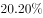。其中，产险业务赔款4194.17亿元，同比增长；寿险业务给付3565.17亿元，同比增长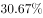；健康险业务赔款和给付762.97亿元，同比增长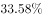；意外险业务赔款151.84亿元，同比增长。

        截至2015年末，保险公司资金运用余额111795.49亿元，较年初增长。其中，银行存款24349.67亿元，占比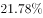；债券38446.42亿元，占比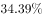；股票和证券投资基金16968.99亿元，占比；其他投资32030.41亿元，占比。

        截至2015年末，保险公司总资产123597.76亿元，较年初增长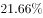。其中，产险公司总资产18481.13亿元，较年初增长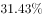；寿险公司总资产99324.83亿元，较年初增长；再保险公司总资产5187.38亿元，较年初增长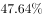；资产管理公司总资产352.39亿元，较年初增长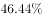。

### 第 11 题　qid 2024170 · 综合

2013年保险公司原保险保费收入约为：

- **A**. 20667亿元
- **B**. 18232亿元
- **C**. 19426亿元
- **D**. 17223亿元　✅

**答案**：D

**官方解析**

由“已知2015年保险公司原保险保费收入，求2013年保险公司原保险保费收入”可知，本题为间隔基期计算问题。定位材料第一段可知，2015年保险公司原保险保费收入为24282.52亿元，同比增长，比上一年高，故2014年保险公司原保险保费收入同比增长。根据间隔增长率计算公式：2015年相对2013年的增长率。故2013年保险公司原保险保费收入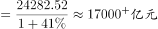。

故正确答案为D。

---

### 第 12 题　qid 2024172 · 比重

2015年，四大保险业务中，原保险保费收入占比最高值与最低值相差约：

- **A**. 

- **B**. 

- **C**. 

　✅
- **D**. 

**答案**：C

**官方解析**

由题干问“占比最高值与最低值相差”且选项为百分数可知，本题为比值计算问题。定位材料第一段可知，2015年保险公司原保险保费收入为24282.52亿元，占比最高的为寿险业务，收入为13241.52亿元，占比最低的为意外险业务，收入为635.56亿元。。

故正确答案为C。

---

### 第 13 题　qid 2024174 · 综合

2014年寿险业务原保险保费收入比其给付金额多：

- **A**. 10902亿元
- **B**. 8174亿元　✅
- **C**. 9676亿元
- **D**. 3800亿元

**答案**：B

**官方解析**

材料为2015年，由题干问“2014年······比······多”可知，本题为基期和差问题。定位材料第一、第二段，2015年寿险业务原保险保费收入13241.52亿元，同比增长；寿险业务给付3565.17亿元，同比增长。则2014年原保险保费收入约为亿元，给付金额约为亿元，原保险保费收入比其给付金额多亿元，与B项最接近。

故正确答案为B。

---

### 第 14 题　qid 2024178 · 比重

截至2015年末，保险公司资金运用余额占比最大的是：

- **A**. 银行存款
- **B**. 债券投资　✅
- **C**. 股票和证券投资基金
- **D**. 其他投资

**答案**：B

**官方解析**

由题干求“资金运用余额占比最大的是”可知，本题为直接找数问题。定位材料第三段可知，银行存款占比；债券占比；股票和证券投资基金占比；其他投资占比。最大，所以债券投资占比最大。

故正确答案为B。

---

### 第 15 题　qid 2024180 · 综合

以下选项能够从资料中推出的是：

- **A**. 2015年保险公司原保险保费收入增长最快的是意外险业务
- **B**. 2015年保险公司资金运用中，股票和证券投资基金的收益最高
- **C**. 2015年保险公司原保险保费收入满足不了其赔款和给付支出需求
- **D**. 2015年年初产险公司和寿险公司总资产占保险公司总资产九成以上　✅

**答案**：D

**官方解析**

A项：判断增长最快，即增长率比较。定位材料第一段，健康险业务原保险保费收入同比增长，意外险业务原保险保费收入同比增长，意外险健康险，意外险业务不是增长最快的，故A项错误。

B项：材料中没有提及保险资金运用的收益，只有保险资金运用的余额，B项无法推出。

C项：定位材料第一段，可知2015年保险公司原保险保费收入为24282.52亿元，定位材料第二段，可知2015年保险公司赔款和给付支出8674.14亿元，收入赔款和给付支出，故C项错误。

D项：定位材料第四段，可知保险公司总资产为123597.76亿元，增长；产险和寿险公司总资产分别为18481.13亿元和99324.83亿元，分别增长和。所以2015年初产险和寿险公司资产之和占保险公司总资产的比重为，故D项正确。

故正确答案为D。

---

## 材料 4

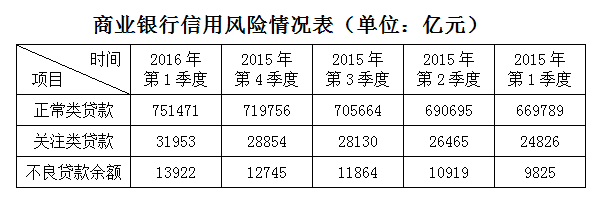

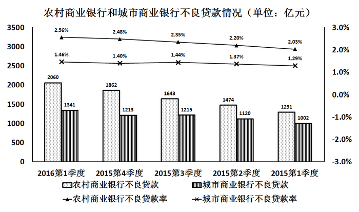 

### 第 16 题　qid 2015318 · 增长

2016年第1季度，商业银行正常类贷款同比增长率约为：

- **A**. 

- **B**. 

- **C**. 

- **D**. 

　✅

**答案**：D

**官方解析**

由题干“同比增长率”可知为增长率计算问题，题中给出了2016年第1季度和2015年第1季度的数据，给出了现期和基期为一般增长率计算问题。利用求解即可。定位图表可知，2016年第一季度，正常类贷款为751471亿元，2015年第一季度，正常类贷款为669789亿元。增长率计算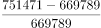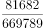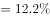。

故正确答案为D。

---

### 第 17 题　qid 2015322 · 增长

2015年第2季度至2016年第1季度，商业银行关注类贷款环比增长最快的是：

- **A**. 2016年第1季度　✅
- **B**. 2015年第4季度
- **C**. 2015年第3季度
- **D**. 2015年第2季度

**答案**：A

**官方解析**

由题干“环比增长最快的是”可知为增长率比较问题，题中给出了2015年第1季度到2016年第1季度的数据，为一般增长率比较问题。利用= 表示出增长率，进行比较即可。定位图表可知，2015年第1季度到2016年第1季度关注类贷款数据分别为：24826，26465，28130，28854，31953。则2015年第2季度到2016年第1季度增长率=分别为：=，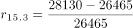=，=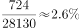，=。

故正确答案为A。

---

### 第 18 题　qid 2015330 · 增长

2016年第1季度，农村商业银行贷款总额环比增长约：

- **A**. 

- **B**. 

- **C**. 

　✅
- **D**. 

**答案**：C

**官方解析**

由题干“环比增长约”结合选项都为百分数，可判定该题属于一般增长率问题。定位柱状图数据，2016年第1季度，农村商业银行不良贷款2060亿元，不良贷款率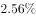；2015年第4季度农村商业银行不良贷款1862亿元，不良贷款率。则2016年第1季度，农村商业银行贷款总额为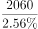亿元； 2015年第4季度，农村商业银行贷款总额为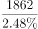亿元。因此2016年第1季度，农村商业银行贷款总额环比增长约为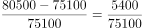。

故正确答案为C。

---

### 第 19 题　qid 2015336 · 综合

2015年城市商业银行全年不良贷款率约为：

- **A**. 
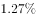

- **B**. 

　✅
- **C**. 

- **D**. 

**答案**：B

**官方解析**

由题干“2015年城市商业银行全年不良贷款率”可知为比重问题，结合材料中只给出2015年一、二、三、四个季度的不良贷款率，求全年不良贷款率可知本题为混合比重问题。

定位图表可知，2015年城市商业银行不良贷款率第一季度至第四季度依次为：、、、。混合之后居中，故2015年城市商业银行全年不良贷款率应在~之间，只有B项符合。

故正确答案为B。

---

### 第 20 题　qid 2015342 · 综合

关于2015年第1季度至2016年第1季度商业银行贷款情况能从上述资料中推出的是：

- **A**. 城市商业银行不良贷款率高于农村商业银行
- **B**. 农村商业银行贷款总额高于城市商业银行
- **C**. 农村商业银行贷款总额持续增加　✅
- **D**. 城市商业银行不良贷款持续增加

**答案**：C

**官方解析**

A项：定位材料统计图，2015年第1季度至2016年第1季度城市商业银行不良贷款率始终低于农村商业银行，错误；

B项：根据贷款总额，计算可得城市商业银行2015年第1季度到2016年第1季度的贷款总额分别为：；；；；。对比C项发现，每个季度农村商业银行的贷款额均低于城市贷款额，故前者的总额也低于后者，错误；

C项：根据农村贷款总额，结合图形材料可得2015年第1季度至2016年第1季度农村商业银行贷款总额分别为：；；  ；；；每季度高于上个季度，正确；

D项：定位材料统计图，城市商业银行2015年第4季度不良贷款为1213，小于2015年第3季度不良贷款的1215，没有增加，错误；

故正确答案为C。

---
