# 2016年重庆市选调优秀大学生到基层工作考试《行测》题

> 资料分析 · 10 题 · 选调 2016

## 材料 1

        虽然受到国家对一些投资过热的重点行业实行严格控制的影响，但由于国家对西部农业、能源、交通、水利以及教育、卫生等社会事业的支持与投入继续加大，同时西部各省区市也加大了地方投资力度，西部地区2014年的固定资产投资继续保持较高的增长速度。全年完成固定资产投资(不含农村和城乡个体投资，下同)125980亿元，同比增长，增速同比回落5.5个百分点。

        在西部各省区市中，固定资产投资总量最多的是四川省，共完成投资24692.08亿元，占西部投资总量的；其次是内蒙古，共完成投资17763.18亿元，占西部的；重庆完成投资15117.6亿元，占西部投资总量的，排在第三位。

        除新疆、贵州和甘肃外，西部其他地区2014年固定资产投资增长速度都在以上，内蒙古、重庆的固定资产投资增幅超过，分别比上年增长和，分列西部投资增幅的前两位；广西和云南的固定资产增长速度均为，并列居于西部第三位。

### 第 1 题　qid 2262591 · 综合

西部地区2013年固定资产投资额约为（    ）亿元。

- **A**. 121291.39
- **B**. 112377.76
- **C**. 145603.50
- **D**. 107217.02　✅

**答案**：D

**官方解析**

根据题干“西部地区2013年固定资产投资额约为（    ）亿元”，结合材料所给时间为2014年，可判定本题为基期计算问题。定位文字材料第一段可得：西部地区2014年的固定资产投资125980亿元，同比增长，代入公式：，则2013年固定资产投资额为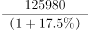，与D项最接近。

故正确答案为D。

---

### 第 2 题　qid 2262592 · 综合

下列省区市中，2013年固定资产投资总量位居第二位的是：

- **A**. 四川
- **B**. 重庆
- **C**. 内蒙古　✅
- **D**. 广西

**答案**：C

**官方解析**

根据题干“······2013年固定资产投资总量位居第二位的是”，结合材料时间为2014年，可判定本题为基期比较问题。定位文字材料第二段可得，西部地区固定资产投资总量排在前三位的省份是四川、内蒙古、重庆，分别为24692.08、17763.18、15117.6亿元。则广西固定资产投资总量&lt;15117.6亿元。定位文字材料第三段可得，除新疆、贵州和甘肃外，西部其他地区2014年固定资产投资增长速度都在20%以上，内蒙古、重庆的固定资产投资增幅超过30%，分别比上年增长53.0%和41.3%······广西和云南的固定资产增长速度均为29.0%，并列居于西部第三位。则四川固定资产投资增幅介于20%~29%之间。根据公式：基期量可得，2013年内蒙古固定资产投资总量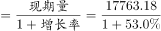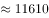亿元，重庆亿元，广西亿元，四川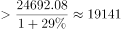亿元。故2013年固定资产投资总量最多的是四川，无法比较广西和内蒙古的大小关系，故本题无法确定正确答案。

---

### 第 3 题　qid 2262593 · 增长

假设按照现在的增长趋势，重庆2015年固定资产投资额约为（    ）亿元。

- **A**. 21361　✅
- **B**. 19780
- **C**. 20990
- **D**. 22470

**答案**：A

**官方解析**

根据题干“重庆2015年固定资产投资额约为（    ）亿元”，可判定本题为现期计算问题。定位文字材料第二段和第三段可知：2014年重庆固定资产投资15117.6亿元，增长率为。按照现在的增长趋势，代入公式：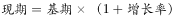，则2015年重庆固定资产投资基期

，计算时两个数字均缩小，故真实值略大于21000。

故正确答案为A。

---

### 第 4 题　qid 2262594 · 综合

内蒙古自治区2013年固定资产投资额约占西部投资总量的：

- **A**. 

- **B**. 

　✅
- **C**. 

- **D**. 

**答案**：B

**官方解析**

根据题干“内蒙古自治区2013年固定资产投资额约占西部投资总量的······”，结合材料所给时间为2014年，判定本题为基期比重问题。定位材料可知，2014年内蒙古固定资产投资额占西部地区的比重为，内蒙古固定资产投资额的增速为，西部为。代入公式，（是现期比重），则2013年内蒙古固定资产投资占西部投资总量的比重为。

故正确答案为B。

---

### 第 5 题　qid 2262595 · 综合

能够从上述材料反映出的是：

- **A**. 重庆和云南2014年固定资产投资总量及增长速度并列居于西部第三位
- **B**. 甘肃省2014年社会固定资产投资增幅位列西部地区倒数第一位
- **C**. 2013年西部地区某些行业出现投资过热现象　✅
- **D**. 四川省2014年社会固定资产投资总额及增幅均居西部地区第一位

**答案**：C

**官方解析**

A项：定位文字材料第二段，重庆完成投资15117.6亿元，占西部投资总量的，排在第三位。定位材料最后一段，广西和云南的固定资产增长速度均为，并列居于西部第三位，错误。

B项：材料中未提及增幅列于西部地区倒数第一位的省份，无法判断，错误。

C项：定位文字材料第一段，“虽然受到国家对一些投资过热的重点行业实行严格控制的影响······西部地区2014年的固定资产投资继续保持较高的增长速度”,说明2013年西部地区的一些行业出现投资过热现象，正确。

D项：定位文字材料第三段，在西部各省区市中，固定资产投资增幅居西部地区第一位的是内蒙古，错误。

故正确答案为C。

---

## 材料 2

        2014年年末，A市规模以上工业企业2087户，全年实现工业增加值1653.54亿元，比上年增长。其中，轻工业增加值653.28亿元，增长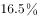；重工业增加值1000.26亿元，增长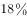。战略性新兴产业完成产值1598.74亿元，比上年增长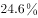。

        规模以上工业企业主营业务收入6002.74亿元，比上年增长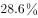；利润总额358.55亿元，增长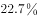；亏损企业亏损额15.46亿元，下降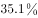。电气机械和器材制造业、通用设备制造业、专用设备制造业、金属制品业、汽车制造业等11个行业利润均超过10亿元，累计实现利润285.26亿元。

        A市36个工业增加值全部实现增长，六大主导产业实现增加值951.60亿元，比上年增长。全年规模以上工业出口交货值419.79亿元.比上年下降。

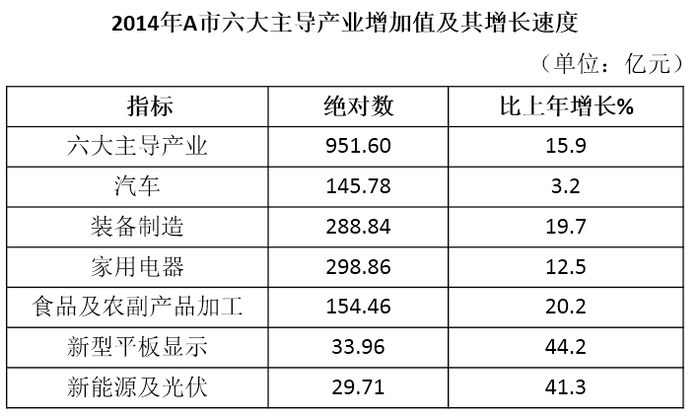

### 第 6 题　qid 2262596 · 增长

2014年，A市战略性新兴产业完成产值比上年增加约（    ）亿元。

- **A**. 315.64　✅
- **B**. 364.76
- **C**. 378.42
- **D**. 389.23

**答案**：A

**官方解析**

根据题干“2014年，······比上年增加约（    ）亿元”，可判定本题为增长量计算问题。定位文字材料第一段可得：2014年年末，······战略性新兴产业完成产值1598.74亿元，比上年增长。则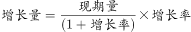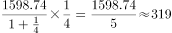亿元，与A项最接近。

故正确答案为A。

---

### 第 7 题　qid 2262597 · 比重

2013年，A市重工业增加值占全年工业增加值的比重约为：

- **A**. 

- **B**. 

- **C**. 

　✅
- **D**. 
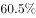

**答案**：C

**官方解析**

根据题干“2013年，······占······的比重约为”，结合材料所给时间为2014年，可判定本题为基期比重问题。定位文字材料第一段可得，2014年年末，······全年实现工业增加值1653.54亿元，比上年增长。······重工业增加值1000.26亿元，增长。代入公式，则2013年A市重工业增加值占全年工业增加值的比重约为，结果略小于，只有C项满足。

故正确答案为C。

---

### 第 8 题　qid 2262598 · 增长

2013年，六大主导产业中增加值最多的产业的增加值比最少的多（  ）倍。

- **A**. 9.2
- **B**. 10.2
- **C**. 11.6　✅
- **D**. 12.6

**答案**：C

**官方解析**

根据题干“2013年，······比······多（    ）倍”，结合材料所给时间为2014年，可判定本题为基期倍数问题。定位表格可得，2014年A市六大主导产业增加值及增长率。根据公式：，可得2013年A市汽车产业增加值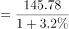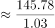亿元，装备制造产业增加值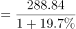亿元，家用电器产业增加值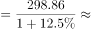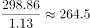亿元，食品及农副产品加工产业增加值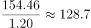亿元，新型平板显示产业增加值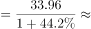亿元，新能源及光伏产业增加值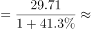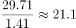亿元，则2013年家用电器产业增加值最大，新能源及光伏产业增加值最小。故所求倍数倍，与C项最接近。

故正确答案为C。

---

### 第 9 题　qid 2262599 · 综合

2013年，A市亏损企业亏损额为（  ）亿元。

- **A**. 11.4
- **B**. 13.9
- **C**. 23.8　✅
- **D**. 27.6

**答案**：C

**官方解析**

根据题干“2013年，A市亏损企业亏损额为（  ）亿元”，结合材料所给时间为2014年，可判定本题为基期计算问题。定位文字材料第二段可得，亏损企业亏损额15.46亿元，下降。根据公式：，则2013年A市亏损企业亏损额为亿元。

故正确答案为C。

---

### 第 10 题　qid 2262600 · 综合

根据上述资料，下列表述不正确的是：

- **A**. 
2014年，A市六大主导产业中，增加值同比增速高于六大主导产业平均增速的有4个

- **B**. 
2014年，A市六大主导产业中，增加值占比较上年同期有所下降的有2个

- **C**. 
2013年，A市规模以上工业出口交货值约为412亿元
　✅
- **D**. 
2014年，A市11个利润均超过10亿元的行业，其利润额占规模以上工业企业利润总额的比重接近

**答案**：C

**官方解析**

A项：定位表格可得，2014年，A市六大主导产业平均增速为，那么六大主导产业中，增加值同比增速高于的有装备制造（）、食品及农副产品加工（）、新型平板显示（）、新能源及光伏（），共4个，正确。

B项：根据两期比重比较规律可得，可知当a（六大主导产业中的某一产业的增长率）b（六大主导产业的增长率）时，增加值占比较上年同期有所下降。定位表格，只有汽车增长率（）和家用电器增长率（）小于六大主导产业增长率（），正确（或者根据A项判断有4个高于的，剩余2个低于，判断B项正确）。

C项：定位文字材料第三段可得，全年规模以上工业出口交货值419.79亿元，比上年下降”,代入公式，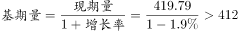亿元，错误。

D项：定位文字材料第二段可得，规模以上工业企业主营业务收入6002.74亿元，利润总额358.55亿元，······电气机械和器材制造业、通用设备制造业、专用设备制造业、金属制品业、汽车制造业等11个行业利润均超过10亿元，累计实现利润285.26亿元”。那么2014年，A市11个利润均超过10亿元的行业，其利润额占规模以上工业企业利润总额的比重为，接近，正确。

本题为选非题，故正确答案为C。

---
