# 2016年黑龙江省公务员录用考试《行测》题（县乡卷）

> 资料分析 · 20 题 · 黑龙江 2016

## 材料 1

根据以下资料，回答下列问题。

        2015年1-3月，国有企业营业总收入103155.5亿元，同比下降。其中，中央企业收入63191.3亿元，同比下降。地方国有企业收入39964.2亿元，同比下降。

        1-3月，国有企业营业总成本100345.5亿元，同比下降，其中销售费用、管理费用和财务费用同比分别下降、增长和增长。其中，中央企业成本60216.5亿元，同比下降；地方国有企业成本40129亿元，同比下降。

        1-3月，国有企业利润总额4997.3亿元，同比下降。国有企业应交税金9383亿元，同比增长。

        3月末，国有企业资产总额1054875.4亿元，同比增长；负债总额685766.3亿元，同比增长；所有者权益合计369109.1亿元，同比增长。其中，中央企业资产总额554658.3亿元，同比增长；负债总额363304亿元，同比增长；所有者权益为191354.4亿元，同比增长。地方国有企业资产总额500217.1亿元，同比增长；负债总额322462.3亿元，同比增长；所有者权益为177754.7亿元，同比增长。

### 第 1 题　qid 1796340 · 综合

2014年1-3月，国有企业营业总收入最接近：

- **A**. 10.5万亿元
- **B**. 11万亿元　✅
- **C**. 11.5万亿元
- **D**. 12万亿元

**答案**：B

**官方解析**

根据题干中“2014年1~3月”，可以判断本题为基期计算问题。定位文字材料第一段，2015年1~3月，国有企业营业总收入103155.5亿元，同比下降。代入基期公式：=。

故正确答案为B。

---

### 第 2 题　qid 1796334 · 比重

2015年3月末，中央企业所有者权益占国有企业总体比重比上年同期约：

- **A**. 下降了0.7个百分点　✅
- **B**. 下降了1.5个百分点
- **C**. 上升了0.7个百分点
- **D**. 上升了1.5个百分点

**答案**：A

**官方解析**

根据题干中“2015年3月”“比上年同期”“占比重”，可以判定本题为两期比重问题。定位文字材料第四段，可以得到中央企业所有者权益为191354.4亿元，同比增长；国有企业所有者权益合计369109.1亿元，同比增长。代入两期比重公式，先判断上升还是下降，由可判断为下降，排除C、D两项。&lt;，故答案应小于，只有A项满足。

故正确答案为A。

---

### 第 3 题　qid 1796338 · 综合

2015年3月末，中央企业的资产负债率（负债总额÷资产总额）约在以下哪个范围内？

- **A**. 
以下

- **B**. 
-

- **C**. 
-
　✅
- **D**. 
以上 

**答案**：C

**官方解析**

根据题干中“2015年3月末······资产负债率（）”，可以判断本题为比值计算问题。参看第四段材料，中央企业负债总额363304亿元，资产总额554658.3亿元，代入资产负债率公式：

。因此在~范围内。

故正确答案为C。

---

### 第 4 题　qid 1796336 · 增长

2015年1-3月，在销售费用、管理费用和财务费用中，占国有企业营业总成本的比重同比上升的有几项？

- **A**. 0
- **B**. 1
- **C**. 2
- **D**. 3　✅

**答案**：D

**官方解析**

根据题干中“2015年1-3月······占国有企业营业总成本的比重”，可以判定本题为两期比重问题。只需比较部分量的增长率a和整体量的增长率b，为上升。定位文字材料第二段，销售费用的增长率（下降）、管理费用的增长率（增长）及财务费用的增长率（增长）均大于国有企业营业总成本的增长率b（下降），即比重上升；因此，比重上升的有3项。

故正确答案为D。

---

### 第 5 题　qid 1796342 · 综合

能够从上述资料中推出的是：

- **A**. 2015年1-3月，中央和地方国有企业营业成本均低于同期营业收入
- **B**. 2014年1-3月，国有企业应交税金占同期营业总收入的一成以上
- **C**. 2015年3月末，国有企业资产总额同比增长不到12万亿元　✅
- **D**. 2015年3月末，地方国有企业资产负债率高于上年同期水平

**答案**：C

**官方解析**

A项，定位文字材料第一段和第二段，2015年1-3月，，成本低于收入；，成本高于收入，错误；

B项，定位文字材料第一段和第三段，2014年1~3月国有企业应交税金占同期营业总收入的比重，不足一成，错误；

C项，定位文字材料第四段，2015年3月末，国有企业资产总额同比增长量=万亿元，正确；

D项，定位文字材料第四段，地方国有企业资产负债率（）是否高于上年同期水平，需要比较负债总额的增长率a与资产总额的增长率b，而，故地方国有企业资产负债率低于上年同期水平，错误。

故正确答案为C。

---

## 材料 2

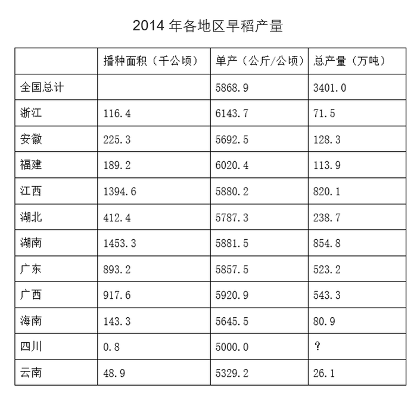

### 第 6 题　qid 2392846 · 综合

表中“?”处的数值应为：

- **A**. 0.4　✅
- **B**. 1.6
- **C**. 4
- **D**. 16

**答案**：A

**官方解析**

题干所求是2014年四川的早稻总产量，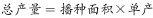，可判定本题为现期平均数问题。定位表格，可知：2014年四川早稻播种面积为0.8千公顷，单产为5000.0公斤/公顷，所求总产量单位为万吨，注意单位换算，，则2014年四川的早稻总产量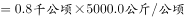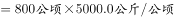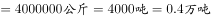。

故正确答案为A。

---

### 第 7 题　qid 2392849 · 综合

2014年全国早稻播种面积约为多少千公顷？

- **A**. 4500
- **B**. 5100
- **C**. 5800　✅
- **D**. 6500

**答案**：C

**官方解析**

根据问题“2014年全国早稻播种面积约为多少千公顷”，材料时间为2014年，结合播种面积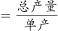，可判断本题为现期平均数问题。定位表格，2014年全国早稻总产量为3401.0万吨，单产为5868.9公斤/公顷，注意单位换算，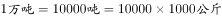，则2014年全国早稻播种面积为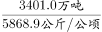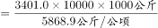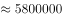公顷=5800千公顷。

故正确答案为C。

---

### 第 8 题　qid 2392851 · 平均数

2014年全国早稻单位面积产量超过全国平均水平的省（自治区）有几个？

- **A**. 6
- **B**. 7
- **C**. 4
- **D**. 5　✅

**答案**：D

**官方解析**

定位表格，2014年全国早稻单产为5868.9公斤/公顷，则2014年全国早稻单位面积产量超过全国平均水平的省（自治区）有浙江（6143.7）、福建（6020.4）、江西（5880.2）、湖南（5881.5）、广西（5920.9），共有5个。
故正确答案为D。

---

### 第 9 题　qid 2392857 · 比重

2014年早稻播种面积排名前两位的省（自治区），当年早稻产量之和占全国总产量的比重在以下哪个范围？

- **A**. 
低于

- **B**. 
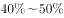
　✅
- **C**. 

- **D**. 
高于

**答案**：B

**官方解析**

根据问题“2014年······的比重在以下哪个范围”，结合材料时间为2014年，可判定本题为现期比重问题。定位表格，2014年早稻播种面积排名前两位的省（自治区）为湖南、江西，对应两个省份当年的早稻产量分别为854.8万吨、820.1万吨，2014年全国早稻产量总计为3401.0万吨，那么其当年早稻产量之和占全国总产量的比重为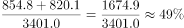。

故正确答案为B。

---

### 第 10 题　qid 2392862 · 综合

能够从上述资料中推出的是：

- **A**. 2014年两广地区早稻产量高于两湖地区
- **B**. 2014年全国早稻播种面积高于上年水平
- **C**. 2014年早稻单位面积产量最高的省份，单位面积产量为最低省份的1.3倍多
- **D**. 2014年早稻总产量和播种面积排名前五的省份排名相同　✅

**答案**：D

**官方解析**

A项：定位表格，可知：2014年广东、广西早稻产量分别为523.2万吨、543.3万吨，两广地区早稻产量为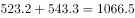万吨；2014年湖北、湖南早稻产量分别为238.7万吨、854.8万吨，两湖地区早稻产量为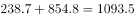万吨，故两广地区早稻产量低于两湖地区，错误；

B项：表格给的是2014年全国的单产和总产量，播种面积，可以求出2014年的全国早稻播种面积，但是并没有2013年相关的数据，无法进行比较，错误；

C项：定位表格，可知2014年早稻单位面积产量最高的省份为浙江省，单产6143.7公斤/公顷；2014年早稻单位面积产量最低的省份为四川省，单产5000.0公斤/公顷，列式：，错误；

D项：定位表格，根据104题可知“?”处为0.4万吨，2014年早稻总产量排名前五的省份为湖南、江西、广西、广东、湖北，2014年播种面积排名前五的省份为湖南、江西、广西、广东、湖北。这五个省份排名相同，正确。

故正确答案为D。

---

## 材料 3

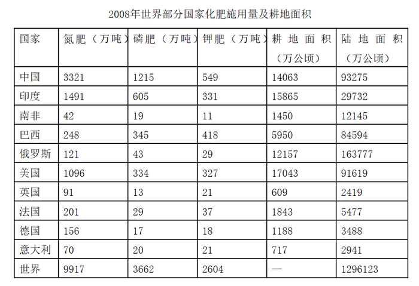

### 第 11 题　qid 2392881 · 综合

在上述国家中，2008年陆地面积超过5亿公顷的国家中磷肥施用量低于100万吨的有：

- **A**. 0个
- **B**. 1个　✅
- **C**. 2个
- **D**. 3个

**答案**：B

**官方解析**

定位表格，可知2008年陆地面积超过5亿公顷的国家有中国、巴西、俄罗斯、美国，其中磷肥施用量低于100万吨国家的只有俄罗斯（43万吨）。
故正确答案为B。

---

### 第 12 题　qid 2392882 · 综合

在上述国家中，2008年单位耕地面积钾肥施用量最少的国家是：

- **A**. 俄罗斯　✅
- **B**. 南非
- **C**. 英国
- **D**. 德国

**答案**：A

**官方解析**

根据问题“······2008年单位耕地面积钾肥施用量最少的国家是”，结合材料时间为2008年，可判定本题为现期平均数问题。定位表格，根据单位耕地面积钾肥施用量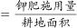，可知各国2008年单位耕地面积钾肥施用量分别为：俄罗斯：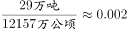吨/公顷；南非：吨/公顷；

英国：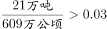吨/公顷；德国：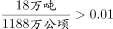吨/公顷。则2008年单位耕地面积钾肥施用量最少的国家是俄罗斯。

故正确答案为A。

---

### 第 13 题　qid 2392883 · 综合

在上述国家中，2008年耕地面积占陆地面积不足的国家个数是：

- **A**. 4个
- **B**. 3个
- **C**. 2个　✅
- **D**. 1个

**答案**：C

**官方解析**

根据问题“······2008年耕地面积占陆地面积不足的国家个数是”，结合材料时间为2008年，可判定本题为现期比重问题。定位表格，中国：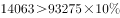，不符合；印度：，不符合；南非：，不符合；巴西：，符合；俄罗斯：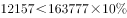，符合；美国：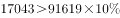，不符合；英国：，不符合；法国：，不符合；德国：，不符合；意大利：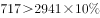，不符合。因此2008年耕地面积占陆地面积不足的国家有巴西和俄罗斯2个。

故正确答案为C。

---

### 第 14 题　qid 2392884 · 综合

以下国家2008年单位耕地面积氮肥施用量，由高到低排序正确的是：

- **A**. 巴西  德国  俄罗斯
- **B**. 德国  巴西  俄罗斯　✅
- **C**. 俄罗斯  德国  巴西
- **D**. 德国  俄罗斯  巴西

**答案**：B

**官方解析**

根据问题“2008年单位耕地面积氮肥施用量，由高到低排序正确的是”，可判定本题为现期平均数的排序问题。单位耕地面积氮肥施用量，选项中的国家为巴西、俄罗斯、德国。定位表格，可知：2008年巴西单位耕地面积氮肥施用量；2008年俄罗斯单位耕地面积氮肥施用量；2008年德国单位耕地面积氮肥施用量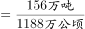。观察三个分数，的分子最小，分母最大，则分数最小，即俄罗斯单位耕地面积氮肥施用量最低，排除C、D两项。比较巴西和德国，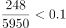，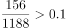，故巴西德国，则由高到低排序为德国、巴西、俄罗斯。

故正确答案为B。

---

### 第 15 题　qid 2392885 · 综合

下列判断正确的是：

- **A**. 
在上述国家中，2008年有5个国家的磷肥施用量少于钾肥的施用量
　✅
- **B**. 
2008年南非单位耕地面积磷肥施用量高于英国

- **C**. 
2008年美国氮肥、磷肥、钾肥的施用量均超过世界总施用量的

- **D**. 
在上述国家中，2008年耕地面积最少的国家也是上述三种化肥施用量最少的国家

**答案**：A

**官方解析**

A项：定位表格，发现磷肥施用量少于钾肥的施用量的国家有巴西、英国、法国、德国、意大利，共5个国家，正确；

B项：单位耕地面积磷肥施用量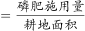，定位表格，2008年南非单位耕地面积磷肥施用量为吨/公顷；2008年英国单位耕地面积磷肥施用量为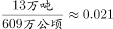吨/公顷，2008年南非单位耕地面积磷肥施用量低于英国，错误；

C项：定位表格，美国的氮肥、磷肥、钾肥施用量分别为1096万吨、334万吨、327万吨，氮肥世界总施用量的为万吨；磷肥世界总施用量的为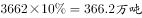；钾肥世界总施用量的为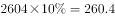万吨。发现美国的磷肥施用量（334）未超过世界总施用量的（366.2），错误；

D项：定位表格，2008年耕地面积最少的国家为英国，三种化肥施用量最少的国家为南非，错误。

故正确答案为A。

---

## 材料 4

根据所给资料，回答101~105题。

### 第 16 题　qid 1797576 · 综合

居民基本养老保险基金中的支出户资产总额比居民基本医疗保险基金中的支出户资产总额约高多少亿元？

- **A**. 62　✅
- **B**. 72
- **C**. 504
- **D**. 585

**答案**：A

**官方解析**

定位图表第四行第三列、第五列，居民基本养老保险基金中的支出户资产总额为145亿元，居民基本医疗保险基金中的支出户资产总额为83亿元，则前者比后者高亿元。

故正确答案为A。

---

### 第 17 题　qid 1797582 · 比重

若将城镇职工基本养老保险基金中财政专户存款资产总额的10%转入协议存款，则协议存款总额占社会保险基金资产总额的比重将增加约多少个百分点？

- **A**. 2
- **B**. 5　✅
- **C**. 8
- **D**. 12

**答案**：B

**官方解析**

定位表格第三行可知，2013年城镇职工基本养老保险中的财政专户存款为24218亿元。若其转入协议存款，协议存款总额占社会保险基金资产总额所增加的比重即为城镇职工基本养老保险财政专户存款占社会保险基金资产总额的比重。故所求即为。（本题为现期比重问题，比重的分母应为社会保险基金资产总额47727亿元，而不是城镇职工基本养老保险基金资产总额29930亿元，所以错选C项是因为分母数据没有找对。）

故正确答案为B。

---

### 第 18 题　qid 1797526 · 综合

根据基金资产总额从高到低，以下顺序正确的是：

- **A**. 失业保险    生育保险    居民基本养老保险
- **B**. 居民基本医疗保险    工伤保险    失业保险
- **C**. 失业保险    居民基本养老保险    居民基本医疗保险　✅
- **D**. 城镇职工基本医疗保险    工伤保险    居民基本养老保险

**答案**：C

**官方解析**

本题为排序类。定位表格，查找数据，代入各选项。
A项：居民基本养老保险3124亿元大于生育保险518亿元，错误。
B项：工伤保险1004亿元小于失业保险3726亿元，错误。
C项：失业保险3726亿元大于居民基本养老保险3124亿元，大于居民基本医疗保险1077亿元，正确。
D项：工伤保险1004亿元小于居民基本养老保险3124亿元，错误。
故正确答案为C。

---

### 第 19 题　qid 1797532 · 比重

以下哪个图形能够正确反映债券投资总额中各基金的占比情况？

- **A**. 

　✅
- **B**. 

- **C**. 

- **D**. 

**答案**：A

**官方解析**

根据题干中“债券投资总额中各基金的占比情况”，可判定本题为现期比重问题。定位表格，债券投资各项分别为54亿元、26亿元、15亿元、4亿元、16亿元、1亿元，总额为116亿元，最大的模块占比为，排除C、D两项，居民基本养老保险26亿元占最大模块将近一半，城镇职工基本医疗保险和失业保险两个模块相近，占比，A项最接近。

故正确答案为A。

---

### 第 20 题　qid 1797586 · 综合

能够从上述资料推出的是：

- **A**. 除居民养老保险基金外，其他社保基金均无协议存款投资
- **B**. 城镇职工基本医疗保险基金资产总额是居民基本医疗保险基金的8倍多
- **C**. 城镇职工基本医疗保险基金的资产项目类型数少于其他社会保险基金
- **D**. 城镇职工基本养老保险基金资产总额高于表中其他各项基金总额之和　✅

**答案**：D

**官方解析**

A项，定位表格可知，除城镇职工基本养老保险基金外，其他各项基金均无协议存款投资，错误； 

B项，定位表格可知，城镇职工基本医疗保险基金总额为8348亿元，居民基本医疗保险基金总额为1077亿元，，错误；

C项，定位表格可知，城镇职工基本医疗保险基金的资产项目数比居民基本医疗保险基金的多，错误；

D项，定位表格可知，城镇职工基本养老保险基金总额为29930亿元，总金额为47727亿元，则其他各项基金总额之和为亿元亿元，正确。

故正确答案为D。

---
