# 2017年422联考《行测》题（内蒙古卷）

> 资料分析 · 15 题 · 内蒙古 2017

## 材料 1

根据以下资料，回答下列小题。

        2016年6月份，我国社会消费品零售总额26857亿元，同比增长，环比增长。其中，限额以上单位消费品零售额13006亿元，同比增长。

        2016年1~6月份，我国社会消费品零售总额156138亿元，同比增长。其中，限额以上单位消费品零售额71075亿元，同比增长。

        按经营单位所在地分，2016年6月份，城镇消费品零售额23082亿元，同比增长；乡村消费品零售额3775亿元，同比增长。1~6月份，城镇消费品零售额134249亿元，同比增长；乡村消费品零售额21889亿元，同比增长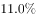。

        按消费类型分，2016年6月份，餐饮收入2907亿元，同比增长；商品零售23951亿元，同比增长。1~6月份，餐饮收入16683亿元，同比增长；商品零售139455亿元，同比增长。

        2016年1~6月份，全国网上零售额22367亿元，同比增长。其中，实物商品网上零售额18143亿元，同比增长。

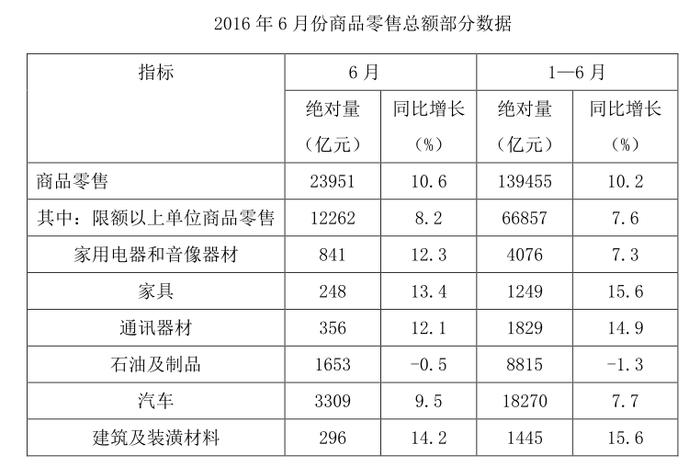

### 第 1 题　qid 2049848 · 综合

2016年5月份，全国社会消费品零售总额约为：

- **A**. 24594亿元
- **B**. 24283亿元
- **C**. 26612亿元　✅
- **D**. 27104亿元

**答案**：C

**官方解析**

材料中给出的时间为2016年6月，题干中的时间为2016年5月，可知，本题为基期计算问题。定位材料第一段，“2016年6月份，我国社会消费品零售总额26857亿元，环比增长”，代入基期计算公式，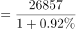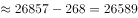，与C项最接近。

故正确答案为C。

---

### 第 2 题　qid 2049856 · 比重

2015年1-6月份，限额以上单位消费品零售额占全国社会消费品零售总额的比重约为：

- **A**. 
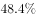

- **B**. 
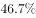
　✅
- **C**. 

- **D**. 
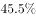

**答案**：B

**官方解析**

材料中给出的时间为2016年，题干中的时间为2015年，所求为“······占······比重”，可知，本题为基期比重问题。定位数据，“2016年1-6月份，我国社会消费品零售总额156138亿元，同比增长。其中，限额以上单位消费品零售额71075亿元，同比增长”，代入基期比重计算公式，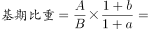。

故正确答案为B。

---

### 第 3 题　qid 2049858 · 增长

2016年1-6月份，以下选项中，商品零售同比增速最快的是：

- **A**. 汽车
- **B**. 石油及制品
- **C**. 家用电器和音像器材
- **D**. 通讯器材　✅

**答案**：D

**官方解析**

定位表格第五列，2016年1-6月份，汽车同比增速为，石油及制品同比增速为，家用电器和音像器材同比增速为，通讯器材同比增速为，所以商品零售同比增速最快的为通讯器材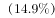。

故正确答案为D。

---

### 第 4 题　qid 2049864 · 增长

2016年6月份，城镇消费品零售额比上年同期增加：

- **A**. 380亿元
- **B**. 2169亿元
- **C**. 1193亿元
- **D**. 2193亿元　✅

**答案**：D

**官方解析**

由题干求“2016年6月份，城镇消费品零售额比上年同期增加”，选项带单位“亿元”可知，本题为增长量计算问题。根据“2016年6月份，城镇消费品零售额”,定位材料第三段，定位数据，“2016年6月份，城镇消费品零售额23082亿元，同比增长”，，代入增长量计算公式，亿元。

故正确答案为D。

---

### 第 5 题　qid 2050272 · 增长

按2016年1~6月份的同比增速，2017年1~6月份城镇消费品零售额约为：

- **A**. 25506亿元
- **B**. 172220亿元
- **C**. 147942亿元　✅
- **D**. 153679亿元

**答案**：C

**官方解析**

根据题干所求“按2016年1~6月份的同比增速，2017年1~6月份城镇消费品零售额”，可判定此题为现期计算。定位文字材料第三段，“2016年1~6月份，城镇消费品零售额134249亿元，同比增长”，，则2017年1~6月份城镇消费品零售额为亿元，最接近C项。

故正确答案为C。

---

## 材料 2

### 第 6 题　qid 2049524 · 比重

2015年税收收入占一般公共预算收入比重最大的是：

- **A**. 上海　✅
- **B**. 江苏
- **C**. 浙江
- **D**. 福建

**答案**：A

**官方解析**

由题干“2015年……占……比重最大”，而且材料时间为2015年，可判定此题为现期比重比较问题。定位表格第二列和第四列，所求。

上海：；江苏：

浙江：；福建：

故正确答案为A。

---

### 第 7 题　qid 2051430 · 平均数

2015年一般公共预算收入高于表中七个省（市）平均值的有：

- **A**. 上海、安徽、福建、江西
- **B**. 江苏、浙江、安徽、山东
- **C**. 上海、江苏、浙江、山东　✅
- **D**. 安徽、福建、江西、山东

**答案**：C

**官方解析**

根据题干“2015年一般公共预算收入高于表中七个省（市）平均值”，可判定此题为平均数问题。

方法一：

代入表格数据，七个省（市）一般公共预算平均值为亿元，一般公共预算高于该平均值的省（市）为上海5519.5亿元、江苏8028.6亿元、浙江4809.5亿元、山东5529.3亿元。

方法二：

选项都为4个具体省（市）名称，问高于平均值的有几个，则只需要选择选项当中相对最大的四个城市即可。按照表格中一般公共预算排名前四的省（市）依次是：江苏、山东、上海、浙江，对应C项。

故正确答案为C。

---

### 第 8 题　qid 2049536 · 增长

2015年江苏、浙江、江西三省的税收收入平均增速是：

- **A**. 

- **B**. 

- **C**. 

　✅
- **D**. 

**答案**：C

**官方解析**

由题干“江苏、浙江、江西三省的税收收入平均增速”，可判定此题为混合增长率问题。根据混合增长率原理：混合之后增长率居中不正中，偏向基数大。A项和D项超出三者的范围，排除。江苏（，基期值约为6000）和江西（，基期值约为1400）接近，看做一个整体，基期量约为7400，增长率在到之间，混合后约为。再与浙江（，基期值约为3900）混合，增长率偏向基数大的江苏和江西，所以选择与江苏、江西更接近的C项（）。

故正确答案为C。

---

### 第 9 题　qid 2049540 · 综合

2015年一般公共预算收入与GDP的比值大于的省（市）有：

- **A**. 4个
- **B**. 5个　✅
- **C**. 6个
- **D**. 7个

**答案**：B

**官方解析**

由题干“比值大于的省（市）有”，可判定此题为现期比重问题。

上海：；

江苏：；

浙江：；

安徽：；

福建：；

江西：；

山东：；

可得上海、江苏、浙江、安徽、江西一般公共预算收入与GDP的比值大于，共5个。

故正确答案为B。

---

### 第 10 题　qid 2049554 · 比重

2014年福建GDP占全国GDP的比重较江苏：

- **A**. 
多

- **B**. 
少
　✅
- **C**. 
多

- **D**. 
少

**答案**：B

**官方解析**

由题干“2014年······占······比重较······”，可判定此题为基期比重比较问题。定位表格第六列和第七列，2015年福建GDP为25979.8亿元，同比增长，2015年江苏GDP为70116.4亿元，同比增长，2015年全国GDP为676708亿元，同比增长。故2014年福建GDP占全国GDP的比重江苏GDP占全国GDP比重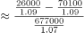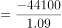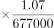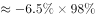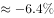。

故正确答案为B。

---

## 材料 3

        2015年全国共建立社会捐助工作站、点和慈善超市3.0万个，比上一年减少0.2万个，其中：慈善超市9654个，同比下降。全年共接收社会捐赠款654.5亿元，其中：民政部门接收社会各界捐款44.2亿元，各类社会组织接收捐款610.3亿元。全年民政部门接收捐赠衣被4537.0万件，捐赠物资价值折合人民币5.2亿元。全年有1838.4万人次困难群众受益，同比增长，增长率较上一年下降27.5个百分点。全年有934.6万人次在社会服务领域提供了2700.7万小时的志愿服务，同比减少10.4万小时。 

### 第 11 题　qid 2049534 · 综合

2015年，全国建立的慈善超市较2014年约：

- **A**. 增加519个
- **B**. 减少519个　✅
- **C**. 增加686个
- **D**. 减少686个​

**答案**：B

**官方解析**

由题干“2015年……较2014年”结合选项增加或减少多少个，可判断本题是增长量计算问题。定位文字材料第一段，2015年慈善超市9654个，同比下降，增长量=（约减少510个），与B项最接近。

故正确答案为B。

---

### 第 12 题　qid 2049546 · 增长

2015年受益的困难群众较2013年增长约：

- **A**. 

　✅
- **B**. 

- **C**. 

- **D**. 

**答案**：A

**官方解析**

由题干“2015年……较2013年增长约……”，结合选项都为“”，可判定该题为间隔增长率问题。定位文字材料，“困难群众受益，同比增长，增长率较上一年下降27.5个百分点”，则2015年增长率，2014年增长率，所以2015年受益的困难群众较2013年增长：，与A选项最接近。

故正确答案为A。

---

### 第 13 题　qid 2049552 · 比重

2012-2015年社会组织接收社会捐赠款占总捐赠款的比重最高的是：

- **A**. 2012年
- **B**. 2013年
- **C**. 2014年
- **D**. 2015年　✅

**答案**：D

**官方解析**

由题干“2012-2015······占······比重最高的是”，可判定该题是比值比较问题。定位文字材料和表中数据，2012-2015年社会组织接收社会捐赠款占总捐赠款的比重分别为：2012年；2013年；2014年；2015年，所以社会组织接收社会捐赠款占总捐赠款的比重最高的是2015年。

故正确答案为D。

---

### 第 14 题　qid 2049568 · 综合

下面哪一张图能正确反映2011～2015年民政部门接收捐赠衣被数量的变化？

- **A**. 

　✅
- **B**. 

- **C**. 

- **D**. 

**答案**：A

**官方解析**

定位文字材料和表中数据，2011~2015年全国民政部门接收捐赠衣被数量分别为2918.5万件、12538.2万件、10405.0万件、5244.5万件、4537.0万件，所以2012年即第二个点最高，只有选项A满足条件。
故正确答案为A。

---

### 第 15 题　qid 2049574 · 综合

能够从上述资料中推出的是：

- **A**. 2011-2015年民政部门接收的社会捐赠款在持续增加
- **B**. 2015年民政部门接收捐赠衣被同比增长率高于2014年的二分之一
- **C**. 2012-2015年社会组织接收社会捐赠款同比增长最快的年份是2012年　✅
- **D**. 相比2014年，2015年在社会服务领域提供志愿服务的人次有所增加

**答案**：C

**官方解析**

A项：定位表中数据，2014年民政部门接收的社会捐赠款79.6亿元小于2013年民政部门接收的社会捐赠款107.6亿元，错误；

B项：定位文字材料和表中数据，2015年民政部门接收捐赠衣被，2014年民政部门接收捐赠衣被。故：，正确；

C项：定位文字材料和表中数据，2012-2015年社会组织接收社会捐赠款同比增长率分别为：2012年；2013年；2014年；2015年，所以2012年同比增长最快，正确；

D项：定位文字材料，“全年有934.6万人次在社会服务领域提供了2700.7万小时的志愿服务，同比减少10.4万小时”，无法判断提供志愿服务的人次的变化，错误。

故正确答案为B和C。

【备注】本题为争议题。粉笔对B项和C项可能的争议点解释如下：

B项可能的争议点是：

①同比增长率是否可以为负数？根据本卷第四篇资料分析的表格数据可知，同比增长（）下面出现了-0.5这样的负数，所以同比增长率是可以为负数的。

②比较同比增长率高低时，是否需要带负号比较？根据近年全国各地类似真题可知，增长率比高低时，需要带负号比较，例如。

C项可能的争议点是：

2012-2015年增长最快的年份是否要考虑2012年？根据近年全国各地类似真题可知，如果提到2012-2015年的年均增长量或年均增长率等，一般不考虑2012年的增长情况（江苏例外）；但是如果提到2012-2015年增长最快/最多的年份，一般都是要考虑2012年当年的增长情况的，否则会使得很多国考省考题目变得没有答案。

基于以上分析，粉笔认为本题B、C答案没有明显错误，都应该是正确答案。

---
