# 2017年422联考《行测》题（吉林卷乙级）

> 资料分析 · 10 题 · 吉林 2017

## 材料 1

        中关村上市公司协会公布的《2016年中关村上市公司竞争力报告》显示，2015年中关村上市公司总营业收入达到2.34万亿元，同比增长，截至2015年底，中关村上市公司总市值达到48175亿元，同比增幅，较2011年增长了约34824亿元。

        中关村上市公司中有接近六成的企业研发投入力度较高，其中有67家（公司数量占比）企业的研发强度在及以上，达到了国际高科技领先企业的水平。

### 第 1 题　qid 2050634 · 增长

2015年与2014年相比，中关村上市公司总营业收入增加了：

- **A**. 0.51万亿元　✅
- **B**. 0.65万亿元
- **C**. 1.83万亿元
- **D**. 0.41万亿元

**答案**：A

**官方解析**

根据题干所求“2015年与2014年相比······营业收入增加了”，选项带单位，可判定此题为增长量计算问题。定位文字材料第一段，“2015年中关村上市公司总营业收入达到2.34万亿元，同比增长”。代入公式：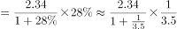万亿元，最接近A项。

故正确答案为A。

---

### 第 2 题　qid 2050644 · 增长

2015年与2014年相比，中关村上市公司净利润同比增速：

- **A**. 上升了18个百分点
- **B**. 下降了5个百分点　✅
- **C**. 上升了5个百分点
- **D**. 下降了18个百分点

**答案**：B

**官方解析**

根据题干所求“2015年与2014年相比······同比增速”，选项为百分点变化，可判定此题为增长率问题。定位统计图，2015年中关村上市公司净利润增长率为，2014年为。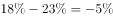，即2015年增速比2014年下降5个百分点。

故正确答案为B。

---

### 第 3 题　qid 2050654 · 综合

资料显示，2015年中关村上市公司数量约为：

- **A**. 67家
- **B**. 22家
- **C**. 10家
- **D**. 210家　✅

**答案**：D

**官方解析**

根据题干所求“2015年中关村上市公司数量”，材料已知部分公司数量及占比，可判定此题为现期比重问题。定位文字材料第二段，“有67家（公司数量占比）企业的研发强度在及以上”，代入公式：，最接近D项。

故正确答案为D。

---

### 第 4 题　qid 2050658 · 增长

2011-2015年间，中关村上市公司净利润年均增加值约为：

- **A**. 96亿元　✅
- **B**. 77亿元
- **C**. 57亿元
- **D**. 103亿元

**答案**：A

**官方解析**

根据题干所求“2011-2015年间······年均增加值”可判定此题为年均增长量计算问题。定位柱状图可得，2015年净利润为902亿元、2011年为518亿元，代入公式：亿元。

故正确答案为A。

---

### 第 5 题　qid 2050666 · 综合

下列关于中关村上市公司的说法，错误的是：

- **A**. 2015年与2011年相比，中关村上市公司总市值，翻了两番多　✅
- **B**. 2011至2015年间，中关村上市公司净利润增速呈震荡起伏变动
- **C**. 2015年排名前3位的公司研发总费用约占前20位研发总费用的近一半
- **D**. 2015年约有近三分之一企业的研发强度达到了国际高科技领先企业的水平

**答案**：A

**官方解析**

A项：定位文字材料第一段，2015年中关村上市公司总市值达到48175亿元，较2011年增长了约34824亿元，则2015年总市值是2011年的，故翻了不到两番，错误；

B项：定位第一个折线图可发现，净利润增速在2011至2015年间起伏呈交替变化趋势，正确；

C项：定位第二个折线图，排名前3位的公司研发总费用为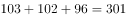亿元，前20位的公司研发费用总和为该图中所有数据相加，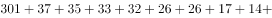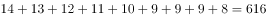亿元，，占比接近一半，正确；

D项：定位文字材料第二段，“有67家（公司数量占比）企业的研发强度在及以上，达到了国际高科技领先企业的水平”，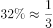，正确。

本题为选非题，故正确答案为A。

---

## 材料 2

        2016年是中国脱贫攻坚首战之年，全年超过1000万人告别贫困；中央和省级财政扶贫资金首次超过1000亿元；各类金融机构累计发放扶贫小额贷款2772亿元；产业扶贫为脱贫不断“换血”，其中2016年旅游扶贫覆盖到2.26万个贫困村，据不完全统计，河南、甘肃、河北等地2016年贫困地区农民人均可支配收入增长速度普遍高于当地农民人均可支配收入增速。其中，河南省贫困地区人均可支配收入可达9734.9元，处于中部地区领先水平；福建贫困地区人均可支配收入增长高达，高于全国农民人均可支配收入增长的平均水平。

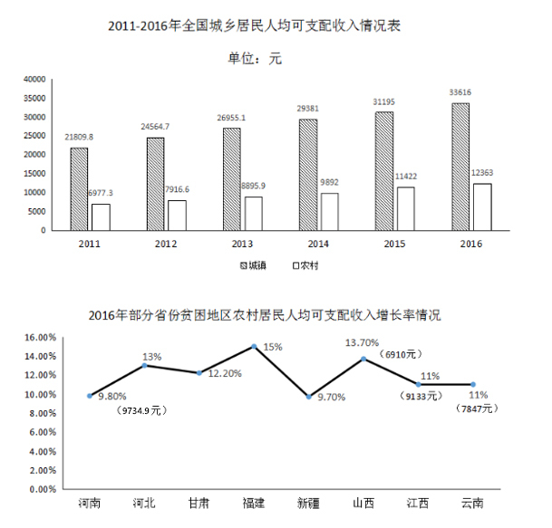

### 第 6 题　qid 2050528 · 平均数

2011-2016年全国城镇居民人均可支配收入与前一年相比增长最多的年份是：

- **A**. 2012　✅
- **B**. 2013
- **C**. 2014
- **D**. 2015

**答案**：A

**官方解析**

由题干“2011-2016年······与前一年相比增长最多的年份是”，可判定该题是增长量比较问题。定位数据图一中数据，可得全国城镇居民人均可支配收入与前一年相比增长分别为：2012年增长量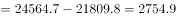元；2013年增长量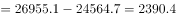元；2014年增长量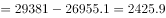元；2015年增长量元。所以2011-2016年全国城镇居民人均可支配收入与前一年相比增长最多的年份是2012年。

故正确答案为A。

---

### 第 7 题　qid 2050532 · 增长

2016年部分省份贫困地区农村居民人均可支配收入增速高于全国农村居民人均可支配收入增速的省份个数有：

- **A**. 1
- **B**. 4
- **C**. 6
- **D**. 8　✅

**答案**：D

**官方解析**

由题干“2016年部分省份贫困地区······高于······个数有”，可知只需要计算出全国农村居民人均可支配收入增速比较即可，可判定该题是一般增长率问题。定位数据图一中数据，可得2016年全国农村居民人均可支配收入增速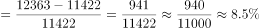，观察数据图二中数据，8个省份贫困地区农村居民人均可支配收入增速均高于。

故正确答案为D。

---

### 第 8 题　qid 2050538 · 平均数

2011-2016年全国农村居民人均可支配收入超过9000元的年份有：

- **A**. 1
- **B**. 2
- **C**. 3　✅
- **D**. 4

**答案**：C

**官方解析**

由题干“2011-2016年全国······超过9000元的年份有”，图一各年数据给出，可判定该题是简单计算问题。定位数据图一中数据，2011-2016年全国农村居民人均可支配收入超过9000元的年份有2014年9892元，2015年11422元，2016年12363元，总共3年超过9000元。
故正确答案为C。

---

### 第 9 题　qid 2050544 · 平均数

2011-2016年城乡居民人均可支配收入的比值变化趋势为：

- **A**. 波浪形变化
- **B**. 逐年递减　✅
- **C**. 逐年递增
- **D**. 直线形变化

**答案**：B

**官方解析**

由题干“2011-2016年······比值变化趋势为”，比值变化趋势其实也就是比值大小变化情况，可判定该题是比值比较问题。定位数据图一中数据，可得2011-2016年城乡居民人均可支配收入的比值分别为：2011年；2012年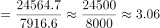；2013年；2014年；2015年；2016年，所以2011-2016年城乡居民人均可支配收入的比值，呈逐年递减趋势。

故正确答案为B。

---

### 第 10 题　qid 2050552 · 综合

从上述资料中可以推出的是：

- **A**. 河南、甘肃、河北等地2016年贫困地区农民人均可支配收入增长速度普遍高于当地居民人均可支配收入增速
- **B**. 全国农村居民人均可支配收入增速呈逐年上涨趋势
- **C**. 2016年河南省贫困地区农村居民人均可支配收入与全国农村居民人均可支配收入的差额为3500元
- **D**. 2015年江西省贫困地区农村居民人均可支配收入约为8230元　✅

**答案**：D

**官方解析**

A项：定位文字材料，河南、甘肃、河北等地2016年贫困地区农民人均可支配收入增长速度普遍高于当地农民人均可支配收入增速，是当地农民而不是当地居民，错误；

B项：增长率的比较可用进行比较，定位数据图一中数据，2012年：；2013年：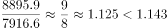，所以2012年全国农村居民人均可支配收入增速快于2013年，错误；

C项：定位数据图一和二中数据，可得2016年河南省贫困地区农村居民人均可支配收入与全国农村居民人均可支配收入的差额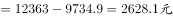，错误；

D项：定位数据图二中数据，可得2015年江西省贫困地区农村居民人均可支配收入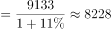元，约为8230元，正确。

故正确答案为D。

---
