# 2017年422联考《行测》题（吉林卷甲级）

> 资料分析 · 10 题 · 吉林 2017

## 材料 1

        2012-2015年，我国国内生产总值年均增长率为，远高于世界同期（世界银行数据）的平均水平。对世界经济增长的贡献率平均约为。2015年被称为新常态元年，我国GDP占世界的比重为，比2012年高4个百分点。2015年GDP相当于美国的，比2012年提高11个百分点。我国依然是世界经济增长的最重要引擎。

        2015年，我国服务业增加值为34.16万亿元，2013-2015年均增长，服务业增加值在国内生产总值中的比重从2012年的提高到2015年的，连续三年保持国民经济第一大产业的地位，2015年，我国服务业投资额为31.19万亿元，2012-2015年均增长。

        网络消费增长强劲，2014年、2015年全年网上零售额分别为2.79万亿元、3.88万亿元，增长和，其中实物商品网上零售额占当年社会消费品零售总额的和。

        网络服务高速增长。2013-2015年，规模以上服务企业中“互联网和相关服务业”营业收入分别增长，和，远高于同期规模以上服务业营业收入的增速。

        电子商务交易额快速增长。2014年电子商务交易额达16.4万亿元，增长；其中，自营电商交易额为8.7万亿元，增长。

        现代金融服务业支撑作用不断增强，2013-2015年，上市公司通过境内市场累计筹资年均增长。金融对重点领域支持力度明显加强。2014年，新增小微企业贷款2.1万亿元，占企业新增贷款，2015年末，主要农村金融机构贷款余额12.03万亿元，增长。

### 第 1 题　qid 2052070 · 比重

2012年，我国国内生产总值占世界的比重为：

- **A**. 

　✅
- **B**. 

- **C**. 

- **D**. 

**答案**：A

**官方解析**

由题干“2012年……占……比重”可知本题为基期比重问题。定位材料第一段“2015我国GDP占世界的比重为，比2012年高4个百分点”，则2012年我国国内生产总值占世界的比重为。

故正确答案为A。

---

### 第 2 题　qid 2052072 · 增长

按年均增长率为计算，2015年我国服务业增加值同比增加了：

- **A**. 1.3万亿元
- **B**. 31.6万亿元
- **C**. 2.6万亿元　✅
- **D**. 1.8万亿元

**答案**：C

**官方解析**

由题干“2015年……同比增加了”结合选项有单位，可知本题为增长量计算问题。定位材料第二段“2015年，我国服务业增加值为34.16万亿元”且题干要求按年均增长率计算，则：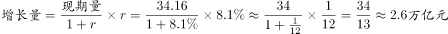 ，与C项最为接近。

故正确答案为C。

---

### 第 3 题　qid 2052074 · 增长

2015年我国服务业投资额相当于2012年的增长率约为：

- **A**. 

- **B**. 

　✅
- **C**. 

- **D**. 

**答案**：B

**官方解析**

由题干“2015年……相当于2012年增长率约为”可知本题为一般增长率问题。定位材料第二段“2015年，我国服务业投资额为31.19万亿元，2012-2015年均增长”，由年均增长率公式：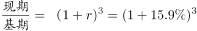 ，由增长率公式：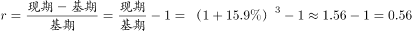 。

故正确答案为B。

---

### 第 4 题　qid 2052076 · 综合

资料显示，2014年企业新增贷款额约为：

- **A**. 6万亿元
- **B**. 1万亿元
- **C**. 3万亿元
- **D**. 5万亿元　✅

**答案**：D

**官方解析**

由题干“2014年企业新增贷款额约为”结合材料“2014年，新增小微企业贷款2.1万亿元，占企业新增贷款”可知本题为现期比重问题，则2014年企业新增贷款额为：。

故正确答案为D。

---

### 第 5 题　qid 2052078 · 综合

下列说法错误的是：

- **A**. 2012-2015年间，我国服务业投资额增速快于GDP增速
- **B**. 2014年，在电子商务交易中自营电子商务交易是主体
- **C**. 资料显示，未来服务业的发展主要还是依靠传统服务业　✅
- **D**. 2015全年网上零售额比2013年增长了约2.02万亿元

**答案**：C

**官方解析**

A项：定位材料第一段和第二段“2012-2015年，我国国内生产总值年均增长率为。我国服务业投资额为31.19万亿元，2012-2015年均增长”，则2012-2015年间，我国服务业投资额增速快于GDP增速，正确；

B项：定位材料第五段“2014年电子商务交易额达16.4万亿元，其中，自营电商交易额为8.7万亿元”，则2014年，在电子商务交易中自营电子商务交易的占比为：，占比超过一半，是主体，正确；

C项：定位材料第四段“2013-2015年，规模以上服务企业中‘互联网和相关服务业’营业收入分别增长，和，远高于同期规模以上服务业营业收入的增速”可知互联网和相关服务业增速远高于服务业营业收入增速，未来服务业的发展主要依靠互联网和相关服务业，错误；

D项：定位材料第三段“2014年、2015年全年网上零售额分别为2.79万亿元、3.88万亿元，增长和，”，2013年全年网上零售额为：，故2015年比2013年增长了：万亿元，正确。

本题为选非题，故正确答案为C。

---

## 材料 2

下面是某省的对外贸易进出口总额的部分数据资料，请根据图表回答下述问题：

### 第 6 题　qid 2052080 · 综合

以下各项中，该省净进口贸易总额数值最小的年份是：

- **A**. 2015　✅
- **B**. 2011
- **C**. 2012
- **D**. 2014

**答案**：A

**官方解析**

定位材料统计图，2011年进口额为170.49亿元、出口额为49.98亿元，2012年进口额为185.89亿元、出口额为59.83亿元，2014年进口额为206亿元、出口额为57.78亿元，2015年进口额为142.84亿元、出口额为46.54亿元。

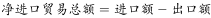，2011年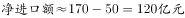，2012年，2014年，2015年。2015年净进口额最小。

故正确答案为A。

---

### 第 7 题　qid 2052082 · 比重

根据图表，该省出口额占进出口贸易总额的比重最大的年份是：

- **A**. 2013　✅
- **B**. 2016
- **C**. 2015
- **D**. 2014

**答案**：A

**官方解析**

由题干所求“……占……比重”，可判定此题为现期比重问题。

定位图表，2013年出口额占进出口贸易总额的比重为；

2014年对应比重为；

2015年对应比重为；

2016年对应比重为。

2013年出口额占进出口贸易总额的比重最大。

故正确答案为A。

---

### 第 8 题　qid 2052084 · 综合

下列企业中，2016年该省海关进出口差额最大的是：

- **A**. 国有企业
- **B**. 私营企业
- **C**. 集体企业
- **D**. 外商投资企业　✅

**答案**：D

**官方解析**

定位统计表，2016年国有企业出口绝对量为98058万美元、进口绝对量为447697万美元，外商投资企业出口绝对量为134248万美元、进口绝对量为799532万美元，集体企业出口绝对量为1395万美元、进口绝对量为5372万美元，私营企业出口绝对量为185970万美元、进口绝对量为159282万美元。

国有企业进出口差额为，外商投资企业进出口差额为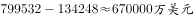，集体企业进出口差额为，私营企业进出口差额为。进出口差额最大的是外商投资企业。

故正确答案为D。

---

### 第 9 题　qid 2052086 · 比重

2016年该省外商投资企业进出口总值占海关进出口总值的比重约为：

- **A**. 
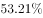

- **B**. 

- **C**. 

　✅
- **D**. 

**答案**：C

**官方解析**

由题干所求“……占……比重”，可判定此题为现期比重问题。定位统计表，2016年该省外商投资企业进出口总值为，海关进出口总值为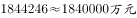，2016年该省外商投资企业进出口总值占海关进出口总值的比重约为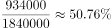，与C项最接近。

故正确答案为C。

---

### 第 10 题　qid 2052088 · 综合

根据材料，以下说法错误的一项是：

- **A**. 
2011-2015年，该省的进出口贸易总额的变化趋势是先增后减

- **B**. 
2016年该省私营企业出口总值增速最快
　✅
- **C**. 
2012年该省的进口额净增长大于2015年该省的进口额净增长

- **D**. 
2015年该省进口额的同比增长率为-

**答案**：B

**官方解析**

A项：观察图形材料可以看出，2011年-2014年该省的进出口贸易总额为递增趋势，2015年为减少趋势，正确；

B项：结合表格材料，2016年该省出口总值中外商投资增速（）最快，错误；

C项：2012年该省进口额为185.89亿美元，大于2011年进口额170.49亿美元，故2012年进口额的净增长为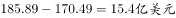；2015年该省进口额为142.84亿美元，小于2014年进口额206亿美元，故2015年进口额的净增长为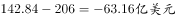，，正确；

D项：结合表格材料，2015年该省进口额为142.84亿美元，2014年进口额为206亿美元。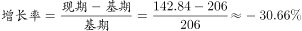，正确。

本题为选非题，故正确答案为B。

---
