# 2017年422联考《行测》题（山东卷）

> 资料分析 · 21 题 · 山东 2017

## 材料 1

        2016年1季度，全国规模以上文化及相关产业企业共4.7万家，实现营业收入16719亿元，比上年同期增长，增速比上年全年增速提高1.7个百分点。 

 

### 第 1 题　qid 2049708 · 平均数

如全国规模以上文化及相关产业企业数量无变化，则2016年1季度平均每家全国规模以上文化及相关产业企业的营业收入约比上年同期增长多少万元？

- **A**. 60
- **B**. 150
- **C**. 280　✅
- **D**. 500

**答案**：C

**官方解析**

根据题干“······2016年1季度平均每家······营业收入约比上年同期增长多少万元”，可判定本题为平均数的增长量问题。由于全国规模以上文化及相关产业企业数量无变化，因此用即可。定位文字材料可得：2016年1季度，全国规模以上文化及相关产业企业共4.7万家，实现营业收入16719亿元，比上年同期增长，可知2016年1季度全国规模以上文化及相关产业企业营业收入的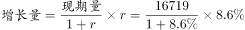亿元。则平均每家全国规模以上文化及相关产业企业的营业收入约比上年同期增长万元。

故正确答案为C。

---

### 第 2 题　qid 2049716 · 增长

在2016年1季度营业收入增速快于的产业中，当季营业收入高于全产业规模以上企业总营业收入的产业有几个？

- **A**. 1
- **B**. 2　✅
- **C**. 3
- **D**. 4

**答案**：B

**官方解析**

定位表格材料可知，2016年1季度营业收入增速快于的企业有：新闻出版发行服务，广播电影电视服务，文化艺术服务，文化信息传输服务，文化创意和设计服务，文化休闲娱乐服务。定位文字材料第一段可知2016年1季度全国规模以上文化及相关产业企业实现营业收入16719亿元，，因此满足增长率大于的产业中，只有文化信息传输服务1131亿元和文化创意和设计服务2041亿元大于836亿元，满足题意的只有2个。

故正确答案为B。

---

### 第 3 题　qid 2049720 · 增长

合并计算2016年1季度营业收入最高的两个产业，其营业收入总体增速最接近以下哪个数字？

- **A**. 4.4
- **B**. 5.1
- **C**. 5.7　✅
- **D**. 6.4

**答案**：C

**官方解析**

根据题干所求“合并计算2016年1季度营业收入最高的两个企业，其营业收入总体增速······”可判定此题为混合增长率问题。

定位表格材料可知，收入最高的两个企业为文化用品和工艺美术品，其增长率分别为和，根据混合增长率整体增长率居中，可知整体增长率一定在之间，排除Ａ、Ｄ两项。

混合增长率整体增长率偏向基数大的，已知文化用品的生产收入6422亿元大于工艺美术品的生产收入3272亿元，所以增长率偏向于，而B项与的差值大于与的差值，排除B项。

故正确答案为C。

---

### 第 4 题　qid 2049732 · 比重

以下哪个饼图能够最准确地反映全国各地区2016年1季度规模以上文化及相关产业营业收入的比重关系？

- **A**. A　✅
- **B**. B
- **C**. C
- **D**. D

**答案**：A

**官方解析**

根据题干所求“以下哪个饼图最能反映全国各地区2016年1季度······的比重关系”可判定此题为现期比重问题。

定位表格可知东部地区1季度营业收入为12528亿元，定位文字材料第一段可知2016年1季度全国规模以上文化及相关产业企业实现营业收入16719亿元，因此东部地区的比重为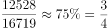，观察图形，可排除C、D两项。

由表格材料可知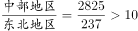，因此所占的比重之比同样大于10倍，观察图形，可排除B项。

故正确答案为A。

---

### 第 5 题　qid 2049736 · 综合

关于2016年1季度全国规模以上文化及相关产业营业收入状况，能够从上述资料中推出的是：

- **A**. 生产相关产业营业收入增速快于服务相关产业
- **B**. 总体营业收入增速快于上年同期水平
- **C**. 营业收入最低的产业，营业收入增速最快
- **D**. 中西部地区企业营业收入占全国总体的比重上升　✅

**答案**：D

**官方解析**

A项：定位表格材料可知，服务相关产业收入（按产业分的前六行）增速最小的为，增长率混合后一定大于；生产相关产业收入（按产业分的后四行）增速最大的为，增长率混合后一定小于，所以生产相关产业收入增速一定小于服务相关产业收入增速，错误；

B项：材料中只能找到2016年一季度增速比2015年全年增速快1.7个百分点，但没有给出与2015年一季度的同比变化数据，故无法判断，错误；

C项：定位表格材料可知，营业收入最低的企业为文化艺术服务，而收入增速最快的为文化信息传输服务，错误；

D项：定位文字材料第一段可知，整体增长率即全国规模以上文化及相关产业企业实现营业收入增长率为，定位表格材料可知，中部地区营业收入增长率为，西部地区的增长率为。根据混合增长率整体居中，可知中西部的增长率在和之间，故中西部的增长率高于，则必然大于全国的增长率，根据两期比重变化的原理，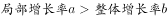，中西部占全国的比重上升，正确。

故正确答案为Ｄ。

---

## 材料 2

        2016年3月我国煤及褐煤进口量为1969万吨，环比增长，同比增长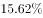。3月我国出口煤及褐煤127万吨，环比增长36万吨，同比增长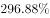。

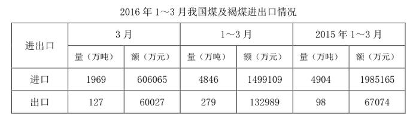

        3月焦炭出口量112万吨，环比增长24万吨，增长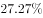，同比增长；1~3月累计出口焦炭274万吨，累计同比增长。

        3月全国钢材出口量998万吨，环比增长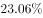，同比增长；1~3月累计出口钢材2783万吨，累计同比增长。3月份进口钢材127万吨，环比增长，同比增长；1~3月累计进口钢材313万吨，累计同比下降。

        铁矿石、原油、铜等大宗商品主要进口商品价格持续低位。2016年一季度，我国进口铁矿石2.42亿吨，增长；原油9110万吨，增长；铜143万吨，增长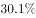。同期，进口煤及褐煤4846万吨，下降；成品油775万吨，下降；钢材313万吨，下降。同期，我国进口价格总体下跌。其中，铁矿石进口均价同比下跌，原油下跌，成品油下跌，煤及褐煤下跌，铜下跌，钢材下跌。

### 第 6 题　qid 2049700 · 增长

2016年3月我国出口煤及褐煤环比约增长多少个百分点？

- **A**. 25
- **B**. 30
- **C**. 35
- **D**. 40　✅

**答案**：D

**官方解析**

由题干求“2016年3月我国出口煤及褐煤环比约增长多少个百分点”可知，本题为一般增长率问题。定位材料第一段“2016年3月我国出口煤及褐煤127万吨，环比增长36万吨”，则所求增长率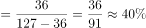。

故正确答案为D。

注意：本题问法有瑕疵，应该问增长了百分之多少而不是多少个百分点，但本题答案为是没有任何问题的。

---

### 第 7 题　qid 2049714 · 综合

2016年1~3月我国煤及褐煤进口量约比去年同期：

- **A**. 
下降
　✅
- **B**. 
下降

- **C**. 
增加

- **D**. 
增加

**答案**：A

**官方解析**

方法一：由题干求“2016年13月我国煤及褐煤进口量比去年同期”结合选项为百分数，可知本题为一般增长率问题。定位材料最后一段：“13月······同期，进口煤及褐煤4846万吨，下降”，即2016年13月煤及褐煤进口量比去年同期约下降。

方法二：由题干求“2016年1~3月我国煤及褐煤进口量比去年同期”结合选项为百分数，可知本题为一般增长率问题。定位表格数据，“2016年1~3月煤及褐煤进口量为4846万吨，2015年1~3月煤及褐煤进口量为4904万吨”，，增长率为负，说明约下降。

故正确答案为A。

---

### 第 8 题　qid 2049728 · 增长

2016年第一季度进口均价同比下降幅度超过的有：

- **A**. 煤、铜
- **B**. 铜、钢材
- **C**. 铁矿石、原油　✅
- **D**. 铁矿石、成品油

**答案**：C

**官方解析**

定位材料第四段，“铁矿石进口均价同比下跌，原油下跌，成品油下跌，煤及褐煤下跌，铜下跌，钢材下跌”，故铁矿石、原油进口均价的同比下降幅度分别为和，均超过。

故正确答案为C。

---

### 第 9 题　qid 2049734 · 综合

2015年3月份进口钢材约为多少万吨？

- **A**. 61.3
- **B**. 73.5
- **C**. 87.5　✅
- **D**. 101.3

**答案**：C

**官方解析**

材料给出的时间为2016年，求“2015年3月份进口钢材约为多少万吨”，可知本题为基期计算问题。定位材料第三段，“2016年3月份进口钢材127万吨，同比增长”，代入基期计算公式，，与C选项最接近。

故正确答案为C。

---

### 第 10 题　qid 2049744 · 综合

能够从上述材料中推出的是：

- **A**. 2016年一季度原油进口量是铜的6倍
- **B**. 2016年3月份钢材出口量环比增长超过200万吨
- **C**. 2016年第一季度铁矿石进口均价降幅高于原油
- **D**. 2016年1~2月钢材月均进口量不到100万吨　✅

**答案**：D

**官方解析**

A项：定位材料第四段数据，2016年一季度原油进口量为9110万吨，2016年一季度铜进口量为143万吨，则所求，即2016年一季度原油进口量大于铜的6倍，错误；

B项：定位材料第三段数据，“2016年3月全国钢材出口量998万吨，环比增长”。代入增长量计算公式，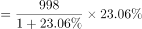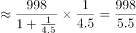万吨，错误；

C项：定位材料第四段，“2016年一季度，铁矿石进口均价同比下跌，原油下跌”，降幅分别为和，故2016年第一季度铁矿石进口均价降幅低于原油，错误；

D项：定位材料第三段，“2016年3月份进口钢材127万吨；1~3月累计进口钢材313万吨”，则2016年1-2月月均钢材进口量万吨，正确。

故正确答案为D。

---

## 材料 3

根据所给资料，回答111～115题。

        2016年1～7月份，同城、异地、国际/港澳台快递业务量分别占全部快递业务量的、和，业务收入如下图所示：

        1～7月份，东、中、西部地区快递业务收入的比重分别为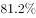、和，业务量比重分别为、和。与去年同期相比，东部地区快递业务收入比重下降了0.5个百分点，快递业务量比重下降了0.4个百分点；中部地区快递业务收入比重上升了0.3个百分点，快递业务量比重上升了0.4个百分点；西部地区快递业务收入比重上升了0.2个百分点，快递业务量比重持平。

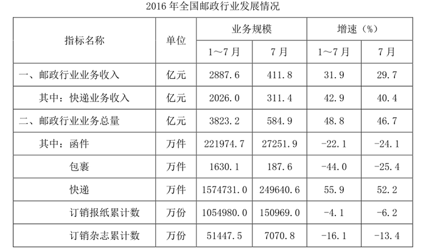

### 第 11 题　qid 2049596 · 比重

与上年同期相比，2016年1～7月国际/港澳台业务收入占同城、异地和国际/港澳台快递业总收入的比重：

- **A**. 下降了不到5个百分点　✅
- **B**. 下降了5个百分点以上
- **C**. 上升了不到5个百分点
- **D**. 上升了5个百分点以上

**答案**：A

**官方解析**

由题干“与上年同期相比，2016年1～7月······占······的比重”，可判定该题为两期比重问题。定位图中数据，2015年1～7月国际/港澳台业务收入占同城、异地和国际/港澳台快递业总收入的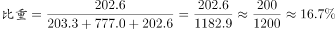 ，2016年1～7月国际/港澳台业务收入占同城、异地和国际/港澳台快递业总收入的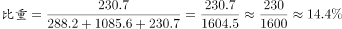，

比低2.3个百分点，即下降了不到5个百分点。

故正确答案为A。

---

### 第 12 题　qid 2049602 · 比重

2015年1～7月份，中部地区快递业务收入的比重为：

- **A**. 

　✅
- **B**. 

- **C**. 

- **D**. 

**答案**：A

**官方解析**

由题干“2015年1～7月份······的比重······”，可判定该题是基期比重问题。定位文字材料第二段，“2016年1～7月份中部地区快递业务收入的比重为，与去年同期相比中部地区快递业务收入比重上升了0.3个百分点”，所以2015年1～7月份中部地区快递业务收入的。

故正确答案为A。

---

### 第 13 题　qid 2049604 · 综合

在函件、包裹、快递中，2016年7月业务量超过上半年月均业务量的有几类？

- **A**. 0
- **B**. 1　✅
- **C**. 2
- **D**. 3

**答案**：B

**官方解析**

由题干“2016年7月业务量超过上半年月均业务量的有”，可判定该题为现期平均数问题。只需计算出上半年月均业务量，与7月份进行比较。定位数据表中数据，函件2016年上半年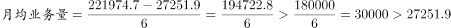；包裹2016年上半年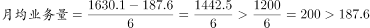；快递2016年上半年，故只有快递2016年7月业务量超过上半年月均业务量。

故正确答案为B。

---

### 第 14 题　qid 2049608 · 综合

2016年7月，全国日均订销报纸多少万份？

- **A**. 4870　✅
- **B**. 5032
- **C**. 5206
- **D**. 5392

**答案**：A

**官方解析**

由题干“2016年7月······日均······多少万份”，可判定该题是现期平均数问题。定位数据表中数据，2016年7月全国订销报纸累计数150969.0万份且7月份有31天，所以2016年7月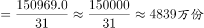，与A选项最接近。

故正确答案为A。

---

### 第 15 题　qid 2049612 · 综合

能够从上述材料中推出的是：

- **A**. 
2016年7月的函件数量是包裹数量的不到100倍

- **B**. 
2016年7月快递业务收入占邮政行业业务收入的比重高于
　✅
- **C**. 
2016年1～7月中、西部地区的快递业务量所占比重均比去年同期有所上升

- **D**. 
2016年1～7月国际/港澳台快递收入同比增速快于同城快递业务和异地快递业务

**答案**：B

**官方解析**

A项：定位数据表中数据，2016年7月的包裹数量的100倍为：，函件数量：27251.9，则有：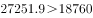，故2016年7月的函件数量高于包裹数量的100倍，错误；

B项：定位数据表中数据，2016年7月快递业务收入占邮政行业业务收入的，正确；

C项：定位文字材料第二段，与去年同期相比，2016年1～7月中部地区快递业务量比重上升了0.4个百分点，西部地区快递业务量比重持平，错误；

D项：定位数据图中数据，2016年1～7月国际/港澳台快递收入；2016年1～7月同城快递收入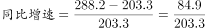，所以2016年1～7月国际/港澳台快递收入同比增速慢于同城快递收入同比增速，错误。

故正确答案为B。

---

## 材料 4

        2016年4月份我国全社会用电量4569亿千瓦时，同比增长。其中，第一产业用电量86亿千瓦时，同比增长；第二产业用电量3316亿千瓦时，同比增长；第三产业用电量569亿千瓦时，同比增长；城乡居民生活用电量598亿千瓦时，同比增长。 

        1～4月份，我国全社会用电量18093亿千瓦时，同比增长。从不同产业看，第一产业用电量270亿千瓦时，同比增长；第二产业用电量12595亿千瓦时，同比增长；第三产业用电量2516亿千瓦时，同比增长，增速比上年同期提高2.1个百分点；城乡居民生活用电量2711亿千瓦时，同比增长，增速比上年同期提高5.4个百分点。

        从不同省份看，1～4月份全社会用电量增速前十位的省份依次为：西藏（）、新疆（）、江西（）、陕西（）、安徽（）、北京（）、浙江（）、广东（）、海南（）、湖北（）。

### 第 16 题　qid 2049598 · 比重

2016年4月第二、三产业用电量占同期我国全社会用电量的比重约为：

- **A**. 

- **B**. 

- **C**. 

- **D**. 

　✅

**答案**：D

**官方解析**

由题干“2016年4月······占······比重约为”，可判定此题为现期比重问题。定位文字材料第一段可得：2016年4月我国全社会用电量4569亿千瓦时，第二产业用电量3316亿千瓦时，第三产业用电量569亿千瓦时，则比重为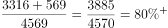。 

故正确答案为D。

---

### 第 17 题　qid 2049600 · 综合

2016年第一产业第一季度月均用电量约为多少亿千瓦时？

- **A**. 50
- **B**. 60　✅
- **C**. 90
- **D**. 180

**答案**：B

**官方解析**

由题干“2016年第一季度月均用电量”，可判定此题为现期平均数问题。定位材料可知，“1～4月份第一产业用电量270亿千瓦时······4月份第一产业用电量86亿千瓦时”，则1～3月第一产业用电量为亿千瓦时，所以第一季度月均用电量为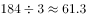亿千瓦时，与B项最接近。

故正确答案为B。

---

### 第 18 题　qid 2049614 · 比重

2016年1～4月，第一、二、三产业中，用电量占全社会用电量比重高于上年同期水平的产业有几个？

- **A**. 0
- **B**. 1
- **C**. 2　✅
- **D**. 3

**答案**：C

**官方解析**

由题干“······占······比重高于上年同期”，可判定此题为两期比重比较问题。定位材料第二段，可知全社会用电量增长率为。第一产业用电量增长率为，第二产业用电量增长率为，第三产业用电量增长率为。根据两期比重原理，部分增长率大于整体增长率则比重上升，满足条件的有第一产业、第三产业。因此一共有2个产业满足题意。

故正确答案为C。

---

### 第 19 题　qid 2049620 · 综合

与2014年同期相比，2016年1～4月第三产业用电量上升了约：

- **A**. 

- **B**. 

　✅
- **C**. 

- **D**. 

**答案**：B

**官方解析**

由题干“与2014年同期相比，2016年1～4月······上升”，且选项为百分数，可判定此题为间隔增长率问题。定位材料第二段，第三产业用电量2016年1～4月增长率为，2015年1～4月增长率为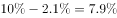。代入间隔增长率公式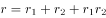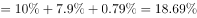，与B选项最接近。

故正确答案为B。

---

### 第 20 题　qid 2049628 · 综合

能够从上述资料中推出的是：

- **A**. 
2016年第一季度全社会月均用电量高于4月水平

- **B**. 
2016年一季度我国全社会用电量同比增速超过
　✅
- **C**. 
2015年1～4月城乡居民生活用电量同比增长接近

- **D**. 
2016年1～4月份全社会用电量增速前5位的省份均来自西部地区

**答案**：B

**官方解析**

A项，定位材料第一、二段，2016年第一季度全社会用电量为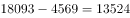亿千瓦时，则第一季度月均用电量为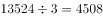亿千瓦时，而4月全社会用电量为4569亿千瓦时，所以第一季度全社会月均用电量是低于4月水平，错误；

B项，定位材料第一、二段，2016年1～4月全社会用电量增速为，而4月份增速为，根据混合增长率原理（混合之后增长率居中），4月增速（）1~4月增速（）1~3月增速，因此可以判断第一季度（1～3月）增速必定超过，正确；

C项，定位材料第二段，“城乡居民生活用电……同比增长，增速比上年同期提高5.4个百分点”，则2015年1～4月增速为，错误；

D项，定位材料第三段，2016年1～4月份全社会用电量增速第3位的是江西省，第5位是安徽省，江西省和安徽省并不属于西部地区，错误。

故正确答案为B。

---

### 第 21 题　qid 2049638 · 倍数

钢铁厂某年总产量的为型钢类，为钢板类，钢管类的产量正好是型钢和钢板产量之差的14倍，而钢丝的产量正好是钢管和型钢产量之和的一半，而其它产品共为3万吨。问该钢铁厂当年的产量为多少万吨？

- **A**. 48
- **B**. 42
- **C**. 36
- **D**. 28　✅

**答案**：D

**官方解析**

假设总产量为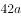，则型钢类产量为，钢板类产量为，钢管类产量为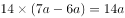，钢丝的产量为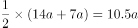，则，解得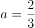万吨，则总产量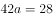万吨。

故正确答案为D。

---
