# 2017年422联考《行测》题（新疆卷）

> 资料分析 · 15 题 · 新疆 2017

## 材料 1

根据以下资料，回答下列小题。

        2015年国家自然科学基金委全年共接收173017项各类申请，同比增长约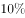，择优资助各类项目40668项，比上年增加1579项，资助直接费用218.8亿元，平均资助强度（资助直接费用与资助项数的比值）53.8万元，各项工作取得新进展新成效。

        在研究项目系列方面，面上项目资助16709项，比上年增加1709项，占总项数的，直接费用102.41亿元，平均资助率（资助项目占接收申请项目的比重）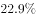，同比下降2.5个百分点。重点项目资助625项，同比增长约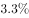，直接费用17.88亿元。重大项目资助20项，直接费用3.18亿元。

        在人才项目系列方面，青年科学基金资助16155项，比上年减少266项，占总项数的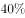，直接费用31.95亿元，平均资助率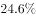，同比下降0.7个百分点。地区科学基金资助2829项，比上年增加78项，直接费用10.96亿元，有力推进了欠发达区域人才稳定与培养。优秀青年科学基金资助400人，国家杰出青年科学基金资助198人，新资助创新研究群体项目38项，促进了优秀人才和团队成长。

### 第 1 题　qid 2049576 · 平均数

2015年国家自然科学基金委全年平均资助率较2014年约：

- **A**. 
增加

- **B**. 
减少
　✅
- **C**. 
增加

- **D**. 
减少

**答案**：B

**官方解析**

根据题干所求“2015年国家自然科学基金委全年平均资助率较2014年”和材料第二段“平均资助率（资助项目占接收申请项目的比重）”可判定此题为两期比重问题。定位材料第一段“2015年国家自然科学基金委全年共接收173017项各类申请，同比增长约，择优资助各类项目40668项，比上年增加1579项”,可求得2015年择优资助各类项目同比增长率为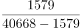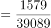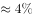，根据两期比重比较公式：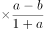，因此2015年国家自然科学基金委全年平均资助率较2014年差值为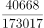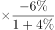，首先为负值，说明减少，排除A、C选项，而，则减少，排除D选项。

故正确答案为B。

---

### 第 2 题　qid 2051444 · 比重

2015年地区科学基金资助的直接费用占各类资助项目总额的比重约为：

- **A**. 

- **B**. 

- **C**. 

　✅
- **D**. 

**答案**：C

**官方解析**

根据题干所求“2015年······占······比重”，且材料数据为2015年，可判定本题为现期比重问题，定位文字材料第三段，“地区科学基金资助······直接费用10.96亿元”，定位第一段，“各类项目······资助直接费用218.8亿元”。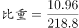。

故正确答案为C。

---

### 第 3 题　qid 2049578 · 平均数

2015年重点项目的平均资助强度约为：

- **A**. 213万元
- **B**. 286万元　✅
- **C**. 342万元
- **D**. 398万元

**答案**：B

**官方解析**

根据题干所求“2015年重点项目的平均资助强度约为”和材料第一段“平均资助强度（资助直接费用与资助项数的比值）”可判定此题为比值计算问题。定位材料第二段“重点项目资助625项，直接费用17.88亿元”可知2015年重点项目的平均资助强度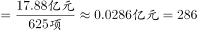万元。

故正确答案为B。

---

### 第 4 题　qid 2049582 · 综合

2014年国家自然科学基金委共接收青年科学基金的申请数约为：

- **A**. 5.1万份
- **B**. 5.9万份
- **C**. 6.5万份　✅
- **D**. 6.9万份

**答案**：C

**官方解析**

根据题干所求“2014年国家自然科学基金委共接收青年科学基金的申请数约为”和材料第二段平均资助率（资助项目占接收申请项目的比重），即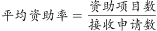，可判定此题为基期比重问题。定位材料第三段“在人才项目系列方面，青年科学基金资助16155项，比上年减少266项，平均资助率，同比下降0.7个百分点”，可知2014年平均资助率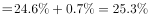。2014年青年科学基金资助项目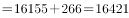，因此2014年接收青年科学基金的申请数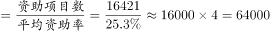，与C项6.5万份最接近。

故正确答案为C。

---

### 第 5 题　qid 2049584 · 综合

能够从上述资料中推出的是：

- **A**. 2015年重点项目的平均资助强度多于重大项目
- **B**. 2014年面上项目资助项数多于青年科学基金项目
- **C**. 2015年面上项目的平均资助率高于青年科学基金项目
- **D**. 2015年重点项目资助项数的同比增长率高于地区科学基金　✅

**答案**：D

**官方解析**

A项：由第二题可知2015年重点项目的平均资助强度亿元，定位材料第二段“重大项目资助20项，直接费用3.18亿元。”则重大项目的平均资助强度亿元，分数比较大小，重点项目平均资助强度分子小且分母大，因此重点项目的平均资助强度小于重大项目的平均资助强度，错误；

B项：定位材料第二段“在研究项目系列方面，面上项目资助16709项，比上年增加1709项”可知2014年面上项目资助项数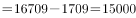，定位材料第三段“青年科学基金资助16155项，比上年减少266项”可知2014年青年科学基金资助项数，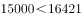，因此2014年面上项目资助项数少于青年科学基金项目，错误；

C项：定位材料第二段可知面上项目资助平均资助率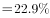，定位材料第三段可知青年科学基金资助平均资助率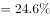，因此面上项目资助平均资助率低于青年科学基金资助平均资助率，错误；

D项：定位材料第二段“重点项目资助625项，同比增长约”可知重点项目资助项数的同比增长率，定位材料第三段“地区科学基金资助2829项，比上年增加78项，”可知地区科学基金资助的增长率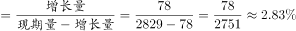，因此2015年重点项目资助项数的同比增长率高于地区科学基金同比增长率，正确。

故正确答案为D。

---

## 材料 2

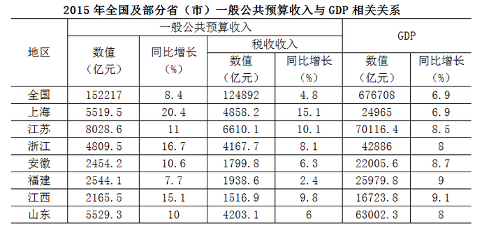

### 第 6 题　qid 2049524 · 比重

2015年税收收入占一般公共预算收入比重最大的是：

- **A**. 上海　✅
- **B**. 江苏
- **C**. 浙江
- **D**. 福建

**答案**：A

**官方解析**

由题干“2015年……占……比重最大”，而且材料时间为2015年，可判定此题为现期比重比较问题。定位表格第二列和第四列，所求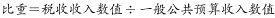。

上海：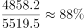；江苏：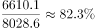

浙江：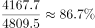；福建：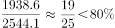

故正确答案为A。

---

### 第 7 题　qid 2051430 · 平均数

2015年一般公共预算收入高于表中七个省（市）平均值的有：

- **A**. 上海、安徽、福建、江西
- **B**. 江苏、浙江、安徽、山东
- **C**. 上海、江苏、浙江、山东　✅
- **D**. 安徽、福建、江西、山东

**答案**：C

**官方解析**

根据题干“2015年一般公共预算收入高于表中七个省（市）平均值”，可判定此题为平均数问题。

方法一：

代入表格数据，七个省（市）一般公共预算平均值为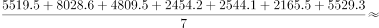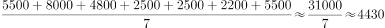亿元，一般公共预算高于该平均值的省（市）为上海5519.5亿元、江苏8028.6亿元、浙江4809.5亿元、山东5529.3亿元。

方法二：

选项都为4个具体省（市）名称，问高于平均值的有几个，则只需要选择选项当中相对最大的四个城市即可。按照表格中一般公共预算排名前四的省（市）依次是：江苏、山东、上海、浙江，对应C项。

故正确答案为C。

---

### 第 8 题　qid 2049536 · 增长

2015年江苏、浙江、江西三省的税收收入平均增速是：

- **A**. 

- **B**. 

- **C**. 

　✅
- **D**. 

**答案**：C

**官方解析**

由题干“江苏、浙江、江西三省的税收收入平均增速”，可判定此题为混合增长率问题。根据混合增长率原理：混合之后增长率居中不正中，偏向基数大。A项和D项超出三者的范围，排除。江苏（，基期值约为6000）和江西（，基期值约为1400）接近，看做一个整体，基期量约为7400，增长率在到之间，混合后约为。再与浙江（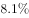，基期值约为3900）混合，增长率偏向基数大的江苏和江西，所以选择与江苏、江西更接近的C项（）。

故正确答案为C。

---

### 第 9 题　qid 2049540 · 综合

2015年一般公共预算收入与GDP的比值大于的省（市）有：

- **A**. 4个
- **B**. 5个　✅
- **C**. 6个
- **D**. 7个

**答案**：B

**官方解析**

由题干“比值大于的省（市）有”，可判定此题为现期比重问题。

上海：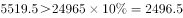；

江苏：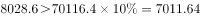；

浙江：；

安徽：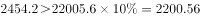；

福建：；

江西：；

山东：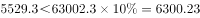；

可得上海、江苏、浙江、安徽、江西一般公共预算收入与GDP的比值大于，共5个。

故正确答案为B。

---

### 第 10 题　qid 2049570 · 综合

关于一般公共预算收入、税收收入、GDP等指标，下列说法错误的是：

- **A**. 
2015年上海一般公共预算收入占GDP的比值最高

- **B**. 
2015年江苏一般公共预算收入、税收收入、GDP均最高

- **C**. 
2015年山东税收收入占全国税收收入的比重较江西高出以上

- **D**. 
2015年全国一般公共预算收入占GDP的比重较2014年有所减少
　✅

**答案**：D

**官方解析**

A项，2015年各省市一般公共预算收入占GDP的比值：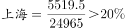；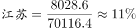；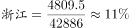；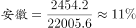；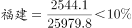；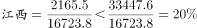；，故上海的比值是最高的，正确；

B项，定位表格，对比可知江苏一般公共预算收入、税收收入、GDP数值均为各省市中最高，正确；

C项，定位表格第四列，山东2015年税收为4203.1亿元，江西为1516.9亿元，全国为124892亿元，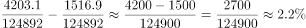，高出以上，正确；

D项：根据两期比重原理，部分增长率（一般公共预算收入增长率8.4%）大于总体增长率（GDP增长率6.9%），比重上升，错误。

本题为选非题，故正确答案为D。

---

## 材料 3

        2015年全国共建立社会捐助工作站、点和慈善超市3.0万个，比上一年减少0.2万个，其中：慈善超市9654个，同比下降。全年共接收社会捐赠款654.5亿元，其中：民政部门接收社会各界捐款44.2亿元，各类社会组织接收捐款610.3亿元。全年民政部门接收捐赠衣被4537.0万件，捐赠物资价值折合人民币5.2亿元。全年有1838.4万人次困难群众受益，同比增长，增长率较上一年下降27.5个百分点。全年有934.6万人次在社会服务领域提供了2700.7万小时的志愿服务，同比减少10.4万小时。 

### 第 11 题　qid 2049534 · 综合

2015年，全国建立的慈善超市较2014年约：

- **A**. 增加519个
- **B**. 减少519个　✅
- **C**. 增加686个
- **D**. 减少686个​

**答案**：B

**官方解析**

由题干“2015年……较2014年”结合选项增加或减少多少个，可判断本题是增长量计算问题。定位文字材料第一段，2015年慈善超市9654个，同比下降，增长量=（约减少510个），与B项最接近。

故正确答案为B。

---

### 第 12 题　qid 2049552 · 比重

2012-2015年社会组织接收社会捐赠款占总捐赠款的比重最高的是：

- **A**. 2012年
- **B**. 2013年
- **C**. 2014年
- **D**. 2015年　✅

**答案**：D

**官方解析**

由题干“2012-2015······占······比重最高的是”，可判定该题是比值比较问题。定位文字材料和表中数据，2012-2015年社会组织接收社会捐赠款占总捐赠款的比重分别为：2012年；2013年；2014年；2015年，所以社会组织接收社会捐赠款占总捐赠款的比重最高的是2015年。

故正确答案为D。

---

### 第 13 题　qid 2049568 · 综合

下面哪一张图能正确反映2011～2015年民政部门接收捐赠衣被数量的变化？

- **A**. 

　✅
- **B**. 
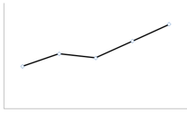

- **C**. 

- **D**. 

**答案**：A

**官方解析**

定位文字材料和表中数据，2011~2015年全国民政部门接收捐赠衣被数量分别为2918.5万件、12538.2万件、10405.0万件、5244.5万件、4537.0万件，所以2012年即第二个点最高，只有选项A满足条件。
故正确答案为A。

---

### 第 14 题　qid 2051434 · 增长

2015年全年接收社会捐赠款的同比增长率较2014年：

- **A**. 约增加3.6个百分点
- **B**. 约减少3.6个百分点
- **C**. 约增加1.6个百分点　✅
- **D**. 约减少1.6个百分点

**答案**：C

**官方解析**

根据题干所求“2015年······同比增长率较2014年”结合选项都是百分点，可知本题为一般增长率问题。定位文字材料“2015······全年共接收社会捐赠款654.5亿元，”可知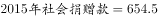，定位表格材料可知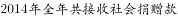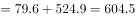，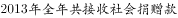。则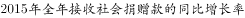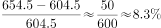，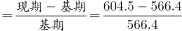。则2015年全年接收社会捐赠款的同比增长率较2014年增加，即增加了1.6个百分点。

故正确答案为C。

---

### 第 15 题　qid 2049574 · 综合

能够从上述资料中推出的是：

- **A**. 2011-2015年民政部门接收的社会捐赠款在持续增加
- **B**. 2015年民政部门接收捐赠衣被同比增长率高于2014年的二分之一
- **C**. 2012-2015年社会组织接收社会捐赠款同比增长最快的年份是2012年　✅
- **D**. 相比2014年，2015年在社会服务领域提供志愿服务的人次有所增加

**答案**：C

**官方解析**

A项：定位表中数据，2014年民政部门接收的社会捐赠款79.6亿元小于2013年民政部门接收的社会捐赠款107.6亿元，错误；

B项：定位文字材料和表中数据，2015年民政部门接收捐赠衣被，2014年民政部门接收捐赠衣被。故：，正确；

C项：定位文字材料和表中数据，2012-2015年社会组织接收社会捐赠款同比增长率分别为：2012年；2013年；2014年；2015年，所以2012年同比增长最快，正确；

D项：定位文字材料，“全年有934.6万人次在社会服务领域提供了2700.7万小时的志愿服务，同比减少10.4万小时”，无法判断提供志愿服务的人次的变化，错误。

故正确答案为B和C。

【备注】本题为争议题。粉笔对B项和C项可能的争议点解释如下：

B项可能的争议点是：

①同比增长率是否可以为负数？根据本卷第四篇资料分析的表格数据可知，同比增长（）下面出现了-0.5这样的负数，所以同比增长率是可以为负数的。

②比较同比增长率高低时，是否需要带负号比较？根据近年全国各地类似真题可知，增长率比高低时，需要带负号比较，例如。

C项可能的争议点是：

2012-2015年增长最快的年份是否要考虑2012年？根据近年全国各地类似真题可知，如果提到2012-2015年的年均增长量或年均增长率等，一般不考虑2012年的增长情况（江苏例外）；但是如果提到2012-2015年增长最快/最多的年份，一般都是要考虑2012年当年的增长情况的，否则会使得很多国考省考题目变得没有答案。

基于以上分析，粉笔认为本题B、C答案没有明显错误，都应该是正确答案。

---
