# 2017年422联考《行测》题（江西卷）

> 资料分析 · 20 题 · 江西 2017

## 材料 1

        2015年，江西规模以上工业增加值7268.9亿元，比上年增长。分轻重工业看，轻工业增加值2731.2亿元，增长；重工业4537.7亿元，增长。分经济类型看，国有企业增加值269.1亿元，增长；集体企业19.3亿元，下降；股份合作企业22.3亿元，下降；股份制企业2847.6亿元，增长；私营企业2992.2亿元，增长；外商及港澳台商投资企业1112.5亿元，增长。

        2015年江西省规模以上工业38个行业大类中34个突破增长，占比近九成。其中，电子、电子机械、纺织、农副产品、医药和有色等六大重点行业表现突出，分别增长、、、、、，合计实现增加值2707.0亿元，占规模以上工业的比重为，对规模以上工业增长的贡献率达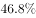。高新技术产业增加值1869.7亿元，增长，占规模以上工业的比重为，比上年提高0.8个百分点。抚州、赣州、吉安高新区晋升为国家级高新技术开发区，年末国家级高新技术开发区7家，居全国第六、中部第一；省级高新技术产业园区3家，比上年新增1家；国家高新技术产业化基地27个，居全国第一。

        2015年江西省规模以上工业企业实现主营业务收入32459.4亿元，比上年增长；实现利税总额3543.8亿元，增长，其中，利润总额2128.0亿元，增长。主营业务收入超百亿元的企业10户，其中，江铜集团2010.4亿元，居全省首位。

### 第 1 题　qid 2050966 · 综合

2015年江西省规模以上工业企业的营业利润率与上年同期相比（  ）

- **A**. 有所上升
- **B**. 有所下降　✅
- **C**. 持平
- **D**. 无法判断

**答案**：B

**官方解析**

营业利润率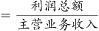，由题干“2015年江西省规模以上工业企业的营业利润率与上年同期相比”，结合选项，可知本题为两期比重的比较问题，仅需比较增长率与的大小关系即可。根据“利润总额”“主营业务收入”定位材料第三段，定位数据：，，，即2015年江西省规模以上工业企业的营业利润率低于上年同期。

故正确答案为B。

---

### 第 2 题　qid 2050968 · 比重

2014年江西省重工业增加值占规模以上工业增加值的比重为（    ）。

- **A**. 

- **B**. 

- **C**. 

　✅
- **D**. 

**答案**：C

**官方解析**

材料中给出的时间为2015年，由题干“2014年······占······比重”可知，本题为基期比重问题。根据“江西省重工业增加值”“规模以上工业增加值”定位材料第一段，定位数据，“2015年，江西规模以上工业增加值7268.9亿元，比上年增长”“重工业4537.7亿元，增长”，代入基期比重计算公式，2014年的比重。

故正确答案为C。

---

### 第 3 题　qid 2050974 · 增长

2014年江西省规模以上工业增加值为（    ）。

- **A**. 6656.5亿元　✅
- **B**. 6945.3亿元
- **C**. 7268.9亿元
- **D**. 7937.6亿元

**答案**：A

**官方解析**

材料中给出的时间为2015年，由题干“2014年江西省规模以上工业增加值”可知，本题为基期计算问题。根据“规模以上工业增加值”定位材料第一段，定位数据，“2015年，江西规模以上工业增加值7268.9亿元，比上年增长”，代入基期计算公式，亿元，接近A选项。

故正确答案为A。

---

### 第 4 题　qid 2050980 · 增长

2015年江西省规模以上工业38个行业大类中增长超过的行业有：

- **A**. 6个
- **B**. 7个
- **C**. 8个
- **D**. 无法计算　✅

**答案**：D

**官方解析**

由题干“2015年江西省规模以上工业38个行业大类增长”定位材料第二段，“2015年江西省规模以上工业38个行业大类中34个突破增长，占比近九成。其中，电子、电子机械、纺织、农副产品、医药和有色等六大重点行业表现突出，分别增长、、、、、”，材料中只给出6个大类的增长率，其余30多个大类未知，无法判断。

故正确答案为D。

---

### 第 5 题　qid 2050982 · 综合

根据所给材料，下列表述正确的是（  ）

- **A**. 2015年江西省轻工业增加值占规模以上工业增加值的比重较上年有所上升
- **B**. 2015年江西省电子行业增加值同比增量最大
- **C**. 2015年江铜集团利税居全省各企业的首位
- **D**. 以上选项均错误　✅

**答案**：D

**官方解析**

A项：根据“2015年······比重较上年有所上升”可知，该选项为两期比重的比较，仅需比较增长率a与b的大小关系即可。根据“轻工业增加值”“规模以上工业增加值”定位材料第一段，定位数据，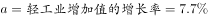，，，2015年江西省轻工业增加值占规模以上工业增加值的比重较上年有所下降，错误；

B项：根据“电子行业”定位材料第二段，只有增长率，现期量未知，基期量未知，无法求增长量，无法判断增长量是否最大，错误；

C项：根据“江铜集团利税”定位材料第三段，“主营业务收入超百亿元的企业10户，其中，江铜集团2010.4亿元，居全省首位。”江铜集团利税数据未知，无法判断，错误。

故正确答案为D。

---

## 材料 2

        江西省2015年财政总收入3021.5亿元，比上年增长，财政总收入占生产总值的比重为，比上年提高1.0个百分点。其中，税收收入2373.0亿元，增长，占财政总收入比重为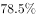，其他收入648.5亿元。所有县（市、区）财政总收入突破6亿元，其中，财政总收入超10亿元的县（市、区）85个，比上年增加8个；超20亿元的36个，增加7个；超30亿元的17个，增加2个；超50亿元的5个，增加2个；百亿县实现零突破，南昌县财政总收入达100.9亿元。

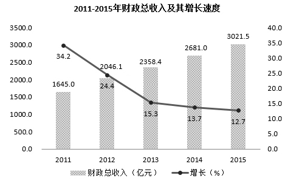

### 第 6 题　qid 2050986 · 比重

2014年江西省的税收收入占财政总收入的比重为（  ）。

- **A**. 

- **B**. 

　✅
- **C**. 
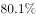

- **D**. 

**答案**：B

**官方解析**

根据题干所求“2014年江西省的税收收入占财政总收入的比重”，材料数据为2015年，可判定此题为基期比重问题。

定位文字材料，2015年财政总收入B为3021.5亿元，增长率b为，税收收入A为2373.0亿元，增长率a为，占财政总收入比重为。代入公式，基期比重，最接近B项。

故正确答案为B。

---

### 第 7 题　qid 2050992 · 增长

2015年江西省财政总收入中的其他收入比上年（  ）。

- **A**. 
减少了

- **B**. 
减少了

- **C**. 
增加了

- **D**. 
增加了
　✅

**答案**：D

**官方解析**

题干求“2015年江西省财政总收入中的其他收入比上年”，选项为百分数，可判定本题为增长率问题。根据题意，财政总收入税收收入其他收入，已知财政总收入增长率为，税收收入增长率为，可判定此题为混合增长率问题。

因为税收增长率小于整体增长率，根据混合增长率居中原则，其他收入增长率应大于整体增长率，只有D项的增长率大于。

故正确答案为D。

---

### 第 8 题　qid 2051004 · 增长

2011-2015年，江西省财政总收入同比增长率最低的年份，平均每月的财政收入约为（  ）。

- **A**. 242亿元
- **B**. 247亿元
- **C**. 252亿元　✅
- **D**. 257亿元

**答案**：C

**官方解析**

根据题干所求“平均每月的财政收入约为”，可判定此题为平均数问题。定位统计图可得，江西省财政总收入同比增长率最低的年份为2015年，该年财政总收入为3021.5亿元，平均每月的财政收入为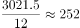亿元。

故正确答案为C。

---

### 第 9 题　qid 2051010 · 增长

2011-2015年，有几年的江西省财政总收入同比增长低于380亿元？

- **A**. 3　✅
- **B**. 2
- **C**. 1
- **D**. 4

**答案**：A

**官方解析**

根据问题所求“有几年……同比增长低于380亿元”，可判定此题为增长量计算问题。，代入统计图数据，可得增长量分别为：

2011年：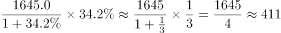亿元；

2012年：亿元；

2013年：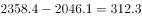亿元；

2014年：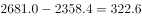亿元；

2015年：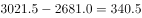亿元。

同比增长低于380亿元的为2013、2014、2015年，共3年。

故正确答案为A。

---

### 第 10 题　qid 2051066 · 综合

以下关于江西省财政总收入情况的描述与资料相符的是：

- **A**. 
2015年江西省财政总收入比5年前翻了一番

- **B**. 
2011年-2015年江西省财政总收入的增长幅度呈逐年下降的趋势
　✅
- **C**. 
2014年江西省财政总收入占生产总值比重为

- **D**. 
2014年江西省财政总收入不是主要来源于税收收入

**答案**：B

**官方解析**

A项：结合124题计算结果可得，2010年财政总收入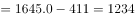亿元。2015年是2010年的倍，财政收入比5年前翻了一番，正确；

B项：定位图形材料折线部分可得，2011—2015年江西省财政总收入的同比增速分别为：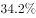、、、、，增长幅度呈逐年下降的趋势，正确；

C项：定位文字材料，“江西省2015年财政总收入占生产总值的比重为，比上年提高1.0个百分点”。则2014年所占比重，错误；

D项：结合文字材料与图形材料可得，2015年江西省税收收入占财政总收入比重为。其中，税收收入的同比增长率，财政总收入的同比增长率。由部分增长率小于整体增长率可得，税收收入在财政总收入中的比重下降，故2014年税收收入占财政总收入比重高于。税收收入应为财政总收入的主要来源，错误。

故正确答案为B和A。

【备注】可能的争议点：翻番是否必须为精确的2倍关系？根据近年的国考和省考真题可以推断，一般二倍以上关系也称作翻了一番，否则很多题目就没有正确答案。

基于以上分析，粉笔认为本题B、A答案没有明显错误，都应该是正确答案。

---

## 材料 3

        2015年全年我国粮食产量62144万吨，比上年增加1441万吨，增产。其中，夏粮产量14112万吨，增产；旱稻产量3369万吨，减产；秋粮产量44662万吨，增产。全年谷物产量57225万吨，比上年增产。其中，稻谷产量20825万吨，增产；小麦产量13019万吨，增产；玉米产量22458万吨，增产。

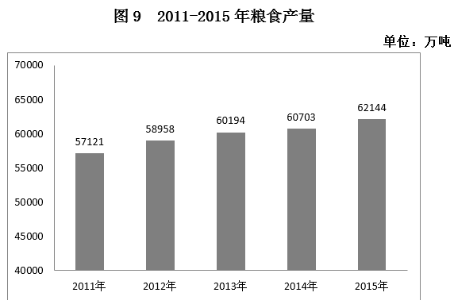

### 第 11 题　qid 2050944 · 增长

2012-2015年，我国粮食产量增长率最小的年份是：

- **A**. 2012年
- **B**. 2013年
- **C**. 2015年
- **D**. 2014年　✅

**答案**：D

**官方解析**

由题干“2012-2015年......增长率最小的年份是”，可判定该题是一般增长率问题。定位图中数据，可得2012-2015年我国粮食产量增长率分别为：；；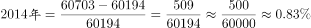；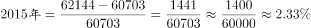，所以2012-2015年我国粮食产量增长率最小的年份是2014年。

故正确答案为D。

---

### 第 12 题　qid 2050950 · 综合

2014年，我国玉米产量比小麦产量多：

- **A**. 8642万吨
- **B**. 8958万吨　✅
- **C**. 9429万吨
- **D**. 9915万吨

**答案**：B

**官方解析**

由题干“2014年，我国玉米产量比小麦产量多”，结合文字材料2015年的产量与增长率均给出，可判定该题是基期和差问题。定位文字材料，“2015年小麦产量13019万吨，增产；玉米产量22458万吨，增产”，根据基期量，可得2014年小麦产量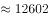万吨；2014年玉米产量万吨。2014年，我国玉米产量比小麦产量多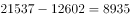万吨。与B项最接近。

故正确答案为B。

---

### 第 13 题　qid 2050960 · 比重

2014年我国秋粮产量占当年粮食产量的比重：

- **A**. 与2015年相比，大幅上升
- **B**. 与2015年相比，大幅下降
- **C**. 与2015年大致相同　✅
- **D**. 无法比较

**答案**：C

**官方解析**

由题干“2014年······占······的比重与2015年相比”，可判定该题是两期比重问题。定位文字材料，“2015年全年我国粮食产量62144万吨，增产，秋粮产量44662万吨，增产”，与很接近，因此与2015年大致相同。

故正确答案为C。

---

### 第 14 题　qid 2050970 · 比重

2015年我国稻谷产量占谷物产量的比重为：

- **A**. 

　✅
- **B**. 

- **C**. 

- **D**. 

**答案**：A

**官方解析**

由题干“2015年······的比重为”，可判定该题为现期比重问题。定位文字材料，“2015年谷物产量57225万吨，稻谷产量20825万吨”，可得2015年我国稻谷产量占谷物产量的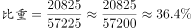。

故正确答案为A。

---

### 第 15 题　qid 2050978 · 综合

根据所给我国粮食产量的相关数据，能够从资料中推出的是：

- **A**. 2015年，我国夏粮、旱稻、秋粮的产量均高于2014年
- **B**. 2015年，我国稻谷、小麦、玉米的产量均高于2014年　✅
- **C**. 2014年，我国稻谷产量是小麦产量的2.1倍
- **D**. 2014年，我国秋粮产量是旱稻产量的9.8倍

**答案**：B

**官方解析**

A项：定位文字材料，2015年夏粮产量增产；旱稻产量减产；秋粮产量增产，其中旱稻产量低于2014年，错误；

B项：定位文字材料，2015年稻谷产量增产；小麦产量增产；玉米产量增产，所以2015年我国稻谷、小麦、玉米的产量均高于2014年，正确；

C项：定位文字材料，可得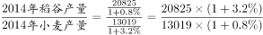，所以2014年我国稻谷产量不到小麦产量的2倍，错误；

D项：定位文字材料，可得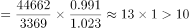，所以2014年我国秋粮产量高于旱稻产量的10倍，错误。

故正确答案为B。

---

## 材料 4

        我国2015年全年全社会固定资产投资562000亿元，固定资产投资（不含农户）551590亿元，增长。从各区域看，东部地区投资232107亿元，比上年增长；中部地区投资143118亿元，增长；西部地区投资140416亿元，增长；东北地区投资40806亿元，下降。

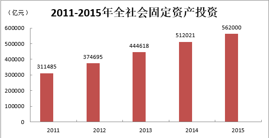

### 第 16 题　qid 2050996 · 增长

我国2015年全年全社会固定资产投资同比增长（  ）

- **A**. 

- **B**. 
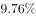
　✅
- **C**. 
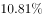

- **D**. 

**答案**：B

**官方解析**

根据“我国······同比增长”，判定此题为一般增长率问题。定位图表，2015年全年全社会固定资产投资为562000亿元，2014年为512021亿元，故增长率为：。

故正确答案为B。

---

### 第 17 题　qid 2050998 · 增长

2011-2015年，我国社会固定资产投资同比增长量最大的年份是（  ）

- **A**. 2012年
- **B**. 2014年
- **C**. 2013年　✅
- **D**. 2015年

**答案**：C

**官方解析**

根据“······同比增长量最大”，判定此题为增长量比较问题。增长量=现期量-基期量。

定位图表，2012年：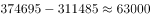，2013年：，2014年：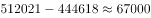，2015年：，最大为2013年。

故正确答案为C。

---

### 第 18 题　qid 2051002 · 综合

2015年，我国制造业投资是基础设施投资的（  ）

- **A**. 1.78倍　✅
- **B**. 1.58倍
- **C**. 1.38倍
- **D**. 1.18倍

**答案**：A

**官方解析**

根据题干“2015年······是······的多少倍”可知，此题为现期倍数问题。定位图表，制造业投资占固定资产投资比重为，基础设施投资占固定资产投资比重为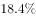，则2015年我国制造业投资是基础设施投资的倍数为：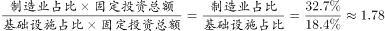倍。

故正确答案为A。

---

### 第 19 题　qid 2051006 · 综合

根据所给材料，以下说法错误的是：

- **A**. 2015年，我国房地产投资的力度进一步加大　✅
- **B**. 2015年，我国西部地区投资和东北地区投资之和小于东部地区投资
- **C**. 2015年，我国中部地区投资大约是东北地区投资的3.5倍
- **D**. 2012年-2015年，我国全社会固定资产投资增长率最小的是2015年

**答案**：A

**官方解析**

A项：材料没有2014年房地产开发投资金额，所以不能判定投资的力度进一步加大，错误；

B项：“各区域看，东部地区投资232107亿元······西部地区投资140416亿元；东北地区投资40806亿元。”西部地区投资东北地区投资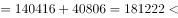东部地区投资232107，正确；

C项：“中部地区投资143118亿元······东北地区投资40806亿元，”中部地区是东北地区的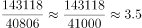倍，正确；

D项：增长率比较：2012年增长率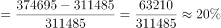；2013年增长率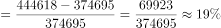；2014年增长率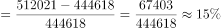；2015年增长率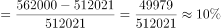，增长率最小的是2015年，正确。

本题为选非题，故正确答案为A。

---

### 第 20 题　qid 2051008 · 比重

2015年，东部地区投资占全社会固定资产投资的比重比西部地区投资高（  ）

- **A**. 20.35个百分点
- **B**. 19.43个百分点
- **C**. 16.62个百分点
- **D**. 16.32个百分点　✅

**答案**：D

**官方解析**

根据“2015年······的比重比······高”，结合选项都是百分点，可知本题为现期比重问题。定位文字材料，“2015年，全年全社会固定资产投资562000亿元，东部地区投资232107亿元，西部地区投资140416亿元”，则比重差为，与D项最接近。

故正确答案为D。

---
