# 2017年422联考《行测》题（海南卷）

> 资料分析 · 15 题 · 海南 2017

## 材料 1

        某年度某机构关于中国宠物主人消费行为及倾向调查回收的10680份有效问卷显示：女性养宠者占，宠物主人为“80-90后”占。将宠物定义为“孩子”“亲人”“朋友”和“宠物”的分别为、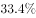、和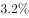。的人月开销在100元以内，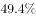的人开销在101至500元之间，而花费在501至1000元之间的达到，月消费1000元以上的人群达到。在购买物品方面，购买宠物食物的人数达到有效问卷总人数的，其次为药品、保健品，以及日用品、玩具、服饰五项，均接近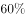。宠物主人外出时，四成“委托亲朋照顾”，三成“一起带走”，委托寄养还不到。在训练方面，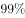的宠物处于自主训练或放任生长的状态，但近一半人希望爱宠得到专业训练。在购买渠道方面，的被访问者选择综合电商平台，选择线下综合商店或专卖店者为，选择宠物类垂直电商平台的占，但其复购率更高。值得注意的是，目前宠物主人对购物类O2O服务有选择意向的不足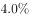。

### 第 1 题　qid 2051084 · 比重

问卷中，男性养宠者占养宠人群的比重为：

- **A**. 

- **B**. 

- **C**. 
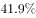
　✅
- **D**. 
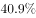

**答案**：C

**官方解析**

根据问题中“男性养宠者占养宠人群的比重”可判定此题为现期比重问题。定位文字材料首句，“女性养宠者占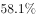”，则男性养宠物者占比为。

故正确答案为C。

---

### 第 2 题　qid 2051086 · 综合

问卷中对宠物没有花费的人数约为：

- **A**. 38
- **B**. 36
- **C**. 34
- **D**. 32　✅

**答案**：D

**官方解析**

由题干“问卷中对宠物没有花费的人数约为”，而且材料中给出不同开销人员占比及问卷总人数，问没有花费的人数，可判定此题为现期比重问题。定位材料中“的人月开销在100元以内，的人……”，可知有消费的人占比为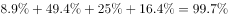，则没有花费的人数占比为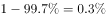，所以，没有花费的人数总人数没有花费的人数占比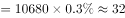人。

故正确答案为D。

---

### 第 3 题　qid 2051088 · 综合

问卷中，选择综合电商平台和选择购物类O2O服务的消费者人数之比为：

- **A**. 
小于

- **B**. 
大于

- **C**. 
小于

- **D**. 
大于
　✅

**答案**：D

**官方解析**

由题干“……和……人数之比”，可知本题为比值计算问题。定位文字材料“的被访问者选择综合电商平台……对购物类O2O服务有选择意向的不足”，则两者之比为：，分母不足，分母变小，分数值变大，故两者之比大于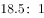。

故正确答案为D。

---

### 第 4 题　qid 2051090 · 综合

问卷中，在药品、保健品，以及日用品、玩具、服饰方面有花销的总人次最可能有：

- **A**. 6408
- **B**. 9612
- **C**. 16020
- **D**. 32040　✅

**答案**：D

**官方解析**

由题干“······方面有花销的总人次······”，定位材料“回收的10680份有效问卷”“购买宠物食物的人数达到有效问卷总人数的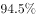，其次为药品、保健品，以及日用品、玩具、服饰五项，均接近”，可知本题为现期比重问题。，故药品、保健品、日用品、玩具、服饰这五项部分量的总和。

故正确答案为D。

---

### 第 5 题　qid 2051092 · 综合

根据问卷，下列判断错误的是：

- **A**. 
只有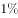的宠物接受过训练，专业训练消费潜力巨大
　✅
- **B**. 
绝大部分宠物主人对宠物的定义超越了宠物本身

- **C**. 
月均消费在101-1000元的是宠物消费的主流

- **D**. 
购物类O2O服务的市场还有待培育

**答案**：A

**官方解析**

逐项分析如下：

A项：定位文字材料后半段，“在训练方面，的宠物处于自主训练或放任生长的状态”，则自主训练的宠物占比小于，但自主训练和专业训练都属于训练，所以接受过训练的宠物占比小于，有可能超过，故A项说法“只有的宠物接受过训练”与其不符，错误；

B项：定位材料前半段，对宠物的定义超越宠物本身，定义为“孩子”“亲人”“朋友”的比重分别占到、、，合计占比超过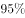，可以认定为“绝大部分宠物主人”，正确；

C项：定位材料前半段，101至500元和501至1000元的消费人群占比分别为和，合计占比超过，可以认定为“主流”，正确；

D项：定位材料最后一句，对购物类O2O服务有选择意向的不足，说明有超过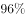的人暂时没有选择意向，符合“市场有待培育”，正确。

本题为选非题，故正确答案为A。

---

## 材料 2

        截至2015年末，全国水果（含瓜果，下同）种植总面积1536.71万公顷，较“十二五”（即2011-2015年）期初增加143.38万公顷，增长了约。其中，园林水果种植面积1281.67万公顷，比“十二五”期初增加127.28万公顷，增长，年均增长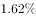。从全国园林水果种植面积的地区分布情况看，在主要大宗果品中，苹果“十二五”期初种植面积214万公顷，期末232.8万公顷，增长；柑橘期初种植面积221.1万公顷，期末251.3万公顷，增长；梨期初种植面积106.3万公顷，期末112.4万公顷，增长；葡萄期初种植面积55.2万公顷，期末79.9万公顷，增长；香蕉期初种植面积35.7万公顷，期末40.9万公顷，增长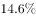。

        2015年我国水果总产量达到2.71亿吨，比上一年增长。其中苹果产量达到4261.3万吨，比上年增长169万吨，增长幅度为。需要注意的是，在2010-2015年期间，2010年苹果产量仅为3326.3万吨，2014年突破4000万吨，达到4092.3万吨。

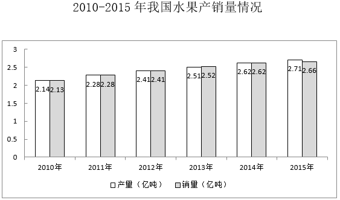

### 第 6 题　qid 2049374 · 增长

“十二五”期间全国水果种植面积的年均增长率约为：

- **A**. 

　✅
- **B**. 

- **C**. 

- **D**. 

**答案**：A

**官方解析**

由题干“‘十二五’期间······年均增长率约为”，可判断该题是年均增长率问题。定位文字材料第一段，截至2015年末，全国水果种植总面积1536.71万公顷，较“十二五”期初增加143.38万公顷，所以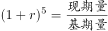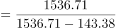。代入选项A，，接近1.103。年均增长率一般用估算的方法，但是选项过于接近，无法估算，因此解析给出年均增长率的精确计算方法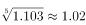，所以年均增长率为。

故正确答案为A。

---

### 第 7 题　qid 2049382 · 综合

2015年全国水果的公顷单产量为：

- **A**. 17.64吨　✅
- **B**. 17.75吨
- **C**. 17.86吨
- **D**. 17.97吨

**答案**：A

**官方解析**

由题干“2015年全国水果的公顷单产量为”，可判定该题是现期平均数问题。定位文字材料一、二段，2015年末，全国水果种植总面积1536.71万公顷，水果总产量达到2.71亿吨，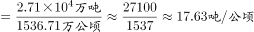。

故正确答案为A。

---

### 第 8 题　qid 2049328 · 增长

“十二五”期间，下列增幅最大的是：

- **A**. 水果种植总面积
- **B**. 柑橘种植面积
- **C**. 苹果产量　✅
- **D**. 水果销量

**答案**：C

**官方解析**

由题干“下列增幅最大的是······”，可判定该题是一般增长率问题。定位文字材料第一段，“十二五”期间，全国种植水果总面积增长了约，柑橘种植面积增长，定位文字材料第二段，2010年苹果产量3326.3万吨，2015年苹果产量4261.3万吨，，定位数据表，2010年水果销量2.13亿吨，2015年水果销量2.66亿吨，，所以苹果产量增幅最大。

故正确答案为C。

---

### 第 9 题　qid 2049334 · 增长

对“十二五”期间水果种植面积增长贡献最大的果品是：

- **A**. 苹果
- **B**. 柑橘　✅
- **C**. 梨
- **D**. 香蕉

**答案**：B

**官方解析**

由题干“‘十二五’期间······面积增长贡献最大的是······”，增长贡献就是增长贡献率。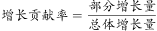，由于总体增长量是定值，因此只需要比较分子即部分增长量。定位文字材料第一段，“十二五”期初苹果种植面积214万公顷，期末232.8万公顷，；“十二五”期初柑橘种植面积221.1万公顷，期末251.3万公顷，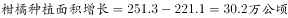；“十二五”期初梨种植面积106.3万公顷，期末112.4万公顷，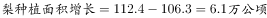；“十二五”期初香蕉种植面积35.7万公顷，期末40.9万公顷，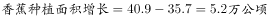，所以增长面积贡献最大的是柑橘。

故正确答案为B。

---

### 第 10 题　qid 2049348 · 综合

根据所给资料，下列判断正确的是：

- **A**. 
在2015年，苹果、梨、柑橘、香蕉及葡萄种植面积超过水果种植总面积的

- **B**. 
按“十二五”期间增长势头，在2025年，葡萄种植面积将超过柑橘

- **C**. 
“十二五”期间，我国每年的水果产量都高于销量

- **D**. 
2015年，苹果公顷单产量高于水果的平均公顷单产量
　✅

**答案**：D

**官方解析**

A项：定位文字材料第一段，截至2015年末，全国水果种植总面积1536.71万公顷，苹果、梨、柑橘、香蕉及葡萄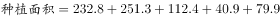，错误；

B项：定位文字材料第一段，“十二五”期末葡萄种植面积79.9万公顷，增长，所以按“十二五”期间增长势头，在2025年，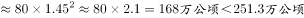（“十二五”期末柑橘种植面积），而按“十二五”期间增长势头（增长率），2025年柑橘种植面积会更大，错误；

C项：定位数据图中数据，2013年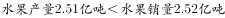，错误；

D项：定位文字材料第一段和第二段，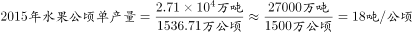；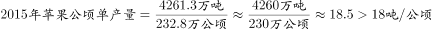，正确。

故正确答案为D。

---

## 材料 3

       2016年，全国民间固定资产投资为365219亿元，比上年名义增长，增速比1—11月份提高0.1个百分点，民间固定资产投资占全国固定资产投资的比重为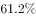，比1—11月份降低0.3个百分点，比上年降低3个百分点。

       分地区看，东部地区民间固定资产投资164674亿元，比上年增长；中部地区107881亿元，比上年增长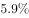，增速回落0.1个百分点；西部地区71056亿元，比上年增长，增速回落0.5个百分点；东北地区21608亿元，比上年下降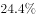，降幅收窄1.6个百分点。

       分产业看，第一产业民间固定资产投资15039亿元，比上年增长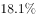，增速比1—11月份回落0.5个百分点；第二产业增长，增速较去年提高0.3个百分点；第三产业167673亿元，年度增长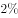，增速与1—11月份持平。第二产业中，工业民间固定投资180970亿元，比上年增长，比1—11月份提高0.3个百分点。

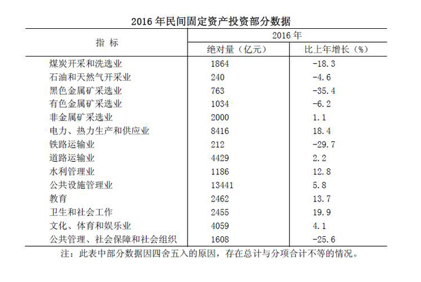

### 第 11 题　qid 2050706 · 综合

东北地区2014年民间固定资产投资额为：

- **A**. 28582亿元
- **B**. 29200亿元
- **C**. 35864亿元
- **D**. 38624亿元　✅

**答案**：D

**官方解析**

根据材料所给数据是2016年，而题干所求为“东北地区2014年民间固定资产投资额”，可判定此题为间隔基期问题。

定位文字材料第二段“东北地区21608亿元，比上年下降，降幅收窄1.6个百分点”可知，2016年增长率，2015年增长率，则间隔增长率

则东北地区2014年民间固定资产投资额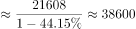亿元，与D项最接近。

故正确答案为D。

---

### 第 12 题　qid 2050708 · 比重

2015年，民间固定资产投资占全国固定资产投资的比重为：

- **A**. 

　✅
- **B**. 
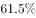

- **C**. 
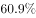

- **D**. 
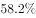

**答案**：A

**官方解析**

定位文字材料首段末句，“2016年民间固定资产投资占全国固定资产投资的比重为······比上年降低3个百分点”，则2015年民间固定资产投资占全国固定资产投资的比重为。

故正确答案为A。

---

### 第 13 题　qid 2050710 · 增长

表格中绝对量最大和最小的行业2016年增长额之差约为：

- **A**. 647亿元
- **B**. 688亿元
- **C**. 786亿元
- **D**. 827亿元　✅

**答案**：D

**官方解析**

由题干“2016年增长额之差”可知，本题为增长量计算问题。定位表格，绝对量最大的行业为公共设施管理业，2016年绝对量13441亿元，比上年增长，绝对量最小的行业为铁路运输业，2016年绝对量212亿元，比上年增长。两者增长额之差为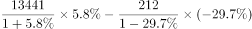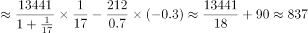亿元，与D选项最接近。

故正确答案为D。

---

### 第 14 题　qid 2050712 · 综合

表格中投资较去年变幅最大的是：

- **A**. 煤炭开采和洗选业
- **B**. 黑色金属矿采选业　✅
- **C**. 铁路运输业
- **D**. 公共管理、社会保障和社会组织

**答案**：B

**官方解析**

由题干“较去年变幅最大”可知本题为一般增长率问题。定位表格材料可知，煤炭开采和洗选业为：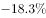，黑色金属矿采选业：，铁路运输业：，公共管理、社会保障和社会组织：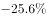。问的是变幅即变化幅度，变化幅度最大的是黑色金属矿采选业：。

故正确答案为B。

---

### 第 15 题　qid 2050718 · 综合

根据所给资料，下列判断正确的是：

- **A**. 
2016年度，三大产业中，第三产业民间固定资产投资月增速最为平稳

- **B**. 
工业民间固定资产投资占第二产业民间固定资产投资的

- **C**. 
民间固定资产投资的主力是东部地区的民间固定资产投资
　✅
- **D**. 
各地区民间固定资产投资水平差距不明显

 

**答案**：C

**官方解析**

A项：定位文字材料第三段，“第三产业167673亿元，年度增长，增速与1—11月份持平”，无法知道每个月份的增速，无法判断，错误；

B项：定位文字材料第三段，第二产业中，工业民间固定投资180970亿元，第二产业民间固定资产投资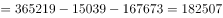，工业民间固定资产投资占第二产业民间固定资产投资的比重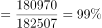，错误；

C项：定位文字材料第二段，“东部地区民间固定资产投资164674亿元，中部地区107881亿元，西部地区71056亿元，东北地区21608亿元”，东部地区的民间固定资产投资额远远高于别的地区，是民间固定资产投资的主力, 正确；

D项：定位材料第二段，“东部地区民间固定资产投资164674亿元，中部地区107881亿元，西部地区71056亿元，东北地区21608亿元”，各地区民间固定资产投资额差距很大，错误。

故正确答案为C。

---
