# 2017年422联考《行测》题（贵州卷）

> 资料分析 · 20 题 · 贵州 2017

## 材料 1

       2016年，全国民间固定资产投资为365219亿元，比上年名义增长，增速比1—11月份提高0.1个百分点，民间固定资产投资占全国固定资产投资的比重为，比1—11月份降低0.3个百分点，比上年降低3个百分点。

       分地区看，东部地区民间固定资产投资164674亿元，比上年增长；中部地区107881亿元，比上年增长，增速回落0.1个百分点；西部地区71056亿元，比上年增长，增速回落0.5个百分点；东北地区21608亿元，比上年下降，降幅收窄1.6个百分点。

       分产业看，第一产业民间固定资产投资15039亿元，比上年增长，增速比1—11月份回落0.5个百分点；第二产业增长，增速较去年提高0.3个百分点；第三产业167673亿元，年度增长，增速与1—11月份持平。第二产业中，工业民间固定投资180970亿元，比上年增长，比1—11月份提高0.3个百分点。

### 第 1 题　qid 2050706 · 综合

东北地区2014年民间固定资产投资额为：

- **A**. 28582亿元
- **B**. 29200亿元
- **C**. 35864亿元
- **D**. 38624亿元　✅

**答案**：D

**官方解析**

根据材料所给数据是2016年，而题干所求为“东北地区2014年民间固定资产投资额”，可判定此题为间隔基期问题。

定位文字材料第二段“东北地区21608亿元，比上年下降，降幅收窄1.6个百分点”可知，2016年增长率，2015年增长率，则间隔增长率

则东北地区2014年民间固定资产投资额亿元，与D项最接近。

故正确答案为D。

---

### 第 2 题　qid 2050708 · 比重

2015年，民间固定资产投资占全国固定资产投资的比重为：

- **A**. 

　✅
- **B**. 

- **C**. 

- **D**. 

**答案**：A

**官方解析**

定位文字材料首段末句，“2016年民间固定资产投资占全国固定资产投资的比重为······比上年降低3个百分点”，则2015年民间固定资产投资占全国固定资产投资的比重为。

故正确答案为A。

---

### 第 3 题　qid 2050710 · 增长

表格中绝对量最大和最小的行业2016年增长额之差约为：

- **A**. 647亿元
- **B**. 688亿元
- **C**. 786亿元
- **D**. 827亿元　✅

**答案**：D

**官方解析**

由题干“2016年增长额之差”可知，本题为增长量计算问题。定位表格，绝对量最大的行业为公共设施管理业，2016年绝对量13441亿元，比上年增长，绝对量最小的行业为铁路运输业，2016年绝对量212亿元，比上年增长。两者增长额之差为亿元，与D选项最接近。

故正确答案为D。

---

### 第 4 题　qid 2050712 · 综合

表格中投资较去年变幅最大的是：

- **A**. 煤炭开采和洗选业
- **B**. 黑色金属矿采选业　✅
- **C**. 铁路运输业
- **D**. 公共管理、社会保障和社会组织

**答案**：B

**官方解析**

由题干“较去年变幅最大”可知本题为一般增长率问题。定位表格材料可知，煤炭开采和洗选业为：，黑色金属矿采选业：，铁路运输业：，公共管理、社会保障和社会组织：。问的是变幅即变化幅度，变化幅度最大的是黑色金属矿采选业：。

故正确答案为B。

---

### 第 5 题　qid 2050718 · 综合

根据所给资料，下列判断正确的是：

- **A**. 
2016年度，三大产业中，第三产业民间固定资产投资月增速最为平稳

- **B**. 
工业民间固定资产投资占第二产业民间固定资产投资的

- **C**. 
民间固定资产投资的主力是东部地区的民间固定资产投资
　✅
- **D**. 
各地区民间固定资产投资水平差距不明显

 

**答案**：C

**官方解析**

A项：定位文字材料第三段，“第三产业167673亿元，年度增长，增速与1—11月份持平”，无法知道每个月份的增速，无法判断，错误；

B项：定位文字材料第三段，第二产业中，工业民间固定投资180970亿元，第二产业民间固定资产投资，工业民间固定资产投资占第二产业民间固定资产投资的比重，错误；

C项：定位文字材料第二段，“东部地区民间固定资产投资164674亿元，中部地区107881亿元，西部地区71056亿元，东北地区21608亿元”，东部地区的民间固定资产投资额远远高于别的地区，是民间固定资产投资的主力, 正确；

D项：定位材料第二段，“东部地区民间固定资产投资164674亿元，中部地区107881亿元，西部地区71056亿元，东北地区21608亿元”，各地区民间固定资产投资额差距很大，错误。

故正确答案为C。

---

## 材料 2

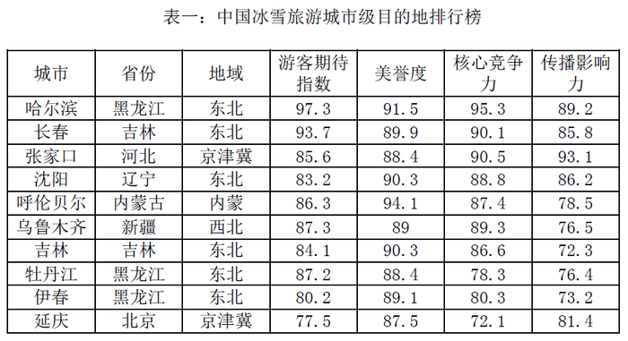

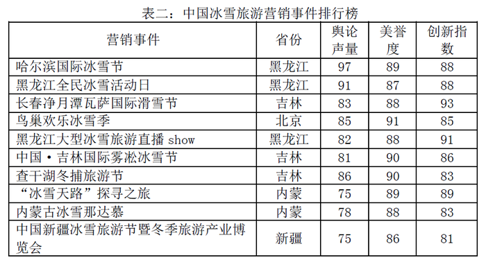

### 第 6 题　qid 2049338 · 综合

表一中，冰雪旅游综合得分最高的城市是：

- **A**. 乌鲁木齐
- **B**. 张家口
- **C**. 哈尔滨　✅
- **D**. 呼伦贝尔

**答案**：C

**官方解析**

求“表一中……冰雪旅游综合得分最高”，综合得分为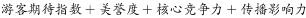，所以定位表一第4、5、6、7列。结合选项，只需将乌鲁木齐、张家口、哈尔滨、呼伦贝尔四个城市的相关数据进行比较即可。

方法一：

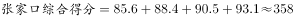

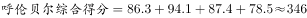

哈尔滨的综合得分最高。

方法二：比较选项对应的各项指标可以发现，哈尔滨的旅游期待指数远高于其他城市，同时哈尔滨的其他指数在四个城市中相对较高且与最高的城市相差不多，可直接判定哈尔滨的冰雪旅游综合得分最高。

故正确答案为C。

---

### 第 7 题　qid 2049344 · 综合

表一中，游客期待指数和美誉度相差最大的是：

- **A**. 延庆　✅
- **B**. 哈尔滨
- **C**. 伊春
- **D**. 长春

**答案**：A

**官方解析**

定位表一第四列和第五列即可得出各城市对应游客期待指数和美誉度，延庆区两指数相差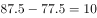；哈尔滨市两指数相差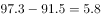；伊春市两指数相差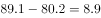；长春市两指数相差。因此，延庆区的游客期待指数和美誉度相差最大。

故正确答案为A。

---

### 第 8 题　qid 2049332 · 平均数

表二中的各营销事件美誉度平均得分约为：

- **A**. 89.85
- **B**. 88.6　✅
- **C**. 86.7
- **D**. 83.3

**答案**：B

**官方解析**

由题干求“表二中······平均得分”可知，本题为现期平均数问题。根据“美誉度”，定位到表二第四列，各营销事件美誉度分别为89，87，88，91，88，90，90，89，88，86。

方法一：根据平均数公式，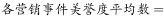

。

方法二：求平均数采用削峰填谷法。观察数据，各营销事件美誉度多在88附近，取88为基准线，各事件的美誉度与之分别相差：1、-1、0、3、0、2、2、1、0、-2，相加的和为6，平均为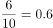,所以最终结果应比88多0.6，为88.6。

故正确答案为B。

---

### 第 9 题　qid 2049356 · 综合

假定舆论声量、美誉度和创新指数得分分别占综合竞争力权重的、、，那么最具竞争力的3个营销事件分别是：

- **A**. 哈尔滨国际冰雪节、长春净月潭瓦萨国际滑雪节、黑龙江大型冰雪旅游直播show
- **B**. 哈尔滨国际冰雪节、长春净月潭瓦萨国际滑雪节、黑龙江全民冰雪活动日　✅
- **C**. 中国新疆冰雪旅游节暨冬季旅游产业博览会、鸟巢欢乐冰雪季、查干湖冬捕旅游节
- **D**. 哈尔滨国际冰雪节、长春净月潭瓦萨国际滑雪节、内蒙古冰雪那达慕

**答案**：B

**官方解析**

题干给出每种指数的权重计算总体竞争力，可判定此题为现期比重问题。由题干可知，。根据舆论声量、美誉度、创新指数定位表二，哈尔滨国际冰雪节各项指数基本都是最大，所以加权后也较大，排除C选项。余下选项中都有长春净月潭瓦萨国际滑雪节，不需要计算，三个选项的不同事件竞争力分别为：

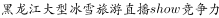；

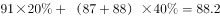；

。

故正确答案为B。

---

### 第 10 题　qid 2049366 · 综合

根据所给资料，下列分析正确的是：

- **A**. 
所有城市游客期待指数和传播影响力均呈正相关

- **B**. 
美誉度最高的4个城市其核心竞争力也分列前四名

- **C**. 
得分最高的营销事件其分数高出第4名

- **D**. 
黑龙江的营销事件舆论声量高于吉林
　✅

**答案**：D

**官方解析**

A项：定位表一，游客期待指数与传播影响力变化趋势不一致，没有呈正相关，错误；

B项：美誉度最高的4个城市分别为呼伦贝尔、哈尔滨、吉林、沈阳，核心竞争力最高的4个城市分别为哈尔滨、长春、张家口、乌鲁木齐，二者不完全相同，错误；

C项：得分最高的营销事件为，第4名为，，错误；

D项：定位表二第三列，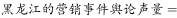 ，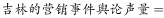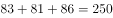，黑龙江的高于吉林的，正确。

故正确答案为D。

---

## 材料 3

下面是关于我国年轻人2016年各项消费的数据统计：

        2016年（全年366天），全国年轻人人均月收入为6726元。同时，存款额度也在增加，2016年年轻人的人均月存款为2340元，较2015年同比增加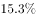，而2015年的人均月存款较2014年增加。在贷款方面，月收入4000元以上的办理信用卡比例超过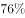，而贷款年龄段比例则为：18-25岁占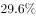、26-35岁占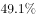、36-45岁占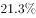。年轻人每月平均记账次数约为41笔，其中上海以1.672笔的人均日记账次数居榜首。在消费方面，KTV的年人均消费由2014年的699.9元增加到2016年的814.6元；在旅游方面，人均年度交通支出达4985元。年轻人2016年在书本上的人均支出达到168元，相对于2015年的155元，同比增长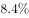。2016年，年轻人与雾霾相关的支出较2015年多出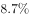，人均支出达到998.7元；每日人均食品消费45.9元，比去年增加8.8元，早餐平均花费4.5元。

### 第 11 题　qid 2049292 · 增长

下列各项关于2016年年轻人的人均数据中，较去年增幅最大的是：

- **A**. 每日食品消费额　✅
- **B**. 月存款额
- **C**. 年度书本支出
- **D**. 年度雾霾支出

**答案**：A

**官方解析**

根据题干所求“关于2016年……较去年增幅最大的是”，可判定此题为一般增长率比较问题。从材料可知“每日人均食品消费45.9元，比去年增加8.8元”，因此人均每日食品消费额增幅为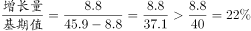。从材料可知2016年年轻人人均月存款额“较2015年同比增加”，人均年度书本支出“相对于2015年……同比增长”，年度雾霾支出“较2015年多出”。综上分析，增幅最大的为每日食品消费额。

故正确答案为A。

---

### 第 12 题　qid 2049302 · 平均数

在2016年，上海年轻人人均全年记账次数多出全国年轻人：

- **A**. 118次
- **B**. 120次　✅
- **C**. 122次
- **D**. 124次

**答案**：B

**官方解析**

题目求2016年全年记账次数的比较，材料给出2016年“每月平均记账次数”和“日记账次数”，可判定此题为现期平均数问题。上海年轻人人均全年记账次数为：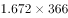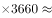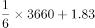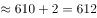次，全国年轻人人均全年记账次数为：次，因此上海年轻人比全国全年记账多次。

故正确答案为B。

---

### 第 13 题　qid 2049300 · 平均数

2016年，全国年轻人的人均旅游交通支出占个人全年支出的比重为：

- **A**. 

- **B**. 

- **C**. 

　✅
- **D**. 

**答案**：C

**官方解析**

由题干“2016年……占……比重”，可判定该题为现期比重问题。由材料可知，2016年年轻人的人均旅游交通支出为4985元，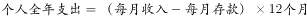，因此比重为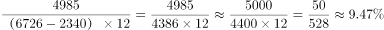。

故正确答案为C。

---

### 第 14 题　qid 2049298 · 综合

下列不能从所给资料得出的是：

- **A**. 2016年18-35岁人员办理信用卡比例　✅
- **B**. 2014-2016年年轻人人均KTV消费年均增长率
- **C**. 2015年年轻人人均食品消费支出
- **D**. 2014年年轻人人均存款额度

**答案**：A

**官方解析**

A项，材料虽然给出18-35岁的贷款比例，但办理信用卡的比例有前提“月收入4000元以上”，而且各年龄层次贷款人员办理信用卡的比例也未必一样，不能求出；

B项，定位材料“KTV的年人均消费由2014年的699.9元增加到2016年的814.6元”，根据年均增长率公式：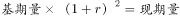，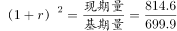，可求出；

C项，定位材料“每日人均食品消费45.9元，比去年增加8.8元”，可知2015年年轻人每日人均食品消费支出为：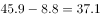元，2015年年轻人人均食品消费支出为：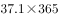元，可求出；

D项，定位材料“2016年年轻人的人均月存款为2340元，较2015年同比增加，而2015年的人均存款较2014年增加”，2014年年轻人人均月存款额度为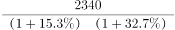元，2014年年轻人人均存款额度为元，可求出。

本题为选非题，故正确答案为A。

---

### 第 15 题　qid 2049296 · 综合

下列关于年轻人的说法错误的是：

- **A**. 
2016年，贷款年龄在26-45岁的人群和办理信用卡且月收入在4000元以上的人群重合率达到
　✅
- **B**. 
在2016年，按平均来算，他们天天都记账

- **C**. 
在2016年，人均食品支出高出当年KTV、旅游交通、书本、雾霾支出总额约1.4倍

- **D**. 
2014年人均新增存款不足2万元

**答案**：A

**官方解析**

A项：，由材料无法求得2016年贷款年龄在26-45岁人群与办理信用卡且月收入在4000元以上人群的交集和并集，故重合率无法求出，错误；

B项：定位材料“年轻人每月平均记账次数约为41笔”，每月记账次数大于天数，可知按平均计算，年轻人“天天都记账”，正确；

C项：定位材料“每日人均食品消费45.9元”，可知全年食品消费为。KTV、旅游交通、书本、雾霾支出总额为：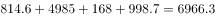，则它们的倍数关系为：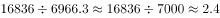，所以人均食品支出高出KTV、旅游交通、书本、雾霾支出总额约：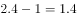倍，正确；

D项：定位材料“2016年年轻人的人均月存款为2340元，较2015年同比增加，而2015年的人均月存款较2014年增加”，可知2016年相对于2014年人均存款的增长率为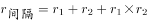。则2014年人均存款约为元，2014年人均存款不足2万元，则2014年人均新增存款不足2万元，正确。

本题为选非题，故正确答案为A。

---

## 材料 4

        截至2015年末，全国水果（含瓜果，下同）种植总面积1536.71万公顷，较“十二五”（即2011-2015年）期初增加143.38万公顷，增长了约。其中，园林水果种植面积1281.67万公顷，比“十二五”期初增加127.28万公顷，增长，年均增长。从全国园林水果种植面积的地区分布情况看，在主要大宗果品中，苹果“十二五”期初种植面积214万公顷，期末232.8万公顷，增长；柑橘期初种植面积221.1万公顷，期末251.3万公顷，增长；梨期初种植面积106.3万公顷，期末112.4万公顷，增长；葡萄期初种植面积55.2万公顷，期末79.9万公顷，增长；香蕉期初种植面积35.7万公顷，期末40.9万公顷，增长。

        2015年我国水果总产量达到2.71亿吨，比上一年增长。其中苹果产量达到4261.3万吨，比上年增长169万吨，增长幅度为。需要注意的是，在2010-2015年期间，2010年苹果产量仅为3326.3万吨，2014年突破4000万吨，达到4092.3万吨。

### 第 16 题　qid 2049374 · 增长

“十二五”期间全国水果种植面积的年均增长率约为：

- **A**. 

　✅
- **B**. 

- **C**. 

- **D**. 

**答案**：A

**官方解析**

由题干“‘十二五’期间······年均增长率约为”，可判断该题是年均增长率问题。定位文字材料第一段，截至2015年末，全国水果种植总面积1536.71万公顷，较“十二五”期初增加143.38万公顷，所以。代入选项A，，接近1.103。年均增长率一般用估算的方法，但是选项过于接近，无法估算，因此解析给出年均增长率的精确计算方法，所以年均增长率为。

故正确答案为A。

---

### 第 17 题　qid 2049382 · 综合

2015年全国水果的公顷单产量为：

- **A**. 17.64吨　✅
- **B**. 17.75吨
- **C**. 17.86吨
- **D**. 17.97吨

**答案**：A

**官方解析**

由题干“2015年全国水果的公顷单产量为”，可判定该题是现期平均数问题。定位文字材料一、二段，2015年末，全国水果种植总面积1536.71万公顷，水果总产量达到2.71亿吨，。

故正确答案为A。

---

### 第 18 题　qid 2049328 · 增长

“十二五”期间，下列增幅最大的是：

- **A**. 水果种植总面积
- **B**. 柑橘种植面积
- **C**. 苹果产量　✅
- **D**. 水果销量

**答案**：C

**官方解析**

由题干“下列增幅最大的是······”，可判定该题是一般增长率问题。定位文字材料第一段，“十二五”期间，全国种植水果总面积增长了约，柑橘种植面积增长，定位文字材料第二段，2010年苹果产量3326.3万吨，2015年苹果产量4261.3万吨，，定位数据表，2010年水果销量2.13亿吨，2015年水果销量2.66亿吨，，所以苹果产量增幅最大。

故正确答案为C。

---

### 第 19 题　qid 2049334 · 增长

对“十二五”期间水果种植面积增长贡献最大的果品是：

- **A**. 苹果
- **B**. 柑橘　✅
- **C**. 梨
- **D**. 香蕉

**答案**：B

**官方解析**

由题干“‘十二五’期间······面积增长贡献最大的是······”，增长贡献就是增长贡献率。，由于总体增长量是定值，因此只需要比较分子即部分增长量。定位文字材料第一段，“十二五”期初苹果种植面积214万公顷，期末232.8万公顷，；“十二五”期初柑橘种植面积221.1万公顷，期末251.3万公顷，；“十二五”期初梨种植面积106.3万公顷，期末112.4万公顷，；“十二五”期初香蕉种植面积35.7万公顷，期末40.9万公顷，，所以增长面积贡献最大的是柑橘。

故正确答案为B。

---

### 第 20 题　qid 2049348 · 综合

根据所给资料，下列判断正确的是：

- **A**. 
在2015年，苹果、梨、柑橘、香蕉及葡萄种植面积超过水果种植总面积的

- **B**. 
按“十二五”期间增长势头，在2025年，葡萄种植面积将超过柑橘

- **C**. 
“十二五”期间，我国每年的水果产量都高于销量

- **D**. 
2015年，苹果公顷单产量高于水果的平均公顷单产量
　✅

**答案**：D

**官方解析**

A项：定位文字材料第一段，截至2015年末，全国水果种植总面积1536.71万公顷，苹果、梨、柑橘、香蕉及葡萄，错误；

B项：定位文字材料第一段，“十二五”期末葡萄种植面积79.9万公顷，增长，所以按“十二五”期间增长势头，在2025年，（“十二五”期末柑橘种植面积），而按“十二五”期间增长势头（增长率），2025年柑橘种植面积会更大，错误；

C项：定位数据图中数据，2013年，错误；

D项：定位文字材料第一段和第二段，；，正确。

故正确答案为D。

---
