# 2017年422联考《行测》题（陕西卷）

> 资料分析 · 20 题 · 陕西 2017

## 材料 1

        中国人民银行发布的《2015年中国区域金融运营报告》披露：2015年末，全国各地区银行业金融机构网点共计22.1万个，从业人员379.0万人，资产总额174.2万亿元，同比分别增长、、。分地区看，中部、西部和东北地区银行业金融机构发展加快，从业人员和资产规模占全国的比例同比均有所提高，东部地区这两项指标同比分别下降1.0个百分点和0.7个百分点。

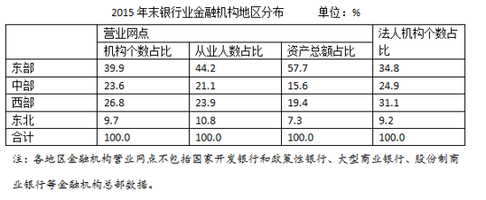

### 第 1 题　qid 2051590 · 综合

2015年末，我国西部地区和中部地区的银行业金融机构的营业网点机构个数相差约：

- **A**. 7000　✅
- **B**. 8000
- **C**. 28000
- **D**. 30000

**答案**：A

**官方解析**

材料时间为2015年末，由题干“2015年末，我国西部地区和中部地区的银行业金融机构的营业网点机构个数”，结合表格给出中部和西部机构占比可知，本题为现期比重问题。定位文字材料第一段可知，2015年末，全国各地区银行业金融机构网点共计22.1万个，定位表格第二列可知，2015年末，西部金融机构营业网点占比为，中部金融机构营业网点占比。西部地区和中部地区机构个数相差为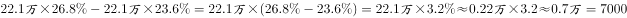。

故正确答案为A。

---

### 第 2 题　qid 2051596 · 综合

2015年末，我国东部地区银行业金融机构从业人数比东北地区的多多少倍？

- **A**. 1
- **B**. 2
- **C**. 3　✅
- **D**. 4

**答案**：C

**官方解析**

由题干“2015年末……多……倍”，可知本题为一般增长率问题。定位表格第三列可知，2015年末，东部地区银行业金融机构从业人数占比为，东北地区银行业金融机构从业人数占比为，则东部地区从业人数比东北地区多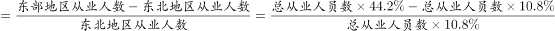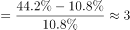倍。

故正确答案为C。

---

### 第 3 题　qid 2051604 · 平均数

2015年末，我国银行业金融机构营业网点的平均资产总额最高的地区是：

- **A**. 东部　✅
- **B**. 中部
- **C**. 西部
- **D**. 东北

**答案**：A

**官方解析**

材料时间为2015年末，由题干“2015年末……平均……是”，可知本题为现期平均数。地区平均资产总额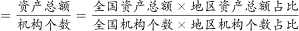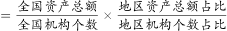。定位表格第一列第三列可知：

东部地区；

中部地区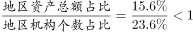；

西部地区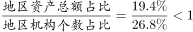；

东北地区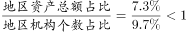。

一定，东部地区最高，所以东部地区平均资产总额最高。

故正确答案为A。

---

### 第 4 题　qid 2051606 · 平均数

2015年末，我国银行业金融机构从业人员的人均资产最少的地区是：

- **A**. 东部
- **B**. 中部
- **C**. 西部
- **D**. 东北　✅

**答案**：D

**官方解析**

材料时间为2015年末，由题干“2015年末……人均资产”，可知本题为现期平均数。地区人均资产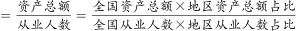。定位表格第二列第三列可知：

东部地区；

中部地区；

西部地区；

东北地区。

一定，东北地区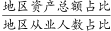最少，所以东北地区人均资产最少。

故正确答案为D。

---

### 第 5 题　qid 2051610 · 综合

根据以上资料，下列说法正确的是：

- **A**. 2014年末，我国银行业金融机构营业网点的从业人员平均规模是20人。
- **B**. 2014年末，我国银行业金融机构营业网点的平均总资产是7亿元。　✅
- **C**. 2014年末，我国银行业金融机构从业人员的人均总资产是4500万元。
- **D**. 2014年，我国东部地区银行业金融机构从业人员的人均总资产为6000万元。

**答案**：B

**官方解析**

A项：定位文字材料，“2015年末，全国各地区银行业金融机构网点共计22.1万个，从业人员379.0万人，同比分别增长、”。2014年末，银行业金融机构营业网点的从业人员平均规模，错误；

B项：定位文字材料，“2015年末，全国各地区银行业金融机构网点共计22.1万个，资产总额174.2万亿元，同比分别增长、”。2014年末，我国银行业金融机构营业网点的平均总资产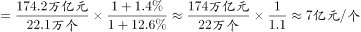，正确；

C项：定位文字材料，“2015年末，全国各地区银行业金融机构，从业人员379.0万人，资产总额174.2万亿元，同比分别增长、”。2014年末，我国银行业金融机构从业人员的人均总资产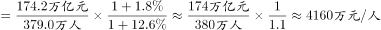，错误；

D项：定位文字材料，“2015年末，全国各地区银行业金融机构，从业人员379.0万人，资产总额174.2万亿元，同比分别增长、”，定位表格材料“东部地区：从业人员占比为，资产总额占比为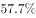”，定位文字材料“分地区看，中部、西部和东北地区银行业金融机构发展加快，从业人员和资产规模占全国的比例同比均有所提高，东部地区这两项指标同比分别下降1.0个百分点和0.7个百分点”。可知2014年从业人员占比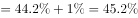，2014年资产规模占比，2014年，我国东部地区银行业金融机构从业人员的人均总资产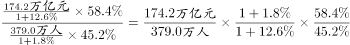，错误。

故正确答案为B。

---

## 材料 2

        根据国家统计局抽样调查结果，2015年农民工总量为27747万人，比上年增加352万人，增长。2011年以来农民工总量增速持续回落。2012年、2013年、2014年和2015年农民工总量增速分别比上年回落0.5、1.5、0.5和0.6个百分点，而且农民工年龄结构也有所变化。

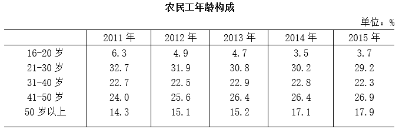

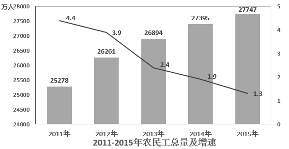

### 第 6 题　qid 2051658 · 增长

2012-2015年，我国农民工同比增速下降最多的年份是：

- **A**. 2012
- **B**. 2013　✅
- **C**. 2014
- **D**. 2015

**答案**：B

**官方解析**

定位文字材料“2012年、2013年、2014年和2015年农民工增速分别比上年回落0.5、1.5、0.5和0.6个百分点”，因此农民工同比增速下降最多的是2013年。
故正确答案为B。

---

### 第 7 题　qid 2051656 · 增长

2012年-2015年，我国农民工总量增长最多的年份是：

- **A**. 2012　✅
- **B**. 2013
- **C**. 2014
- **D**. 2015

**答案**：A

**官方解析**

根据题干所求“2012年-2015年，我国农民工总量增长最多的年份”，可判定此题为增长量比较问题。，代入柱状图数据可得，增长量为：2012年万人；2013年万人；2014年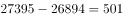万人；定位文字材料可得“2015年农民工总量……比上年增加352万人”。因此农民工总量增长最多的是2012年。

故正确答案为A。

---

### 第 8 题　qid 2051664 · 比重

2011-2015年，年龄为多少岁的农民工在农民工总量中的占比逐年减少：

- **A**. 16-20岁
- **B**. 21-30岁　✅
- **C**. 31-40岁
- **D**. 50岁以上

**答案**：B

**官方解析**

定位表格数据可得：2015年16-20岁农民工占比高于2014年，2013年31-40岁农民工占比高于2012年，2012年50岁以上农民工占比高于2011年，满足2011-2015年占农民工总量比重逐年减少的只有21-30岁的农民工。
故正确答案为B。

---

### 第 9 题　qid 2051668 · 增长

与2014年相比，2015年年龄为多少岁的农民工总量增加最多？

- **A**. 16-20岁
- **B**. 21-30岁
- **C**. 31-40岁
- **D**. 50岁以上　✅

**答案**：D

**官方解析**

根据题干所求，“与2014年相比，2015年年龄为多少岁的农民工总量增加最多”，可判定此题为增长量比较。

增长量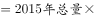

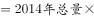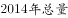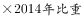

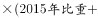-

2015年，各年龄段农民工总量增长量 分别为：

A项：16-20岁：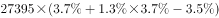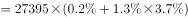；

B项：21-30岁：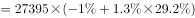；

C项：31-40岁：；

D项：50岁以上：。

观察数据，A和D项是正的，而B和C项是负的，排除B和C项。A项一定小于D项，排除A。故D项数值最大。

故正确答案为D。

---

### 第 10 题　qid 2051674 · 综合

根据以上材料，下列说法中不正确的是：

- **A**. 2011-2015年，50岁以上的农民工人数都超过了3600万。
- **B**. 2015年，21-30岁、31-40岁、41-50岁的农民工人数均超过6100万。
- **C**. 2015年16-20岁农民工人数比2013年16-20岁农民工人数要多。　✅
- **D**. 2011-2015年，50岁以上农民工在农民工总量中的占比逐年增加。

**答案**：C

**官方解析**

A项：，定位柱状图与表格，2011年50岁以上农民工为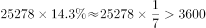万，2012年-2015年，农民工总量与50岁以上农民工占总量的比重均高于2011年，故2011-2015年，50岁以上的农民工人数都超过3600万，正确；

B项：定位文字材料与表格，2015年，31-40岁农民工人数为万，21-30岁、41-50岁农民工占比分别为、，均高于31-40岁农民工占比，故农民工人数均超过6100万，正确；

C项：定位柱状图与表格，2015年16-20岁农民工人数为，2013年为，比较数据，2015年农民工总量小于2013年的1.1倍，2013年比重大于2015年的1.2倍，故2015年16-20岁农民工人数少于2013年，错误；

D项：定位表格，2011年-2015年，50岁以上农民工占农民工总量中的比重逐年增加，正确。

本题为选非题，故正确答案为C。

---

## 材料 3

        据国家卫计委统计，2016年1-11月全国医疗卫生机构出院人数达19912.9万人，同比提高。其中：医院15392.5万人，同比提高；基层医疗卫生机构3618.6万人，同比提高；其他机构901.8万人。医院中：公立医院13080.0万人，同比提高；民营医院2312.5万人，同比提高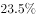。

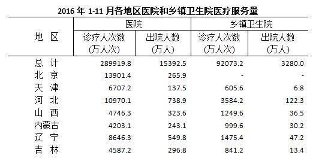

   

### 第 11 题　qid 2051722 · 综合

2016年1-11月医院和乡镇卫生院的诊疗人次数合计最多的省份是：

- **A**. 江苏
- **B**. 浙江
- **C**. 河南
- **D**. 广东　✅

**答案**：D

**官方解析**

由题干“2016年1-11月······人数合计最多的······”可以判定本题为简单加减计算问题。定位表格材料，四个选项的诊疗人次数合计分别为：

A项：江苏万人次；

B项：浙江万人次；

C项：河南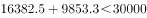万人次；

D项：广东万人次。

所以诊疗人次数合计最多的省份为广东省。

故正确答案为D。

---

### 第 12 题　qid 2051712 · 综合

2016年1-11月医院和乡镇卫生院的出院人数合计最多的省份是：

- **A**. 山东
- **B**. 河南
- **C**. 四川　✅
- **D**. 广东

**答案**：C

**官方解析**

由题干“2016年1-11月······人数合计最多的······”可以判定本题为简单加减计算问题。定位表格材料，四个选项的出院人数合计分别为：

A项：山东万人；

B项：河南万人；

C项：四川万人；

D项：广东万人。

所以出院人数合计最多的省份为四川省。

故正确答案为C。

---

### 第 13 题　qid 2051726 · 综合

2016年1-11月医院和乡镇卫生院的出院人数合计超过1000万的省份共有多少个？

- **A**. 4
- **B**. 5
- **C**. 6　✅
- **D**. 7

**答案**：C

**官方解析**

由题干“2016年1-11月······人数合计超过1000万的······”可以判定本题为简单加减计算问题。定位表格材料第三列与第五列，想要快速寻找两列合计超过1000万的省份，可以分两步考虑：
第一步，只要单列超过1000万，则两列合计必然超过1000万。将单列超过1000万的省份找出来，从上到下依次为山东、河南、广东、四川，共有4个省份；
第二步，由于第三列的数据远超第五列，故主要寻找第三列略低于1000万的省份，计算第三列和第五列总和是否超过1000万，从上到下依次有江苏（961.3）、湖南（807.8）满足要求，共有2个省份。
所以共有6个省份出院人数合计超过1000万人。
故正确答案为C。

---

### 第 14 题　qid 2051724 · 综合

2016年1-11月医院的出院人数与诊疗人次数之比由高到低的省份依次为：

- **A**. 湖南 陕西 甘肃 四川　✅
- **B**. 甘肃 陕西 湖南 四川
- **C**. 四川 陕西 湖南 甘肃
- **D**. 陕西 湖南 四川 甘肃

**答案**：A

**官方解析**

由“2016年1-11月······之比由高到低”可以判定本题为比值比较问题。观察选项可知，选项只涉及到湖南、陕西、甘肃、四川四个省份，且第一名各不相同，故只需确定这四个省份中最高的一个即可。

A项：湖南；

B项：陕西；

C项：甘肃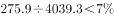；

D项：四川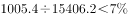。

很显然，四个省份的比值最高的是湖南。

故正确答案为A。

---

### 第 15 题　qid 2051728 · 综合

根据以上资料，下列说法中正确的是：

- **A**. 
2016年1-11月，医院诊疗人次数与乡镇卫生院诊疗人次数之和与之差都最小的省份不是西藏

- **B**. 
2016年1-11月，医院和乡镇卫生院的诊疗人次数合计超过1亿的省份有16个
　✅
- **C**. 
2016年1-11月，我国医疗卫生机构的出院人数中，公立医院的占比为

- **D**. 
2016年1-11月，我国医院诊疗人次数的合计数比乡镇卫生院诊疗人次数的合计数少20亿

**答案**：B

**官方解析**

A项：定位材料最后一句话“注：西藏2016年月报未报机构较多”，所以表中西藏的数据只是部分数据，不能说明西藏医院诊疗人次数和乡镇卫生院诊疗人次数的实际总数，因此无法判断西藏的医院诊疗人次数与乡镇卫生院诊疗人次数之和与之差是否都最小，错误；

B项：定位表格材料，2016年1-11月，医院和乡镇卫生院的诊疗人次数合计超过1亿的省份有北京、河北、辽宁、上海、江苏、浙江、安徽、福建、山东、河南、湖北、湖南、广东、广西、四川、云南，共16个省份，正确；

C项：定位文字材料“2016年1-11月全国医疗卫生机构出院人数达19912.9万人······医院中：公立医院13080.0万人” ，2016年1-11月，我国医疗卫生机构的出院人数中，，错误；

D项：定位表格材料，我国医院诊疗人次数的合计数（289919.8万人次）比乡镇卫生院诊疗人次数的合计数（92073.2万人次）多，错误。

故正确答案为B。

---

## 材料 4

        2016年电信业务收入完成11893亿元，同比增长，比上年回升7.6个百分点。电信业务总量完成35948亿元，同比增长，比上年提高25.5个百分点。2016年，电信业务收入结构继续向互联网接入和移动流量业务倾斜。非话音业务收入占比由上年的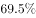提高至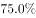；移动数据及互联网业务收入占电信业务收入的比重从上年的提高至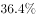。

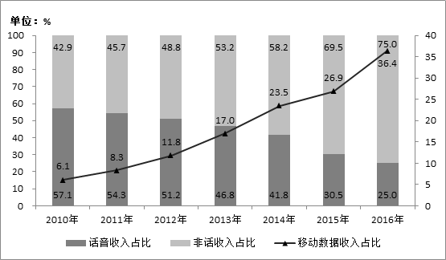

        2010-2016年话音业务和非话音业务收入占比变化情况

### 第 16 题　qid 2054178 · 增长

2016年电信业务总量同比增长了约（    ）亿元。

- **A**. 12653
- **B**. 12635　✅
- **C**. 7340
- **D**. 7304

**答案**：B

**官方解析**

根据题干所求“2016年······同比增长了约（    ）亿元”，材料数据为2016年，可判定此题为增长量计算问题。定位文字材料“电信业务总量完成35948亿元，同比增长”，代入公式：增长量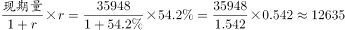亿元。

故正确答案为B。

---

### 第 17 题　qid 2054180 · 增长

2016年非话音业务收入同比增加了约（  ）亿元。

- **A**. 1903
- **B**. 1309
- **C**. 1093　✅
- **D**. 1039

**答案**：C

**官方解析**

根据题干所求“2016年······同比增长加了······亿元”，材料数据为2016年，可判定此题为增长量计算问题。定位文字材料“2016年电信业务收入完成11893亿元，同比增长······非话音业务收入占比由上年的提高至”，增长量现期量基期量现期总量现期比重基期总量基期比重现期总量现期比重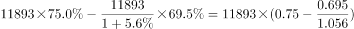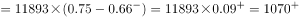亿元。C项最接近。

故正确答案为C。

---

### 第 18 题　qid 2054182 · 增长

2016年话音业务收入增速同比降低（  ）。

- **A**. 

- **B**. 

- **C**. 

- **D**. 

　✅

**答案**：D

**官方解析**

根据题干所求“2016年······收入增速同比降低”，选项为百分数，材料数据为2016年，可判定此题为一般增长率问题。

方法一：定位文字材料可得“2016年电信业务收入完成11893亿元，同比增长，”定位柱状图可得，2016年与2015年话音收入占比分别为、。代入公式：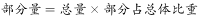，2016年话音收入为，，2015年话音收入为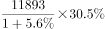，2016年话音收入增长率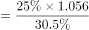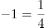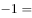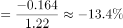。

方法二：根据两期比重比较逆向考查进行求解。定位柱状图可得，2016年与2015年话音收入占比分别为、，即2016年话音收入占比相对于2015年降低了个百分点。定位文字材料可得“2016年电信业务收入完成11893亿元，同比增长”，设2016年话音业务收入同比增速为，根据两期比重比较公式，代入数据可得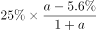，做一简单化简，即，进一步化简可求得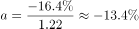。当然也可以直接代入排除来做。

故正确答案为D。

---

### 第 19 题　qid 2054184 · 综合

2016年移动数据及互联网业务收入规模约为（  ）亿元。

- **A**. 4329　✅
- **B**. 4239
- **C**. 3209
- **D**. 3029

**答案**：A

**官方解析**

方法一：根据题干所求“2016年移动数据及互联网业务收入”，材料给出2016年的总量及该部分的比重，可判定此题为现期比重问题。定位文字材料“移动数据及互联网业务收入占电信业务收入的比重从上年的提高至”“2016年电信业务收入完成11893亿元”，代入公式：部分量总量部分占总体比重亿元，仅A项满足。

方法二：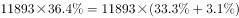亿元，A项最接近。

故正确答案为A。

---

### 第 20 题　qid 2054186 · 综合

根据以上资料，下列说法中不正确的是（  ）。

- **A**. 2016年移动数据及互联网业务收入同比增速是当年非话音业务收入同比增速的3倍
- **B**. 2016年电信业务收入、非话音业务收入、移动数据及互联网业务收入均实现了同比正增长，且同比增速由小到大
- **C**. 2016年移动数据及互联网业务收入的同比增量比当年电信业务收入同比增量多669亿元
- **D**. 2016年移动数据及互联网业务收入的同比增速要高于电信业务总量的同比增速　✅

**答案**：D

**官方解析**

A项：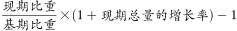，代入文字材料及统计图数据，2016年移动数据及互联网业务收入增速，非话音业务收入同比增速，前者增速是后者的倍，正确；

B项：定位文字材料，2016年电信业务收入同比增长，根据本题A项计算结果，非话音业务收入同比增长、移动数据及互联网业务收入同比增长，三者均同比正增长，且增速由小到大，正确；

C项：增长量现期量基期量现期总量现期比重基期总量基期比重现期总量现期比重基期比重，代入文字材料数据，2016年移动数据及互联网业务收入的同比增量为亿元，增长量增长率，电信业务收入同比增量为亿元，前者同比增量比后者多亿元，与669亿元接近，正确；

D项：根据本题A项计算结果，2016年移动数据及互联网业务收入同比增长，定位文字材料，电信业务总量同比增长，前者增速低于后者，错误。

本题为选非题，故正确答案为D。

---
