# 2017年北京市公务员录用考试《行测》题

> 资料分析 · 20 题 · 北京 2017

## 材料 1

        据统计，2015年上半年全国渔业产值4152.56亿元，同比增长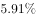；渔业增加值2260.05亿元，同比增长，高出农林牧渔业增加值的增幅2.2个百分点。

        2015年上半年全国水产品产量2700.09万吨，同比增长，其中养殖水产品产量2114.38万吨，同比增长。

        2015年上半年全国水产品进出口总量383.08万吨，同比下降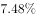，进出口总额137.28亿美元，同比下降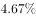。

        其中，出口量189.28万吨，出口额95.81亿美元，同比分别增长和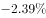。主要出口国家和地区中，对美国、欧盟、东盟、日本、中国香港、韩国和中国台湾的出口额分别增长、、、、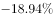、和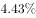。

        进口量193.80万吨，进口额41.47亿美元，同比分别下降和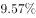，其中鱼粉进口量、进口额同比分别下降和。

### 第 1 题　qid 2031160 · 综合

2015年上半年，非养殖水产品产量与上年同期相比的变化最接近以下哪个数字？

- **A**. 

- **B**. 

　✅
- **C**. 

- **D**. 

**答案**：B

**官方解析**

由题干“与上年同期相比”结合选项都为百分比，且题干给了水产品和养殖水产品的量以及增长率，可判断该题是混合增长率问题。定位材料第二段，2015年上半年全国水产品产量2700.09万吨，同比增长，其中养殖水产品产量2114.38万吨，同比增长，所以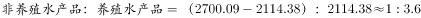，所以设非养殖水产品增长率为，则，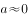。

故正确答案为B。

---

### 第 2 题　qid 2031162 · 增长

与上年同期相比，2015年上半年全国农林牧渔业增加值增幅为：

- **A**. 
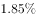

- **B**. 

　✅
- **C**. 

- **D**. 

**答案**：B

**官方解析**

由题干“与上年同期相比， 2015年上半年全国农林牧渔业增加值增幅为”，结合材料第一段最后一句话，可判定该题属于简单加减计算问题。定位材料第一段，渔业增加值同比增长，高出农林牧渔业增加值的增幅2.2个百分点，可得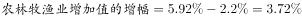。

故正确答案为B。

---

### 第 3 题　qid 2031164 · 综合

2015年上半年我国水产品进出口贸易状态为：

- **A**. 逆差4亿多美元
- **B**. 顺差4亿多美元
- **C**. 逆差50多亿美元
- **D**. 顺差50多亿美元　✅

**答案**：D

**官方解析**

由题干“2015年上半年······进出口贸易状态为”，结合选项以及材料分别给出了进口额和出口额，可判定该题是简单加减计算问题。定位材料第四、五段，2015年上半年全国水产品出口额95.81亿美元，进口额41.47亿美元，因为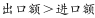且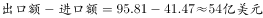，所以2015年上半年我国水产品进出口贸易状态为顺差50多亿美元。

故正确答案为D。

---

### 第 4 题　qid 2031166 · 增长

材料中所列水产品主要出口国家和地区中，2015年上半年我国对其出口额同比降幅最大的是：

- **A**. 东盟
- **B**. 韩国
- **C**. 中国香港　✅
- **D**. 日本

**答案**：C

**官方解析**

由题干“2015年上半年…同比降幅最大的是”，结合材料第四段数据都给出了，可判定该题属于直接找数问题。定位材料第四段，主要出口国家和地区中，对美国、欧盟、东盟、日本、中国香港、韩国和中国台湾的出口额分别增长、、、、、和，所以降幅最大的中国香港为。

故正确答案为C。

---

### 第 5 题　qid 2031168 · 综合

根据上述资料，下列说法中正确的是：

- **A**. 2015年上半年平均每吨水产品的出口价格比上年同期低　✅
- **B**. 2015年上半年我国水产品进口量和进口额均高于上年同期水平
- **C**. 2015年上半年出口的水产品占全国水产品产量的一成多
- **D**. 水产品主要出口国家和地区中，2015年上半年我国对其出口额同比上升的国家（地区）有1个

**答案**：A

**官方解析**

A项：定位材料第四段，2015年上半年水产品的出口量189.28万吨，出口额95.81亿美元，同比分别增长和，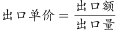，则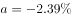，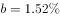，，所以2015年上半年平均每吨水产品的出口价格比上年同期低，正确；

B项：定位材料最后一段，进口量193.80万吨，2015年上半年水产品的进口额41.47亿美元，同比分别下降和，均低于去年同期水平，错误；

C项：定位材料第二、四段，2015年上半年全国水产品产量2700.09万吨，2015年上半年出口的水产品189.28万吨，因为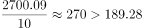，因此2015年上半年出口的水产品占全国水产品产量不到一成，错误；

D项：定位材料第四段，2015年上半年主要出口国家和地区中，对美国、欧盟、东盟、日本、中国香港、韩国和中国台湾的出口额分别增长、、、、、和，其中有东盟和中国台湾2个国家（地区）出口额同比上升，错误。

故正确答案为A。

---

## 材料 2

        2015年全年，全国吸收外商直接投资新设立企业26575家，同比增长；实际使用外资金额7813.5亿元，同比增长。其中从“一带一路”沿线国家吸收外商直接投资新设立企业2164家，增长；实际使用外商直接投资金额526亿元，增长。

2015年全国吸收外商直接投资状况       

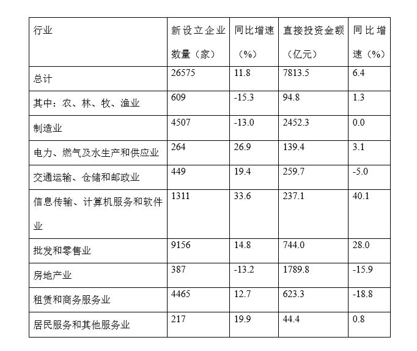

### 第 6 题　qid 2031170 · 增长

2015年从“一带一路”沿线国家吸收外商直接投资新设立企业数比上年增加了多少家？

- **A**. 不到300家
- **B**. 300多家　✅
- **C**. 400多家
- **D**. 500家以上

**答案**：B

**官方解析**

根据“设立企业数比上年增加了多少家”，判定此题为增长量计算问题。定位文字材料第一段，从“一带一路”沿线国家吸收外商直接投资新设立企业2164家，增长。代入增长量计算公式：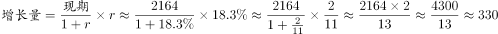家。

故正确答案为B。

---

### 第 7 题　qid 2031172 · 比重

如“一带一路”沿线国家在不同行业中的直接投资金额分布比例与所有外商直接投资相同，则“一带一路”沿线国家在批发和零售业约投资了多少亿元？

- **A**. 20
- **B**. 50　✅
- **C**. 160
- **D**. 740

**答案**：B

**官方解析**

根据“比例与所有外商直接投资相同”，判定此题为现期比重问题。定位表格，批发和零售业直接投资金额占总计比重为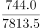，从“一带一路”沿线国家吸收外商直接投资资金526亿元，已知比例相同，则“一带一路”沿线国家在批发和零售业约投资了亿元，与B项最为接近。

故正确答案为B。

---

### 第 8 题　qid 2031174 · 增长

表中有几个行业在新设立企业数和直接投资金额同比增速上均快于全国总体水平？

- **A**. 4
- **B**. 3
- **C**. 2　✅
- **D**. 1

**答案**：C

**官方解析**

定位表格，新设立企业数和直接投资金额全国总体水平同比增速分别为、。表中有信息传输、计算机服务和软件业，批发和零售业两个行业同比增速均快于全国总体水平。

故正确答案为C。

---

### 第 9 题　qid 2031176 · 平均数

下列行业中，平均每家新设立企业获得的直接投资金额最接近总体平均水平的是：

- **A**. 房地产业
- **B**. 农、林、牧、渔业
- **C**. 租赁和商务服务业
- **D**. 居民服务和其他服务业　✅

**答案**：D

**官方解析**

根据“平均每家新设立企业获得的直接投资金额”，判定此题为现期平均数问题。定位表格，总体平均水平为，选项中各行业平均水平分别为、、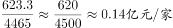、，则最接近的为居民服务和其他服务业。

故正确答案为D。

---

### 第 10 题　qid 2031178 · 综合

关于2014—2015年全国吸收外商直接投资状况，能够从上述资料中推出的是：

- **A**. 2015年全国吸收外商直接投资新设立企业比2014年多3000家
- **B**. 2014年“一带一路”沿线国家直接投资新设立企业2000多家
- **C**. 表中有3个行业直接投资金额占外商直接投资总额的一成以上
- **D**. 2014年信息传输、计算机服务和软件业外商直接投资新设立不到1000家企业　✅

**答案**：D

**官方解析**

Ａ项：定位材料第一段，全国吸收外商直接投资新设立企业26575家，同比增长，代入增长量计算公式：，错误；

Ｂ项：定位材料第一段，从“一带一路”沿线国家吸收外商直接投资新设立企业2164家，增长，根据第一题解析,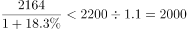家，已知增长量为330家,则2014年“一带一路”沿线国家直接投资新设立企业为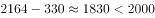，错误；

Ｃ项：定位表格，实际使用外资金额7813.5亿元，其一成即为781.35亿元，满足条件的有制造业、房地产业两个行业，错误；

D项：定位表格，信息传输、计算机服务和软件业新设立企业数为1311家，同比增速为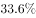,则2014年信息传输、计算机服务和软件业外商直接投资新企业为，正确。

故正确答案为D。

---

## 材料 3

        2015年上半年A区完成规模以上工业总产值289.9亿元，同比下降，降幅比1-5月扩大0.7个百分点，比1-4月扩大2.2个百分点，比一季度扩大7.5个百分点。

        其中，上半年A区两大主导行业汽车制造业完成产值51.6亿元，同比增长，医药制造业完成产值17亿元，同比增长。

        上半年A区六大高耗能行业七成企业生产产值低于上年同期，上半年共完成规模以上工业总产值55.6亿元，同比下降，降幅较上年同期扩大0.1个百分点。

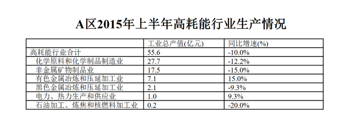

### 第 11 题　qid 2031180 · 综合

2014年上半年A区规模以上工业总产值约为多少亿元？

- **A**. 387
- **B**. 320　✅
- **C**. 265
- **D**. 214

**答案**：B

**官方解析**

根据问题所求“2014年上半年A区规模以上工业总产值为多少亿元”可判定此题为基期计算问题。定位文字材料第一段可得，2015年上半年A区完成规模以上工业总产值289.9亿元，同比下降，因此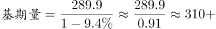，B项最接近。

故正确答案为B。

---

### 第 12 题　qid 2031202 · 增长

2015年1-4月A区完成规模以上工业总产值同比增速约为：

- **A**. 

- **B**. 

- **C**. 

　✅
- **D**. 
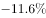

**答案**：C

**官方解析**

根据问题所求“2015年1-4月A区完成规模以上工业总产值同比增速”，可判定此题为增长率计算问题。定位文字材料第一段可得，上半年同比下降，降幅比1-4月扩大2.2个百分点，因此。

故正确答案为C。

---

### 第 13 题　qid 2031184 · 增长

2015年上半年，A区汽车制造业产值同比增量约是医药制造业的多少倍？

- **A**. 1.3　✅
- **B**. 6.5
- **C**. 3.0
- **D**. 0.4

**答案**：A

**官方解析**

根据问题所求“2015年上半年，A区汽车制造业产值同比增量约是医药制造业的多少倍”可判定此题为增长量倍数计算问题，定位文字材料第二段可得，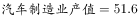亿元，，亿元，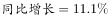，根据公式，，，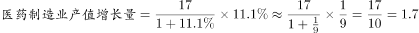。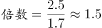，A项最接近。

故正确答案为A。

---

### 第 14 题　qid 2031186 · 增长

在A区六大高耗能行业中，2015年上半年产值同比降幅快于全区规模以上工业总产值的行业有几个？

- **A**. 2
- **B**. 3　✅
- **C**. 4
- **D**. 5

**答案**：B

**官方解析**

定位文字材料第一段可得，全区规模以上工业总产值同比下降。定位表格，同比降幅快于全区的六大高耗能行业有：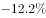、、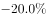，共3个。

故正确答案为B。

---

### 第 15 题　qid 2031188 · 综合

关于A区规模以上工业，下列说法中正确的是：

- **A**. 
2015年一季度总产值同比降速快于二季度总产值降速

- **B**. 
2015年上半年两大主导行业产值之和超过全区总产值的

- **C**. 
2014年上半年六大高耗能行业规模以上工业总产值超过50亿元
　✅
- **D**. 
2015年上半年黑色金属冶炼和压延加工业及电力、热力生产和供应业产值之和与上年同期相同

**答案**：C

**官方解析**

A项：定位文字材料第一段可得，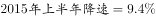，降幅比一季度扩大7.5个百分点，因此。根据混合增长率居中原则，二季度降速应大于，一季度降速较慢，错误；

B项：定位文字材料第二段可得，，，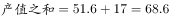，定位文字材料第一段可得，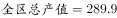，，小于，错误；

C项：定位文字材料第三段可得，，同比下降，因此2014年总产值，正确；

D项：定位表格可得，，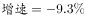，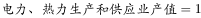，。因此，2014产值之和， 错误。

故正确答案为C。

---

## 材料 4

       某机构对2000名在线旅行预订用户进行了关于经常选择的交通方式的抽样调查，结果如下：

### 第 16 题　qid 2031192 · 综合

被调查者中，首选火车（包括高铁、动车和普通列车）出行的比首选飞机出行的多多少人？

- **A**. 不到300人
- **B**. 300～320人之间　✅
- **C**. 321～340人之间
- **D**. 多于340人

**答案**：B

**官方解析**

定位图1，最经常选择高铁、动车和普通列车的占比分别为，，，选择飞机的占比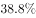。被调查者共2000名。则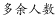。

故正确答案为B。

---

### 第 17 题　qid 2031194 · 比重

因主要出行方式中只有飞机拥有积分奖励活动，所以出行时将积分奖励活动作为考虑因素的人，均会将飞机作为最经常选择的交通方式。则在最经常选择飞机出行的用户中，出行时考虑到积分奖励活动因素的人占比约为：

- **A**. 

　✅
- **B**. 

- **C**. 

- **D**. 

**答案**：A

**官方解析**

根据“······的占比约为”判断本题为现期比重问题。定位图2，考虑积分奖励活动占被调查者人数的，且只有飞机拥有积分奖励活动。选择飞机的人数占被调查者的。。

故正确答案为A。

---

### 第 18 题　qid 2031196 · 综合

如果2000名被调查者均要求坐高铁或飞机从同一城市前往北京，那么从哪个城市出发时，优先选择飞机的人数在750人左右？

- **A**. 西安（高铁运行时间：4.5小时）　✅
- **B**. 太原（高铁运行时间：2.5小时）
- **C**. 广州（高铁运行时间：8小时）
- **D**. 贵阳（高铁运行时间：9小时）

**答案**：A

**官方解析**

根据“······优先选择飞机的人数在750人左右”，且材料中为比重，判断本题为现期比重问题。优先选择飞机的人数750人，且占全部被调查者的。所以优先选择高铁的占比是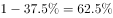。定位图3，5小时以内优先选择高铁的占比（）最接近。选项中西安最符合条件。

故正确答案为A。

---

### 第 19 题　qid 2031198 · 平均数

如调查中，所有考虑行程总耗时因素的人均最经常选择飞机或高铁出行，则在最经常选择飞机或高铁出行的人中，不考虑行程总耗时因素的人占比约为：

- **A**. 

- **B**. 

　✅
- **C**. 

- **D**. 

**答案**：B

**官方解析**

根据“······的占比约为”判断本题为现期比重问题。定位材料图1和图2，最经常选择高铁或飞机的占被调查者的比重为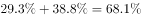。考虑行程总耗时因素的人占被调查者的，因为，所有考虑行程总耗时因素的人均最经常选择飞机或高铁出行。故考虑行程总耗时因素的人占最经常选择高铁或飞机的比重为，不考虑行程总耗时因素的人占比为。B项最接近。

故正确答案为B。

---

### 第 20 题　qid 2031200 · 综合

能够从上述资料中推出的是：

- **A**. 有不到100名调查者最经常选择汽车方式出行
- **B**. 被调查者中一定有人出行时同时考虑到总耗时和准点率因素
- **C**. 最经常选择地面交通方式出行的人中，超过六成出行时不考虑天气因素
- **D**. 绝大部分被调查者都不能接受将超过8小时的高铁行程作为首选　✅

**答案**：D

**官方解析**

A项：定位图1，最经常选择汽车的占比为。，超过100名，错误；

B项：定位图2，考虑总耗时的占比为，考虑准点率的占比为。，有可能考虑总耗时的都不考虑准点率，错误；

C项：定位图1，在选择地面交通的人中，缺少考虑天气因素的具体人数，错误；

D项：定位图3，8小时以上的行程中，将高铁作为首选的仅占，所以绝大部分被调查者都不能接受将超过8小时的高铁行程作为首选，正确。

故正确答案为D。

---
