# 2017年四川省公务员录用考试《行测》题（下半年）

> 资料分析 · 15 题 · 四川 2017

## 材料 1

        2015年，全国规模以上纺织企业工业增加值同比增长，高于规模以上工业整体水平0.2个百分点，增速比上年同期回落0.7个百分点。其中，纺织业、服装服饰行业、化学纤维行业增加值同比分别增长、和。

        2015年，纺织行业规模以上企业累计实现主营业务收入70713亿元，同比增长；实现利润总额3860亿元，同比增长；企业亏损面(亏损企业占所有企业比重)，比上年低0.1个百分点。

        2015年，我国出口纺织品、服装2912亿美元，同比下降，按出口商品类型看，纺织品出口1153亿美元，同比下降；服装出口1759亿美元，同比下降。按出口对象看，对美国出口额同比增长，对欧盟出口额同比下降，对日本出口额同比下降，对东盟出口额同比下降。

        2015年，我国纺织行业500万元以上项目固定资产投资完成额11913亿元，同比增长。其中东部地区固定资产投资完成额同比增长，中部地区固定资产投资完成额同比增长，西部地区固定资产投资完成额同比增长。行业新开工项目数呈现增速提升势头，新开工项目16149项，同比增长。

### 第 1 题　qid 2097096 · 增长

2015年，化学纤维行业增加值同比增速比规模以上工业增加值同比增速：

- **A**. 高4.7个百分点
- **B**. 高4.9个百分点
- **C**. 高5.1个百分点　✅
- **D**. 低1.9个百分点

**答案**：C

**官方解析**

由题目材料第一段“2015年，全国规模以上纺织企业工业增加值同比增长，高于规模以上工业整体水平0.2个百分点”“其中······化学纤维行业增加值同比增长”。可得规模以上工业增加值同比增速为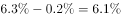；“化学纤维行业增加值同比增速”与“规模以上工业增加值同比增速”相比较：，即高5.1个百分点。

故正确答案为C。

---

### 第 2 题　qid 2097098 · 增长

2015年，纺织行业规模以上企业主营业务利润率（利润总额/主营业务收入）比上年约：

- **A**. 上升0.02个百分点　✅
- **B**. 上升0.4个百分点
- **C**. 下降0.02个百分点
- **D**. 下降0.4个百分点

**答案**：A

**官方解析**

由问题“2015年主营业务利润率（利润总额/主营业务收入）比上年约上升/下降几个百分点”，判断本题为两期比重的比较问题。定位材料第二段：“2015年，纺织行业规模以上企业累计实现主营业务收入亿元，同比增长，实现利润总额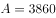亿元，同比增长”。因，比值同比上升，排除C、D两项。根据两期比重公式，则，由于，故所求，A项满足。

故正确答案为A。

---

### 第 3 题　qid 2097102 · 比重

在美国、欧盟、日本和东盟四大主要贸易伙伴中，2015年我国纺织品、服装对其出口额占当年我国纺织品、服装出口总额比重低于2014年水平的有：

- **A**. 仅东盟
- **B**. 美国和东盟
- **C**. 欧盟和日本　✅
- **D**. 欧盟、日本和东盟

**答案**：C

**官方解析**

由问题“2015年······的比重低于2014年”可得本题为两期比重比较问题，仅需比较部分增长率a与整体增长率b的大小关系，只需查找出的，即为比重低于上年同期水平的国家。定位材料第三段可知“2015年我国出口纺织品、服装”为整体，其增速；各部分包括：“对美国出口额”其增速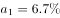；“对欧盟出口额”其增速；“对日本出口额”其增速；“对东盟出口额”其增速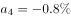。可见增速小于整体的，只有欧盟和日本。

故正确答案为C。

---

### 第 4 题　qid 2097108 · 综合

2014年，我国服装出口额在以下哪个范围之内？

- **A**. 低于1800亿美元
- **B**. 1800～1900亿美元之间　✅
- **C**. 1900～2000亿美元之间
- **D**. 高于2000亿美元

**答案**：B

**官方解析**

由问题“2014年，我国服装出口额的范围”，结合材料数据为2015年，可判定本题为基期计算问题。定位材料第三段“2015年，我国服装出口1759亿美元，同比下降 ”，代入公式：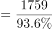亿美元。

故正确答案为B。

---

### 第 5 题　qid 2097116 · 综合

能够从上述资料中推出的是：

- **A**. 
2014年全国规模以上纺织企业工业增加值同比增长

- **B**. 
2015年全国扭亏为盈的纺织行业规模以上企业少于盈转亏的企业数量

- **C**. 
2014年全国纺织行业500万元以上项目固定资产投资完成额超过1万亿元
　✅
- **D**. 
2015年纺织行业中西部地区固定资产投资完成额同比增量高于东部地区

**答案**：C

**官方解析**

A项：根据材料第一段“2015年，全国规模以上纺织企业工业增加值同比增长，增速比上年同期回落0.7个百分点”，可得2014年，全国规模以上纺织企业工业增加值同比增长，错误；

B项：由于文中只给出了“企业亏损面，比上年低0.1个百分点”，并未给出2015年和2014年的企业总个数，因此无法推断亏损的企业个数增加还是减少，所以无法推断出扭亏为盈和盈转亏的企业个数之间是否存在少于关系，错误；

C项：根据材料第四段“2015年，我国纺织行业500万元以上项目固定资产投资完成额11913亿元，同比增长”，可得，正确；

D项：由于文中只给出东、中、西部地区固定资产完成额的增长率，未给出三者的现期值，故无法判断增长量的大小，错误。

故正确答案为C。

---

## 材料 2

        2014年末，某省公路里程172167公里，同比增长，其中，高速公路4237公里，同比增长。国家铁路正线延展里程和营业里程分别为15060公里和9351公里，分别同比增长和。地方铁路正线延展里程和营业里程分别为1805公里和1072公里，分别同比增长和。

### 第 6 题　qid 2097272 · 综合

2013年末，该省公路里程约为多少万公里？

- **A**. 15.3
- **B**. 16.7　✅
- **C**. 17.9
- **D**. 19.4

**答案**：B

**官方解析**

由题意知，问题是“2013年该省公路里程约为多少万公里”且材料是2014年，判定此题是基期量问题。定位材料第一段“2014年末，某省公路里程为172167公里，同比增长”，可知2013年该省公路里程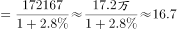万，B项当选。

故正确答案为B。

---

### 第 7 题　qid 2097274 · 综合

2013年末，该省国家铁路正线延展里程比地方铁路正线延展里程多约多少公里？

- **A**. 13377　✅
- **B**. 14902
- **C**. 15280
- **D**. 16579

**答案**：A

**官方解析**

问题是“2013年该省国家铁路延展里程比地方铁路延展里程多的多少”且材料是2014年，判定此题为基期和差问题。定位文字材料第一段“2014年末，国家铁路延展里程为15060公里，同比增长；地方铁路延展里程为1805，同比增长”，可知2013年该省国家铁路延展里程，2013年该省地方铁路延展里程，则2013年该省国家铁路正线延展里程比地方铁路正线延展里程多 公里，与A项最接近。

故正确答案为A。

---

### 第 8 题　qid 2097276 · 增长

该省的下列各项指标中，2014年同比增速最快的是：

- **A**. 铁路货运量
- **B**. 民航货运量
- **C**. 铁路旅客周转量　✅
- **D**. 公路货物周转量

**答案**：C

**官方解析**

定位表格材料可知铁路货运量增长率为，民航货运量增长率为，铁路旅客周转量增长率为，公路货物周转量增长率为，增长最快的是铁路旅客周转量。

故正确答案为C。

---

### 第 9 题　qid 2097278 · 平均数

2014年铁路旅客平均每人次周转距离比2013年多约多少公里？

- **A**. 15
- **B**. 25　✅
- **C**. 34
- **D**. 44

**答案**：B

**官方解析**

由题意“2014年铁路旅客平均每人周转距离比2013年约多”判定此题为平均数的增长量问题。定位表格材料：2014年铁路旅客周转量为201.9亿人公里，增长为，旅客人数为4796.5万人，增长率为8.2%，根据平均数的增长量公式：，B项当选。

故正确答案为B。

---

### 第 10 题　qid 2097282 · 综合

关于2014年该省交通运输状况，下列说法正确的是：

- **A**. 
高速公路里程占全省公路总里程比重超过

- **B**. 
三种运输方式的客运量和货运量均高于上年

- **C**. 
公路货运量占货运总量的7成多

- **D**. 
货运总量比上年增长超过3万亿吨
　✅

**答案**：D

**官方解析**

A项：根据第一段“2014年末，某省公路里程172167公里，其中，高速公路4237公里”，可得2014年末，高速公路里程占全省公路里程的比重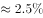，小于，错误；

B项：由表格可知公路客运量2014年的增长率为，即比去年下降，选项说三种运输方式的客运量和货运量均高于上年，错误；

C项：根据表格可知，公路货运量为127000亿吨，货运总量为204000亿吨，故公路货运量占货运总量的比重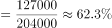，不足7成，错误；

D项：根据表格可知，2014年货运总量是204000亿吨，同比增长。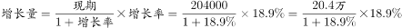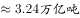，超过3万亿吨，正确。

故正确答案为D。

---

## 材料 3

        2015年2季度，J省消费者信心指数（CCI）为101.1，环比、同比分别下降4.6个、10.7个百分点。分城乡看，城镇和农村消费者信心指数分别为101.6和100.1，环比分别下降5.2、3.8个百分点。

        从体现消费者对当前形势的满意程度看，2015年2季度，J省消费者满意指数（ICC）为96.9，从满意指数的构成看，消费者对当前就业满意指数为101.2，其中城乡指数分别为99.3、104.2，环比分别下降6.1个、3.3个百分点；对当前家庭收入的满意程度看，满意指数为99.5，其中城乡家庭收入满意指数分别为100.4、98.1，环比分别下降9.6个、3.1个百分点。

        从反映消费者对未来乐观程度的预期指数看，2015年2季度，J省消费者预期指数（ICS）为103.8，在持续两个季度小幅回升后，本季度有所回落，环比、同比分别下降4.1个、12.0个百分点。

        2015年2季度，Z省城乡消费者信心指数均呈下行态势，其中，城镇消费者信心指数为111.1，较一季度下降1.4个百分点；农村消费者信心指数为108.7，较一季度下降3.4个百分点。

### 第 11 题　qid 2097262 · 综合

2015年1季度，J省消费者满意指数构成中，数值最低的是：

- **A**. 城镇就业满意指数
- **B**. 农村就业满意指数
- **C**. 城镇家庭收入满意指数
- **D**. 农村家庭收入满意指数　✅

**答案**：D

**官方解析**

定位文字材料第二段可得，2015年2季度······消费者对当前就业满意指数为101.2，其中城乡指数分别为99.3、104.2，环比分别下降6.1个、3.3个百分点······城乡家庭收入满意指数分别为100.4、98.1，环比分别下降9.6个、3.1个点。则2015年1季度，，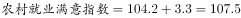，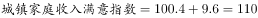，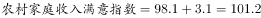，数值最低的是农村家庭收入满意指数。

故正确答案为D。

---

### 第 12 题　qid 2097264 · 综合

Z省2015年1季度农村消费者信心指数值是：

- **A**. 108.7
- **B**. 112.1　✅
- **C**. 112.5
- **D**. 103.9

**答案**：B

**官方解析**

定位文字材料第四段，“2015年2季度，Z省······农村消费者信心指数为108.7，较一季度下降3.4个百分点。”则Z省2015年1季度农村消费者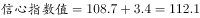。

故正确答案为B。

---

### 第 13 题　qid 2097266 · 综合

设Z省2015年1、2季度消费者信心指数值为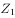、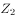，J省同期同一指标为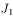、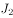，则：

- **A**. 

- **B**. 

　✅
- **C**. 
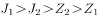

- **D**. 

**答案**：B

**官方解析**

由文字材料第一段可得，2015年2季度，J省消费者信心指数为101.1，环比下降4.6个百分点，则1季度J省消费者信心指数为101.1+4.6=105.7。由折线图可得，2015年1、2季度Z省消费者信心指数值分别、为112.4、110.2。故四项排序由大到小应分别为。

故正确答案为B。

---

### 第 14 题　qid 2097268 · 增长

Z省消费者满意指数下降最快的时间段是：

- **A**. 2014年2季度
- **B**. 2014年3季度
- **C**. 2015年1季度　✅
- **D**. 2015年2季度

**答案**：C

**官方解析**

由题干“消费者满意指数下降最快”可知，题目所求为指数下降最大的。定位材料折线图部分可得，选项各时间段的消费者满意指数的变化量分别为：

A项：2014年2季度，；

B项：2014年3季度，消费者满意指数上升，排除；

C项：2015年1季度，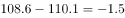；

D项：2015年2季度，。

下降最快的为2015年1季度。

故正确答案为C。

注释：中国消费者信心指数由消费者满意指数和消费者预期指数加权平均取得。满意指数是指消费者对当前就业形势、当前家庭收入情况和购买时机的判断，预期指数是指消费者对未来6个月就业形势和家庭收入情况的预期。上述指数的取值均在“0~200”之间。“100”为“乐观”和“悲观”的临界值。当信心指数大于100，表明消费者趋于乐观；小于100，表明消费者趋于悲观。

---

### 第 15 题　qid 2097270 · 综合

能够从上述资料中推出的是：

- **A**. 2015年2季度，J省、Z省城镇消费者信心指数环比下降的数值均大于农村消费者信心指数
- **B**. 2014年3季度至2015年2季度，J省、Z省消费者信心指数变化趋势相同
- **C**. 2015年2季度，J省、Z省消费者预期指数值相差10个百分点以上
- **D**. 2014年3季度至2015年2季度，Z省消费者信心指数最高的季度也是该指数环比增速最快的季度　✅

**答案**：D

**官方解析**

A项：定位文字材料第四段，“2015年2季度，Z省……城镇消费者信心指数为111.1，较一季度下降1.4个百分点；农村消费者信心指数为108.7，较一季度下降3.4个百分点”，城镇消费者信心指数环比下降数值小于农村，错误；

B项：材料仅提供了2015年1季度与2季度J省消费者信心指数值，2014年3季度与4季度未知，故选项说法无法得出，错误；

C项：定位文字材料第三段可得，2015年2季度，J省消费者预期指数（ICS）为103.8，定位统计图可得，2015年2季度，Z省消费者预期指数为111.8，二者相差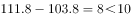个百分点，错误；

D项：定位统计图，比较2014年3季度至2015年2季度各季度Z省消费者信心指数的环比增速，2015年1、2季度环比降低，增速为负值，2014年3季度环比增速为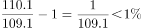，2014年4季度环比增速为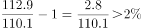，则2014年4季度环比增速最大，Z省消费者信心指数最高的季度是2014年4季度，与指数环比增速最快的是同一季度，正确。

故正确答案为D。

注释：中国消费者信心指数由消费者满意指数和消费者预期指数加权平均取得。满意指数是指消费者对当前就业形势、当前家庭收入情况和购买时机的判断，预期指数是指消费者对未来6个月就业形势和家庭收入情况的预期。上述指数的取值均在“0~200”之间。“100”为“乐观”和“悲观”的临界值。当信心指数大于100，表明消费者趋于乐观；小于100，表明消费者趋于悲观。

---
