# 2017年四川省公务员考试《行测》题（定向乡镇）

> 资料分析 · 17 题 · 四川 2017

## 材料 1

        截至2015年12月，我国网民规模达6.88亿，全年共计新增网民3951万人。互联网普及率为50.3%，较2014年底提升了2.4个百分点。

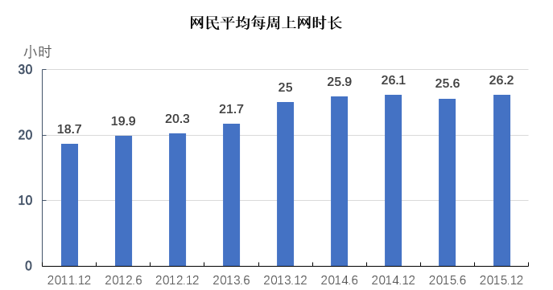

### 第 1 题　qid 4769883 · 综合

2015年底，我国非网民规模约为（    ）亿。

- **A**. 6.2
- **B**. 6.4
- **C**. 6.6
- **D**. 6.8　✅

**答案**：D

**官方解析**

根据题干“2015年底，我国非网民规模约为（    ）亿”，结合材料中给出了2015年底网民规模及互联网普及率，且互联网普及率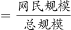，可判定本题为现期比重计算问题。定位文字材料可知：截至2015年12月，我国网民规模达6.88亿，互联网普及率为50.3%。则总规模亿，故2015年底，我国非网民规模约为13.76-6.88=6.88亿，与D项最接近。

故正确答案为D。

---

### 第 2 题　qid 4769887 · 平均数

与2011年底相比，2015年底网民平均每周上网时长增加了（    ）小时。

- **A**. 4.5
- **B**. 5.5
- **C**. 6.5
- **D**. 7.5　✅

**答案**：D

**官方解析**

定位统计图可知：2011年底（2011年12月）网民平均每周上网时长为18.7小时，2015年底（2015年12月）为26.2小时。故与2011年底相比，2015年底网民平均每周上网时长增加了26.2-18.7=7.5小时。
故正确答案为D。

---

### 第 3 题　qid 4769893 · 平均数

与半年前相比，网民平均每周上网时长增长速度最快的时间是：

- **A**. 2012年底
- **B**. 2013年底　✅
- **C**. 2014年底
- **D**. 2015年底

**答案**：B

**官方解析**

根据题干“与半年前相比······增长速度最快的时间是”，可判定本题为一般增长率比较问题。定位柱状图可得2012-2015年6月及12月网民平均每周上网时长。根据公式：增长率，则与半年前相比，各年底网民平均每周上网时长的增长速度为：2012年底，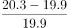；2013年底，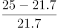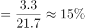；2014年底，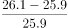；2015年底，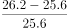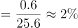。则与半年前相比，网民平均每周上网时长增长速度最快的时间是2013年底。

故正确答案为B。

---

### 第 4 题　qid 4769896 · 增长

按照2012年底的同比增速测算，2010年底的网民平均每周上网时长可能为：

- **A**. 15小时
- **B**. 17小时　✅
- **C**. 19小时
- **D**. 21小时

**答案**：B

**官方解析**

根据题干“······2010年底的网民平均每周上网时长可能为”，结合材料时间为2011~2015年，可判定本题为基期计算问题。定位柱状图可得：2011年12月、2012年12月网民平均每周上网时长分别为18.7小时、20.3小时。根据公式：增长率，则2012年底的同比增速为；根据公式：基期量，则2010年底的网民平均每周上网时长可能为小时。

故正确答案为B。

---

### 第 5 题　qid 4769901 · 综合

不能从上述资料中推出的是：

- **A**. 2014年底，我国互联网普及率低于50%
- **B**. 2014年起，网民平均每周上网时长达到了25小时以上
- **C**. 2015年新增网民平均每周上网时长超过了20小时　✅
- **D**. 2015年底网民平均每周上网时长比上年同期增加了6分钟

**答案**：C

**官方解析**

A项：定位文字材料可得：（截至2015年12月）互联网普及率为50.3%，较2014年底提升了2.4个百分点。则2014年底互联网普及率为50.3%-2.4%=47.9%，低于50%，正确；
B项：观察柱状图发现，2014年之前网民平均每周上网时长均未超过25小时，2014年起网民平均每周上网时长均大于25小时，即达到了25小时以上，正确；
C项：材料未给出2015年新增网民的每周上网时长情况，无法推出，错误；
D项：定位柱状图可得，2014年12月与2015年12月网民平均每周上网时长分别为26.1小时、26.2小时，即2015年底比上年同期增加了26.2－26.1＝0.1小时＝6分钟，正确。
本题为选非题，故正确答案为C。

---

## 材料 2

        2010年人口普查，某省外出人口达2091.4万人，占全省人口总数约26%，其中，外出省内1040.8万人，外出省外1050.6万人，分别占外出人口总数的49.8%和50.2%。在省内外来人口中，有82.8%的人口由乡村到城镇，其中，由乡村进入大中城市、小城镇的人口分别占省内外来人口的48.8%、34%。在外出省外人口中，92.89%的人口来源于乡村、7.11%的人口来源于城镇。

        近年来，由于东部地区劳动力、土地等基本生产要素成本上升等因素影响。该省劳务输出出现人口回流。2013年省外务工人员回流166.4万人，实现就业133.38万人，其中，第二产业46.40万人，第三产业49.44万人。2014年省外务工人员回流152.47万人，实现就业123.39万人，其中，第二产业46.45万人，第三产业48.47万人。2015年截至第三季度，省外务工人员回流135.95万人，实现就业121.27万人，其中，第二产业41.47万人，第三产业48.53万人。

### 第 6 题　qid 4769985 · 综合

2010年，该省外出到江、浙、沪三省市中的人口总数约为（    ）万人。

- **A**. 158
- **B**. 235　✅
- **C**. 314
- **D**. 467

**答案**：B

**官方解析**

根据题干“2010年，该省外出到······的人口总数约为”，结合材料给出该省外出省外的人口数与比重的相关数据，可判定本题为现期比重问题。定位文字材料第一段可知，2010年，该省外出省外1050.6万人；定位饼状图可知，2010年，该省外出到江苏（江）、浙江（浙）、上海（沪）三省市的人口占比分别为4.96%、12.66%、4.71%。根据公式：部分量=总体量×比重，则该省外出到江、浙、沪三省市中的人口总数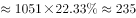万人。

故正确答案为B。

---

### 第 7 题　qid 4769988 · 比重

2010年，该省由乡村进入省内大中城市的人口占全省人口的比重约为：

- **A**. 6%　✅
- **B**. 13%
- **C**. 19%
- **D**. 24%

**答案**：A

**官方解析**

根据题干“2010年······占······的比重约为”，可判定本题为现期比重问题。定位文字材料第一段可知，2010年，某省外出人口达2091.4万人，占全省人口总数约26%，其中，外出省内1040.8万人······由乡村进入大中城市的人口占省内外来人口的48.8%。则全省人口为万人，由乡村进入省内大中城市的人口为1040.8×48.8%万人。根据公式：比重，则所求比重为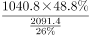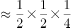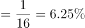，与A项最接近。

故正确答案为A。

---

### 第 8 题　qid 4769991 · 综合

2010年该省外出到本省人数约是外出到北京市人数的（    ）倍。

- **A**. 低于10倍
- **B**. 在10—20倍之间
- **C**. 在20—30倍之间　✅
- **D**. 高于30倍

**答案**：C

**官方解析**

根据题干“2010年······是······倍”，可判定本题为现期倍数问题。定位文字材料第一段可知，2010年，某省外出省内1040.8万人，外出省外1050.6万人；定位饼状图可知，该省外出到北京市的人口占比为3.45%。则该省外出到北京市的人口为1050.6×3.45%万人，所求倍数为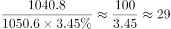，在20—30倍之间。

故正确答案为C。

---

### 第 9 题　qid 4769998 · 比重

2015年截至第三季度，该省回流的省外务工人员中，在二、三产业实现就业的人数占总体比重约为：

- **A**. 五成多
- **B**. 六成多　✅
- **C**. 七成多
- **D**. 八成多

**答案**：B

**官方解析**

根据题干“2015年截至第三季度······占总体比重约为”，可判定本题为现期比重计算问题。定位文字材料第二段可得：2015年截至第三季度，省外务工人员回流135.95万人，实现就业121.27万人，其中，第二产业41.47万人，第三产业48.53万人。根据比重，所求比重为，在B项范围之内。

故正确答案为B。

---

### 第 10 题　qid 4770001 · 综合

能够从上述材料中推出的是：

- **A**. 2010年该省外出到福建的人口数是外出到贵州的人口数的三倍多
- **B**. 2010年该省有100多万人口从城镇外出到其他省份
- **C**. 2010年该省由乡村进入本省小城镇的人口多于全省外出进入广东省的人口
- **D**. 2014年回流的省外务工人员中，进入第三产业就业的比重高于上年　✅

**答案**：D

**官方解析**

A项：定位饼状图可得：2010年该省外出到福建的人口数占全部外出人口的6.15%，外出到贵州的人口数占2.39%。根据比重，整体量相同，可用比重代替部分量进行倍数计算。，即2010年该省外出到福建的人口数不到外出到贵州的人口数的三倍，错误；

B项：定位文字材料第一段可得：2010年人口普查，某省······外出省外1050.6万人······在外出省外人口中，92.89%的人口来源于乡村、7.11%的人口来源于城镇。1050.6×7.11%＜100万人，即2010年该省从城镇外出到其他省份的人口数不到100万人，错误；

C项：定位文字材料第一段可得：2010年人口普查，某省······外出省内1040.8万人，外出省外1050.6万人······其中，由乡村进入大中城市、小城镇的人口分别占省内外来人口的48.8%、34%；定位饼状图可得：2010年该省外出到广东的人口数占全部外出人口的36.88%。根据部分=整体×比重，则2010年该省由乡村进入本省小城镇的人口为（1040.8×34%）万人，外出进入广东省的人口为（1050.6×36.88%）万人，1040.8＜1050.6，34%＜36.88%，则（1040.8×34%）＜（1050.6×36.88%），错误；

D项：定位文字材料第二段可得：2013年省外务工人员回流166.4万人，实现就业133.38万人，其中，第二产业46.40万人，第三产业49.44万人。2014年省外务工人员回流152.47万人，实现就业123.39万人，其中，第二产业46.45万人，第三产业48.47万人。根据比重，2013年回流的省外务工人员中，进入第三产业就业的比重为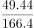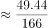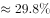，2014年比重为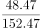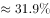，2014年回流的省外务工人员中，进入第三产业就业的比重高于上年，正确。

故正确答案为D。

---

## 材料 3

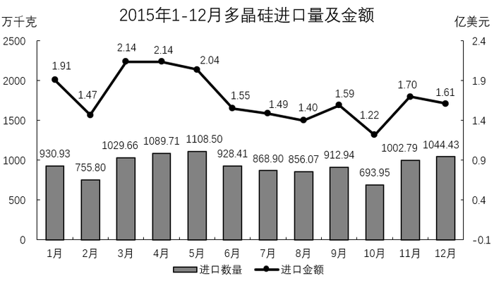

### 第 11 题　qid 4769995 · 综合

2015年上半年多晶硅进口总金额最接近的数字是：

- **A**. 9亿美元
- **B**. 10亿美元
- **C**. 11亿美元　✅
- **D**. 12亿美元

**答案**：C

**官方解析**

定位折线图可得：2015年1-6月多晶硅进口金额分别为1.91、1.47、2.14、2.14、2.04、1.55亿美元，则2015年上半年多晶硅进口总金额为1.91+1.47+2.14+2.14+2.04+1.55=11.25亿美元，与C项最接近。
故正确答案为C。

---

### 第 12 题　qid 4770006 · 综合

2015年下半年，多晶硅进口量和金额均高于上月的月份有（    ）个。

- **A**. 1
- **B**. 2　✅
- **C**. 3
- **D**. 4

**答案**：B

**官方解析**

定位统计图可知2015年6-12月多晶硅进口量及金额。则2015年下半年多晶硅进口量高于上月的有9月、11月、12月；多晶硅进口金额高于上月的有9月、11月。故满足的条件的有9月、11月，共2个。
故正确答案为B。

---

### 第 13 题　qid 4770009 · 平均数

与上月相比，2015年5月的多晶硅平均进口价格约：

- **A**. 下降了6%　✅
- **B**. 下降了24%
- **C**. 上升了2%
- **D**. 上升了12%

**答案**：A

**官方解析**

根据题干“与上月相比······平均进口价格约”，结合选项为上升/下降+百分数，可判定本题为平均数的增长率问题。定位统计图可得：2015年4月多晶硅进口量及金额分别为1089.71万千克、2.14亿美元；2015年5月多晶硅进口量及金额分别为1108.50万千克、2.04亿美元。根据平均进口价格，则2015年4月、5月多晶硅平均进口价格分别为：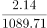万美元/千克、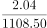万美元/千克。根据公式：增长率，则所求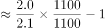，即约下降了5%，与A项最接近。

故正确答案为A。

---

### 第 14 题　qid 4770014 · 综合

2015年二、三、四季度多晶硅进口量按从高到低排列正确的是：

- **A**. 第四季度 第三季度 第二季度
- **B**. 第二季度 第三季度 第四季度
- **C**. 第二季度 第四季度 第三季度　✅
- **D**. 第四季度 第二季度 第三季度

**答案**：C

**官方解析**

定位统计图可得2015年4-12月多晶硅进口量。则2015年第二季度多晶硅进口量万千克；第三季度多晶硅进口量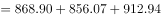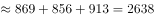万千克；第四季度多晶硅进口量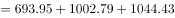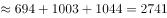万千克，则进口量从高到低的排序是第二季度、第四季度、第三季度。

故正确答案为C。

备注：通过柱状图可明显看出第二季度的三个月数量均大于第三季度、第四季度三个月的数量，可排除A、D两项，故比较第三季度和第四季度即可。

---

### 第 15 题　qid 4770017 · 综合

能够从上述资料中推出的是：

- **A**. 2015年1月多晶硅进口价格约为200美元/千克
- **B**. 2015年多晶硅进口金额超过25亿美元
- **C**. 2015年多晶硅进口量曾连续3个月环比下降　✅
- **D**. 2015年有一半的月份多晶硅进口量高于1万吨

**答案**：C

**官方解析**

A项：定位统计图可知，2015年1月多晶硅进口金额为1.91亿美元，进口数量为930.93万千克。根据公式：，则2015年1月多晶硅进口价格为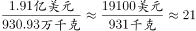美元/千克，错误；

B项：定位统计图可知，2015年1-12月多晶硅进口金额。则2015年多晶硅进口金额为1.91+1.47+2.14+2.14+2.04+1.55+1.49+1.40+1.59+1.22+1.70+1.611.9+1.5+2.1+2.1+2.0+1.6+1.5+1.4+1.6+1.2+1.7+1.6=20.2亿美元，未超过25亿美元，错误；

C项：定位统计图可知，2015年1-12月多晶硅进口数量。则2015年1-12月多晶硅进口数量大小关系为930.93＞755.80＜1029.66＜1089.71＜1108.50＞928.41＞868.90＞856.07＜912.94＞693.95＜1002.79＜1044.43，观察发现，6月、7月、8月多晶硅进口数量连续环比下降，正确；

D项：定位统计图可知，2015年1-12月多晶硅进口数量。根据1吨=1000千克，若满足单月多晶硅进口量高于1万吨，则统计图中单月多晶硅进口数量＞1000万千克即可。查找可知3月（1029.66万千克）、4月（1089.71万千克）、5月（1108.50万千克）、11月（1002.79万千克）、12月（1044.43万千克）满足条件，共5个月，，错误。

故正确答案为C。

---

### 第 16 题　qid 4769878 · 增长

某福利机构统计购买助听器的专项捐款数额。已知每2000元可以购买1个助听器用于捐赠给听力受损儿童，统计显示2016年所得捐款共计27万元，2017年的金额比上年增长了20%，如果每年以同样的速度增加，那么直到哪一年，该福利机构累计捐赠的助听器数量将达到500个以上？

- **A**. 2017年
- **B**. 2018年
- **C**. 2019年　✅
- **D**. 2020年

**答案**：C

**官方解析**

金额=单价×数量，累计捐赠的助听器数量达到500个以上，即累计捐款金额达到2000元×500=1000000元=100万元以上。根据题意可知：2016年捐款共计27万元；此后每年捐款金额均保持20%的同比增速，则2017年累计捐款金额=27+27×（1+20%）=27+32.4=59.4万元；2018年累计捐款金额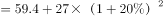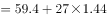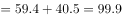万元；2019年累计捐款金额万元，即累计捐赠的助听器数量达到500个以上。因此，直到2019年，该福利机构累计捐赠的助听器数量将达到500个以上。

故正确答案为C。

---

### 第 17 题　qid 4769864 · 综合

一艘货船装载500集装箱A货物时，排水量是空载时的1.4倍，其装载400集装箱A货物和500集装箱B货物时，排水量为空载时的1.77倍，已知A货物和B货物各1集装箱共重68吨，问货船空载时的排水量为多少万吨？

- **A**. 3.0
- **B**. 3.5
- **C**. 4.0　✅
- **D**. 4.5

**答案**：C

**官方解析**

设货船空载时的排水量为1000x吨，1箱A、B货物的重量分别为a吨、b吨。根据题意可得：1000x+500a=1400x······①，1000x+400a+500b=1770x······②，a+b=68······③，联立①②两式解得：a=0.8x，b=0.9x，代入③式可得：a+b=0.8x+0.9x=68，解得x=40，故货船空载时的排水量为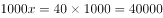吨=4万吨。

故正确答案为C。

---
