# 2017年国家公务员录用考试《行测》题（地市级）

> 资料分析 · 20 题 · 国考 2017

## 材料 1

        某市2015年全年粮食总产量4.16万吨，同比下降；甘蔗产量0.57万吨，下降；油料产量0.12万吨，增长；蔬菜产量15.79万吨，下降；水果产量7.84万吨，增长。

        全年水产品产量29.16万吨，同比增长。其中海洋捕捞1.09万吨，与上年持平；海水养殖6.07万吨，增长；淡水捕捞0.18万吨，增长；淡水养殖21.81万吨，下降。

                    

### 第 1 题　qid 2028332 · 综合

2014年该市蔬菜产量比水果产量约高多少万吨？

- **A**. 9　✅
- **B**. 8
- **C**. 7
- **D**. 6

**答案**：A

**官方解析**

根据题干中所给时间为“2014年”而材料为2015年，可判定本题为基期量问题。定位文字材料第一段，蔬菜产量为15.79万吨、增速为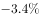和2015年水果产量7.84万吨、增速为。代入公式：基期，则2014年蔬菜产量为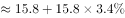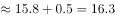万吨，2014年水果产量为万吨，则2014年蔬菜产量比水果产量高万吨。

故正确答案为A。

---

### 第 2 题　qid 2028340 · 综合

“十二五”期间，该市粮食总产量在以下哪个范围？

- **A**. 23-24万吨之间
- **B**. 22-23万吨之间
- **C**. 21-22万吨之间　✅
- **D**. 20-21万吨之间

**答案**：C

**官方解析**

定位图形材料可知“十二五”期间对应2011-2015年的该市粮食总产量分别为4.34、4.43、4.14、4.21、4.16万吨，相加为万吨，即21—22万吨之间。

故正确答案为C。

---

### 第 3 题　qid 2028346 · 综合

按照2015年水产品产量从多到少，以下排序正确的是：

- **A**. 海洋捕捞、海水养殖、淡水捕捞、淡水养殖
- **B**. 淡水养殖、海水养殖、海洋捕捞、淡水捕捞　✅
- **C**. 淡水捕捞、淡水养殖、海洋捕捞、海水养殖
- **D**. 淡水养殖、海洋捕捞、海水养殖、淡水捕捞

**答案**：B

**官方解析**

根据题干中的“2015年水产品产量从多到少以下排序正确的是”，可确定本题为排序类问题。定位文字材料第二段，海洋捕捞1.09万吨、海水养殖6.07万吨、淡水捕捞0.18万吨、淡水养殖21.81万吨，从多到少排序为淡水养殖、海水养殖、海洋捕捞、淡水捕捞。
故正确答案为B。

---

### 第 4 题　qid 2028362 · 增长

以下哪张折线图能准确反映2011-2015年间，该市粮食生产同比增量的变化趋势？

- **A**. A　✅
- **B**. B
- **C**. C
- **D**. D

**答案**：A

**官方解析**

根据题干中的“2011-2015年间该市粮食生产同比增量的变化趋势”，可确定此题为增长量比较问题。定位柱状图，2011-2015年的增量分别为万吨、万吨、万吨、万吨、万吨，根据计算结果可判定A项趋势图符合。

故正确答案为A。

---

### 第 5 题　qid 2028370 · 综合

能够从上述资料中推出的是：

- **A**. 2014年油料产量超过1000吨
- **B**. 除淡水养殖之外，其余类型的水产品2015年产量占水产品总产量的比重均高于上年
- **C**. 2014-2015年甘蔗累计产量不到1万吨
- **D**. 2010-2015年，粮食产量同比上升的年份多于同比下降的年份　✅

**答案**：D

**官方解析**

A项：根据文字材料第一段，2015年油料产量为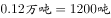，增速为，代入公式：，则2014年油料产量为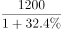，首位商不了1，错误；

B项：根据文字材料第二段，2015年水产品增速为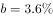，海洋捕捞与上年持平，增速，，比重下降。则除淡水养殖，海洋捕捞也下降，错误。

C项：根据文字材料第一段，2015年甘蔗产量为0.57万吨，下降，则2014、2015年甘蔗累计产量为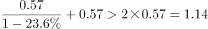万吨，错误；

D项：根据图表可知，2010-2015年中，粮食产量同比上升的有2010、2011、2012和2014年共4个，下降的有2013和2015年共2个，满足上升年份数大于下降年份数，正确。

故正确答案为D。

---

## 材料 2

        截至2014年末，我国共有博物馆3658个，占文物机构总数的。全国文物机构拥有文物藏品4063.58万件，比上年末增加222.77万件。其中，博物馆文物藏品2929.97万件，文物商店文物藏品770.00万件。文物藏品中，一级文物9.82万件，二级文物68.82万件，三级文物340.51万件。

        2014年全国文物机构共安排基本陈列9996个，比上年增长；举办临时展览11174个，增长；接待观众84256万人次，增长，其中博物馆接待观众71774万人次，占文物机构接待观众总人次的。

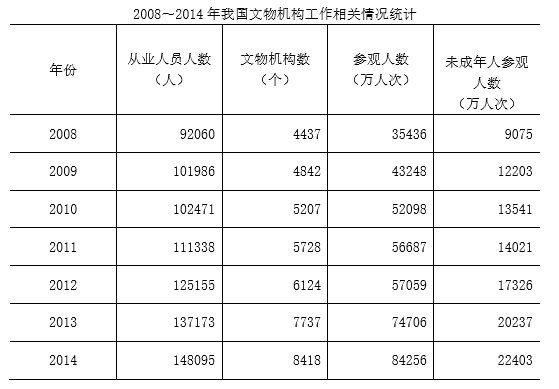

### 第 6 题　qid 2028280 · 增长

2014年，我国文物机构相关指标同比增速最快的是：

- **A**. 从业人员数
- **B**. 参观人数　✅
- **C**. 文物机构数
- **D**. 未成年人参观人数

**答案**：B

**官方解析**

根据题干“2014年，文物机构相关指标同比增速最快的是”，可判定本题为一般增长率问题。定位表格材料，根据公式：，可得，

从业人员人数增长率：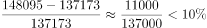；

参观人数增长率：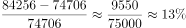；

文物机构数增长率：；

未成年人参观人数增长率：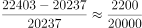。

比较可得，参观人数的同比增速最快。

故正确答案为B。

---

### 第 7 题　qid 2028284 · 平均数

2014年，平均每家博物馆接待观众人次数约是其他文物机构的多少倍？

- **A**. 2
- **B**. 4.5
- **C**. 7.5　✅
- **D**. 11

**答案**：C

**官方解析**

       由题干“2014年，…是…多少倍”材料所给时间为2014年，可判定本题是现期倍数问题。根据题意可列式为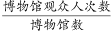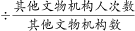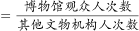，定位文字材料第一二段，2014年末，我国共有博物馆3658个，占文物机构总数的，则其他文物机构占总数的比重为；其中博物馆接待观众71774万人次，占文物机构接待观众总数的，则其他文物机构接待观众人次占总数的比重为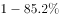。代入式子计算：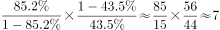，C项与之最接近。

故正确答案为C。

---

### 第 8 题　qid 2028282 · 比重

2014年末，我国一、二、三级文物总量占全部文物藏品的比重最接近以下哪个数字？

- **A**. 

- **B**. 

　✅
- **C**. 

- **D**. 

**答案**：B

**官方解析**

根据题干“2014年末，······占······的比重······”，结合材料时间为2014年末，可判定本题为现期比重问题。定位文字材料第一段，2014年末全国文物机构拥有文物藏品4063.58万件，文物藏品中，一级文物9.82万件，二级文物68.82万件，三级文物340.51万件，因此2014年末，。

故正确答案为B。

---

### 第 9 题　qid 2028286 · 比重

2008～2014年间，文物机构参观者中未成年人占比超过三成的年份有几个？

- **A**. 1　✅
- **B**. 2
- **C**. 3
- **D**. 4

**答案**：A

**官方解析**

       由题干“2008年~2014年间，…中…占比超过三成的年份有”，可判定该题是比重问题。，占比超过三成即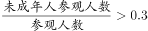，

整理不等式得：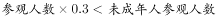。定位表格中数据可得，文物机构中参观者中未成年人2008年：35436×0.3&gt;9075；

2009年：43248×0.3&gt;12203；

2010年：52098×0.3&gt;13541；

2011年：56687×0.3&gt;14021；

2012年：57059×0.3&lt;17326；

2013年：74706×0.3&gt;20237；

2014年：84256×0.3&gt;22403。

因此只有，即只有2012年文物机构参观者中未成年人占比超过三成。

故正确答案为A。

---

### 第 10 题　qid 2028288 · 综合

能够从上述资料中推出的是：

- **A**. 2014年末，我国平均每家博物馆文物藏品超过1万件
- **B**. 2013年，我国全部文物机构日均接待参观者200多万人次　✅
- **C**. 2014年平均每家文物机构安排的基本陈列数低于上年水平
- **D**. 2010～2012年，文物机构接待成年参观者人次数逐年上升

**答案**：B

**官方解析**

A项：定位文字材料第一段，截至2014年末，我国共有博物馆3658个，博物馆文物藏品2929.97万件，则平均每家博物馆文物藏品 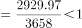万件，错误；

B项：定位表格中数据，2013年，我国文物机构共接待参观者74706万人次，2013年共365天，因此2013年我国全部文物机构日均接待参观者万人次，正确；

C项：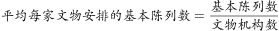，定位文字材料第二段和表格中数据，2014年全国文物机构安排基本陈列比上年增长，2014年文物机构数8418个，2013年7737个，因此2014年文物机构数同比增长，因为，所以2014年平均每家文物机构安排的基本陈列数高于上年水平，错误；

D项：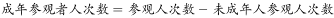，根据表格数据，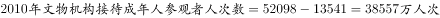，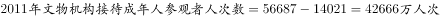，，并非逐年上升，错误。

故正确答案为B。

---

## 材料 3

        2015年我国钟表全行业实现工业总产值约675亿元，同比增长，增速比上年同期提高1.7个百分点。

        全行业全年生产手表10.7亿只，同比增长，完成产值约417亿元，同比增长，增速提高1.9个百分点；生产时钟（含钟心）5.2亿只，同比下降，完成产值162亿元，同比下降，降幅扩大1.3个百分点；钟表零配件、定时器及其它计时仪器产值96亿元，同比增长，增速基本保持上年水平。

        2015年我国钟表行业规模以上工业企业主营业务收入365.8亿元，同比增长；实现利润23.4亿元，与上年相比下降，而2015年轻工行业主营业务利润率（利润/主营业务收入）的平均水平为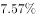。

        2015年我国钟表行业海关进出口总额为92.5亿美元，同比增长，完成出口总额为57.7亿美元，同比增长，进口额34.8亿美元。出口总额中加工贸易额占，较上年缩小2个百分点。

### 第 11 题　qid 2028352 · 综合

2015年我国钟表全行业生产时钟（含钟心）的产值与2013年相比约：

- **A**. 
上升了

- **B**. 
下降了

- **C**. 
上升了

- **D**. 
下降了
　✅

**答案**：D

**官方解析**

      根据“2015年…与2013年相比”，结合选项，判断本题为间隔增长率问题。定位第二段，全行业生产时钟（含钟心）完成产值亿元，同比下降，降幅扩大个百分点。间隔增长率公式：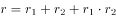。2015年增长率。2014年增长率。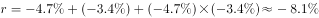。D选项最接近。

故正确答案为D。

---

### 第 12 题　qid 2028354 · 平均数

2015年钟表全行业平均每制造一只手表，能实现约多少元的产值？

- **A**. 36
- **B**. 39　✅
- **C**. 42
- **D**. 63

**答案**：B

**官方解析**

      根据“2015年…平均每制造一只手表，实现多少元的产值”判断本题为现期平均数问题。定位材料第二段，全行业全年生产手表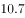亿只，完成产值约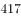亿元。。

故正确答案为B。

---

### 第 13 题　qid 2028356 · 平均数

2015年我国钟表行业规模以上工业企业主营业务利润率比轻工行业平均水平：

- **A**. 低3个百分点
- **B**. 高3个百分点
- **C**. 低1.2个百分点　✅
- **D**. 高1.2个百分点

**答案**：C

**官方解析**

      根据“2015年…利润率比轻工业平均水平，选项里是百分点”判断本题为现期比重问题。定位材料第三段，2015年我国钟表行业规模以上工业企业主营业务收入365.8亿元，实现利润23.4亿元。2015年轻工行业主营业务利润率的平均水平为。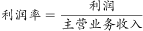，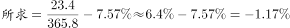。C项最接近。

故正确答案为C。

---

### 第 14 题　qid 2028358 · 综合

2014年我国钟表行业贸易顺差约为多少亿美元？

- **A**. 27
- **B**. 25
- **C**. 23
- **D**. 18　✅

**答案**：D

**官方解析**

根据“2014年…顺差约为多少亿美元”判断本题为基期计算问题。定位材料第四段，2015年我国钟表行业海关进出口总额为92.5亿美元，同比增长。完成出口总额为57.7亿美元，同比增长。进口额34.8亿美元。

方法一：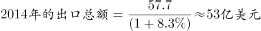。。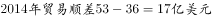。D项最接近。

方法二：进出口总额进口额出口额，进出口总额增速，出口额增速，根据混合增长率知识，混合增长率居中，则进口额的增长率小于。又因为出口额进口额贸易顺差，同理则贸易顺差额的增长率一定大于。即2015年的贸易顺差额大于2014年的贸易顺差额，则2014年贸易顺差额亿美元，只有D项符合。

故正确答案为D。

---

### 第 15 题　qid 2028364 · 综合

能够从上述资料中推出的是：

- **A**. 
2015年钟表零配件、定时器及其它计时仪器产值比2013年增长以上
　✅
- **B**. 
2015年钟表行业海关出口总额中加工贸易额占进出口总额的以上

- **C**. 
2014年手表产值同比增速低于钟表全行业工业总产值增速

- **D**. 
2015年时钟（含钟心）产值达到手表产值的一半以上

**答案**：A

**官方解析**

A项：定位材料第二段，2015年钟表零配件、定时器及其它计时仪器同比增长，增速基本保持上年水平。根据间隔增长率公式，，正确；

B项：定位材料第四段，进出口总额亿美元，出口总额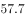亿美元，出口总额中加工贸易额占。，错误；

C项：定位第一段和第二段，。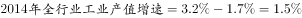。，错误；

D项：定位第二段，时钟产值亿元，手表产值亿元。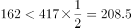，错误。

故正确答案为A。

---

## 材料 4

### 第 16 题　qid 2028440 · 增长

表中新能源汽车产业零部件配件制造技术专利申请数增速最快的年份为：

- **A**. 2005年　✅
- **B**. 2002年
- **C**. 2014年
- **D**. 2010年

**答案**：A

**官方解析**

        由题干所求“增速最快的年份”，判定本题为增长率的比较问题，可直接比较现期与基期的比值大小求解。定位表格，各选项的比值分别为：

A项：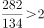；B项：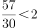；C项：；D项：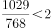。

估算可得，只有A项大于2，因此A项增速最快。

故正确答案为A。

---

### 第 17 题　qid 2028300 · 比重

能够正确描述2015年新能源汽车产业五种专利申请数占比的统计图是：

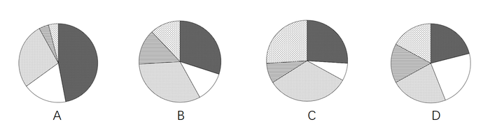

- **A**. A
- **B**. B　✅
- **C**. C
- **D**. D

**答案**：B

**官方解析**

        方法一：题干所求为“2015年新能源汽车产业五种专利申请数的占比”，故可判定本题为现期比重计算问题。2015年新能源汽车专利总数件。五种专利中申请数最多的为848，，A、D两项最大占比均不满足，排除A、D。同时最小三种专利申请数303、377、315，所占比重近似相等，只有B项满足。

         方法二：题干所求为“2015年新能源汽车产业五种专利申请数的占比”，故可判定本题为现期比重计算问题。2015年新能源汽车专利总数件。饼形图从12点位置开始顺时针依次排列，第一项整车制造为769，，比稍大一些。A项接近，C项约为，D项不到，均不满足，排除A、C、D。

故正确答案为B。

---

### 第 18 题　qid 2028296 · 综合

“十二五”期间整车制造专利申请总数约是“十五”期间总数的多少倍？

- **A**. 2
- **B**. 4
- **C**. 6　✅
- **D**. 8

**答案**：C

**官方解析**

        由题干“十二五期间的总数是十五期间总数的多少倍”，可判定本题为倍数计算问题。十二五期间为“2011-2015年”，其整车制造专利申请总数件；十五期间为“2001-2005年”，其整车制造专利申请总数件。“十二五”期间整车制造专利申请总数约是“十五”期间总数的倍数为。

故正确答案为C。

---

### 第 19 题　qid 2028308 · 综合

2001～2015年间，新能源汽车五种技术专利申请数均高于上年的年份有多少个？

- **A**. 7
- **B**. 8　✅
- **C**. 9
- **D**. 10

**答案**：B

**官方解析**

题干给出2000-2015年间五种技术专利申请数的具体值，故找出五种专利申请数均高于上年的年份，直接找数即可。查看表格，五种专利申请数均高于上年的有2003、2004、2005、2006、2007、2008、2010、2011共八个年份。
故正确答案为B。

---

### 第 20 题　qid 2028314 · 综合

能够从上述资料中推出的是：

- **A**. 2000～2015年间，五种技术专利中申请数年均增速最快的是零部件配件制造　✅
- **B**. 2011～2015年间，储能装置制造专利申请数均超过电动机制造的3倍
- **C**. 2010年供能装置制造专利申请数比2005年翻了两番
- **D**. 2001～2015年间，储能装置制造专利申请数增加最多的年份是2010年

**答案**：A

**官方解析**

A项：年均增长率比较，由于都是“2000-2015年”时间相同，则只需比较“”的大小，观察表格，2000-2015年间只有零部件配件制造的专利申请数为，其余均不足10倍，故其年均增速最快，正确；

B项：2012年储能装置专利申请数为3277件，电动机制造为1176件。，故2012年储能装置专利申请数并未超过电动机制造的3倍，错误；

C项：翻了两番即为4倍，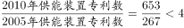，错误；

D项：2010年储能装置专利数增加了件，而2011年增加了件，故2010年并非增加最多，错误。

故正确答案为A。

---
