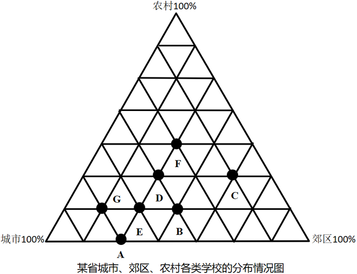

# 2017年天津市选调生选拔考试 综合知识试卷（精选）

> 资料分析 · 5 题 · 天津 2017

## 材料 1

<b>根据下图提供的信息回答问题（其中</b><b>A</b><b>代表大学，</b><b>B</b><b>代表中专，</b><b>C</b><b>代表师范，</b><b>D</b><b>代表普通中学，</b><b>E</b><b>代表职业中专，</b><b>F</b><b>代表小学，</b><b>G</b><b>代表民办学校）：</b>

### 第 1 题　qid 2261651 · 综合

农村学校分布率最高的是（    ）。

- **A**. 小学　✅
- **B**. 普通中学
- **C**. 师范
- **D**. 民办学校

**答案**：A

**官方解析**

定位图形材料可知，离农村100%最近的是F点，其代表小学，所以农村学校分布率最高的是小学。
故正确答案为A。

---

### 第 2 题　qid 2261652 · 综合

农村学校分布率最低的是（    ）。

- **A**. 民办学校
- **B**. 职业中学
- **C**. 中专
- **D**. 大学　✅

**答案**：D

**官方解析**

定位图形材料可知，离农村100%最远的是A点，其代表大学，所以农村学校分布率最低的是大学。
故正确答案为D。

---

### 第 3 题　qid 2261653 · 综合

在城市学校的分布率中，师范与普通中学之比是（  ）。

- **A**. 1：2
- **B**. 1：3　✅
- **C**. 1：4
- **D**. 1：5

**答案**：B

**官方解析**

定位图形材料可知，在城市学校的分布率中，师范C点占一格，普通中学D点占三格，则师范与普通中学之比是1：3。
故正确答案为B。

---

### 第 4 题　qid 2261654 · 综合

哪一类学校在城市、郊区、农村的分布率基本相同？

- **A**. 师范
- **B**. 普通中学
- **C**. 小学　✅
- **D**. 职业中专

**答案**：C

**官方解析**

定位图形材料可得：

A、D两项距三个端点距离相差较大，说明师范和职业中专在城市、郊区、农村的分布率相差较大，排除；B、C两项距离三个端点均为5格、5格、4格，说明普通中学和小学在城市、郊区、农村的分布率基本相同，因两项都符合题目要求，所以均当选。

故正确答案为BC。

备注：因B、C两项数据结果一致，无法选出最优，故有两个答案。

---

### 第 5 题　qid 2261655 · 综合

以下叙述不正确的是（  ）。

- **A**. 民办学校和大学在城市的分布率相同
- **B**. 在农村学校的分布率相同的有师范和普通中学
- **C**. 郊区学校的分布率相同的有大学、职业中专和普通中学
- **D**. 师范在郊区和农村分布比城市少　✅

**答案**：D

**官方解析**

A项：定位图形材料可知，民办学校和大学相对于城市距离相等，所以分布率相同，正确；

B项：定位图形材料可知，民办学校和大学相对于城市距离相等，所以分布率相同，正确；

C项：定位图形材料可知，大学、职业中专和普通中学相对于郊区距离相等，所以分布率相同，正确；

D项：定位图形材料可知，师范相对于郊区距离更近，所以师范在郊区比农村和城市多，错误。

本题为选非题，故正确答案为D。

---
