# 2017年天津滨海新区公务员考试《行测》题（网友回忆版）

> 资料分析 · 20 题 · 天津 2017

## 材料 1

### 第 1 题　qid 2139404 · 增长

2015年，贷款基准利率增长比率最高的月份是：

- **A**. 7月
- **B**. 9月
- **C**. 5月
- **D**. 3月　✅

**答案**：D

**官方解析**

根据题干所求“······增长比率最高······”，可判定此题为一般增长率问题。定位表格，已知贷款基准利率调整前、调整后的具体值，所以贷款基准利率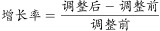，代入选项：

A项：7月，定位表格，调整后为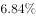，调整前为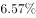，所以贷款基准利率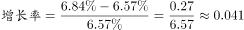；

B项：9月，定位表格，调整后为，调整前为，所以贷款基准利率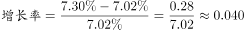；

C项：5月，定位表格，调整后为，调整前为，所以贷款基准利率；

D项：3月，定位表格，调整后为，调整前为，所以贷款基准利率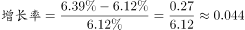。

所以D项最大。

故正确答案为D。

---

### 第 2 题　qid 2139422 · 综合

从3月上旬到12月底，存款基准利率增涨比率是：

- **A**. 

- **B**. 
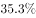

- **C**. 

- **D**. 

　✅

**答案**：D

**官方解析**

根据题干所求“从3月上旬到12月底，存款基准利率增涨比率是”，可判定此题为一般增长率问题，所以存款基准利率增涨。定位表格，3月上旬为3月10号前，所以应为3月18日存款基准利率调整前的；12月底为12月31日前，所以应为12月21日存款基准利率调整后的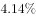。所以存款基准利率增涨。

故正确答案为D。

---

### 第 3 题　qid 2139424 · 综合

2015年7月底，调整后的存贷款基准利率差额为：

- **A**. 

- **B**. 

- **C**. 
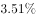
　✅
- **D**. 
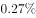

**答案**：C

**官方解析**

根据题干所求“······调整后的存贷款基准利率差额为”，结合材料给出存贷款基准利率调整后的具体值，可判定此题为简单加减计算问题。定位表格，7月存款基准利率调整后为，7月贷款基准利率调整后为，所以调整后的存贷款基准利率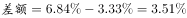。

故正确答案为C。

---

### 第 4 题　qid 2139426 · 综合

2015年8月底，贷款基准利率是存款基准利率的：

- **A**. 2.05倍
- **B**. 0.95倍
- **C**. 1.95倍　✅
- **D**. 1.05倍

**答案**：C

**官方解析**

根据题干所求“2015年8月底，贷款基准利率是存款基准利率的”，可判定此题为现期倍数问题。定位表格，2015年8月底存款基准利率调整后为，贷款基准利率调整后为，所以。

故正确答案为C。

---

### 第 5 题　qid 2139428 · 综合

下列关于中国人民银行2015年历次调整存贷款基准利率的目的，说法错误的是：

- **A**. 控制信贷资金过渡需求
- **B**. 引导投资合理增长
- **C**. 稳定通货膨胀预期
- **D**. 增加居民消费能力　✅

**答案**：D

**官方解析**

央行6次提高存贷款利率。
A项：信贷资金主要用于对企业和社会的贷款，以满足社会生产和商品流通的需要，而提高贷款基准利率，可以增加贷款的成本，进而可以控制信贷资金的过度需求，正确；
B项：提高贷款基准利率，贷款成本就会相应增加，企业投资也会更加谨慎，不会为了扩大生产规模而盲目贷款投资，有利于引导投资合理增长，正确；
C项：提高存款基准利率，可以吸收更多的民间资本；提高贷款基准利率，可以降低投资热情，减少货币供给。因此提高存贷款基准利率可以减少市场上的货币流通量，稳定物价，稳定通货膨胀预期，从而保持经济的持续稳定发展，正确；
D项：当存款基准利率提高时，储蓄利息就会相应增加，因此会增加居民的储蓄热情，降低居民的消费能力，错误。
本题为选非题，故正确答案为D。

---

## 材料 2

       世界煤储量在世界能源总储量中占，按目前规模可持续开采200年左右。据19世纪80年代初世界能源会议等组织的资料，世界煤资源地质储量为14.3万亿吨，其中探明储量为3.5万亿吨，约占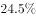；在总储量中硬煤占，褐煤占。按硬煤经济可采储量以美国、俄罗斯、中国最为丰富，分别占世界总量的、、，共占三分之二。

### 第 6 题　qid 2139376 · 综合

在世界煤炭资源地质储量中，未探明储量占总储量的：

- **A**. 

- **B**. 

- **C**. 

　✅
- **D**. 

**答案**：C

**官方解析**

定位材料可得，世界煤炭资源地质储量为14.3万亿吨，其中探明储量为3.5万亿吨，约占。则未探明储量占总储量的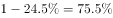。

故正确答案为C。

---

### 第 7 题　qid 2139380 · 比重

硬煤经济可采储量占世界总量比例最高的国家是：

- **A**. 美国　✅
- **B**. 中国
- **C**. 俄罗斯
- **D**. 都不是

**答案**：A

**官方解析**

根据题干“硬煤经济可采储量占世界总量比例最高的国家是”，结合文字材料中“按硬煤经济可采储量以美国、俄罗斯、中国最为丰富，分别占世界总量的、、”，可判定为直接找数。直接比较数据大小可知，硬煤经济可采储量占世界总量比例最高的是美国，为。

故正确答案为A。

---

### 第 8 题　qid 2139384 · 综合

在世界煤炭总储量中，硬煤大约有：

- **A**. 9.84万亿吨
- **B**. 10.73万亿吨　✅
- **C**. 3.58万亿吨
- **D**. 14.3万亿吨

**答案**：B

**官方解析**

根据题干“在······中硬煤大约有多少”，结合材料给出世界煤炭总储量及硬煤占比，可判定本题为现期比重问题。定位材料可得，世界煤资源地质储量为14.3万亿吨，硬煤占，褐煤占。根据，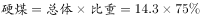万亿吨，与B项最为接近。

故正确答案为B。

---

### 第 9 题　qid 2139394 · 综合

中国的硬煤占世界能源总储量的：

- **A**. 

- **B**. 

- **C**. 

　✅
- **D**. 

**答案**：C

**官方解析**

由题干“中国硬煤占世界能源总储量的多少”，可判定本题为现期比重计算。根据比重公式列式为，由于题目中没有给定具体数值，分别给了中国硬煤占世界硬煤总量的，世界硬煤总量占世界煤储量的，世界煤储量占世界能源总储量的，由此可得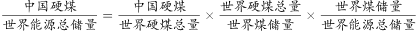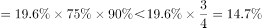，只有C项满足。

故正确答案为C。

---

### 第 10 题　qid 2139400 · 综合

在世界煤炭总储量中，硬煤的储量比褐煤的储量多：

- **A**. 7.15万亿吨　✅
- **B**. 3.58万亿吨
- **C**. 10.73万亿吨
- **D**. 6.78万亿吨

**答案**：A

**官方解析**

根据题干“在······中硬煤的储量比褐煤的储量多”，结合材料给出世界煤炭总储量及硬煤、褐煤占比，可判定本题为现期比重问题。定位材料可得，世界煤资源地质储量为14.3万亿吨······硬煤占，褐煤占。根据，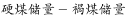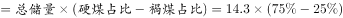万亿吨。

故正确答案为A。

---

## 材料 3

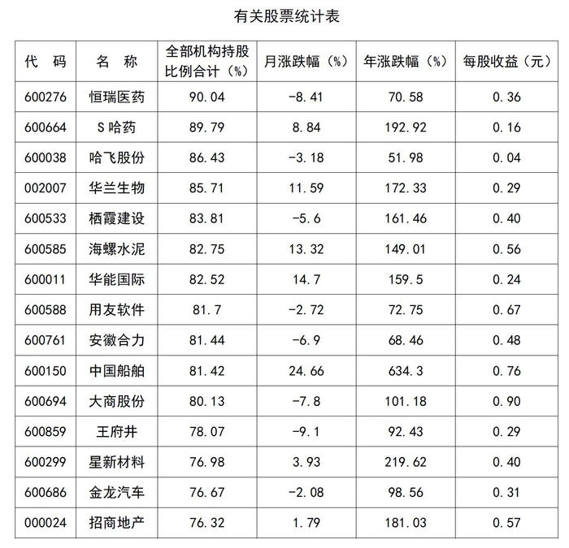

### 第 11 题　qid 2139506 · 综合

下列代码中，每股收益最高的是：

- **A**. 000024
- **B**. 600150
- **C**. 600299
- **D**. 600694　✅

**答案**：D

**官方解析**

定位表格，各代码的每股收益分别为：A项：000024招商地产0.57元，B项：600150中国船舶0.76元，C项：600299星新材料0.40元，D项：600694大商股份0.90元，最高的是D项600694大商股份。
故正确答案为D。

---

### 第 12 题　qid 2139510 · 综合

下列公司中，月涨跌幅最高的是：

- **A**. S哈药
- **B**. 华兰生物
- **C**. 中国船舶　✅
- **D**. 华能国际

**答案**：C

**官方解析**

定位表格，各公司月涨跌幅分别为：A项S哈药、B项华兰生物、C项中国船舶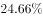、D项华能国际，月涨跌幅最高的是C项中国船舶。

故正确答案为C。

---

### 第 13 题　qid 2139514 · 综合

年涨幅与月涨跌幅差别最大的公司是：

- **A**. S哈药
- **B**. 华兰生物
- **C**. 中国船舶　✅
- **D**. 华能国际

**答案**：C

**官方解析**

定位表格，A项：S哈药月涨幅、年涨幅，相差；

B项：华兰生物月涨幅、年涨幅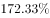，相差；

C项：中国船舶月涨幅、年涨幅，相差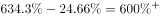；

D项：华能国际月涨幅、年涨幅，相差；

差别最大的是C项中国船舶。

故正确答案为C。

---

### 第 14 题　qid 2139518 · 综合

栖霞建设每股收益比招商地产少：

- **A**. 0.56元
- **B**. 0.28元
- **C**. 0.17元　✅
- **D**. 0.52元

**答案**：C

**官方解析**

定位表格，栖霞建设每股收益为0.40元，招商地产为0.57元，前者比后者少元。

故正确答案为C。

---

### 第 15 题　qid 2139524 · 综合

若有人持有1000股大商股份，那么他需要持有约_______金龙汽车的股份才能与此收益相当。

- **A**. 3500股
- **B**. 2000股
- **C**. 2900股　✅
- **D**. 3000股

**答案**：C

**官方解析**

根据题干所求“若有人持有1000股大商股份，那么他需要持有约_______金龙汽车的股份才能与此收益相当”，材料给出两公司股份的每股收益，可判定此题为平均数问题。定位表格，大商股份每股收益0.90元，金龙汽车每股0.31元。与1000股大商股份收益相当，需要持有金龙汽车股份股，C项最接近。

故正确答案为C。

---

## 材料 4

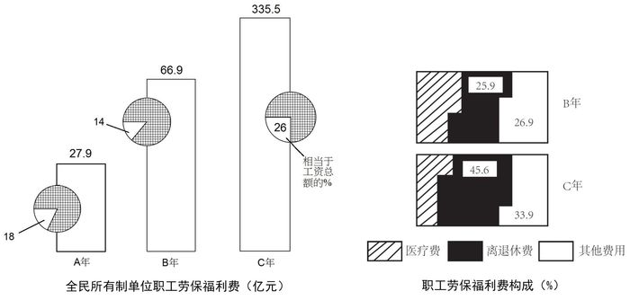

### 第 16 题　qid 2139532 · 增长

B年全民所有制单位职工劳保福利费比A年增加了：

- **A**. 279亿元
- **B**. 669亿元
- **C**. 49亿元
- **D**. 39亿元　✅

**答案**：D

**官方解析**

由题干“B年······比A年增加了”，且选项单位为亿元，可判定本题为增长量计算问题。定位图形材料1可知，A年全民所有制单位职工劳保福利费为27.9亿元，B年为66.9亿元。根据公式，B年全民所有制单位职工劳保福利费比A年增加了亿元。

故正确答案为D。

---

### 第 17 题　qid 2139538 · 综合

C年全民所有制单位职工医疗费为：

- **A**. 335.5亿元
- **B**. 158.4亿元
- **C**. 68.8亿元　✅
- **D**. 20.5亿元

**答案**：C

**官方解析**

根据题干所求“C年······医疗费”，结合图形材料2，可判定此题为现期比重问题。定位图形材料1，C年全民所有制单位职工劳保福利费为335.5亿元；定位图形材料2，C年医疗费所占比重为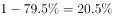，则C年全民所有制单位职工医疗费为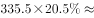，与C项最接近。

故正确答案为C。

---

### 第 18 题　qid 2139544 · 增长

全民所有制单位职工B年工资总额比A年上涨了：

- **A**. 

　✅
- **B**. 
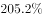

- **C**. 

- **D**. 
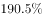

**答案**：A

**官方解析**

根据题干所求“······B年比A年上涨了······”，且选项为百分数，可判定此题为一般增长率问题。定位图形材料1，A年全民所有制单位职工劳保福利费为27.9亿元，占工资总额的，故A年工资总额为；B年为66.9亿元，占工资总额的，故B年工资总额为。根据增长率计算公式，可计算出，全民所有制单位职工B年工资总额比A年上涨了。

故正确答案为A。

---

### 第 19 题　qid 2139548 · 综合

全民所有制单位职工劳保福利费在B年用于医疗费用的支出比用于其他费用的支出多：

- **A**. 20.3亿元
- **B**. 14.25亿元
- **C**. 13.58亿元　✅
- **D**. 31.8亿元

**答案**：C

**官方解析**

根据题干所求“B年用于医疗费用的支出比用于其他费用的支出多”，结合图形材料2所给的职工劳保福利费构成，可判定此题为现期比重问题。定位图形材料1，B年全民所有制单位职工劳保福利费为66.9亿元；定位图形材料2，B年医疗费所占比重为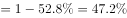。可得，B年用于医疗费用的支出为，用于其他费用的支出为。从而可计算出，B年用于医疗费用的支出比用于其他费用的支出多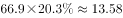亿元。

故正确答案为C。

---

### 第 20 题　qid 2139556 · 综合

下列说法中，错误的是：

- **A**. 
A年全民所有制单位职工劳保福利费占工资总额的

- **B**. 
C年全民所有制单位职工工资总额为1290.4亿元

- **C**. 
C年全民所有制单位职工劳保福利费中，离退休费所占比重比B年增加了19.7个百分点

- **D**. 
全民所有制单位职工B年工资总额比C年劳保福利费低
　✅

**答案**：D

**官方解析**

A项：定位图形材料1，A年全民所有制单位职工劳保福利费占工资总额的，正确；

B项：定位图形材料1，C年全民所有制单位职工工资总额为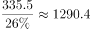亿元，正确；

C项：定位图形材料2，C年离退休费所占比重比B年增加了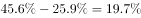，即增加了19.7个百分点，正确；

D项：定位图形材料1，B年工资总额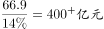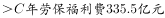，错误。

本题为选非题，故正确答案为D。

---
