# 2017年山东省选调应届优秀高校毕业生到基层工作考试《行测》试卷（精选）

> 资料分析 · 10 题 · 选调 2017

## 材料 1

（1）房地产开发投资完成情况

        2017年1-2月份，全国房地产开发投资9854亿元，同比名义增长，增速比去年全年提高2个百分点。其中，住宅投资6571亿元，增长，增速提高2.6个百分点。住宅投资占房地产开发投资的比重为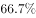。

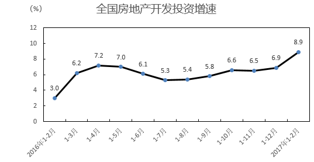

        1-2月份，东部地区房地产开发投资5966亿元，同比增长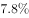，增速比去年全年提高2.2个百分点；中部地区投资1907亿元，增长，增速提高3个百分点；西部地区投资1982亿元，增长，增速提高1.6个百分点。

        1-2月份，房地产开发企业房屋施工面积622950万平方米，同比增长，增速与去年全年持平。其中，住宅施工面积423185万平方米，增长。房屋新开工面积17238万平方米，增长，增速提高2.3个百分点。其中，住宅新开工面积12410万平方米，增长。房屋竣工面积16141万平方米，增长，增速提高9.7个百分点。其中，住宅竣工面积11674万平方米，增长。

        1-2月份，房地产开发企业土地购置面积2374万平方米，同比增长，去年全年为下降；土地成交价款794亿元，增长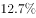，增速回落7.1个百分点。

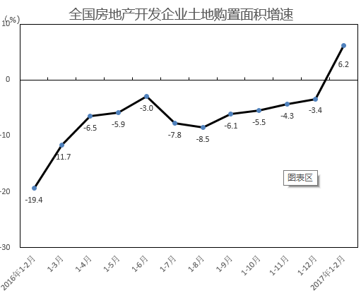

（2）商品房销售和待售情况

        1-2月，商品房销售面积14054万平方米，同比增长，增速比去年全年提高2.6个百分点。其中，住宅销售面积增长，办公楼销售面积增长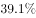，商业营业用房销售面积增长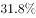。商品房销售额10806亿元，增长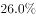，增速回落8.8个百分点。其中，住宅销售额增长，办公楼销售额增长，商业营业用房销售额增长。

        1-2月份，东部地区商品房销售面积6595万平方米，同比增长，增速比去年全年回落6.8个百分点；销售额6645亿元，增长，增速回落23个百分点。中部地区商品房销售面积3680万平方米，增长，增速提高4.6个百分点；销售额2073亿元，增长44.1%，增速提高5.4个百分点。西部地区商品房销售面积3779万平方米，增长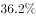，增速提高20.6个百分点；销售额2088亿元，增长，增速提高31.2个百分点。

        2月末，商品房待售面积70555万平方米，比去年末增加1015万平方米。其中，住宅待售面积增加468万平方米，办公楼待售面积增加155万平方米，商业营业用房待售面积增加260万平方米。

（3）房地产开发企业到位资金情况

        1-2月份，房地产开发企业到位资金22880亿元，同比增长，增速比去年全年回落8.2个百分点。其中，国内贷款4985亿元，增长;利用外资48亿元，增长；自筹资金6897亿元，下降；其他资金10950亿元，增长。在其他资金中，定金及预收款6108亿元，增长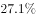；个人按揭贷款3391亿元，增长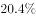。

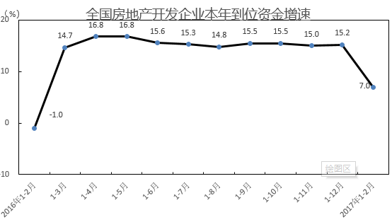

（4）房地产开发景气指数

        2月份，房地产开发景气指数（简称“国房景气指数”，今年起发布的是基期修定后的值）为100.78，比1月份提高0.02点。

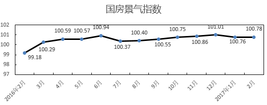

### 第 1 题　qid 2261763 · 综合

2016年1-2月份全国房地产开发投资总额约是：

- **A**. 9046亿元
- **B**. 9047亿元
- **C**. 9048亿元
- **D**. 9049亿元　✅

**答案**：D

**官方解析**

根据题干“2016年1-2月份······投资总额约是”，结合选项带单位且材料时间为2017年1-2月份，可判定本题为基期计算问题。定位材料文字第一段：“2017年1-2月份，全国房地产开发投资9854亿元，同比名义增长”。故2016年1-2月份全国房地产开发投资总额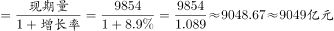（选项差距极小，需要精确计算）。

故正确答案为D。

---

### 第 2 题　qid 2261764 · 综合

2015年1-2月份，全国房地产开发企业土地购置面积（  ）万平方米。

- **A**. 2927.3
- **B**. 2773.5　✅
- **C**. 2235.4
- **D**. 1976.5

**答案**：B

**官方解析**

据题干“2015年1-2月份······万平方米”，结合材料时间为2017年1-2月份，可判定本题为间隔基期问题。定位文字材料第四段：“2017年1-2月份房地产开发企业土地购置面积2374万平方米，同比增长率”；定位表格材料全国房地产开发企业土地购置面积增速可知：2016年1-2月房地产开发企业土地购置面积同比增长率。根据间隔增长率公式，与2015年1-2月相比，2017年1-2月全国房地产开发企业土地购置面积增长率，故2015年1-2月份，全国房地产开发企业土地购置面积万平方米，与B项最接近。

故正确答案为B。

---

### 第 3 题　qid 2261765 · 综合

2016年末全国商品房的待售面积（  ）万平方米。

- **A**. 68450
- **B**. 69540　✅
- **C**. 79987
- **D**. 70295

**答案**：B

**官方解析**

定位材料文字第七段可知：2017年2月末，商品房待售面积70555万平方米，比去年末增加1015万平方米。故2016年末全国商品房的待售面积万平方米。

故正确答案为B。

---

### 第 4 题　qid 2261766 · 综合

2016年1-2月，全国房地产开发企业到位资金大约是：

- **A**. 21383亿元　✅
- **B**. 21384亿元
- **C**. 24633亿元
- **D**. 24634亿元

**答案**：A

**官方解析**

根据题干“2016年1-2月······资金大约是”，结合选项带单位且材料时间为2017年1-2月，可判定本题为基期计算问题。定位文字材料第八段可知：2017年1-2月份，房地产开发企业到位资金22880亿元，同比增长。故2016年1-2月，全国房地产开发企业到位资金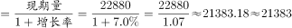亿元（选项差距极小，需要精确计算）。

故正确答案为A。

---

### 第 5 题　qid 2261767 · 增长

自2016年2月至2017年2月，国房景气指数的极差是（  ），2017年2月国房景气指数环比增加了：

- **A**. 
  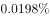
　✅
- **B**. 
  

- **C**. 
  

- **D**. 
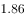  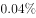

**答案**：A

**官方解析**

根据题干“2017年2月……环比增加了”，结合选项第二个空带百分号，可判定本题为一般增长率问题。定位材料最后一个表格可知：2016年2月至2017年2月，国房景气指数最高值为2016年12月（101.01），最低值为2016年2月（99.18），故自2016年2月至2017年2月，国房景气指数的极差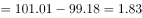。定位材料文字最后一段和最后一个表格可知：2017年2月房地产开发景气指数比1月分提高0.02点，1月份国房景气指数为100.76。故2017年2月国房景气指数环比增长率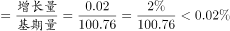，只有A项符合。

故正确答案为A。

---

## 材料 2

根据以下资料，完成第76～80题。

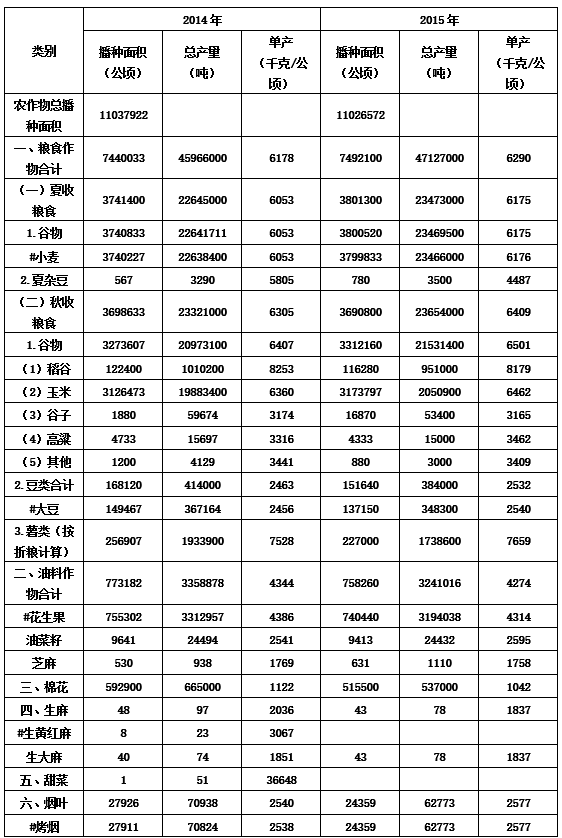

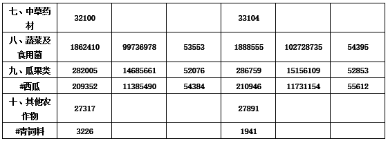

### 第 6 题　qid 2631489 · 比重

2014年各类农作物播种面积比例的饼形图为：

- **A**. 

- **B**. 
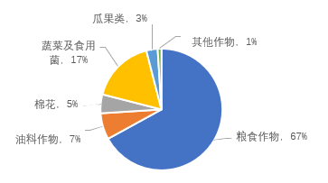
　✅
- **C**. 
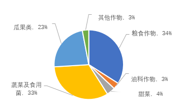

- **D**. 

**答案**：B

**官方解析**

根据题干“2014年各类农作物播种面积比例的饼形图”，可判定本题为现期比重问题。定位表格数据可知，2014年粮食作物种植面积为7440033公顷，总种植面积为11037922公顷，则粮食作物种植面积占比，排除C、D两项。对比A、B两项，粮食作物和瓜果类作物所占比例不同，可根据二者倍数关系进行排除。瓜果类种植面积为282005公顷，则粮食作物种植面积与瓜果类的倍数关系应为：，因为总体相同，故二者所占比例的倍数关系30倍，A项：，排除。

故正确答案为B。

---

### 第 7 题　qid 2631497 · 综合

2015年，在秋收粮食作物中，单产增量最多的农作物是：

- **A**. 高粱　✅
- **B**. 玉米
- **C**. 大豆
- **D**. 薯类

**答案**：A

**官方解析**

根据题干“单产增量最多的农作物是”，可判定本题为增长量比较问题。定位表格数据可知，高粱、玉米、大豆、薯类2014年单产分别为3316千克/公顷、6360千克/公顷、2456千克/公顷、7528千克/公顷；2015年分别为3462千克/公顷、6462千克/公顷、2540千克/公顷、7659千克/公顷。根据公式：增长量现期基期，则各类农作物单产增量如下：高粱：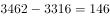千克/公顷；玉米：千克/公顷；大豆：千克/公顷；薯类：千克/公顷。则单产增量最多的农作物是高粱。

故正确答案为A。

---

### 第 8 题　qid 2631503 · 增长

2015年粮食总产量的增长率是：

- **A**. 

- **B**. 

- **C**. 

　✅
- **D**. 

**答案**：C

**官方解析**

根据题干“······的增长率是”，可判定本题为增长率计算问题。定位表格数据可知，2015年、2014年粮食总产量分别为47127000吨、45966000吨。根据公式：增长率，则2015年粮食总产量的增长率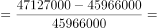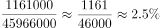。

故正确答案为C。

---

### 第 9 题　qid 2631506 · 综合

2014年的粮食作物种植面积是非粮食作物种植面积的（    ）倍。

- **A**. 2.04
- **B**. 2.05
- **C**. 2.06
- **D**. 2.07　✅

**答案**：D

**官方解析**

根据题干“2014年的······是······的（    ）倍”，可判定本题为现期倍数问题。定位表格数据可知，2014年农作物总播种面积、粮食作物播种面积分别为11037922公顷、7440033公顷，则非粮食作物种植面积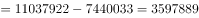公顷。根据公式：倍数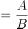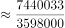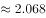，与D项最接近。

故正确答案为D。

---

### 第 10 题　qid 2631510 · 综合

2015年非粮食作物种植面积减少了：

- **A**. 
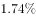

- **B**. 

- **C**. 

　✅
- **D**. 

**答案**：C

**官方解析**

根据题干“2015年······减少了”，结合选项为百分数，可判定本题为一般增长率计算问题。定位表格数据可知，2015年农作物总播种面积、粮食作物播种面积分别为11026572公顷、7492100公顷，则2015年非粮食作物种植面积公顷，从第79题可知，2014年非粮食作物种植面积为3597889公顷。根据公式：增长率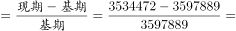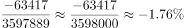，即2015年非粮食作物种植面积减少了1.76%。

故正确答案为C。

---
