# 2017年广东省公务员录用考试《行测》题（县级、乡镇统一卷）

> 资料分析 · 15 题 · 广东 2017

## 材料 1

        2016年，某省小微服务业呈现出经营平稳面、资产规模、享受税收优惠政策范围“三扩大”的特点，主要行业实现较快增长。

        2016年，该省小微服务业样本企业实现营业收入80.1亿元，同比增长，高于规模以上重点服务业企业8.2个百分点，增速比上年回落0.6个百分点。经营平稳面扩大，2016年4季度，的企业认为本企业综合经营状况良好或稳定，同比提高3.3个百分点，处于历史较高水平。

        2016年，小微服务业样本企业资产总计367亿元，同比增长，户均1643.7万元。负债合计194.8亿元，同比增长，低于资产增长速度1.2个百分点。资产负债率为，处于较为合理水平。实现利润总额4.6亿元，销售利润率为。小微服务业企业的资金和盈利水平均处于平稳状态。

        各主要行业中，水利、环境和公共设施管理业，信息传输、软件和信息技术服务业，租赁和商务服务业，房地产业的增速明显高于平均水平。

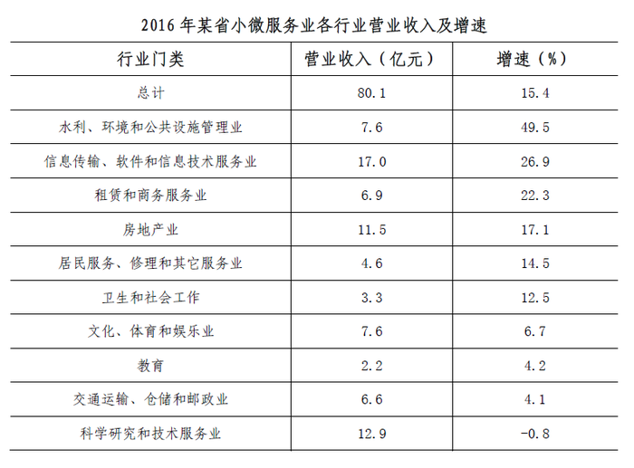

### 第 1 题　qid 2047804 · 综合

2016年，该省小微服务业样本企业的营业收入比2015年大约多多少亿元？

- **A**. 5.3
- **B**. 10.7　✅
- **C**. 12.3
- **D**. 23.0

**答案**：B

**官方解析**

由题干“2016年······比2015年大约多······亿元”，可判定该题为增长量计算问题。定位材料第二段，2016年，该省小微服务业样本企业实现营业收入80.1亿元，同比增长，可得亿元。

故正确答案为B。

---

### 第 2 题　qid 2047812 · 增长

2016年，小微服务业经营平稳面同比扩大最显著的是：

- **A**. 1季度
- **B**. 2季度
- **C**. 3季度
- **D**. 4季度　✅

**答案**：D

**官方解析**

定位折线图中数据，第1季度：个百分点；第2季度：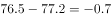个百分点；2016年第1季度和第2季度同比均减少，因此只比较第3季度和第4季度，第3季度扩大个百分点，第4季度扩大个百分点，所以2016年第4季度同比扩大最显著。

故正确答案为D。

---

### 第 3 题　qid 2047826 · 平均数

2015-2016年，平均每季度大约有多少企业认为自身综合经营状况良好或稳定？

- **A**. 

- **B**. 
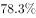
　✅
- **C**. 

- **D**. 
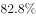

**答案**：B

**官方解析**

由题干“2015-2016年，平均每季度”，可判定该题为现期平均数问题。定位折线图中数据，平均每季度认为自身综合经营状况良好或稳定的企业大约有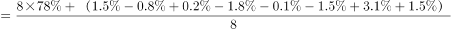。

故正确答案为B。

---

### 第 4 题　qid 2047842 · 增长

2016年，小微服务业的下列各行业，按营业收入同比变化量的大小排序正确的是：

- **A**. 
文化、体育和娱乐业卫生和社会工作科学研究和技术服务业教育
　✅
- **B**. 
文化、体育和娱乐业卫生和社会工作教育科学研究和技术服务业

- **C**. 
文化、体育和娱乐业科学研究和技术服务业卫生和社会工作教育

- **D**. 
卫生和社会工作文化、体育和娱乐业科学研究和技术服务业教育

**答案**：A

**官方解析**

定位表格中数据，文化、体育和娱乐业同比增加：亿元；卫生和社会工作同比增加：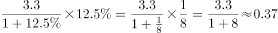亿元；科学研究和技术服务业同比减少：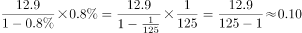亿元；教育同比增加：亿元。因此营业收入的变化量从大到小的排序为：文化、体育和娱乐业、卫生和社会工作、科学研究和技术服务业、教育。

故正确答案为A。

---

### 第 5 题　qid 2047848 · 综合

下列说法不正确的是：

- **A**. 2016年，大多数小微服务业行业的营业收入同比有所增长
- **B**. 2015年，小微服务业样本企业的户均资产大约为1504万元　✅
- **C**. 2016年，小微服务业样本企业的户均负债大约为873万元
- **D**. 2016年，信息传输、软件和信息技术服务业的营业收入增加最多

**答案**：B

**官方解析**

A项：定位表格中数据，10个行业除了科学研究和技术服务业的营业收入同比都有所增长，正确；

B项：无法通过2016年的户均判定2015年的户均，因为户数变化没有给出，错误；

C项：定位文字材料第三段，小微服务业样本企业负债合计194.8亿元，小微服务业样本企业户数为，平均每户负债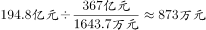，正确；

D项：定位表格中数据，信息传输、软件和信息技术服务业的现期量和增长率均比除了水利、环境和公共设施管理业外的其它8个行业大。根据增长量比较口诀“大大则大”，则信息传输、软件和信息技术服务业增量大于其他8个行业。信息传输、软件和信息技术服务业增量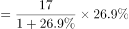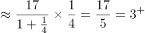，水利、环境和公共设施管理业增量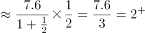，则信息传输、软件和信息技术服务业增量最大，正确。

本题为选非题，故正确答案为B。

---

## 材料 2

        2016年，广东民营经济增加值突破四万亿元。经初步核算，全年实现民营经济增加值42578.76亿元，按可比价计算，比上年同期增长，增幅高于同期GDP增幅0.3个百分点，其中第二产业增幅比同期GDP第二产业增幅高3个百分点。民营经济占GDP的比重为，比2010年提高3.9个百分点，占比逐年提高；对GDP增长的贡献率为，同比提高1.3个百分点，拉动GDP增速达4.2个百分点，民营经济的作用不断提升，是广东经济增长的主力军。

        分行业看，民营经济发展速度快于全部经济类型的行业有工业、金融业和其他服务业，其中民营工业实现增加值15898.95亿元，同比增长，比全部经济类型工业快3.3个百分点；民营经济占全部经济类型比重较大的行业有农林牧渔业、住宿餐饮业、批发零售业和房地产业，分别为、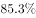、和；民营经济对GDP贡献率较大的行业有工业、其他服务业，分别为、。

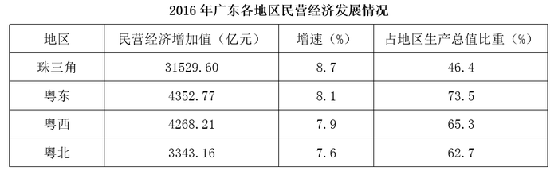

【注释】

        生产总值（GDP）：指按市场价格计算的一个地区所有常住单位在一定时期内生产活动的最终成果。从价格形态看，它是所有常住单位的增加值之和。

        增加值：总产出减去中间投入后的余额，反映一定时期内各部门、各单位生产经营活动的最终成果，也就是本部门、本单位对生产总值提供的份额。

### 第 6 题　qid 2047712 · 增长

2016年广东民营经济第二产业实现的增加值约是第一产业的多少倍？

- **A**. 4.11
- **B**. 4.32
- **C**. 4.77　✅
- **D**. 5.17

**答案**：C

**官方解析**

根据题干所求“2016年······实现的增加值约是······的倍数”，且材料数据为2016年，可判定此题为现期倍数问题。定位第一个表格，民营经济第一产业、第二产业增加值分别为3631.01亿元、17306.17亿元，后者是前者的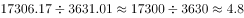倍，最接近C项。

故正确答案为C。

---

### 第 7 题　qid 2047720 · 比重

2016年广东民营经济中第三产业所占的比重相比2015年大约：

- **A**. 提高了0.1个百分点
- **B**. 降低了0.1个百分点　✅
- **C**. 提高了0.2个百分点
- **D**. 降低了0.2个百分点

**答案**：B

**官方解析**

根据题干所求“2016年······的比重相比2015年”，可判定此题为两期比重比较问题。定位文字材料第一段可得，民营经济增加值为42578.76亿元，增速为，定位第一个表格可得，第三产业增加值为21641.58亿元，增速为。根据两期比重差公式：，，因此比重下降，排除A、C，代入公式，比重差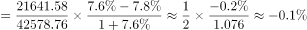。

故正确答案为B。

---

### 第 8 题　qid 2047738 · 增长

2015年广东民营工业实现的增加值约占当年GDP的：

- **A**. 

- **B**. 

　✅
- **C**. 

- **D**. 

**答案**：B

**官方解析**

根据题干所求“2015年······约占······”，选项为百分数，且材料数据为2016年，可判定此题为基期比重问题。定位文字材料第一段，2016年，民营经济增加值增速为，高于同期GDP增幅0.3个百分点，则GDP增速为，民营经济占GDP的比重为，则2016年GDP为亿元；定位文字材料第二段，2016年民营工业实现增加值为15898.95亿元，增速为，代入基期比重公式：，2015年比重为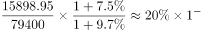，略小于，最接近B项。

故正确答案为B。

---

### 第 9 题　qid 2047748 · 综合

根据资料可知：

- **A**. 
2016年广东民营经济对GDP增长的贡献率高于其他经济类型
　✅
- **B**. 
广东民营经济占GDP的比重从2011年开始超过

- **C**. 
2016年广东的房地产市场中，国有经济占了近三分之一的份额

- **D**. 
民营经济仅在部分行业具有优势

**答案**：A

**官方解析**

A项：定位文字材料第一段，民营经济对GDP增长的贡献率为，则其他经济类型贡献率为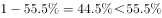，并且材料第一段最后一句说“民营经济的作用不断提升，是广东经济增长的主力军”再次强调了民营经济对GDP增长的贡献率最高，正确；

B项：定位文字材料第一段，民营经济占GDP比重为，比2010年提高3.9个百分点，占比逐年提高，则2010年比重为，无法判定2011年比重一定超过，错误；

C项：材料仅在第二段提及广东房地产业，没有国有经济占比相关的数据，无法判定，错误；

D项：根据材料无法判定民营经济所有行业情况，错误。

故正确答案为A。

---

### 第 10 题　qid 2047754 · 综合

下列说法正确的是：

- **A**. 2016年珠三角地区民营经济占全省的比重相比2015年提高了超过0.5个百分点　✅
- **B**. 2016年广东各地区中，民营经济增速越慢的地区，当地民营经济占生产总值的比重也越低
- **C**. 2015年珠三角地区民营经济的增加值是广东其他各地区之和的3倍
- **D**. 2016年广东民营经济在各行业中的发展速度都是最快的

**答案**：A

**官方解析**

A项：定位表格，2016年珠三角民营经济增加值为31529.60亿元，增速为，定位文字材料第一段，全省民营经济增加值为42578.76亿元，增速为，代入两期比重差公式：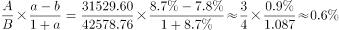，正确；

B项：定位表格，各地区民营经济增速由大到小为：珠三角粤东粤西粤北，占地区生产总值比重由大到小为：粤东粤西粤北珠三角，错误；

C项：选项所述是基期倍数，材料给的是现期值和增长率。如果直接算基期量的话计算量太大，因此我们可以先算出现期倍数，再通过增长率进行比较。

方法一：定位表格，珠三角民营经济增加值为31529.60亿元，其他地区之和为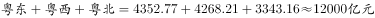，前者是后者的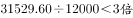；

方法二：（由于给出的文字材料和表格材料的数据有矛盾，文字材料第一段中民营经济增加值与表格中四地区增加值总和并不相等，若采用第一段民营经济增加值数据计算，结果如下。）定位文字材料第一段可得，民营经济增加值为42578.76亿元，则其他地区之和为，珠三角民营经济增加值是其他地区的。

因此我们发现现期倍数是不到三倍的，又由于珠三角的增速要快于其他三个地区的增速，所以珠三角的基期量相对其他地区更小，因此基期倍数更小，所以不到三倍，错误；

D项：定位文字材料第二段，仅给出部分行业速度快于全部经济类型，无法判定民营经济在所有行业中的速度都是最快的，错误。

故正确答案为A。

---

## 材料 3

        2016年，某省完成邮政通信业务总量6886.15亿元，同比增长，增幅比上年提高27.4个百分点。其中，完成邮政业务总量1879.99亿元，增长，增幅提高11.0个百分点；完成通信业务总量5006.16亿元，增长，增幅提高33.2个百分点。

        2016年，该省完成快递业务量76.72亿件，同比增长，占全国快递业务量的比重达到，比排名第二的Z省多16.80亿件。

        2016年，该省电话用户数为1.69亿，其中固定电话用户数为2609.7万，移动电话用户数为14349万，分别比上年减少197.4万户和203.1万户。移动电话中4G用户数为9085.30万，占移动电话用户的比重由上年的提升至。固定电话本地通话时长、长途通话时长以及移动电话通话时长同比分别减少、和，移动短信、彩信业务量分别减少和。

        2016年，该省固定互联网宽带用户数为2850.60万，宽带接入流量同比增长，其中8M及以上和20M及以上宽带接入用户占比分别为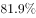和，分别比上年提升26.2个和40.4个百分点，固定宽带用户均资费同比下降。该省移动互联网用户数达1.15亿，移动互联网接入流量同比增长，移动流量资费水平同比下降，通信资费总体水平同比下降。

### 第 11 题　qid 2047806 · 比重

2016年该省完成的通信业务总量占邮政通信业务总量的比重相比2014年大约：

- **A**. 提高了0.6个百分点
- **B**. 降低了0.6个百分点
- **C**. 提高了1.9个百分点
- **D**. 降低了1.9个百分点　✅

**答案**：D

**官方解析**

由题干“2016年······比重相比2014年”，可判定该题为两期比重问题。定位文字材料第一段“2016年，某省完成邮政通信业务总量6886.15亿元，同比增长，增幅比上年提高27.4个百分点。其中，完成通信业务总量5006.16亿元，增长，增幅提高33.2个百分点”，则该省完成的通信业务总量2016年相比2014年的增长率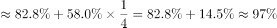，邮政通信业务总量2016年相比2014年的增长率。该省完成的通信业务总量的，邮政通信业务总量的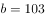，，比重下降，排除AC。代入两期比重公式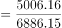，即降低2.1个百分点，与D最接近。

故正确答案为D。

---

### 第 12 题　qid 2047820 · 综合

2015年该省报纸的订销完成量约是杂志的多少倍？

- **A**. 12.3　✅
- **B**. 13.9
- **C**. 15.1
- **D**. 16.7

**答案**：A

**官方解析**

由题干“2015年，······是······的多少倍”，结合材料为2016年，可判定该题为基期倍数问题。定位表格材料“报纸的订销完成量7.8亿件，增速；杂志的订销完成量5596.04万件，增速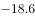”，代入基期倍数公式，只有A项小于13.9。

故正确答案为A。

---

### 第 13 题　qid 2047824 · 增长

2016年该省移动电话用户中4G用户数比2015年大约增加了多少万？

- **A**. 3154
- **B**. 3483　✅
- **C**. 3844
- **D**. 4239

**答案**：B

**官方解析**

题干所求为“2016年······比2015年大约增加了多少万”，可判定该题为增长量计算问题。定位文字材料第三段“2016年该省移动电话用户数为14349万，比上年减少203.1万户。移动电话中4G用户数为9085.30万，占移动电话用户的比重由上年的提升至”。则2015年移动电话用户数为，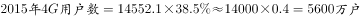，2016年该省移动电话用户中4G用户数比2015年增加了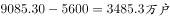，与B最接近。

故正确答案为B。

---

### 第 14 题　qid 2047830 · 综合

根据资料，下列选项无法得出的是：

- **A**. 2016年该省邮政通信业务总量的增长速度约是上一年的2倍
- **B**. 2016年该省手机流量的资费水平大幅降低
- **C**. 4G正成为该省移动电话用户的主流制式
- **D**. 固定宽带运营商未采取有效降低资费水平的措施　✅

**答案**：D

**官方解析**

A项：根据文字材料第一段“2016年，某省完成邮政通信业务总量6886.15亿元，同比增长，增幅比上年提高27.4个百分点”可知，2016年该省邮政通信业务总量的增长速度为，2015年的增长速度为，，正确；

B项：根据文字材料第四段“该省移动互联网用户数达1.15亿，移动互联网接入流量同比增长，移动流量资费水平同比下降”，同比下降属于大幅降低，正确；

C项：根据文字材料第三段“2016年，移动电话中4G用户数为9085.30万，占移动电话用户的比重由上年的提升至”，所占比重超过一半，正确；

D项：根据文字材料第四段“2016年，该省固定互联网宽带用户数为2850.60万，宽带接入流量同比增长，固定宽带用户均资费同比下降”可知，固定宽带用户均资费同比下降，即固定宽带运营商采取了降低资费水平的措施，错误。

本题为选非题，故正确答案为D。

---

### 第 15 题　qid 2047834 · 综合

根据资料可知：

- **A**. 2015年该省的快递业务量比Z省少
- **B**. 2016年该省主要邮政普遍服务项目均出现下滑
- **C**. 2016年该省8M以下宽带接入用户的占比相较于上一年减少了一半以上　✅
- **D**. 2016年该省电话通话时长和短信业务量的下降是由于移动互联网的迅速发展所致

**答案**：C

**官方解析**

A项：根据文字材料第二段“2016年，该省完成快递业务量76.72亿件，同比增长，占全国快递业务量的比重达到，比排名第二的Z省多16.80亿件”可知，仅提供2016年Z省数据，2015年数据无法得知，故无法判断2015年两省数据关系，错误；

B项：根据表格材料数据可知，函件的增长率为正，而非均出现下滑，错误；

C项：根据文字材料第四段“2016年，8M及以上和20M及以上宽带接入用户占比分别为和，分别比上年提升26.2个和40.4个百分点”可知，2016年该省8M以下宽带接入用户的占比为，2015年该省8M以下宽带接入用户占比为，2016年比2015年减少了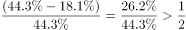，正确；

D项：根据文字材料第三段“固定电话本地通话时长、长途通话时长以及移动电话通话时长同比分别减少、和，移动短信、彩信业务量分别减少和”可知，2016年该省电话通话时长和短信业务量是下降，但无法看出原因，错误。

故正确答案为C。

---
