# 2017年广州市公务员录用考试《行测》题（单考区卷）

> 资料分析 · 15 题 · 广州市考 2017

## 材料 1

        在我国某次调查中，受访者人数为1328人，其中男性受访者共673人，略高于女性受访者的655人。

        从年龄结构看，30-44岁的受访者居多，占；其次是45-59岁的受访者，占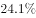；20-29岁的受访者占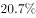；60-74岁的受访者占；20岁以下（不含20岁）和75岁以上的受访者占比比较低，分别是和。

        就受教育程度而言，大学本科的受访者居多，占；其次是中专和大专的受访者，分别占和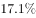；高中、初中的受访者分别占和；小学及以下的受访者占；研究生及以上的受访者较少，仅占。

        从职业来看，本次调查涵盖了各类职业人群。其中，专业技术人员占，位居首位，紧跟其后的是商业、服务人员，占；受访者中有较多的学生和离退休人员，分别占和。

        就月收入情况而言，无收入的受访者占；收入在2000元以内的受访者占；收入在2001-3000元的受访者占。的受访者收入在3001-4000元，收入在4001-6000元的受访者占；收入在6000元以上的受访者占，其比重比去年增加了4.2个百分点。

        从婚姻状况来看，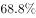的受访者已婚，的受访者未婚，离婚和丧偶的受访者分别占和。

### 第 1 题　qid 2045766 · 综合

男性受访者约占总受访者的（  ）。

- **A**. 

- **B**. 

　✅
- **C**. 

- **D**. 

**答案**：B

**官方解析**

根据问题所求“…占…”，选项为百分数，且所求为现期，可判定此题为现期比重问题。定位材料第一段，“受访者人数为1328人，其中男性受访者共673人”，则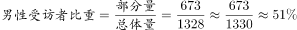。

故正确答案为B。

---

### 第 2 题　qid 2045768 · 比重

20岁以上（含20岁），未婚的受访者占比约为（  ）。

- **A**. 

- **B**. 

　✅
- **C**. 

- **D**. 

**答案**：B

**官方解析**

根据问题所求“···占比约为···”，选项为百分数，且所求为现期，可判定此题为现期比重问题。定位材料第二段“20岁以下（不含20岁）”的受访者占比，定位材料第六段，“的受访者未婚”，根据常识男性法定婚龄为22岁、女性20岁，因此20岁以下（不含20岁）的应为未婚者，则20岁以上（含20岁）未婚者占比约为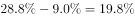，最接近B项。

故正确答案为B。

注：本题对题干的理解存在歧义，第一种理解是在全部受访者中，20岁以上（含20岁）且未婚的占比，解题方法如上述解析所示；第二种是在20岁以上（含20岁）的受访者中，未婚的受访者占比，解题方式应该再追加一步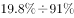。由于整篇材料和其他四个题目均为占总体受访者占比，所以粉笔推荐第一种理解和解答方式。

---

### 第 3 题　qid 2045770 · 综合

已知去年受访者总人数为1467人，则月收入在6000元以上的受访者比今年约少了（  ）人。

- **A**. 10
- **B**. 30　✅
- **C**. 60
- **D**. 100

**答案**：B

**官方解析**

根据问题所求“……比今年约少了多少人”可判定此题为增长量计算。定位材料第五段，“收入在6000元以上的受访者占，其比重比去年增加了4.2个百分点”，则去年比重为；定位材料第一段今年“受访者人数为1328人”，则今年收入在6000元以上的受访者为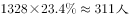，去年人数为，去年比今年少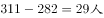，最接近B项。

故正确答案为B。

---

### 第 4 题　qid 2045772 · 比重

从受教育程度来看，（  ）的受访者人数占比最多。

- **A**. 大学本科及以上
- **B**. 高中及大专　✅
- **C**. 中专
- **D**. 初中及以下

**答案**：B

**官方解析**

定位材料第三段，A项，B项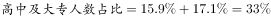，C项中专人数占比为，D项，高中及大专的受访者人数占比最多。

故正确答案为B。

---

### 第 5 题　qid 2045774 · 综合

以下关于这次调查的说法，推论正确的有（  ）。

（1）月收入在4000元以上的受访者占大部分；

（2）在所有受访者中，第三大受访群体是学生；

（3）20-44岁的受访者占了受访者总体的半壁江山；

（4）离退休人员中有的人没有收入。

- **A**. 1个　✅
- **B**. 2个
- **C**. 3个
- **D**. 4个

**答案**：A

**官方解析**

（1）定位材料第五段，月收入在4000元以上者包括收入4001-6000元、6000元以上者，占比为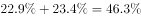，占比不足总人数一半，非大部分，错误；

（2）定位材料第四段，只明确给出第一、二大受访群体，还有受访群体数据未知，不能确定学生一定是第三大受访群体，所以无法判定，错误；

（3）定位材料第二段，30-44岁、20-29岁占比分别为、，则20-44岁占比，正确；

（4）材料没有涉及离退休人员收入的数据，无法判定，错误。

正确的只有（3）1个。

故正确答案为A。

---

## 材料 2

        2011年，全国教育经费总投入为23869.29亿元，比上年增长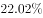。2012年，全国教育经费总投入比上年增加3826.68亿元。2013年，全国教育经费总投入比上年增长，比2009年翻了一番。2014年，全国教育经费总投入32806.46亿元。2015年1-9月，全国财政教育支出累计同比增长。

        2015年，全国普通本专科院校招生人数约为737万人，其中普通本科院校招生人数389万人，比普通专科院校多41万人；在校人数约为2626万人，其中普通本科院校约1577万人，普通专科院校约1049万人；毕业人数约为1000万人，其中普通本科院校约占，普通专科院校约占。

### 第 6 题　qid 2045734 · 综合

2013年，全国教育经费总投入约为（  ）亿元。

- **A**. 28200
- **B**. 25600
- **C**. 30400　✅
- **D**. 34700

**答案**：C

**官方解析**

由题干“2013年，全国教育经费总投入约······”，结合文字材料第一段，可以算出2012年的全国教育经费总投入，且题目中直接给出了2013年全国教育经费总投入较2012年的增长率，可判定该题为现期计算问题。定位材料第一段，2011年，全国教育经费总投入为23869.29亿元；2012年，全国教育经费总投入比上年增加3826.68亿元；2013年，全国教育经费总投入比上年增长。可得2012年全国教育经费总投入亿元，2013年全国教育经费总投入亿元，选项C最接近。

故正确答案为C。

---

### 第 7 题　qid 2045738 · 增长

2014年，全国教育经费投入增速较上年相比约（  ）。

- **A**. 下降了3.2个百分点
- **B**. 提高了3.2个百分点
- **C**. 下降了1.6个百分点　✅
- **D**. 提高了1.6个百分点

**答案**：C

**官方解析**

由题干“2014年，全国教育经费投入增速较上年相比”，结合材料2013年的增长率已经给出，可判定该题为一般增长率问题。定位文字材料第一段，2013年，全国教育经费总投入比上年增长，2014年全国教育经费总投入32806.46亿元，结合上题，2013年全国教育经费总投入约为30400亿元。可得2014年全国教育经费投入增速，2014年全国教育经费投入增速较上年相比，约下降了1.6个百分点。

故正确答案为C。

---

### 第 8 题　qid 2045742 · 综合

上表所列省（市）中，2015年普通专科院校招生人数不多于该类院校毕业人数的有（  ）个。

- **A**. 3
- **B**. 4　✅
- **C**. 5
- **D**. 6

**答案**：B

**官方解析**

要满足题干所给条件的省（市），则该省（市）的第二列数据（专科招生人数）第六列数据（专科毕业生人数），通过观察，可发现北京、河北、江苏、浙江四个省（市）满足该条件，因此有4个省（市）2015年普通专科院校招生人数不多于该类院校毕业人数。

故正确答案为B。

---

### 第 9 题　qid 2045746 · 综合

以下省份中，2015年普通本专科院校毕业人数占全国普通本专科院校毕业人数的是（  ）。

- **A**. 江苏　✅
- **B**. 四川
- **C**. 湖南
- **D**. 河北

**答案**：A

**官方解析**

由题干“2015年······占······”，可判定该题为现期比重问题，定位数据表最后两列，2015年全国本科院校毕业人数681万人，专科院校毕业人数319万人，共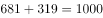万人，则其为万人，2015年江苏本专科院校毕业人数万人，满足条件。

故正确答案为A。

---

### 第 10 题　qid 2045752 · 综合

根据上述资料，以下推论准确的是（  ）。

- **A**. 2010年，全国教育经费总投入超过20000亿元
- **B**. 2015年，河南省普通本专科院校招生总人数位列全国第一
- **C**. 除北京市外，其他省（市）普通本专科院校在校总人数均超过100万
- **D**. 上表所列省（市），普通本科院校在校人数均大于该省（市）普通专科院校在校人数　✅

**答案**：D

**官方解析**

A项：定位文字材料第一段，2010年全国教育经费总投入亿元，错误；

B项：定位数据表中第二、三列，2015年河南普通本专科院校招生总人数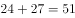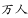，2015年广东普通本专科院校招生总人数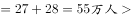2015年河南普通本专科院校招生总人数，且材料只给出部分省市的招生人数，其他省份情况未知不能判断，错误；

C项：定位数据表中第四列和第五列,浙江省本专科院校在校人数，且材料只给出部分省（市）的在校人数，其他省份情况未知不能判断，错误；

D项：定位数据表中第四列和第五列，所有省（市）需满足第四列第五列，通过比较，所有省（市）均满足该条件，正确。

故正确答案为D。

---

## 材料 3

        我国供气来源多元化，主要包括国产气和进口气两部分。国产气主要有常规天然气、页岩气和煤层气等，进口气主要有进口LNG和进口管输气。近年来，我国天然气供应量稳步增加，国产气、进口管输气、进口LNG都呈上涨趋势。国产气从2010年的989.7亿立方米增至2014年的1344.8亿立方米，增长了355.1亿立方米。进口管输气从2010年的35.5亿立方米增至2014年的313亿立方米，增长了7.82倍。

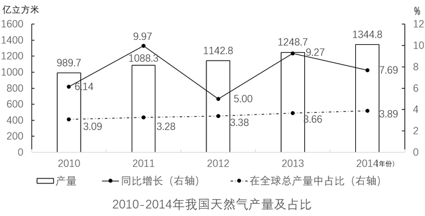

### 第 11 题　qid 2045756 · 增长

2010—2014年，我国各类天然气供应量年均增速由高到低排列正确的是（  ）。

- **A**. 管输进口量、LNG进口量、国产气量　✅
- **B**. 国产气量、LNG进口量、管输进口量
- **C**. 国产气量、管输进口量、LNG进口量
- **D**. LNG进口量、国产气量、管输进口量

**答案**：A

**官方解析**

题干所求为年均增速的排序，可判定本题为年均增长率的比较问题。当年份差相同时，直接比较即可。定位图一可得，管输进口量的为：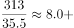；LNG进口量的为：；国产气量的为：。则年均增速由高到低排序应为：管输进口量、LNG进口量、国产气量，A项满足。

故正确答案为A。

---

### 第 12 题　qid 2045758 · 综合

2014年，全球天然气总产量约是我国各类天然气供应量的（  ）倍。

- **A**. 10
- **B**. 18　✅
- **C**. 27
- **D**. 30

**答案**：B

**官方解析**

题干所求为“2014年，全球天然气总产量是我国供应量的多少倍”，可判定本题为现期倍数计算问题。定位图二，2014年我国天然气产量为1344.8亿立方米，占全球总产量的比重为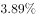，则全球天然气总产量。定位图一，2014年我国各类天然气供应量亿立方米。2014年，全球天然气总产量约是我国各类天然气供应量的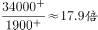，与B项接近。 

故正确答案为B。

---

### 第 13 题　qid 2045760 · 比重

我国进口管输气占全球天然气总产量比重最小的是（  ）年。

- **A**. 2014
- **B**. 2013
- **C**. 2012
- **D**. 2010　✅

**答案**：D

**官方解析**

题干所求为“我国进口管输气占全球天然气总产量比重最小的一年”，可判定本题为比重比较问题。

方法一：全球天然气总产量可根据图二中的数据，用我国天然气产量÷在全球总量中的占比（虚线的折线），即

2010年：；2012年：；2013年：；2014年：。

由于产量在逐年上升，占比也在逐年上升，两数相除数字变化不大。再结合图一，我国进口管输气的量（中间黑色柱子），2010年产量是35.5亿立方米远小于其他年份214、274、313亿立方米。这样可以利用分母变化慢、分子变化快，分子小、分数小的原理来判断，得出2010年比重最小。

方法二：结合图一与图二，各年份所求占比分别为：

A项：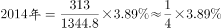；

B项：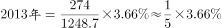；

C项：；

D项：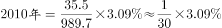。

对比选项，D项乘式两边均小于其他三项，故D项最小。

故正确答案为D。

---

### 第 14 题　qid 2045762 · 综合

以下数据不能从材料中得到的是（  ）。

- **A**. 2011年我国管输进口量同比增速
- **B**. 2009年我国天然气产量
- **C**. 2010年全球天然气总产量同比增速　✅
- **D**. 我国2010-2014年5年间LNG平均进口量

**答案**：C

**官方解析**

A项：由图一可知2011年和2010年管输进口量，根据增长率计算公式，可求出2011年管输进口量的同比增速。

B项：由图二可知2010年我国天然气产量和同比增长率，根据基期量公式，可求出2009年我国天然气产量。

C项：由图二可以求出2010年全球天然气产量，但无法得知2009年全球天然气产量，所以无法求出2010年全球天然气产量的同比增速。

D项：由图一可知2010年—2014年各年份的LNG进口量，故可以求出5年间的平均值。

本题为选非题，故正确答案为C。

---

### 第 15 题　qid 2045764 · 综合

以下说法错误的是（  ）。

- **A**. 2010-2014年，全球天然气总产量逐年递增
- **B**. 我国天然气产量2013年同比增长近2倍　✅
- **C**. 2010-2014年，我国天然气的供应主要依靠国产气
- **D**. 2012年，我国管输进口量反超LNG进口量

**答案**：B

**官方解析**

A项：根据图二可得，2010-2014年，全球天然气总产量分别为： 、 、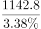 、 、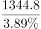。分子增长率可以看实线折线图，而分母增长率均小于分子增长率，分子变化快，看分子，分子逐步增大，故分数逐步增大，说法正确；

B项：方法一：2012年我国天然气产量1142.8亿立方米   ，2013年我国天然气产量1248.7亿立方米   ，比较两个数字，我国天然气产量2013年同比增长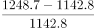，并非增长2倍。

方法二：看折线图（实线），2013年我国天然气的增长率为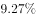，并非同比增长近2倍，说法错误；

C项：由图一可知，我国各类天然气中国产气量在2010-2014年均是三者之中最多的，所占比重均超过，我国天然气的供应主要靠国产气，说法正确；

D项：由图一可知，2011年管输进口量少于LNG进口量，2012年管输进口量超过LNG进口量，说法正确。

本题为选非题，故正确答案为B。

---
