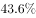
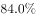
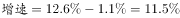
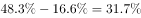
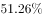
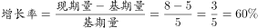
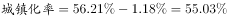
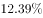
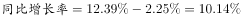
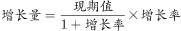

# 2017年新疆兵团公务员录用考试《行测》题（网友回忆版）

> 资料分析 · 12 题 · 新疆 2017

## 材料 1

        2017年1-8月，W省完成民间固定资产投资（以下简称民间投资）10287.23亿元，同比增长，比全国民间投资增速快6.2个百分点，比上年同期快10.2个百分点，比上半年和一季度分别加快1.1个和6.0个百分点。

        1-8月，全省民间投资增速比国有经济投资增速低1.6个百分点，比1-7月差距缩小1.7个百分点，比上半年缩小4.3个百分点，比一季度缩小17.4个百分点。

        1-8月，全省民间投资占全部投资的比重为，比一季度、上半年、1-7月分别提高3.1、0.4和0.1个百分点。

        民间投资主要集中在工业和房地产业。1-8月，全省工业民间投资占全部民间投资的比重为，其中，制造业民间投资占全部民间投资的比重为；工业民间投资占全部工业投资的比重为，其中，制造业民间投资占全部制造业投资的比重为。房地产开发投资是W省民间投资的第二大领域，1-8月，全省房地产开发民间投资占全部民间投资的比重为，占全部房地产开发投资的比重为。

### 第 1 题　qid 2144714 · 综合

2016年1-8月，W省完成民间固定资产投资约为（  ）亿元。

- **A**. 9136.08　✅
- **B**. 9257.31
- **C**. 10875.22
- **D**. 11583.42

**答案**：A

**官方解析**

根据“2016年1-8月，亿元”判断本题为基期计算问题。定位材料第一段，2017年1-8月，W省完成民间固定资产投资10287.23亿元，同比增长。则2016年1-8月亿元，与A项最接近。

故正确答案为A。

---

### 第 2 题　qid 2144720 · 增长

2017年上半年，W省完成民间固定资产投资同比增长约（  ）个百分点。

- **A**. 2.4
- **B**. 6.0
- **C**. 6.4
- **D**. 11.5　✅

**答案**：D

**官方解析**

根据“2017年上半年，同比增长多少个百分点”判断本题为一般增长率问题。定位第一段，2017年1-8月，W省完成民间固定资产投资同比增长，比上半年加快1.1个百分点。2017年上半年。

故正确答案为D。

---

### 第 3 题　qid 2144734 · 增长

2017年1-8月，W省国有经济投资增速为（  ）。

- **A**. 

- **B**. 

- **C**. 

- **D**. 

　✅

**答案**：D

**官方解析**

根据“2017年1-8月，增速为”判断本题为一般增长率问题。定位材料第一、二段，2017年1-8月，W省完成民间固定资产投资同比增长，全省民间投资增速比国有经济投资增速低1.6个百分点，所以。

故正确答案为D。

---

### 第 4 题　qid 2144739 · 综合

2017年1-8月，W省完成全部投资约为（  ）亿元。

- **A**. 15037.31
- **B**. 16458.62
- **C**. 17465.59　✅
- **D**. 18037

**答案**：C

**官方解析**

根据“2017年1-8月，亿元”，且材料中有民间投资占全部投资的比重，判断本题为现期比重问题。定位材料一、三段，2017年1-8月，W省完成民间固定资产投资（以下简称民间投资）10287.23亿元。1-8月，全省民间投资占全部投资的比重为。亿元，与C项最接近。

故正确答案为C。

---

### 第 5 题　qid 2144748 · 增长

根据上述资料，下列说法中正确的有（  ）个。
（1）2017年1-8月，W省制造业民间投资占全部民间投资的比重大于其占全部制造业投资的比重
（2）2017年1-8月，W省工业民间投资占全部民间投资的比重比房地产开发民间投资占全部民间投资的比重大31.7个百分点
（3）2017年以来，W省民间投资增速与国有经济投资增速的差距逐月增大

- **A**. 0
- **B**. 1　✅
- **C**. 2
- **D**. 3

**答案**：B

**官方解析**

（1）项：定位材料第四段，制造业民间投资占全部民间投资的比重为；制造业民间投资占全部制造业投资的比重为。因此制造业民间投资占全部民间投资的比重小于其占全部制造业投资的比重。错误；

（2）项：定位材料第四段，1-8月，全省工业民间投资占全部民间投资的比重为，全省房地产开发民间投资占全部民间投资的比重为。。正确；

（3）项：定位材料第二段，材料中给出的是1-8月，1-7月，上半年以及一季度数据，并没有逐月数据，因此并不能判断民间投资增速与国有经济投资增速的差距逐月变化情况。错误。

只有（2）正确。

故正确答案为B。

---

## 材料 2

        2012-2016年，S省城镇化水平快速提高。2016年末，S省常住人口3681.61万人，其中居住在城镇区域的常住人口2069.63万人，较2015年末增加53.26万人；城镇化率达，居全国第16位，比2015年提高1.18个百分点。

        与2012年相比，城镇化率提高了4.95个百分点，高于这一时期全国平均增幅0.17个百分点。与全国城镇化平均水平的差距由2012年的1.31个百分点缩小为1.14个百分点。

2016年，全省11个市中城镇人口超过的市由2012年的5个增加为8个。城镇化水平较低的E市、F市、G市均实现了较快的增长，年均增长率分别达到1.56、1.62和1.53个百分点，区域间城镇化水平差距进一步缩小，全省城镇化保持了较快的增长势头。

### 第 6 题　qid 2144681 · 综合

2015年末，S省居住在城镇区域的常住人口有（  ）万人。

- **A**. 2025.36
- **B**. 2070.58
- **C**. 2034.87
- **D**. 2016.37　✅

**答案**：D

**官方解析**

定位材料第一段“2016年······城镇区域的常住人口2069.63万人，较2015年末增加53.26万人”可知2015年末S省居住在城镇区域的万人。

故正确答案为D。

---

### 第 7 题　qid 2144691 · 综合

2012年，S省城镇化率为（  ）。

- **A**. 

- **B**. 

　✅
- **C**. 

- **D**. 

**答案**：B

**官方解析**

定位材料第一段“2016年······城镇化率达······与2012年相比，城镇化率提高了4.95个百分点”。可知2012年S省。

故正确答案为B。

---

### 第 8 题　qid 2144696 · 平均数

2012-2016年间，S省城镇化水平与全国城镇化平均水平的差距最小的是（  ）。

- **A**. 2012年
- **B**. 2013年
- **C**. 2014年　✅
- **D**. 2015年

**答案**：C

**官方解析**

定位图形材料，S省城镇化水平与全国城镇化平均水平的差距最小的是2014年。
故正确答案为C。

---

### 第 9 题　qid 2144703 · 增长

与2012年相比，2016年S省城镇人口超过的城市数量增长了（  ）。

- **A**. 

- **B**. 

- **C**. 

　✅
- **D**. 

**答案**：C

**官方解析**

由题意“与2012年相比，2016年S省······增长了”且选项为百分数，判定此题为一般增长率问题。定位材料“2016年，全省11个市中城镇人口超过的市由2012年的5个增加为8个。”根据。

故正确答案为C。

---

### 第 10 题　qid 2144707 · 增长

根据上述资料，下列说法中<b>错误</b>的有（  ）个。

（1）2015年，S省城镇化率为

（2）2012-2016年间，全国城镇化水平平均增幅为

（3）2012-2016年间，S省城镇化水平较低的城市中，年均增长率最低的是E市

- **A**. 0
- **B**. 1
- **C**. 2
- **D**. 3　✅

**答案**：D

**官方解析**

（1）定位文字材料第一段“2016年······城镇化率达，比2015年提高1.18个百分点。” 2015年S省。错误；

（2）定位文字材料第一段“······与2012年相比，城镇化率提高了4.95个百分点，高于这一时期全国平均增幅0.17个百分点······”，可知全国城镇化水平，错误；

（3）定位文字材料第三段“2016年，全省11个市中城镇人口超过的市由2012年的5个增加为8个。城镇化水平较低的E市、F市、G市均实现了较快的增长，年均增长率分别达到1.56、1.62和1.53个百分点。” 年均增长率最低的是G市，错误。

则说法中错误的有3个。

故正确答案为D。

---

## 材料 3

        2017年上半年医药工业规模以上企业实现主营业务收入15314.40亿元，同比增长，增速较上年同期提高2.25个百分点。各子行业中，增长最快的是中药饮片加工，化学药品制剂、中成药、制药设备的增速低于行业平均水平。

### 第 11 题　qid 2144731 · 综合

在医药工业规模以上企业实现主营业务收入上，2017年上半年约是2015年上半年的（  ）。

- **A**. 1.13倍
- **B**. 0.13倍
- **C**. 1.24倍　✅
- **D**. 0.24倍

**答案**：C

**官方解析**

根据题干所求“······2017年······约是2015年······”，时间存在间隔，结合选项为倍数，可判定此题为间隔增长率问题。定位文字材料“2017年上半年医药工业······，同比增长，增速较上年同期提高2.25个百分点”，可知2016年上半年医药工业规模以上企业实现主营业务收入。所以，只有C满足。

故正确答案为C。

---

### 第 12 题　qid 2144733 · 增长

2017年上半年，中成药制造的主营业务收入较上年约增加了（  ）。

- **A**. 371亿元
- **B**. 330亿元　✅
- **C**. 300亿元
- **D**. 30亿元

**答案**：B

**官方解析**

根据题干所求“······约增加了”，结合选项带单位，可判定此题为增长量计算问题。定位表格，2017年上半年，中成药制造的主营业务收入3339.72亿元，同比增长率为，所以，最接近B项。

故正确答案为B。

---
