# 2017年江苏省公务员录用考试《行测》题(A类)

> 资料分析 · 20 题 · 江苏 2017

## 材料 1

        2005年我国GDP为187318.9亿元人民币，主要能源生产总量为228.9百万吨标准煤，主要能源为原煤、原油、天然气和水风核电，分别生产177.2百万吨标准煤、25.9百万吨标准煤、6.6百万吨标准煤和19.2百万吨标准煤。“十一五”“十二五”时期我国主要能源生产情况见下表。

         <b>表2006-2015年我国主要能源生产情况         单位：百万吨标准煤</b>

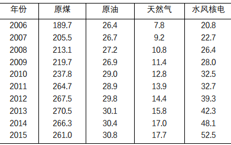

### 第 1 题　qid 2042786 · 增长

2012-2015年我国主要能源生产总量年增加最少的年份是：

- **A**. 2015年　✅
- **B**. 2014年
- **C**. 2013年
- **D**. 2012年

**答案**：A

**官方解析**

根据题干所求“年增加最少的年份”可判定本题为增长量比较问题。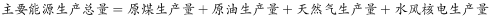，。代入表格数据，可得：

2015年主要能源生产总量增加量：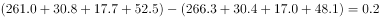

2014年主要能源生产总量增加量：

2013年主要能源生产总量增加量：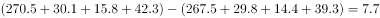

2012年主要能源生产总量增加量：

增长量最少的为2015年。

故正确答案为A。 

---

### 第 2 题　qid 2042790 · 增长

自2016年起，若我国水风核电年产量均按2006-2015年平均增速增长，则2025年我国水风核电产量将为

- **A**. 84.2百万吨标准煤
- **B**. 85.8百万吨标准煤
- **C**. 132.5百万吨标准煤
- **D**. 143.6百万吨标准煤　✅

**答案**：D

**官方解析**

根据题干“按2006-2015年平均增速增长”，可判定本题为年均增长率问题。定位文字材料和表格可得，2005、2015年水风核电生产量分别为19.2、52.5百万吨标准煤；

自2016年起，按2006-2015年平均增速增长，2016-2025年与2006-2015年间隔年数相同；

则2016-2025与2006-2015年增长率相同，2025年水风核电产量为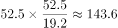百万吨标准煤。

故正确答案为D。 

---

### 第 3 题　qid 2042794 · 比重

2015年我国非原煤主要能源产量之和占主要能源生产总量的比重与2005年相差：

- **A**. 4.3个百分点
- **B**. 5.3个百分点　✅
- **C**. 6.3个百分点
- **D**. 7.3个百分点

**答案**：B

**官方解析**

根据题干所求“2015年……比重与2005年相差”可判定本题为两期比重问题。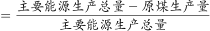，代入表格数据可得：2015年比重为，代入文字材料数据可得：2005年比重为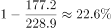，二者约相差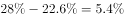，最接近B项。

故正确答案为B。 

---

### 第 4 题　qid 2042798 · 增长

2006-2015年我国原煤产量年增长率超过的年份个数有

- **A**. 0个
- **B**. 1个　✅
- **C**. 2个
- **D**. 3个

**答案**：B

**官方解析**

根据题干所求“年增长率超过的年份个数”，可判定本题为增长率问题。，代入材料数据可得：

2015年：；2014年：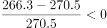；2013年：；

2012年：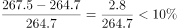；2011年：；

2010年：；2009年：；

2008年：；2007年：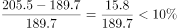；2006年：。超过的年份为2011年。

故正确答案为B。 

---

### 第 5 题　qid 2042806 · 综合

下列判断正确的是：

- **A**. 
2005年我国单位GDP能耗为12.38万吨标准煤/亿元人民币

- **B**. 
“十二五”时期，我国原煤产量比“十一五”时期增长超过

- **C**. 
2015年我国水风核电产量占主要能源生产总量的比重比上年有所提升
　✅
- **D**. 
2011-2015年我国原油、天然气和水风核电产量均逐年增加

**答案**：C

**官方解析**

A项：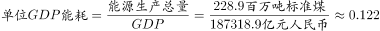万吨标准煤亿元人民币，错误；

B项：“十二五”即2011-2015年的原煤产量为百万吨标准煤，“十一五”即2006-2010年的原煤产量为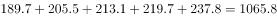百万吨标准煤，增长率为，错误；

C项：方法一：2015年我国水风核电产量占主要能源生产总量的比重为，2014年比重为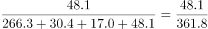，前者较后者，分子增长多于分母，故2015年比重较高，正确；

方法二：2015年水风核电产量增量为，根据本篇资料第一题计算数据，2015年主要能源生产总量增量为0.2，故部分增速大于总量增速，该部分占总量比重上升，正确；

D项：定位表格数据可得，2011年原油生产量为28.9百万吨标准煤，少于2010年的29.0百万吨标准煤，错误。

故正确答案为C。 

---

## 材料 2

        2016年某市一次有关市民邻里关系的调查显示，在受访的951位市民中，“没有邻居”的有6位。“有邻居”的受访市民中，对邻居表示“了解”的占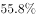（“了解”分“很了解”和“部分了解”，占比分别为和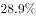），其余的表示“不了解”；对邻里关系表示“满意”的占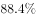，（“满意”分为“很满意”和“比较满意”，占比分别为和），“不满意”的占，其余不愿表态，对邻里关系感到“满意”和“不满意”的主要原因分别见图1和图2。

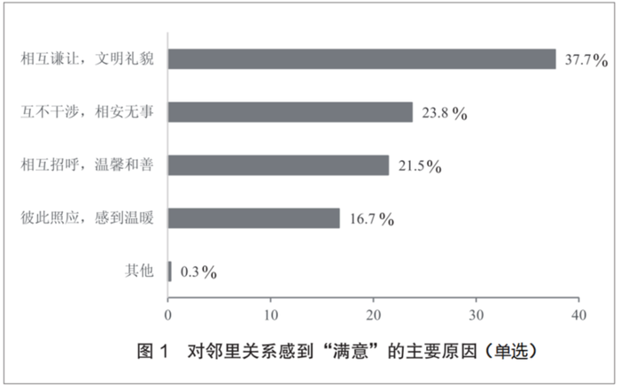

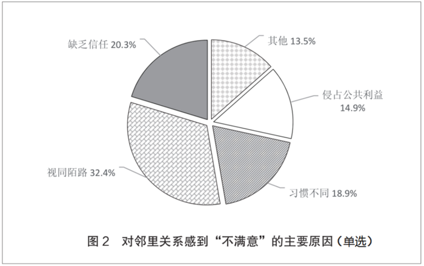

### 第 6 题　qid 2042814 · 综合

受访市民中，“不了解”邻居的有？

- **A**. 275人
- **B**. 365人
- **C**. 412人
- **D**. 418人　✅

**答案**：D

**官方解析**

题干所求为“不了解”邻居的人数，结合材料所给为总量与占比，可判定本题为现期比重计算问题。定位文字材料，在受访的951位市民中，“没有邻居”的有6位，则“有邻居”的受访市民一共有位，“有邻居”的受访市民中，对邻居表示“了解”的占，其余的表示“不了解”。对邻居“不了解”的市民。则“不了解”邻居的，与D项接近。

故正确答案为D。

---

### 第 7 题　qid 2042816 · 比重

对邻里关系感到“不满意”的受访市民中，主要原因是“视同陌路”的占比比“习惯不同”多几个百分点？

- **A**. 13.5个百分点　✅
- **B**. 15.7个百分点
- **C**. 17.5个百分点
- **D**. 18.9个百分点

**答案**：A

**官方解析**

定位饼状图材料，对邻里关系感到“不满意”的受访市民中，主要原因是“视同陌路”的所占比重为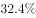，“习惯不同”的为。则“视同陌路”所占比重比“习惯不同”的多：，即13.5个百分点。

故正确答案为A。

---

### 第 8 题　qid 2042818 · 综合

“有邻居”的受访市民中，感到“比较满意”的人数比“很满意”的多多少人？

- **A**. 402人
- **B**. 455人　✅
- **C**. 458人
- **D**. 470人

**答案**：B

**官方解析**

题干所求为“比较满意”的人数比“很满意”的多多少人，可判定本题为现期比重比较问题。定位文字材料，在受访的951位市民中，“没有邻居”的有6位。“有邻居”的受访市民中，对邻里关系表示“满意”的占，（“满意”分为“很满意”和“比较满意”，占比分别为和），则感到“比较满意的”人数比“很满意”的多 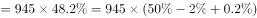

故正确答案为B。

---

### 第 9 题　qid 2042820 · 综合

在感到“满意”的受访市民中，主要原因为“相互谦让，文明礼貌”的受访市民是“彼此照应，感到温暖”受访市民的多少倍？

- **A**. 1.6倍
- **B**. 1.8倍
- **C**. 2.3倍　✅
- **D**. 3.1倍

**答案**：C

**官方解析**

由“······是······的多少倍”，可判定本题为现期倍数问题。定位图1，在感到“满意”的受访市民中，主要原因为“相互谦让，文明礼貌”的受访市民所占比重为，主要原因为“彼此照应，感到温暖”的所占比重为，则前者是后者的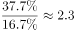倍。

故正确答案为C。

---

### 第 10 题　qid 2042822 · 综合

下列判断正确的是：

- **A**. 
有531位受访市民“了解”邻居

- **B**. 
超过的受访市民因感到与邻居“缺乏信任”而对邻里关系“不满意”

- **C**. 
对邻里关系感到“很满意”的受访市民数不及“比较满意”市民数的三分之一
　✅
- **D**. 
对邻居表示“了解”的受访市民中，对邻里关系感到“很满意”的超过三分之一

**答案**：C

**官方解析**

A项：定位文字材料，在受访的951位市民中，“没有邻居”的有6位。“有邻居”的受访市民中，对邻居表示“了解”的占。则对邻居表示“了解”的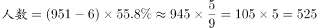名，错误；

B项：由饼状图可知，因“缺乏信任”而对邻里关系“不满意”的市民占“不满意总数”的比重为，并非占“受访市民总数”的比重，错误；

C项：定位文字材料，对邻里关系表示“满意”的占“有邻居”受访市民的，（“满意”分为“很满意”和“比较满意”，占比分别为和）。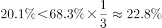，正确；

D项：根据材料，无从得出对邻居表示“了解”与“很满意”之间的关系，错误。

故正确答案为C。

---

## 材料 3

        2015年J省S市全社会研发经费投入占地区生产总值的比重为，比2010年提高0.3个百分点。其中，规模以上工业企业研发经费投入占全社会研发经费投入的。规模以上工业企业中，建有独立研发机构的占，以上的大型企业建有独立研发机构。

        2015年末该市拥有技术企业3478家，人才总数由2010年末的146万人增加到2015年末的227万人。其中，高层次人才由2010年末的8万人增加到2015年末的18万人。每万名劳动者中研发人员由158人增加到175人。

        2015年该市发明专利拥有量的90%来自于企业，2010-2015年S市发明专利申请量、授权量占全省专利申请量、授权量的比重，以及万人发明专利拥有量情况见下表。

### 第 11 题　qid 2042846 · 比重

2015年该市发明专利申请量占全省的比重比2010年提高了：

- **A**. 22.5个百分点
- **B**. 27.0个百分点　✅
- **C**. 32.1个百分点
- **D**. 40.8个百分点

**答案**：B

**官方解析**

根据问题所求“2015年······比重比2010年提高”，可判定本题为两期比重问题。定位表格可得，2015年该市发明专利申请量占全省的比重为，2010年为，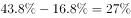，即2015年比重比2010年提高27个百分点。

故正确答案为B。

---

### 第 12 题　qid 2042848 · 平均数

“十二五”期间（2011-2015年），该市人才总数年平均增加人数是：

- **A**. 13.6万人
- **B**. 14.2万人
- **C**. 15.6万人
- **D**. 16.2万人　✅

**答案**：D

**官方解析**

根据问题所求“年平均增加人数”，可判定本题为年均增长量计算问题。定位文字材料第二段可得“2015年末该市······人才总数由2010年末的146万人增加到2015年末的227万人”。则2011-2015年平均增加人数为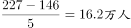。

故正确答案为D。

---

### 第 13 题　qid 2042850 · 比重

2015年该市规模以上工业企业研发经费投入占地区生产总值的比重是：

- **A**. 

- **B**. 

- **C**. 

　✅
- **D**. 

**答案**：C

**官方解析**

根据问题所求“2015年······比重是”，可判定此题为现期比重问题。定位文字材料第一段可得，“2015年J省S市全社会研发经费投入占地区生产总值的比重为······其中，规模以上工业企业研发经费投入占全社会研发经费投入的”。2015年规模以上工业企业研发经费投入占地区生产总值的比重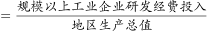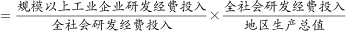

故正确答案为C。

---

### 第 14 题　qid 2042852 · 综合

设2015年J省发明专利授权率（授权量占申请量之比）为a，则2015年S市发明专利授权率是：

- **A**. 0.38a　✅
- **B**. 0.63a
- **C**. 0.78a
- **D**. 1.05a

**答案**：A

**官方解析**

根据题干“专利授权率（授权量占申请量之比）”，结合表格数据条件为S市发明专利申请量、授权量占全省专利申请量、授权量的比重，判定本题为现期比重问题。

，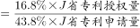，与A项最接近。

故正确答案为A。 

---

### 第 15 题　qid 2042854 · 综合

下列判断不正确的是：

- **A**. 
2015年该市万人发明专利拥有量中有24.7件来自企业

- **B**. 
2015年，该市大型企业中，没有独立研发机构的不到

- **C**. 
“十二五”时期，该市发明专利申请量占全省的比重年增幅最大的年份是2015年
　✅
- **D**. 
“十二五”时期末，该市高层次人才数占人才总数的比重比“十一五”时期末提高了2个百分点

**答案**：C

**官方解析**

A项：定位文字材料第三段可得“2015年该市发明专利拥有量的90%来自于企业”，定位表格可得，2015年万人拥有量为27.4件，则万人发明专利拥有量中来自企业的为件，正确；

B项：定位文字材料第一段可得“以上的大型企业建有独立研发结构”，则没有独立研发机构的占比少于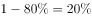，正确；

C项：定位表格可得，2015年该市发明专利申请量占全省的比重为，2014年比重为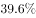，2013年比重为，则2015年增长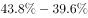个百分点，2014年增长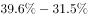个百分点，2014年比重增幅超过2015年，错误；

D项：定位文字材料第二段可得“人才总数由2010年末的146万人增加到2015年末的227万人。其中，高层次人才由2010年末的8万人增加到2015年末的18万人”，则“ 十二五” 时期末，高层次人才数占人才总数的比重比“十一五” 时期末提高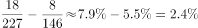，正确。

本题为选非题，故正确答案为C。 

---

## 材料 4

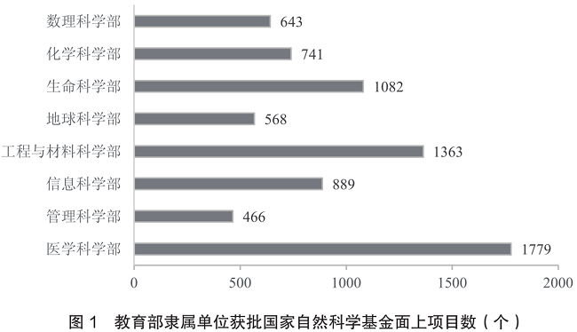

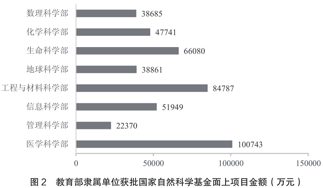

### 第 16 题　qid 2042800 · 综合

2016年教育部隶属单位获批国家自然科学基金面上项目的总金额是：

- **A**. 451216万元　✅
- **B**. 462158万元
- **C**. 446354万元
- **D**. 446893万元

**答案**：A

**官方解析**

定位柱状图二，2016年教育部隶属单位获批国家自然科学基金面上项目的总金额，计算得尾数为6，A项满足。

故正确答案为A。

---

### 第 17 题　qid 2042802 · 比重

2016年国家自然科学基金资助，医学科学部和生命科学部批准项数之和占比是：

- **A**. 

- **B**. 

　✅
- **C**. 

- **D**. 

**答案**：B

**官方解析**

由“2016年······之和占比”，可判定本题为现期比重计算问题。定位表格材料可得，2016年国家自然科学基金资助中，医学科学部批准项数为4102，生命科学部批准项数为2700，批准项数总和为16934。则，与B项最接近。

故正确答案为B。

---

### 第 18 题　qid 2042808 · 综合

2016年国家自然科学基金面上项目资助率最高的科学部是：

- **A**. 地球科学部
- **B**. 数理科学部　✅
- **C**. 管理科学部
- **D**. 化学科学部

**答案**：B

**官方解析**

由题干“项目资助率最高······”，可判定本题为比值比较问题。定位表格材料可得，选项四个项目的资助率分别为：

A项：；

B项：；

C项：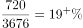；

D项：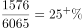；

项目资助率最高的为数理科学部。

故正确答案为B。

---

### 第 19 题　qid 2042810 · 综合

在8个科学部中，教育部隶属单位2016年获批国家自然科学基金面上项目数占本科学部全部批准项目数之比超过的科学部个数是：

- **A**. 4个
- **B**. 3个
- **C**. 2个
- **D**. 1个　✅

**答案**：D

**官方解析**

由“······占······之比超过”，可判定本题为现期比重问题。在8个科学部中，教育部隶属单位获批的项目数占本科学部全部批准项目数之比超过，即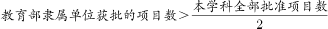。定位表格材料与柱状图一可得，只有管理科学部：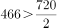，满足题干条件。

故正确答案为D。

---

### 第 20 题　qid 2042812 · 综合

下列说法不正确的是：

- **A**. 
2016年国家自然科学基金面上项目中，信息科学部的批准资助金额占资助总金额的

- **B**. 
2016年国家自然科学基金面上项目受理申请项数较多的科学部批准项数也较多

- **C**. 
2016年教育部隶属单位获批国家自然科学基金面上项目的总项数是6531个
　✅
- **D**. 
2016年国家自然科学基金面上项目的平均资助金额是60万元

**答案**：C

**官方解析**

A项：定位表格可得，2016年国家自然科学基金面上项目中，信息科学部批准资助金额占资助总金额的比重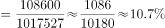，正确；

B项：直接查找表格可知，2016年国家自然科学基金面上项目，受理申请项数越多的科学部，批准项数也越多，正确；

C项：定位柱状图一可得，2016年教育部隶属单位获批基金面上项目总数为个，错误；

D项：定位表格，2016年国家自然科学基金面上项目的平均资助金额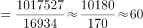万元，正确。

本题为选非题，故正确答案为C。

---
