# 2017年江苏省公务员录用考试《行测》题(B类)

> 资料分析 · 20 题 · 江苏 2017

## 材料 1

        在以2015年11月1日零时为标准时点进行的全国人口抽样调查中。江苏最终样本量占全省常住人口总数的。调查显示：2015年11月1日零时江苏常住人口为7973万人。同以2010年11月1日零时为标准时点进行的第六次全国人口普查相比，增加107万人，增长。

        全省常住人口中，0~14岁人口为1064万人，占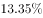；15~64岁人口为5910万人，占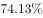；65岁及以上人口为999万人，占。同第六次全国人口普查相比，0~14岁人口的比重上升0.34个百分点，15~64岁人口的比重下降1.97个百分点，65岁及以上人口的比重上升1.64个百分点。

        全省常住人口中，大专及以上文化程度人口为1230万人，高中（含中专）文化程度人口为1356万人；初中文化程度人口为2741万人；小学文化程度人口为1744万人。

### 第 1 题　qid 2042086 · 综合

以2015年11月1日零时为标准时点进行的人口抽样调查中，江苏最终样本量为：

- **A**. 75万人　✅
- **B**. 79万人
- **C**. 82万人
- **D**. 86万人

**答案**：A

**官方解析**

根据“2015年11月1日······人口抽样调查······样本量为”，可判定本题为现期比重问题。定位材料第一段，江苏最终样本量占全省常住人口总数的且2015年11月1日零时江苏常住人口为7973万人，则此时进行的人口抽样调查中，江苏最终样本量为：万人。

故正确答案为A。

---

### 第 2 题　qid 2042090 · 比重

2010年第六次全国人口普查时，江苏0~14岁人口比重比65岁及以上人口：

- **A**. 少0.48个百分点
- **B**. 少2.12个百分点
- **C**. 多0.48个百分点
- **D**. 多2.12个百分点　✅

**答案**：D

**官方解析**

定位材料第二段，2015年11月1日的全国人口抽样调查中，0-14岁人口所占比重为，65岁及以上人口所占比重为，同第六次全国人口普查比，前者比重上升0.34个百分点，后者比重上升1.64个百分点，则第六次全国人口普查时，比重差为：个百分点。

故正确答案为D。

---

### 第 3 题　qid 2042092 · 增长

两次调查的5年间，江苏常住人口中65岁及以上人口增加：

- **A**. 142万人　✅
- **B**. 107万人
- **C**. 116万人
- **D**. 99万人

**答案**：A

**官方解析**

根据题干求增长，结合选项给出单位万人，判定此题为增长量计算问题。定位文字材料第一段，2015年11月1日零时江苏常住人口为7973万人，比第六次全国人口普查增加107万人；定位文字材料第二段，2015年11月1日的调查中，65岁及以上人口人数为999万人，所占比重为，同第六次全国人口普查比，比重上升1.64个百分点，则两次调查5年间，65岁及以上人口增加：万人，A项最接近。

故正确答案为A。

---

### 第 4 题　qid 2042098 · 综合

2015年11月1日零时江苏常住人口中，高中（含中专）及以上文化程度人口占：

- **A**. 

- **B**. 
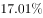

- **C**. 

　✅
- **D**. 
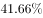

- **E**. 

**答案**：C

**官方解析**

根据“2015年11月1日······高中（含中专）及以上文化程度人口占”可知，判定此题为现期比重问题。定位文字材料第一段和第三段，2015年11月1日零时江苏常住人口为7973万人，高中（含中专）及以上文化程度人口包含两部分，高中（含中专）文化程度人口为1356万人，大专及以上文化程度人口为1230万人，则高中（含中专）及以上文化程度人口占：，C项最接近。

故正确答案为C。

---

### 第 5 题　qid 2042106 · 综合

下列说法不正确的是：

- **A**. 
两次调查的5年间，江苏常住人口年平均增加21万人

- **B**. 
两次调查的5年间，江苏常住人口中15~64岁人口下降了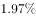
　✅
- **C**. 
两次调查的5年间，江苏常住人口中65岁及以上人口的增长率高于其他年龄段

- **D**. 
2015年11月1日零时江苏常住人口中，小学文化程度以下（不含小学）人口为902万人

**答案**：B

**官方解析**

A项：定位材料第一段，两次调查的5年间，江苏常住人口增加107万人，平均增加：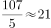万人，正确；

B项：定位材料第一、二段，2015年11月1日零时江苏常住人口为7973万人，同第六次全国人口普查比增加107万人，其中15~64岁人口有5910万人，占比为，同第六次全国人口普查比重下降1.97百分点。故2010年11月1日零时江苏常住人口中15~64岁人口为：万人，下降率为：，错误；

C项：定位材料第二段，2015年11月1日零时0～14岁人口占，同第六次全国人口普查相比，比重上升0.34个百分点；15～64岁人口占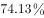，比重下降1.97个百分点；65岁及以上人口占，比重上升1.64个百分点。根据两期比重比较结论：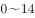岁和65岁及以上人口的比重上升，则增长率大于常住人口增长率；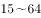岁人口的比重下降，则增长率小于常住人口增长率，故65岁及以上人口的增长率高于15～64岁人口的增长率。

定位材料第一段，江苏常住人口增长率为，代入两期比重差公式：

岁人口：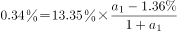，解得；

65岁及以上人口：，解得，故65岁及以上人口的增长率最大，高于其他年龄段,正确；

D项：定位材料第一段和第三段，2015年11月1日零时江苏常住人口为7973万人，全省常住人口中，大专及以上文化程度人口为1230万人，高中（含中专）文化程度人口为1356万人；初中文化程度人口为2741万人；小学文化程度人口为1744万人。则小学文化程度以下（不含小学）人口为：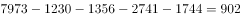万人，正确。

本题为选非题，故正确答案为B。

---

## 材料 2

### 第 6 题　qid 2042084 · 综合

2016年第一季度，全国星级饭店餐饮收入比客房收入多：

- **A**. 4.8亿元
- **B**. 3.5亿元　✅
- **C**. 3.1亿元
- **D**. 2.6亿元

**答案**：B

**官方解析**

根据题干所求“2016年第一季度···多···”，选项带单位，可判定此题为现期计算问题。定位表格可得，2016年第一季度全国星级饭店营业收入为496.5亿元，餐饮收入占比、客房收入占比。则餐饮收入比客房收入多亿元。

故正确答案为B。

---

### 第 7 题　qid 2042088 · 平均数

2016年第一季度，全国五星级饭店的平均营业收入是四星级饭店的：

- **A**. 1.8倍
- **B**. 2.6倍
- **C**. 3.4倍　✅
- **D**. 4.1倍

**答案**：C

**官方解析**

根据题干所求“2016年第一季度，······平均营业收入是······”，选项为倍数，可判定此题为现期倍数问题。定位表格可得，2016年第一季度，五星级饭店为816家、营业收入184.7亿元，四星级饭店为2438家、营业收入162.9亿元。，则五星级饭店的平均营业收入是四星级饭店的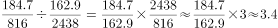倍。

故正确答案为C。

---

### 第 8 题　qid 2042094 · 比重

2016年第一季度，全国一、二星级饭店总数占星级饭店总数的比重是：

- **A**. 
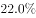
　✅
- **B**. 

- **C**. 

- **D**. 

**答案**：A

**官方解析**

根据题干所求“2016年第一季度······占······的比重是”，可判定此题为现期比重问题。定位表格可得，一、二星级饭店数量分别为87家、2342家，星级饭店总数为11037家。代入公式，。

故正确答案为A。

---

### 第 9 题　qid 2042096 · 综合

2016年第一季度，全国星级饭店中取得其他收入（除餐饮、客房收入外）最高的是：

- **A**. 二星级饭店
- **B**. 三星级饭店
- **C**. 四星级饭店　✅
- **D**. 五星级饭店

**答案**：C

**官方解析**

根据问题所求“2016年第一季度······取得其他收入（除餐饮、客房收入外）最高的是”，结合材料给出条件为总量和占比，可判定此题为现期比重问题。其他收入占比=1-餐饮收入占比-客房收入占比，其他收入=总收入×其他收入占比，代入表格数据可得，

二星级饭店其他收入：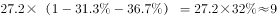亿元；

三星级饭店其他收入：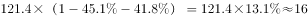亿元；

四星级饭店其他收入：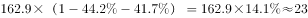亿元；

五星级饭店其他收入：亿元。

四星级饭店最高。

故正确答案为C。

---

### 第 10 题　qid 2042100 · 综合

下列说法正确的是：

- **A**. 
2016年第一季度，全国星级饭店餐饮总收入为248.3亿元

- **B**. 
2016年第一季度，全国三星级饭店数量占星级饭店数量的比重大于

- **C**. 
2016年第一季度，全国二星级饭店的餐饮与客房收入都低于其他星级饭店

- **D**. 
2016年第一季度，全国三星级及以下星级饭店的营业收入占全国星级饭店的比重不足三分之一
　✅

**答案**：D

**官方解析**

A项：全国星级饭店营业收入为496.5亿元，餐饮收入占比，则餐饮收入为亿元，错误；

B项：三星级饭店数量为5354家，星级饭店总数量为11037家，占比为，错误；

C项：二星级饭店营业收入为27.2亿元，餐饮收入占比，则餐饮收入为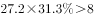亿元，一星级饭店营业收入为0.3亿元，餐饮收入占比，则餐饮收入为亿元，二星级饭店餐饮收入较高，错误；

D项：一、二、三星级饭店营业收入分别为0.3亿元、27.2亿元、121.4亿元，全国星级饭店的总营业收入为496.5亿元，则三星级及以下星级饭店营业收入占全国星级饭店比重为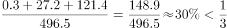，正确。

故正确答案为D。

---

## 材料 3

      某市调查总队随机抽取2000名市民开展媒体需求调查，受访市民按文化程度分为小学及以下、初中、高中/中专、大专、大学本科、研究生等六类，所占比重分别为、、、、、，调查结果见下表。

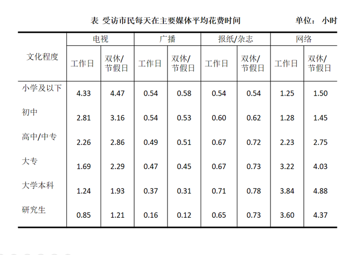

### 第 11 题　qid 2042012 · 综合

文化程度为“高中/中专”及以下的受访市民比“大专”及以上的多：

- **A**. 148人
- **B**. 150人
- **C**. 152人　✅
- **D**. 154人

**答案**：C

**官方解析**

由题干“文化程度为······比······多”并结合材料中给出总人数及比重，求两类人数的差值，可判定该题是现期比重问题。定位文字材料数据，可得“高中/中专”及以下的受访市民所占比重，“大专”及以上的受访市民（也可以直接用总的减去“高中/中专”及以下的受访市民，即）。受访市民总共2000人，因此可得文化程度为“高中/中专”及以下的受访市民比“大专”及以上的多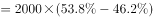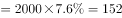人（可用尾数法判断尾数为2）。

故正确答案为C。

---

### 第 12 题　qid 2042014 · 平均数

受访市民工作日平均花费时间最少的主要媒体是：

- **A**. 电视
- **B**. 广播　✅
- **C**. 报纸/杂志
- **D**. 网络

**答案**：B

**官方解析**

定位表中数据，可以看到在每个文化程度分类中，工作日每天在主要媒体花费时间最少的都是广播，因此我们不需要通过计算即可直接判断受访市民工作日平均花费时间最少的主要媒体是广播。
故正确答案为B。

---

### 第 13 题　qid 2042016 · 平均数

“大专”类受访市民一周（有5个工作日）内平均每天看电视的时间为：

- **A**. 1.69小时
- **B**. 1.86小时　✅
- **C**. 1.99小时
- **D**. 2.15小时

**答案**：B

**官方解析**

由题干“平均每天看电视的时间为”，可判定该题是现期平均数问题。定位数据表中数据，“大专”类受访市民工作日每天看电视1.69小时，双休/节假日每天看电视2.29小时，一周有5个工作日和2个双休/节假日，可得“大专”受访市民一周内每天看电视时间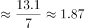小时，与B项最接近。

故正确答案为B。

---

### 第 14 题　qid 2042018 · 平均数

在不同文化程度的受访市民中，工作日在主要媒体平均花费时间最多的类别是：

- **A**. 小学及以下　✅
- **B**. 高中/中专
- **C**. 大专
- **D**. 大学本科

**答案**：A

**官方解析**

根据表格材料可以得，不同文化程度的受访市民工作日在主要媒体花费时间如下：

A项：；

B项：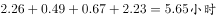；

C项：；

D项：。

A项小学及以下花费的时间最多。

故正确答案为A。

---

### 第 15 题　qid 2042020 · 综合

下列说法正确的是：

- **A**. 受访市民的文化程度越高，每天上网花费的时间越多
- **B**. 各类受访市民每天听广播的平均花费时间都比其他主要媒体少
- **C**. “研究生”类受访市民每天在主要媒体上平均花费时间都少于“本科”类　✅
- **D**. 文化程度高于“初中”的受访市民双休/节假日上网平均花费时间都多于看电视

**答案**：C

**官方解析**

A项：观察表中数据最后两行，“大学本科”类在工作日和双休/节假日每天上网花费的时间都比“研究生”类多，错误；
B项：观察表中数据第一行，“小学及以下”类，听广播在工作日的平均花费时间为0.54，在双休/节假日的平均花费时间为0.58，因此听广播每天的平均花费时间在0.54~0.58之间；而“小学及以下”类，看报纸/杂志在工作日和双休/节假日的平均花费时间均为0.54，因此每天看报纸/杂志的平均花费时间为0.54，所以每天听广播的平均花费时间比看报纸/杂志多，错误；
C项：观察表中数据最后两行，“研究生”类受访市民的8个数据都比“大学本科”类少，正确；
D项：观察表中数据第三行，“高中/中专”类双休/节假日看电视花费时间为2.86小时，上网花费时间为2.75小时，所以“高中/中专”类双休/节假日上网花费时间少于看电视，错误。
故正确答案为C。

---

## 材料 4

        2015年中国机场旅客吞吐量91477万人次，比上年增长，其中，国内航线完成82895万人次，增长；国际航线完成8582万人次，增长，“十二五”时期中国机场旅客吞吐量如下图。

        2015年中国机场旅客吞吐量100万人次以上的有70个，比上年增长6个，完成旅客吞吐量占全国机场旅客吞吐量的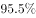；旅客吞吐量1000万人次以上的有26个，比上年增长2个，完成旅客吞吐量占全部机场旅客吞吐量的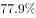；北京、上海和广州三大城市占全部机场旅客吞吐量的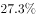。

        2015年中国各地区机场旅客吞吐量的分布情况是：华北地区占，比上年降低0.5个百分点；东北地区占，降低0.1个百分点；华东地区占，提高0.2个百分点；中南地区占，降低0.6个百分点；西南地区占，提高0.6个百分点；西北地区占，提高0.2个百分点；新疆地区占，提高0.2个百分点。

### 第 16 题　qid 2042320 · 综合

2015年北京、上海和广州三大城市机场旅客吞吐量是：

- **A**. 19978万人次
- **B**. 20173万人次
- **C**. 24973万人次　✅
- **D**. 27012万人次

**答案**：C

**官方解析**

由题干“2015年北京、上海和广州三大城市机场旅客吞吐量是”并结合材料中给出2015年中国机场旅客吞吐量及北京、上海和广州三大城市机场旅客吞吐量所占比重，可判定该题是现期比重问题。根据第一段材料“2015年中国机场旅客吞吐量91477万人次”，可知北京、上海和广州三大城市旅客吞吐量为，与C项最接近。

故正确答案为C。

---

### 第 17 题　qid 2042328 · 综合

2014年，旅客吞吐量100万人次以上而不超过1000万人次的中国机场数量有：

- **A**. 38个
- **B**. 40个　✅
- **C**. 44个
- **D**. 48个

**答案**：B

**官方解析**

根据材料“2015年中国机场旅客吞吐量100万人次以上的有70个，比上年增长6个”可知2014年中国机场旅客吞吐量100万人次以上的有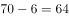个；根据材料“旅客吞吐量1000万人次以上的有26个，比上年增长2个”可知14年中国机场旅客吞吐量1000万人次以上的有个；所以2014年旅客吞吐量100万人次以上而不超过1000万人次的中国机场数量有个。

故正确答案为B。

---

### 第 18 题　qid 2042332 · 增长

若2016-2017年与2014-2015年保持相同的年平均增速，则2017年中国机场国际航线旅客吞吐量将是：

- **A**. 10075万人次
- **B**. 10389万人次
- **C**. 11608万人次　✅
- **D**. 13781万人次​

**答案**：C

**官方解析**

由题干“保持相同的年平均增速，则2017年中国机场国际航线旅客吞吐量将是”判定该题为现期计算问题。由统计图可知15年国际航线旅客吞吐量为8582，2013年国际航线旅客吞吐量为6345，设2014-2015的平均增速为，则。若2016-2017年与2014-2015年保持相同的年平均增速，则2017年国际航线旅客吞吐量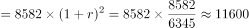，与C项最接近。

故正确答案为C。

---

### 第 19 题　qid 2042340 · 综合

2014年中国机场旅客吞吐量位于前三位的地区依次是：

- **A**. 华北地区、中南地区、西南地区
- **B**. 中南地区、华北地区、西南地区
- **C**. 中南地区、华东地区、西南地区
- **D**. 华东地区、中南地区、华北地区　✅

**答案**：D

**官方解析**

根据选项可知第一名一定为华北地区、中南地区、华东地区其中的一个。根据材料“华北地区占，比上年降低0.5个百分点”，则14年华北地区吞吐量占比为；根据材料“中南地区占，降低0.6个百分点”，则14年中南地区吞吐量占比为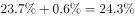；根据材料“华东地区占，提高0.2个百分点”，则14年华东地区占比为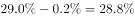；最大为华东地区，所以可知第一名为华东地区。

故正确答案为D。

---

### 第 20 题　qid 2042348 · 综合

下列判断正确的是：

- **A**. 
2015年中国西北地区机场旅客吞吐量不及华北地区的三分之一

- **B**. 
2015年国内航线旅客吞吐量占中国机场旅客吞吐量的比重比上年有所提高

- **C**. 
“十二五”时期后四年，中国机场国内航线旅客吞吐量年均增长量小于国际航线

- **D**. 
2015年，旅客吞吐量100万人次以上而不超过1000万人次的机场旅客吞吐量总和占中国机场旅客吞吐量的比重为
　✅

**答案**：D

**官方解析**

A项：2015年中国各地区机场旅客吞吐量的分布情况是：华北地区占，西北地区占，总量相同，直接比较比重，，错误；

B项：2015年国内航线旅客吞吐量占中国机场旅客吞吐量的比重，分子国内航线旅客吞吐量的增长率，分母中国机场旅客吞吐量的增长率为，分子增长率小于分母增长率，比重下降，错误；

C项：2015国内航线旅客吞吐量-2011国内航线旅客吞吐量，2015国际航线旅客吞吐量-2011国际航线旅客吞吐量，国际航线四年总增量小于国内航线四年总增量，故国际航线四年年均增量小于国内航线四年年均增量，错误；

D项：2015年中国机场旅客吞吐量100万人次以上而不超过1000万人次的机场旅客吞吐量总和占中国机场旅客吞吐量的比重=2015年旅客吞吐量100万人次以上比重-2015年旅客吞吐量1000万人次以上比重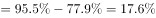，正确。

故正确答案为D。

---
