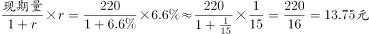
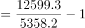
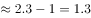
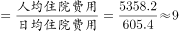
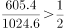

# 2017年江苏省公务员录用考试《行测》题（C类）

> 资料分析 · 20 题 · 江苏 2017

## 材料 1

        在以2015年11月1日零时为标准时点进行的全国人口抽样调查中。江苏最终样本量占全省常住人口总数的。调查显示：2015年11月1日零时江苏常住人口为7973万人。同以2010年11月1日零时为标准时点进行的第六次全国人口普查相比，增加107万人，增长。

        全省常住人口中，0~14岁人口为1064万人，占；15~64岁人口为5910万人，占；65岁及以上人口为999万人，占。同第六次全国人口普查相比，0~14岁人口的比重上升0.34个百分点，15~64岁人口的比重下降1.97个百分点，65岁及以上人口的比重上升1.64个百分点。

        全省常住人口中，大专及以上文化程度人口为1230万人，高中（含中专）文化程度人口为1356万人；初中文化程度人口为2741万人；小学文化程度人口为1744万人。

### 第 1 题　qid 2042086 · 综合

以2015年11月1日零时为标准时点进行的人口抽样调查中，江苏最终样本量为：

- **A**. 75万人　✅
- **B**. 79万人
- **C**. 82万人
- **D**. 86万人

**答案**：A

**官方解析**

根据“2015年11月1日······人口抽样调查······样本量为”，可判定本题为现期比重问题。定位材料第一段，江苏最终样本量占全省常住人口总数的且2015年11月1日零时江苏常住人口为7973万人，则此时进行的人口抽样调查中，江苏最终样本量为：万人。

故正确答案为A。

---

### 第 2 题　qid 2042090 · 比重

2010年第六次全国人口普查时，江苏0~14岁人口比重比65岁及以上人口：

- **A**. 少0.48个百分点
- **B**. 少2.12个百分点
- **C**. 多0.48个百分点
- **D**. 多2.12个百分点　✅

**答案**：D

**官方解析**

定位材料第二段，2015年11月1日的全国人口抽样调查中，0-14岁人口所占比重为，65岁及以上人口所占比重为，同第六次全国人口普查比，前者比重上升0.34个百分点，后者比重上升1.64个百分点，则第六次全国人口普查时，比重差为：个百分点。

故正确答案为D。

---

### 第 3 题　qid 2042092 · 增长

两次调查的5年间，江苏常住人口中65岁及以上人口增加：

- **A**. 142万人　✅
- **B**. 107万人
- **C**. 116万人
- **D**. 99万人

**答案**：A

**官方解析**

根据题干求增长，结合选项给出单位万人，判定此题为增长量计算问题。定位文字材料第一段，2015年11月1日零时江苏常住人口为7973万人，比第六次全国人口普查增加107万人；定位文字材料第二段，2015年11月1日的调查中，65岁及以上人口人数为999万人，所占比重为，同第六次全国人口普查比，比重上升1.64个百分点，则两次调查5年间，65岁及以上人口增加：万人，A项最接近。

故正确答案为A。

---

### 第 4 题　qid 2042098 · 综合

2015年11月1日零时江苏常住人口中，高中（含中专）及以上文化程度人口占：

- **A**. 

- **B**. 

- **C**. 

　✅
- **D**. 

- **E**. 

**答案**：C

**官方解析**

根据“2015年11月1日······高中（含中专）及以上文化程度人口占”可知，判定此题为现期比重问题。定位文字材料第一段和第三段，2015年11月1日零时江苏常住人口为7973万人，高中（含中专）及以上文化程度人口包含两部分，高中（含中专）文化程度人口为1356万人，大专及以上文化程度人口为1230万人，则高中（含中专）及以上文化程度人口占：，C项最接近。

故正确答案为C。

---

### 第 5 题　qid 2042106 · 综合

下列说法不正确的是：

- **A**. 
两次调查的5年间，江苏常住人口年平均增加21万人

- **B**. 
两次调查的5年间，江苏常住人口中15~64岁人口下降了
　✅
- **C**. 
两次调查的5年间，江苏常住人口中65岁及以上人口的增长率高于其他年龄段

- **D**. 
2015年11月1日零时江苏常住人口中，小学文化程度以下（不含小学）人口为902万人

**答案**：B

**官方解析**

A项：定位材料第一段，两次调查的5年间，江苏常住人口增加107万人，平均增加：万人，正确；

B项：定位材料第一、二段，2015年11月1日零时江苏常住人口为7973万人，同第六次全国人口普查比增加107万人，其中15~64岁人口有5910万人，占比为，同第六次全国人口普查比重下降1.97百分点。故2010年11月1日零时江苏常住人口中15~64岁人口为：万人，下降率为：，错误；

C项：定位材料第二段，2015年11月1日零时0～14岁人口占，同第六次全国人口普查相比，比重上升0.34个百分点；15～64岁人口占，比重下降1.97个百分点；65岁及以上人口占，比重上升1.64个百分点。根据两期比重比较结论：岁和65岁及以上人口的比重上升，则增长率大于常住人口增长率；岁人口的比重下降，则增长率小于常住人口增长率，故65岁及以上人口的增长率高于15～64岁人口的增长率。

定位材料第一段，江苏常住人口增长率为，代入两期比重差公式：

岁人口：，解得；

65岁及以上人口：，解得，故65岁及以上人口的增长率最大，高于其他年龄段,正确；

D项：定位材料第一段和第三段，2015年11月1日零时江苏常住人口为7973万人，全省常住人口中，大专及以上文化程度人口为1230万人，高中（含中专）文化程度人口为1356万人；初中文化程度人口为2741万人；小学文化程度人口为1744万人。则小学文化程度以下（不含小学）人口为：万人，正确。

本题为选非题，故正确答案为B。

---

## 材料 2

注：①费用均值按当年价格计算；②次均门诊费用指门诊病人次均医药费用，人均住院费用指出院病人住院期间人均医药费用，日均住院费用指出院病人住院期间日均医药费用。

### 第 6 题　qid 2043702 · 综合

2014年全国医院次均门诊费用按当年价格计算比2013年多：

- **A**. 13.6元　✅
- **B**. 14.5元
- **C**. 16.6元
- **D**. 18.1元

**答案**：A

**官方解析**

由题干“2014年······比2013年多”结合选项给出单位，可知本题为增长量计算问题。定位表格，2014年次均门诊费用为220.0元，按当年价格上涨，故增长量为：，A项最接近。

故正确答案为A。

---

### 第 7 题　qid 2043704 · 平均数

2015年全国公立三级医院人均住院费用比公立二级医院多：

- **A**. 1.1倍
- **B**. 1.4倍　✅
- **C**. 1.7倍
- **D**. 2.0倍

**答案**：B

**官方解析**

由题干“2015年······比······多”结合选项给出倍数，可知本题为现期倍数问题。定位表格，2015年全国公立三级医院和公立二级医院人均住院费分别为12599.3、5358.2元，故2015年全国公立三级医院人均住院费用比公立二级医院多：倍，与B项最接近。

故正确答案为B。

---

### 第 8 题　qid 2043706 · 增长

2014-2015年全国医院次均门诊费用，“按当年价格上涨”不同于“按可比价格上涨”的幅度，主要影响因素是：

- **A**. 就诊人数
- **B**. 统计误差
- **C**. 计算方法
- **D**. 通货膨胀　✅

**答案**：D

**官方解析**

可比价格为消除价格影响因素之后的计费方式，选项中只有D项与价格变动有关。
故正确答案为D。

---

### 第 9 题　qid 2043708 · 平均数

2015年全国公立二级医院出院病人人均住院天数是：

- **A**. 7天
- **B**. 9天　✅
- **C**. 11天
- **D**. 13天

**答案**：B

**官方解析**

由题干“2015年······人均住院天数”，可知本题为现期平均数问题。定位表格，2015年公立二级医院人均住院费用为5358.2元，2015年公立二级医院日均住院费用为605.4元，故2015年全国公立二级医院出院病人人均住院天数为：，B项符合。

故正确答案为B。

---

### 第 10 题　qid 2043710 · 综合

下列判断正确的是：

- **A**. 
2015年全国公立二级医院日均住院费用不足公立三级医院的一半

- **B**. 
2014-2015年全国医院次均门诊费用、人均住院费用和日均住院费用按可比价格计算年增幅均未超过

- **C**. 
2015年全国公立医院、公立三级医院、公立二级医院日均住院费用按当年价格计算增幅均低于2014年
　✅
- **D**. 
无论按当年价格还是可比价格计算，2015年全国公立三级医院次均门诊费用、人均住院费用和日均住院费用增幅均高于2014年

**答案**：C

**官方解析**

A项：2015年全国公立二级医院日均住院费和公立三级医院日均住院费分别为605.4、1024.6元，二者之比为：，超过一半，错误；

B项：观察数据表中数据，2014年全国医院日均住院费用按可比价格计算增幅为，超过，错误；

C项：观察数据表中数据，2015年全国公立医院、公立三级医院、公立二级医院日均住院费用按当年价格计算增幅都低于2014年，正确；

D项：观察数据表中数据，按当年价格计算2015年全国公立三级医院日均住院费用增幅为，低于2014年的，错误。

故正确答案为C。

---

## 材料 3

        2005年我国GDP为187318.9亿元人民币，主要能源生产总量为228.9百万吨标准煤，主要能源为原煤、原油、天然气和水风核电，分别生产177.2百万吨标准煤、25.9百万吨标准煤、6.6百万吨标准煤和19.2百万吨标准煤。“十一五”“十二五”时期我国主要能源生产情况见下表。

         <b>表2006-2015年我国主要能源生产情况         单位：百万吨标准煤</b>

### 第 11 题　qid 2042786 · 增长

2012-2015年我国主要能源生产总量年增加最少的年份是：

- **A**. 2015年　✅
- **B**. 2014年
- **C**. 2013年
- **D**. 2012年

**答案**：A

**官方解析**

根据题干所求“年增加最少的年份”可判定本题为增长量比较问题。，。代入表格数据，可得：

2015年主要能源生产总量增加量：

2014年主要能源生产总量增加量：

2013年主要能源生产总量增加量：

2012年主要能源生产总量增加量：

增长量最少的为2015年。

故正确答案为A。 

---

### 第 12 题　qid 2042790 · 增长

自2016年起，若我国水风核电年产量均按2006-2015年平均增速增长，则2025年我国水风核电产量将为

- **A**. 84.2百万吨标准煤
- **B**. 85.8百万吨标准煤
- **C**. 132.5百万吨标准煤
- **D**. 143.6百万吨标准煤　✅

**答案**：D

**官方解析**

根据题干“按2006-2015年平均增速增长”，可判定本题为年均增长率问题。定位文字材料和表格可得，2005、2015年水风核电生产量分别为19.2、52.5百万吨标准煤；

自2016年起，按2006-2015年平均增速增长，2016-2025年与2006-2015年间隔年数相同；

则2016-2025与2006-2015年增长率相同，2025年水风核电产量为百万吨标准煤。

故正确答案为D。 

---

### 第 13 题　qid 2042794 · 比重

2015年我国非原煤主要能源产量之和占主要能源生产总量的比重与2005年相差：

- **A**. 4.3个百分点
- **B**. 5.3个百分点　✅
- **C**. 6.3个百分点
- **D**. 7.3个百分点

**答案**：B

**官方解析**

根据题干所求“2015年……比重与2005年相差”可判定本题为两期比重问题。，代入表格数据可得：2015年比重为，代入文字材料数据可得：2005年比重为，二者约相差，最接近B项。

故正确答案为B。 

---

### 第 14 题　qid 2042798 · 增长

2006-2015年我国原煤产量年增长率超过的年份个数有

- **A**. 0个
- **B**. 1个　✅
- **C**. 2个
- **D**. 3个

**答案**：B

**官方解析**

根据题干所求“年增长率超过的年份个数”，可判定本题为增长率问题。，代入材料数据可得：

2015年：；2014年：；2013年：；

2012年：；2011年：；

2010年：；2009年：；

2008年：；2007年：；2006年：。超过的年份为2011年。

故正确答案为B。 

---

### 第 15 题　qid 2042806 · 综合

下列判断正确的是：

- **A**. 
2005年我国单位GDP能耗为12.38万吨标准煤/亿元人民币

- **B**. 
“十二五”时期，我国原煤产量比“十一五”时期增长超过

- **C**. 
2015年我国水风核电产量占主要能源生产总量的比重比上年有所提升
　✅
- **D**. 
2011-2015年我国原油、天然气和水风核电产量均逐年增加

**答案**：C

**官方解析**

A项：万吨标准煤亿元人民币，错误；

B项：“十二五”即2011-2015年的原煤产量为百万吨标准煤，“十一五”即2006-2010年的原煤产量为百万吨标准煤，增长率为，错误；

C项：方法一：2015年我国水风核电产量占主要能源生产总量的比重为，2014年比重为，前者较后者，分子增长多于分母，故2015年比重较高，正确；

方法二：2015年水风核电产量增量为，根据本篇资料第一题计算数据，2015年主要能源生产总量增量为0.2，故部分增速大于总量增速，该部分占总量比重上升，正确；

D项：定位表格数据可得，2011年原油生产量为28.9百万吨标准煤，少于2010年的29.0百万吨标准煤，错误。

故正确答案为C。 

---

## 材料 4

        2016年某市一次有关市民邻里关系的调查显示，在受访的951位市民中，“没有邻居”的有6位。“有邻居”的受访市民中，对邻居表示“了解”的占（“了解”分“很了解”和“部分了解”，占比分别为和），其余的表示“不了解”；对邻里关系表示“满意”的占，（“满意”分为“很满意”和“比较满意”，占比分别为和），“不满意”的占，其余不愿表态，对邻里关系感到“满意”和“不满意”的主要原因分别见图1和图2。

### 第 16 题　qid 2042814 · 综合

受访市民中，“不了解”邻居的有？

- **A**. 275人
- **B**. 365人
- **C**. 412人
- **D**. 418人　✅

**答案**：D

**官方解析**

题干所求为“不了解”邻居的人数，结合材料所给为总量与占比，可判定本题为现期比重计算问题。定位文字材料，在受访的951位市民中，“没有邻居”的有6位，则“有邻居”的受访市民一共有位，“有邻居”的受访市民中，对邻居表示“了解”的占，其余的表示“不了解”。对邻居“不了解”的市民。则“不了解”邻居的，与D项接近。

故正确答案为D。

---

### 第 17 题　qid 2042816 · 比重

对邻里关系感到“不满意”的受访市民中，主要原因是“视同陌路”的占比比“习惯不同”多几个百分点？

- **A**. 13.5个百分点　✅
- **B**. 15.7个百分点
- **C**. 17.5个百分点
- **D**. 18.9个百分点

**答案**：A

**官方解析**

定位饼状图材料，对邻里关系感到“不满意”的受访市民中，主要原因是“视同陌路”的所占比重为，“习惯不同”的为。则“视同陌路”所占比重比“习惯不同”的多：，即13.5个百分点。

故正确答案为A。

---

### 第 18 题　qid 2042818 · 综合

“有邻居”的受访市民中，感到“比较满意”的人数比“很满意”的多多少人？

- **A**. 402人
- **B**. 455人　✅
- **C**. 458人
- **D**. 470人

**答案**：B

**官方解析**

题干所求为“比较满意”的人数比“很满意”的多多少人，可判定本题为现期比重比较问题。定位文字材料，在受访的951位市民中，“没有邻居”的有6位。“有邻居”的受访市民中，对邻里关系表示“满意”的占，（“满意”分为“很满意”和“比较满意”，占比分别为和），则感到“比较满意的”人数比“很满意”的多 

故正确答案为B。

---

### 第 19 题　qid 2042820 · 综合

在感到“满意”的受访市民中，主要原因为“相互谦让，文明礼貌”的受访市民是“彼此照应，感到温暖”受访市民的多少倍？

- **A**. 1.6倍
- **B**. 1.8倍
- **C**. 2.3倍　✅
- **D**. 3.1倍

**答案**：C

**官方解析**

由“······是······的多少倍”，可判定本题为现期倍数问题。定位图1，在感到“满意”的受访市民中，主要原因为“相互谦让，文明礼貌”的受访市民所占比重为，主要原因为“彼此照应，感到温暖”的所占比重为，则前者是后者的倍。

故正确答案为C。

---

### 第 20 题　qid 2042822 · 综合

下列判断正确的是：

- **A**. 
有531位受访市民“了解”邻居

- **B**. 
超过的受访市民因感到与邻居“缺乏信任”而对邻里关系“不满意”

- **C**. 
对邻里关系感到“很满意”的受访市民数不及“比较满意”市民数的三分之一
　✅
- **D**. 
对邻居表示“了解”的受访市民中，对邻里关系感到“很满意”的超过三分之一

**答案**：C

**官方解析**

A项：定位文字材料，在受访的951位市民中，“没有邻居”的有6位。“有邻居”的受访市民中，对邻居表示“了解”的占。则对邻居表示“了解”的名，错误；

B项：由饼状图可知，因“缺乏信任”而对邻里关系“不满意”的市民占“不满意总数”的比重为，并非占“受访市民总数”的比重，错误；

C项：定位文字材料，对邻里关系表示“满意”的占“有邻居”受访市民的，（“满意”分为“很满意”和“比较满意”，占比分别为和）。，正确；

D项：根据材料，无从得出对邻居表示“了解”与“很满意”之间的关系，错误。

故正确答案为C。

---
