# 2017年河南省公务员录用考试《行测》题（网友回忆版）

> 资料分析 · 20 题 · 河南 2017

## 材料 1

      <b>  一、根据所给资料，回答101～105题。</b>

      <b>  </b>2016年S市全年用于研究与试验发展（R&amp;D）经费支出总额为1030.00亿元，占S市生产总值的比重为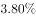。

        全年受理专利申请119937件，比上年增长，其中，受理发明专利申请54339件，增长。全年专利授权量为64230件，增长，其中，发明专利授权量为20086件，增长。全年PCT国际专利受理量为1560件，比上年增长。至年末，全市有效发明专利达85049件。年内全市新认定高新技术企业2306家。年内认定高新技术成果转化项目469项，其中，电子信息、生物医药、新材料等重点领域项目占。至年末，共认定高新技术成果转化项目10969项。全年经认定登记的各类技术交易合同2.12万件，比上年下降；合同金额822.86亿元，增长。

### 第 1 题　qid 2136614 · 增长

2013～2016年间，S市研究与试验发展经费与上年相比增速最快的年份是：

- **A**. 2013年　✅
- **B**. 2014年
- **C**. 2015年
- **D**. 2016年

**答案**：A

**官方解析**

根据题干，求“与上年相比增速最快的年份”，可知，本题为一般增长率问题。定位统计图，可得每年S市全年用于研究与试验发展（R&amp;D）经费，根据可得2013年对应增速为：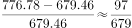；2014年对应增速为：；2015年对应增速为：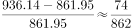；2016年对应增速为：。2013年对应增速分子最大，分母最小，故分数最大。

故正确答案为A。

---

### 第 2 题　qid 2136622 · 综合

2015和2016年S市研究与试验发展经费总支出约占同期生产总值的：

- **A**. 
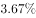

- **B**. 

- **C**. 

　✅
- **D**. 

**答案**：C

**官方解析**

根据题干“2015和2016年S市研究与试验发展经费总支出占同期生产总值的比重”，而材料已给出两年的比重，故本题为混合比重问题。定位统计图：“2015年S市研究与试验发展经费占S市生产总值的比重为，2016年S市研究与试验发展经费占S市生产总值的比重为”，根据混合比重原则“混合居中但不中，偏向于基数大的”。因此混合比重在与之间，排除A、D两项。2016年对应的基数更大，因此偏向于，C项当选。

故正确答案为C。

---

### 第 3 题　qid 2136624 · 增长

S市下列各项指标中，2016年同比增长速度最慢的是：

- **A**. 受理发明专利申请量
- **B**. 发明专利授权量　✅
- **C**. PCT国际专利受理量
- **D**. 经认定登记的各类技术交易合同金额

**答案**：B

**官方解析**

定位文字材料第2段：“受理发明专利申请54339件，增长；发明专利授权量为20086件，增长；全年PCT国际专利受理量为1560件，比上年增长；全年经认定登记的各类技术交易合同2.12万件，合同金额822.86亿元，增长”，因此S市2016年同比增长速度最慢的是发明专利授权量。

故正确答案为B。

---

### 第 4 题　qid 2136628 · 增长

2016年S市全年受理专利申请比2015年约增加多少万件？

- **A**. 2.0　✅
- **B**. 1.8
- **C**. 1.6
- **D**. 1.4

**答案**：A

**官方解析**

由题干“······增加······万件”，可判定本题为增长量的计算问题。定位文字材料第二段“全年受理专利申请119937件，比上年增长”，根据公式，则2016年S市全年受理专利申请比2015年的增长量为：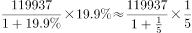。

故正确答案为A。

---

### 第 5 题　qid 2136632 · 综合

根据上述资料，下列说法不正确的是：

- **A**. 2016年研究与试验发展经费支出占生产总值的比重比2012年高0.43个百分点
- **B**. 2012-2016年，年均研究与试验发展经费支出超过800亿元
- **C**. 2016年，发明专利授权量占专利授权量的三分之一以上　✅
- **D**. 2016年，平均每件经认定登记的各类技术交易合同金额不超过400万元

**答案**：C

**官方解析**

A项：定位图形材料，2016年和2012年研究与试验发展经费支出占生产总值的比重分别为、，则2016年比2012年的占比高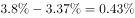，即高0.43个百分点，正确；

B项：定位表格柱状图，2012-2016年研究与试验发展经费支出的，正确；

C项：定位文字材料第二段“全年专利授权量为64230件，增长，其中，发明专利授权量为20086件，增长”，则发明专利授权量占专利授权量的比例为，错误；

D项：定位文字材料第二段“全年经认定登记的各类技术交易合同2.12万件，比上年下降；合同金额822.86亿元，增长”，则平均每件经认定登记的各类技术交易合同金额为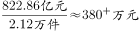，没超过400万元，正确。

本题为选非题，故正确答案为C。

---

## 材料 2

        2014年我国粮食种植面积11274万公顷，比上年增加78万公顷。棉花种植面积422万公顷，减少13万公顷。油料种植面积1408万公顷，增加6万公顷。糖料种植面积191万公顷，减少9万公顷。

        粮食再获丰收。全年粮食产量60710万吨，比上年增加516万吨，增产。其中，夏粮产量13660万吨，增产；早稻产量3401万吨，减产；秋粮产量43649万吨，增产。全年谷物产量55727万吨，比上年增产。其中，稻谷产量20643万吨，增产；小麦产量12617万吨，增产；玉米产量21567万吨，减产。

        全年棉花产量616万吨，比上年减产。油料产量3517万吨，与上年持平。糖料产量13403万吨，减产。茶叶产量209万吨，增产。

### 第 6 题　qid 2136478 · 增长

2014年，我国粮食种植面积同比增速比油料种植面积同比增速：

- **A**. 高不到1个百分点　✅
- **B**. 高1个百分点以上
- **C**. 低不到1个百分点
- **D**. 低1个百分点以上

**答案**：A

**官方解析**

由题意“2014年，我国粮食种植面积同比增速比油料种植面积同比增速”，可判定此题为一般增长率问题，定位文字材料第一段“2014年我国粮食种植面积11274万公顷，比上年增加78万公顷······油料种植面积1408万公顷，增加6万公顷”。根本，可知2014年粮食种植面积，2014年油料种植面积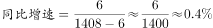，因此2014年我国粮食种植面积同比增速比油料种植面积同比增速高：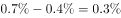，不到1个百分点。

故正确答案为A。

---

### 第 7 题　qid 2136480 · 综合

2014年，我国粮食单位种植面积的产量约为（    ）。

- **A**. 3.9
- **B**. 4.4
- **C**. 4.9
- **D**. 5.4　✅

**答案**：D

**官方解析**

由题意“2014年，······单位种植面积的产量······”，已知，且材料时间为2014年，可判定本题为现期平均数问题。定位文字材料第一段“2014年我国粮食种植面积11274万公顷”和材料第二段“全年粮食产量60710万吨”可知2014年我国粮食。

故正确答案为D。

---

### 第 8 题　qid 2136484 · 综合

将不同作物按2014年单位种植面积产量由高到低排序，下列正确的是：

- **A**. 棉花——油料——糖料
- **B**. 棉花——糖料——油料
- **C**. 糖料——油料——棉花　✅
- **D**. 糖料——棉花——油料

**答案**：C

**官方解析**

由题意“将不同作物按2014年单位种植面积产量由高到低排序”判定此题为现期平均数的排序问题，定位材料第一段“2014年棉花种植面积422万公顷，······油料种植面积1408万公顷，······糖料种植面积191万公顷”和材料第三段“全年棉花产量616万吨，比上年减产。油料产量3517万吨，与上年持平。糖料产量13403万吨，减产。”可知2014年我国棉花；2014年我国油料；2014年我国糖料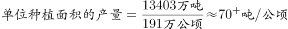，则2014年单位种植面积产量由高到低排序为糖料、油料、棉花。

故正确答案为C。

---

### 第 9 题　qid 2136488 · 综合

2013年，秋粮产量约为夏粮产量的多少倍？

- **A**. 不到2倍
- **B**. 2倍多
- **C**. 3倍多　✅
- **D**. 4倍多

**答案**：C

**官方解析**

由题干“2013年……约为……多少倍”结合材料时间为2014年，可判定本题为基期倍数问题。定位材料第二段可得“夏粮产量13660万吨，增产；秋粮产量43649万吨，增产。”代入基期倍数公式：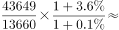。

故正确答案为C。

---

### 第 10 题　qid 2136492 · 综合

关于2014年我国农业生产，下列说法正确的是：

- **A**. 
稻谷、小麦和玉米产量均同比增长

- **B**. 
粮食种植面积为棉花、油料、糖料总种植面积的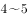倍之间

- **C**. 
棉花、糖料、油料产量均高于茶叶产量
　✅
- **D**. 
糖料单位种植面积的产量同比下降

**答案**：C

**官方解析**

A项：由材料第二段可得“玉米产量21567万吨，减产”，玉米未同比增长，错误；

B项：由材料第一段可得“2014年我国粮食种植面积11274万公顷…棉花种植面积422万公顷…油料种植面积1408万公顷…糖料种植面积191万公顷”，故2014年粮食种植面积是棉花、油料、糖料总种植面积的，超过5倍，错误；

C项：由材料第三段可得“棉花产量616万吨，油料产量3517万吨，糖料产量13403万吨”均高于“茶叶产量209万吨”，正确；

D项：由材料第三段可得“糖料产量13403万吨，减产”，第一段可得“糖料种植面积191万公顷、减少9万公顷”。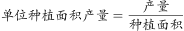，分子增速，分母增速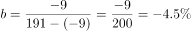，，即，单位种植面积的产量同比增长，错误。

故正确答案为C。

---

## 材料 3

<b>      三、根据所给资料，回答111~115题。</b>

      2013年，全国共有工业企业法人单位241万个，从业人员14025.8万人，分别比2008年增长和。

      2013年，在工业企业法人单位中，采矿业8.9万个，比2008年下降；制造业225.2万个；电力、热力、燃气及水生产和供应业6.9万个，比2008年下降。在工业企业法人单位从业人员中，采矿业占，制造业占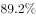，电力、热力、燃气及水生产和供应业占。

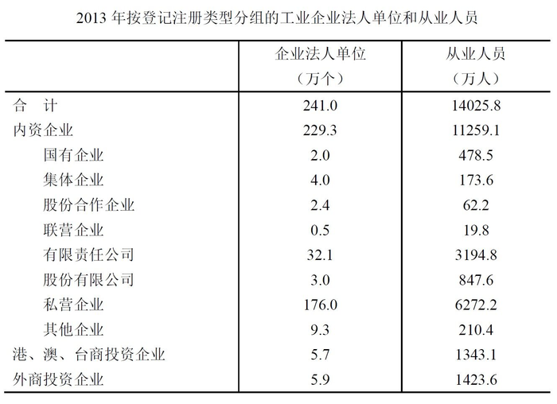

### 第 11 题　qid 2136482 · 综合

2008年，全国共有工业企业从业人员约为多少亿人？

- **A**. 1.0
- **B**. 1.2　✅
- **C**. 1.3
- **D**. 1.5

**答案**：B

**官方解析**

根据题干所求“2008年，全国共有工业企业从业人员约为多少亿人”，材料数据为2013年，可判定此题为基期计算问题。。定位文字材料第一段：2013年，全国共有工业企业从业人员14025.8万人，比2008年增长，故2008年全国共有工业企业从业人员数为：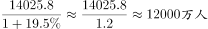，。

故正确答案为B。

---

### 第 12 题　qid 2136486 · 平均数

2013年，全国采矿业每个法人单位的平均从业人员数量约为多少人？

- **A**. 98
- **B**. 117　✅
- **C**. 134
- **D**. 168

**答案**：B

**官方解析**

根据题干所求“2013年采矿业每个法人单位的平均从业人员数量”，材料数据为2013年，可判定此题为现期平均数计算问题。定位文字材料第一段可得，2013年，全国共有工业企业从业人员14025.8万人；定位文字材料第二段可得，在工业企业法人单位中，采矿业8.9万个，在工业企业法人单位从业人员中，采矿业占。故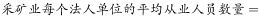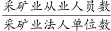=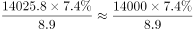，最接近B项。

故正确答案为B。

---

### 第 13 题　qid 2136494 · 平均数

将不同类型企业按2013年平均每个法人单位从业人员数量从高到低排序，下列正确的是：

- **A**. 
私营企业股份合作企业集体企业其他企业

- **B**. 
私营企业集体企业其他企业股份合作企业

- **C**. 
集体企业私营企业股份合作企业其他企业
　✅
- **D**. 
集体企业股份合作企业私营企业其他企业

**答案**：C

**官方解析**

根据题干所求“将不同类型企业按2013年平均每个法人单位从业人员数量从高到低排序”，材料数据为2013年，可判定此题为现期平均数比较问题，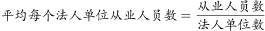。根据表格材料可知，2013年平均每个法人单位的从业人员数量，私营企业：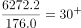人，股份合作企业：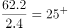人，集体企业：人，其他企业：人。

因此有：集体企业私营企业股份合作企业其他企业，C项满足。

故正确答案为C。

---

### 第 14 题　qid 2136496 · 综合

2008年，全国制造业企业法人单位有约多少万个？

- **A**. 160
- **B**. 174　✅
- **C**. 186
- **D**. 200

**答案**：B

**官方解析**

根据题干所求“2008年全国制造业企业法人单位有······万个”，材料给了2013年全国共有工业企业法人单位数及增长率，采矿业法人单位数及增长率，电力、热力、燃气及水生产和供应业法人单位数及增长率，故可判断本题为基期和差问题。定位文字材料，已知：“全国共有工业企业法人单位241万个，比2008年增长”“采矿业8.9万个，比2008年下降”“电力、热力、燃气及水生产和供应业6.9万个，比2008年下降”，根据材料可得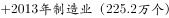，故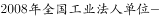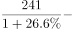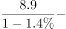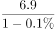，B项最接近。

故正确答案为B。

---

### 第 15 题　qid 2136498 · 综合

关于2013年全国工业企业情况，下列说法正确的是：

- **A**. 
国有企业从业人员占全国内资企业从业人员的比重不足

- **B**. 
电力、热力、燃气及水生产和供应业从业人员超过400万人
　✅
- **C**. 
港、澳、台商投资企业法人单位数量占全国工业企业法人单位的比重不足

- **D**. 
内资企业中企业法人单位个数少于6万的有7种类型

**答案**：B

**官方解析**

A项：定位表格，2013年国有企业从业人员数为478.5万人，内资企业从业人员数为11259.1万人，故国有企业从业人员数占内资企业从业人员数的，超过，错误；

B项：定位文字材料，全国从业人员14025.8万人，电力、热力、燃气及水生产和供应业占，所以 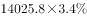，超过400万人，正确；

C项：定位表格，港、澳、台商投资企业法人单位数量为5.7万个，全国工业企业法人单位数量为241万个，所以港、澳、台商投资企业法人单位数量占全国工业企业法人单位的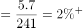，超过，错误；

D项：定位表格，内资企业少于6万的有：国有企业（2.0万个）、集体企业（4.0万个）、股份合作企业（2.4万个）、联营企业（0.5万个）、股份有限公司（3.0万个），共有5种类型，错误。

故正确答案为B。

---

## 材料 4

       2015年，我国货物进出口总额245741亿元，比上年下降。其中，出口141255亿元，下降；进口104485亿元，下降。货物进出口差额（出口减进口）36770亿元，比上年增加13244亿元。 

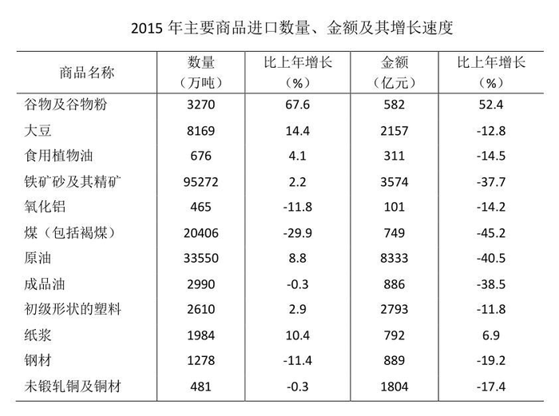

### 第 16 题　qid 2136656 · 增长

2015年，谷物及谷物粉的进口金额比上一年增加约多少亿元？

- **A**. 170
- **B**. 200　✅
- **C**. 230
- **D**. 260

**答案**：B

**官方解析**

由题干“2015年，谷物及谷物粉的进口金额比上一年增加多少亿元”可知，本题为增长量计算问题。根据“谷物及谷物粉的进口金额”定位到表格，可知2015年谷物及谷物粉的进口金额为582亿元，比上年增长，故2015年，谷物及谷物粉的进口金额比上一年增加亿元，与B项最为接近。

故正确答案为B。

---

### 第 17 题　qid 2136660 · 比重

下列商品中，2015年进口金额占我国货物进口总额的比重高于上年的是：

- **A**. 食用植物油
- **B**. 氧化铝
- **C**. 初级形状的塑料　✅
- **D**. 未锻轧铜及铜材

**答案**：C

**官方解析**

由题干“2015年······的比重高于上年的是······”可知，本题为两期比重问题。根据“部分增长率大于总体增长率，则现期比重上升”可知，只需要看哪一类商品进口额的增长率大于进口总额增长率即可。由文字材料可知，我国货物进口总额下降；由表格可知，食用植物油进口金额的增长率为，氧化铝进口金额的增长率为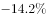，初级形状的塑料进口金额的增长率为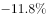，未锻轧铜及铜材进口金额的增长率为。只有初级形状的塑料进口金额的增长率大于总体增长率，即初级形状的塑料现期比重上升。

故正确答案为C。

---

### 第 18 题　qid 2136664 · 比重

2015年，原油进口金额占全年进口总额的比重为：

- **A**. 

- **B**. 

　✅
- **C**. 

- **D**. 

**答案**：B

**官方解析**

由题干“2015年，原油进口金额占全年进口总额的比重”可知，本题为现期比重问题。根据“原油进口金额”定位到表格，可知2015年原油的进口金额为8333亿元；根据文字材料可知全年进口总额为104485亿元。故2015年，原油进口金额占全年进口总额的比重为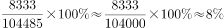，与B项最为接近。

故正确答案为B。

---

### 第 19 题　qid 2136666 · 增长

2015年，下列商品的进口数量同比增长量最大的是：

- **A**. 大豆
- **B**. 铁矿砂及其精矿
- **C**. 原油　✅
- **D**. 纸浆

**答案**：C

**官方解析**

由题干“进口数量同比增长量最大”，可判定本题为增长量比较问题。定位表格材料，找到选项中的相关数据，A项，大豆的进口数量为8169万吨，增长率为；B项，铁矿砂及其精矿的进口数量为95272万吨，增长率为；C项，原油的进口数量为33550万吨，增长率为；D项，纸浆的进口数量为1984万吨，增长率为。根据增长量比较中“大大则大”的原则可知A项中的进口量和增长率都大于D项，因此A项的增长量大于D项，排除D项。剩下A、B、C三项之间不符合“大大则大”原则。利用增长量的计算公式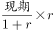进行计算后比较，

A项，万吨，

B项，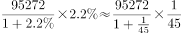万吨，

C项，万吨。则增长量最大的为原油。

故正确答案为C。

---

### 第 20 题　qid 2136668 · 综合

关于2015年我国进出口情况，下列说法正确的是：

- **A**. 
货物进出口差额的增长率不足

- **B**. 
各类主要商品进口单价均低于上年
　✅
- **C**. 
每吨钢材的进口金额超过8000元

- **D**. 
主要商品进口数量和金额均同比下降的有6类

**答案**：B

**官方解析**

A项：定位文字材料“货物进出口差额（出口减进口）36770亿元，比上年增加13244亿元”，给了现期值和增长量，则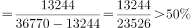，错误。

B项：，2015年单价与上年进行相比，则为两期平均数问题，要使单价低于上年，则需要金额增长率小于进口量的增长率。查找图表中的数据可知，各类主要商品的金额增长率都小于进口量的增长率，因此单价均低于上年，正确。

C项：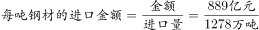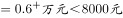，错误。

D项：同比下降即增长率为负数，定位表格数据可知进口数量和金额均同比下降的是氧化铝、煤（包括褐煤）、成品油、钢材、未煅轧铜及铜材五类，错误。

故正确答案为B。

---
