# 2017年深圳市公务员录用考试《行测》题

> 资料分析 · 15 题 · 深圳市考 2017

## 材料 1

        2015年5月，全国医疗卫生机构诊疗人次达6.4亿人次，同比提高，环比提高。其中，医院2.6亿人次，同比提高，环比降低；基层医疗卫生机构诊疗人次为3.6亿人次，同比提高，环比降低；其他机构0.2亿人次。医院中：公立医院2.3亿人次，同比提高，环比提高；民营医院0.3亿人次，同比提高，环比提高。基层医疗卫生机构中：社区卫生服务中心（站）0.6亿人次，同比提高，环比降低；乡镇卫生院0.8亿人次，同比提高，环比降低。

        2015年1-5月，全国医疗卫生机构总诊疗人次达31.1亿人次，同比提高。其中：医院12.2亿人次，同比提高；基层医疗卫生机构18.0亿人次，同比提高；其他机构10.1亿人次。医院中：公立医院10.8亿人次，同比提高；民营医院1.3亿人次，同比提高。基层医疗卫生机构中：社区卫生服务中心（站）2.7亿人次，同比提高；乡镇卫生院4.1亿人次，同比提高；村卫生室诊疗人次8.4亿人次。

        2015年5月份，全国医疗卫生机构出院人数达1738.4万人，同比提高，环比降低。其中：医院1330.2万人，同比提高，环比降低；基层医疗卫生机构出院人数为333.4万人，同比降低，环比降低；其他机构74.8万人。医院中：公立医院1156.5万人，同比提高，环比降低；民营医院173.7万人，同比提高，环比提高。

        2015年1-5月，全国三级公立医院次均门诊费用为276.5元，与去年同期比较，按当年价格上涨，按可比价格上涨；二级公立医院次均门诊费用为182.7元，按当年价格同比上涨，按可比价格同比上涨。

        2015年1-5月，全国三级公立医院人均住院费用为12536.8元，与去年同期比较，按当年价格上涨，按可比价格上涨；二级公立医院人均住院费用为5320.6元，按当年价格同比上涨，按可比价格同比上涨。

### 第 1 题　qid 2060616 · 比重

2015年5月，医院诊疗人次占全国医疗卫生机构诊疗人次的比重：

- **A**. 
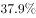

- **B**. 

- **C**. 

　✅
- **D**. 

**答案**：C

**官方解析**

由题干“2015年5月”和“比重”判定为现期比重问题，根据材料第一段第一句“2015年5月，全国医疗卫生机构诊疗人次达6.4亿人次，其中，医院2.6亿人次”可得，所求比重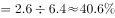。

故正确答案为C。

---

### 第 2 题　qid 2060618 · 综合

按可比价格，2014年1-5月全国三级公立医院次均门诊费比二级公立医院门诊费用（    ）。

- **A**. 
高

- **B**. 
高

- **C**. 
高91.5元
　✅
- **D**. 
高94.6元

**答案**：C

**官方解析**

由题干“2014年1-5月”和“比…多”判定为基期和差问题，根据材料“2015年1-5月，全国三级公立医院次均门诊费用为276.5元，按可比价格上涨；二级公立医院次均门诊费用为182.7元，按可比价格同比上涨。”可得2014年1-5月三级公立医院比二级公立医院次均门诊费用高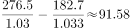，与C项最接近。

故正确答案为C。

---

### 第 3 题　qid 2060620 · 增长

与上年同期相比，2015年5月增长率最高的指标是（    ）。

- **A**. 全国医疗卫生机构出院人数
- **B**. 公立医院出院人数
- **C**. 民营医院出院人数　✅
- **D**. 社区卫生服务中心（站）诊疗人次

**答案**：C

**官方解析**

根据材料可得，同比增长率分别为：全国医疗卫生机构出院人数为、公立医院出院人数为、民营医院出院人数为、社区卫生服务中心（站）诊疗人次为。

故正确答案为C。

---

### 第 4 题　qid 2060622 · 综合

如果2015年1-5月，全国医疗卫生机构总诊疗人次达31.1亿人次，则下列说法正确的是（    ）。

- **A**. 2015年1-5月，全国医疗卫生机构诊疗人次逐月增加
- **B**. 2015年5月，全国医疗卫生机构诊疗人次环比增长主要靠基层医疗卫生机构诊疗人次增长拉动
- **C**. 2015年一季度，全国医疗卫生机构月均诊疗人次未超过6亿
- **D**. 2015年5月，公立医院诊疗人次在全国医疗卫生机构诊疗人次中占比最高　✅

**答案**：D

**官方解析**

本题属于综合分析，需结合每一个选项的描述与表格、材料中给出的具体数据判断其是否正确。

A项：材料只给出1-5月和5月的全国医疗卫生机构诊疗人次和环比，因此经过计算只能得到4月份数值，无法推断出1-3月当月数值，故无法判断是否逐月增加，该项错误;

B项：由材料“2015年5月，基层医疗卫生机构诊疗人次为3.6亿人次，环比降低”可得该项错误;

C项：由材料“2015年1-5月，全国医疗卫生机构总诊疗人次达31.1亿人次”和“2015年5月，全国医疗卫生机构诊疗人次达6.4亿人次，环比提高。”可得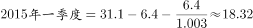，，该项错误;

D项：定位文字材料第一段可知，2015年5月，医院诊疗人次为2.6亿人次（公立医院2.3亿人次和民营医院0.3亿人次）、基层医疗卫生机构诊疗人次为3.6亿人次（社区卫生服务中心（站）0.6亿人次、乡镇卫生院0.8亿人次和其他为3.6-0.6-0.8＝2.2亿人次）、其他机构诊疗人次为0.2亿人次，而2015年5月全国医疗卫生机构诊疗人次为6.4亿人次。综上所述，公立医院诊疗人次最多，则公立医院占比最高，该项正确。

故正确答案为D。

---

### 第 5 题　qid 2060624 · 综合

根据上述材料，下列说法正确的是（  ）

- **A**. 2015年1-5月，全国二级公立医院人均住院费用增长快于三级公立医院
- **B**. 与上年同期相比，2015年5月基层医疗卫生机构诊疗人次和出院人数均有所降低
- **C**. 2015年5月，全国三级公立医院人均住院费用比二级公立医院高7216.2元
- **D**. 与上年同期相比，2015年5月基层医疗卫生机构出院人数减少了约2.4万人　✅

**答案**：D

**官方解析**

本题属于综合分析，需结合每一个选项的描述与表格、材料中给出的具体数据判断其是否正确。

A项：由材料“2015年1-5月，全国三级公立医院人均住院费用与去年同期比较，按当年价格上涨，按可比价格上涨；二级公立医院人均住院费用按当年价格同比上涨，按可比价格同比上涨。”可得二级公立医院当年价格增长率和可比价格增长率均慢于三级公立医院，该项错误。

B项：由材料“2015年5月基层医疗卫生机构诊疗人次为3.6亿人次，同比提高”可得该项错误。

C项：材料只给出1-5月人均住院费用情况，未给出5月当月情况，故该项无法推出，错误。

D项：由材料“基层医疗卫生机构出院人数为333.4万人，同比降低”可得万人，该项正确。

故正确答案为D。

---

## 材料 2

某总公司下属3个分公司职工意愿调查结构图

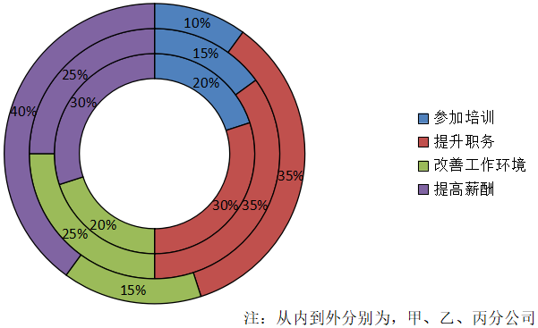

### 第 6 题　qid 2060646 · 增长

假设甲分公司有意愿提升职务的职工有150人，那么该分公司有意愿提高薪酬的职工人数比有意愿参加培训的职工人数（  ）

- **A**. 少100人
- **B**. 少50人
- **C**. 多100人
- **D**. 多50人　✅

**答案**：D

**官方解析**

由图可得，甲分公司有意愿提升职务、提高薪酬、参加培训的职工比重分别为、、，根据有意愿提升职务的职工有150人，可得人，故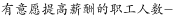人。

故正确答案为D。

---

### 第 7 题　qid 2060652 · 增长

甲、乙、丙3个分公司中，有意愿提高薪酬的职工人数最多的是（  ）

- **A**. 甲分公司
- **B**. 乙分公司
- **C**. 丙分公司
- **D**. 无法确定　✅

**答案**：D

**官方解析**

由于材料只给出三个分公司有意愿提高薪酬职工人数的比重，并未给出三个分公司各自的总人数，故无法推断出哪个分公司有意愿提高薪酬的职工人数更多。
故正确答案为D。

---

### 第 8 题　qid 2060672 · 综合

根据该总公司所属3个分公司职工意愿调查结构的情况，下列说法正确的是：

- **A**. 
乙分公司中有意愿提高薪酬的职工占比最高

- **B**. 
乙分公司中有意愿参加培训的职工比有意愿提升职务的职工少

- **C**. 
甲分公司中有意愿参加培训的职工比有意愿提升职务的职工少
　✅
- **D**. 
甲分公司中有意愿提高薪酬的职工人数多于有其他意愿的职工人数

**答案**：C

**官方解析**

本题属于综合分析，需结合每一个选项的描述与表格、材料中给出的具体数据判断其是否正确。

A项：定位饼图，乙分公司中有意愿提高薪酬的职工占比为25%，而有意愿提升职务的占比为35%，所以乙分公司中有意愿提高薪酬的职工占比不是最高的，该项错误。

B项：由图形可得，乙分公司中有意愿参加培训职工人数、有意愿提升职务职工人数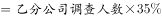，故有意愿参加培训的职工比有意愿提升职务的职工少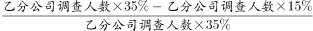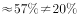，该项错误。

C项：由图形可得，甲分公司中有意愿参加培训职工人数、有意愿提升职务职工人数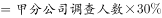，故甲分公司中有意愿参加培训的职工比有意愿提升职务的职工少，该项正确。

D项：甲分公司中有意愿提高薪酬的职工占比为，甲分公司中有其他意愿的职工占比为。，该项错误。

故正确答案为C。

---

### 第 9 题　qid 2060678 · 比重

根据该总公司所属3个分公司职工意愿调查结构的情况，下列说法一定正确的有（  ）个。
（1）如果该总公司人数共1500人，则乙分公司有意愿改善工作环境的职工有125人。
（2）丙分公司中，有意愿提高薪酬的职工人数最多。
（3）在该总公司职工中，有意愿提高薪酬的职工在职工总人数中占比最大。

- **A**. 3
- **B**. 2
- **C**. 1　✅
- **D**. 0

**答案**：C

**官方解析**

本题属于综合分析，需结合每一个选项的描述与表格、材料中给出的具体数据判断其是否正确。
（1）只给出总公司人数，乙分公司人数未知，无法求出乙分公司中有意愿改善工作环境的职工人数，错误。
（2）由图形材料可得，丙公司中有意愿提高薪酬的职工比重最高，且丙分公司总数一定，故该项人数最多，正确。
（3）由于甲乙丙三个分公司总人数未知，故无法推算有意愿提高薪酬的职工在职工总人数中的占比情况，错误。
故正确答案为C。

---

### 第 10 题　qid 2060682 · 比重

假设甲、乙、丙3个分公司的职工人数相同，总公司某年度计划对3个分公司中有意愿提升职务的职工进行职务提升，晋升比例为每5位有意愿的职工中提升1位，那么：

- **A**. 甲分公司获得职务提升的职工人数不一定比乙、丙的少　✅
- **B**. 乙分公司获得职务提升的职工人数不可能多于甲分公司
- **C**. 甲、乙、丙3个分公司获得职务提升的职工人数之和将超过甲分公司职工总人数
- **D**. 乙、丙分公司获得职务提升的职工人数不一定相同

**答案**：A

**官方解析**

本题属于综合分析，需结合每一个选项的描述与表格、材料中给出的具体数据判断其是否正确。

A项：设甲乙丙分公司各自的总人数为20，则，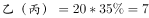。均按照5人中提升1人的比例计算，则甲乙丙均提升1人，相等，故“不一定少”表述正确，该项正确。

B项：设甲乙分公司各自的总人数为100，则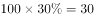，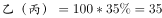。均按照5人中提升1人的比例计算，则甲分公司提升6人，乙提升7人，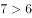，故乙分公司获得职务提升的职工人数“不可能多于”甲分公司的表述错误，该项错误。

C项：甲乙丙三个分公司的人数均为，则，再按晋升比例每5人提升1人，则获得职务提升的职工人数一定小于，该项错误。

D项：乙丙分公司总人数相同，有意愿提升职务的比例相同，晋升比例也相同，故获得职务提升的人数一定相同，该项错误。

故正确答案为A。

---

## 材料 3

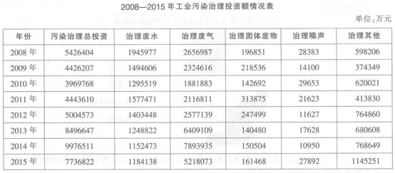

### 第 11 题　qid 2145030 · 增长

2008年至2015年，各类工业污染治理投资中，投资额呈先下降后增长趋势的有：

- **A**. 3个
- **B**. 2个
- **C**. 1个
- **D**. 0个　✅

**答案**：D

**官方解析**

观察表格数据，2008年至2015年，各类工业污染治投资额增长趋势分别为：治理废水：降——升——降——升，治理废气：降——升——降，治理固体废弃物：升——降——升——降——升，治理噪声：降——升——降——升——降——升，治理其他：降——升——降——升——降——升，呈先下降后增长趋势的0个。
故正确答案为D。

---

### 第 12 题　qid 2145031 · 增长

2012年至2015年，治理噪声投资额的年均增长率约为：

- **A**. 

- **B**. 

　✅
- **C**. 

- **D**. 

**答案**：B

**官方解析**

根据题干所求“2012年至2015年，治理噪声投资额的年均增长率”可判定此题为年均增长率计算。定位表格，2012年、2015年治理噪声投资额分别为11627万元、27892万元。代入公式：（），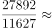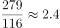，根据选项计算，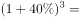，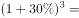，，因此，，只有B项满足要求。

故正确答案为B。

---

### 第 13 题　qid 2145032 · 比重

与2015年相比，2008年治理废气投资在污染治理总投资中占比：

- **A**. 
约低

- **B**. 
约高

- **C**. 
约高18个百分点

- **D**. 
约低18个百分点
　✅

**答案**：D

**官方解析**

根据题干所求“与2015年相比，2008年治理废气投资在污染治理总投资中占比”，可判定此题为两期比重比较。定位表格，2008年治理废气投资2656987万元、污染治理总投资5426404万元，2015年治理废气投资5218073万元、污染治理总投资7736822万元。2008年占比为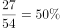、2015年占比为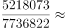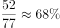，，因此2008年占比比2015年约低18个百分点。

故正确答案为D。

---

### 第 14 题　qid 2145033 · 综合

2008年至2015年，治理废水投资和治理废气投资差额最大的年份是：

- **A**. 2009年
- **B**. 2013年
- **C**. 2014年　✅
- **D**. 2015年

**答案**：C

**官方解析**

代入表格数据，各年份治理废水投资和治理废气投资差额分别为：2009年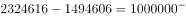万元；2013年万元；2014年万元；2015年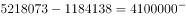万元，差额最大的是2014年。

故正确答案为C。

---

### 第 15 题　qid 2145034 · 综合

根据上表，下列叙述必然正确的是：

- **A**. 与2008年相比，2015年各类工业污染治理投资在总投资中占比增幅最小的是治理废水投资　✅
- **B**. 2008年至2015年，治理固体废物年均投资额约为22亿元
- **C**. 与2008年相比，2015年各类工业污染治理投资年均增长额最小的是治理噪声投资
- **D**. 2008年至2015年，工业污染中问题最为严重的一直是废气污染

**答案**：A

**官方解析**

A项：根据表格数据，与2008年相比，2015年各类工业污染治理投资在总投资中占比变化情况如下：

治理废水投资；

治理废气投资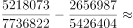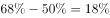；

治理固体废物投资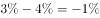；

治理噪声投资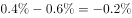；

治理其他投资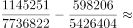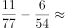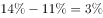；

占比增幅最小的是治理废水投资，正确；

B项：代入表格数据，2008年至2015年，治理固体废物年均投资额为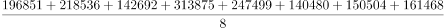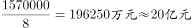，错误；

C项：年均增长量=，年份差相同，因此只需比较“现期量-基期量”大小，治理废水投资，治理废气投资，治理固体废物投资，治理噪声投资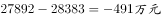，治理其他投资，最小的是治理废水投资，错误；

D项：根据表格数据，只能得到2008年至2015年，工业污染治理投资中投资额最多的一直是治理废气污染，但治理投资额多少与污染严重程度是否必然一致无法推出，错误。

故正确答案为A。

---
