# 2017年湖北省选调生行测题（精选）

> 资料分析 · 7 题 · 湖北 2017

## 材料 1

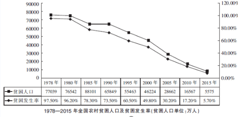

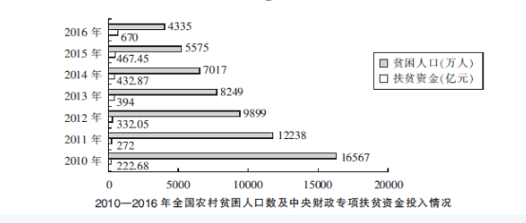

        2016年我国扶贫力度进一步加大，中央和省级财政专项扶贫资金投入超过了1000亿元，其中中央财政安排专项扶贫资金670亿元。全国农村超额完成了政府工作报告提出的减贫1000万人的目标任务。2000-2014年，中央财政累计投入专项扶贫资金2966亿元，年均增长。

### 第 1 题　qid 2261884 · 增长

2011-2016年，中央财政专项扶贫资金投入增速超过的有：

- **A**. 2年
- **B**. 3年　✅
- **C**. 4年
- **D**. 5年

**答案**：B

**官方解析**

根据问题“增速超过”可判定题型为增长率问题，由增长率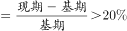，所求问题可转化为：，即增速超过。

定位第二个图形材料可得：

2011年：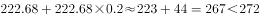，满足；

2012年：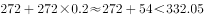，满足；

2013年：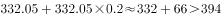，不满足；

2014年：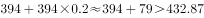，不满足；

2015年：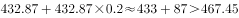，不满足；

2016年：，满足。

因此2011年、2012年、2016年，共3年满足。

故正确答案为B。

---

### 第 2 题　qid 2261885 · 增长

1980年-2015年，全国农村贫困发生率下降最快的是：

- **A**. 1980-1985年
- **B**. 1990-1995年
- **C**. 2000-2005年　✅
- **D**. 2010-2015年

**答案**：C

**官方解析**

定位第一个图形材料可得四个选项分别下降了：1980-1985年：；1990-1995年：；2000-2005年：；2010-2015年：，故2000-2005年全国农村贫困发生率下降最快。

故正确答案为C。

---

### 第 3 题　qid 2261886 · 增长

根据所给材料，下列说法正确的是：

①2010-2016年中央财政专项扶贫资金投入与农村贫困人口数的变化趋势相反

②2010-2016年全国农村年均减贫人口数超过2000万人

③2016年全国农村贫困人口同比下降3成

④2016年全国农村完成减贫任务超过目标近

- **A**. ①②③
- **B**. ①②④　✅
- **C**. ②③④
- **D**. ①②③④

**答案**：B

**官方解析**

①定位第二个图形材料可知：2010-2016年中央财政专项扶贫资金投入逐年增加，农村贫困人口数逐年减少，变化趋势相反，正确；

②定位第二个图形材料可知：2010年全国农村贫困人口16567万人，2016年全国农村贫困人口4335万人，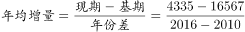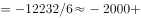万人，即年均减贫超过2000万人，正确；

③定位第二个图形材料可知，2016年全国农村贫困人口4335万人，2015年全国农村贫困人口5575万人，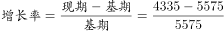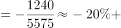，即同比下降不到3成，错误；

④定位文字材料和第二个图形材料可知：2016年全国农村减贫目标为1000万人，实际减贫人口数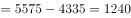，超过目标：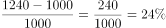，接近，正确。

综上，①②④正确。

故正确答案为B。

---

## 材料 2

        中国支付清算协会发布的《中国支付清算行业运作报告（2016）》显示，2015年国内银行共处理移动支付业务138.37亿笔，金额108.22万亿元，同比分别增长和；非银行支付机构共同处理移动支付业务398.61亿笔，金额21.96万亿元，同比分别增长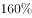和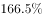。

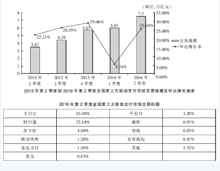

### 第 4 题　qid 2261887 · 增长

2016年第二季度第三方移动支付市场交易额同比增速最接近：

- **A**. 

　✅
- **B**. 
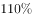

- **C**. 

- **D**. 

**答案**：A

**官方解析**

根据问题问“同比增速”，可判定此题为增长率计算。定位第一个图形材料可得：2016年第二季度第三方移动支付市场交易额为7.5万亿元，2015年第二季度第三方移动支付市场交易额为3.47万亿元。由公式：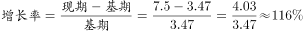，与A项最接近。

故正确答案为A。

---

### 第 5 题　qid 2261888 · 综合

2015年全国第三方移动支付市场月均交易额约为：

- **A**. 1.2万亿元
- **B**. 1.9万亿元
- **C**. 1.7万亿元
- **D**. 1.4万亿元　✅

**答案**：D

**官方解析**

根据问题问“月均”，结合问题时间为2015年、材料时间为2016年，可判定题型为基期平均数问题。定位第一个图形材料，由可知：2015年1季度全国第三方移动支付市场交易额为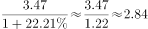万亿元，则月均交易额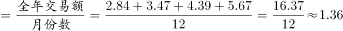万亿元，与D项最接近。

故正确答案为D。

---

### 第 6 题　qid 2261889 · 综合

2016年第二季度，全国第三方移动支付市场上支付宝比财付通交易额高出约：

- **A**. 

- **B**. 

　✅
- **C**. 
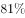

- **D**. 

**答案**：B

**官方解析**

根据问题“2016年第二季度······高出约”结合选项为百分数可判定题型为增长率问题。定位第二个表格材料可得：2016年第二季度，全国第三方移动支付市场上支付宝交易份额为55.40%，财付通为32.10%，支付宝比财付通高出：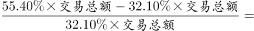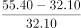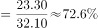，与B项最接近。

---

### 第 7 题　qid 2261890 · 增长

2015年国内银行和非银行机构移动支付金额同比增量之比约为：

- **A**. 7:2
- **B**. 6:1　✅
- **C**. 5:2
- **D**. 4:1

**答案**：B

**官方解析**

根据问题“······同比增量之比约为”可判定题型为比值计算问题。定位文字材料可得：2015年国内银行移动支付金额108.22万亿元，同比增长，非银行机构移动支付金额21.96万亿元，同比增长。由可得：2015年国内银行移动支付金额同比增长了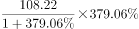万亿元，2015年非银行机构移动支付金额同比增长了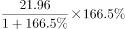万亿元，故比值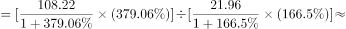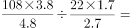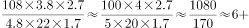，与B项最接近。

故正确答案为B。

---
