# 2017年福建省选调生考试《行政职业能力测验》

> 资料分析 · 21 题 · 福建 2017

## 材料 1

        2015年，全国民航运输机场完成旅客吞吐量9.15亿人次，比上年增长10.0%，增速较上年回落了0.4个百分点。西部增长13.5%；中部增长8.5%；东北增长8.2%；东部增长8.8%。全国民航年吞吐量1000万人次以上的运输机场26个，比上年增加2个，吞吐量占全国的77.9%，100-1000万人次的运输机场44个，比上年增加4个，吞吐量占全国的17.6%。2015年，民航基本建设和技术改造投资769.3亿元，比上年增长4.8%。其中：机场系统完成固定资产投资总额656.1亿元，比上年增长17.0%；空管系统完成固定资产投资17.7亿元，比上年减少6.2亿元；民航其他系统完成固定资产投资总额95.5亿元，比上年减少54亿元。

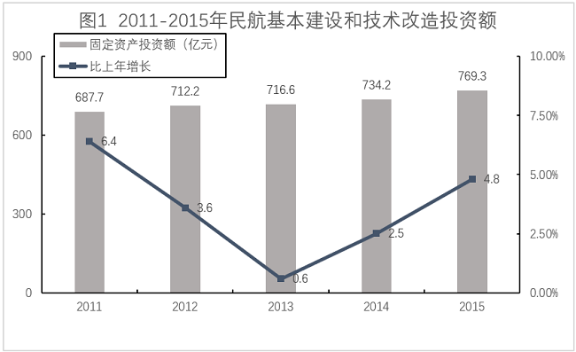

### 第 1 题　qid 4737703 · 平均数

2015年平均每个吞吐量100万-1000万人次的运输机场吞吐量约多少人次 ？

- **A**. 470 万
- **B**. 370 万　✅
- **C**. 570 万
- **D**. 270 万

**答案**：B

**官方解析**

根据题干“2015年平均每个······吞吐量约多少人次”，结合材料时间是2015年，可判定本题为现期平均数问题。定位文字材料可得：“2015年，全国民航运输机场完成旅客吞吐量9.15亿人次······100-1000万人次的运输机场44个，比上年增加4个，吞吐量占全国的17.6%”。根据公式：平均数万人次，与B项最接近。

故正确答案为B。

---

### 第 2 题　qid 4737707 · 增长

2015年，全国民航运输机场完成旅客吞吐量在100万人次以上的运输机场同比增长了：

- **A**. 0.8%
- **B**. 9%　✅
- **C**. 1%
- **D**. 2%

**答案**：B

**官方解析**

根据题干“2015年······同比增长了”，结合选项为百分数，可判定本题为一般增长率问题。定位文字材料可得：“2015年······全国民航年吞吐量1000万人次以上的运输机场26个，比上年增加2个······100-1000万人次的运输机场44个，比上年增加4个”。根据公式：增长率，则所求，与B项最接近。

故正确答案为B。

---

### 第 3 题　qid 4737714 · 比重

关于2014年各地区的旅客吞吐量占全国比重的描述，说法正确的是：

- **A**. 西部地区低于29.4%　✅
- **B**. 中部地区低于9.8%
- **C**. 东北地区低于6%
- **D**. 东部地区低于54.8%

**答案**：A

**官方解析**

根据题干“2014年······比重的描述······”，结合材料时间是2015年，可判定本题为基期比重问题。定位图形材料可得：2015年西部、中部、东北、东部地区旅客吞吐量占全国的比重分别为29.4%、9.8%、6.0%、54.8%。定位文字材料可得：“2015年，全国民航运输机场完成旅客吞吐量9.15亿人次，比上年增长10.0%，增速较上年回落了0.4个百分点。西部增长13.5%；中部增长8.5%；东北增长8.2%；东部增长8.8%。”根据两期比重结论“部分增长率＞整体增长率，比重上升；部分增长率＜整体增长率，比重下降”可知，西部地区增长率13.5%＞整体增长率10.0%＞其余地区增长率，因此2014年西部地区比重低于2015年西部地区比重29.4%。
故正确答案为A。

---

### 第 4 题　qid 4737721 · 增长

2011-2015年民航基本建设和技术改造投资增长额超过30亿元的有几个？

- **A**. 0
- **B**. 1
- **C**. 2　✅
- **D**. 3

**答案**：C

**官方解析**

根据题干“2011-2015年······增长额超过30亿元的有几个”，可判定本题为增长量计算问题。定位图1可得：2011-2015年民航基本建设和技术改造投资额分别为687.7亿元、712.2亿元、716.6亿元、734.2亿元、769.3亿元，2011年民航基本建设和技术改造投资额比上年增长6.4%。根据公式：增长量、增长量=现期量-基期量，则2011年民航基本建设和技术改造投资增长额为：亿元；2012年为：712.2-687.7=24.5亿元；2013年为：716.6-712.2=4.4亿元；2014年为：734.2-716.6=17.6亿元；2015年为：769.3-734.2=35.1亿元。综上，超过30亿元的有2011年、2015年，共2个。

故正确答案为C。

---

### 第 5 题　qid 4737726 · 综合

根据以上材料，可以推出的是：

- **A**. 2014年，空管系统完成固定资产投资为11.5亿元
- **B**. 2014年，机场系统完成固定资产投资总额超过600亿元
- **C**. 2015年西部地区民航运输机场旅客吞吐量超过中部地区的三倍
- **D**. 2015年东部地区民航运输机场旅客吞吐量与其他地区吞吐量之和相差不到1亿人次　✅

**答案**：D

**官方解析**

A项：定位文字材料可得，2015年空管系统完成固定资产投资17.7亿元，比上年减少6.2亿元。根据公式：基期量=现期量-增长量，可得2014年空管系统完成固定资产投资17.7-(-6.2)=23.9亿元，错误；

B项：定位文字材料可得，2015年机场系统完成固定资产投资总额656.1亿元，比上年增长17.0%。根据公式：基期量，可得2014年机场系统完成固定资产投资总额亿元&lt;600亿元，错误；

C项：定位图2可得，2015年西部地区民航运输机场旅客吞吐量占比29.4%，中部地区占比9.8%，则2015年西部地区民航运输机场旅客吞吐量是中部地区的：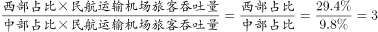倍，并非超过三倍，错误；

D项：定位文字材料可得，2015年全国民航运输机场完成旅客吞吐量9.15亿人次；定位图2，2015年东部地区民航运输机场旅客吞吐量占比54.8%，则2015年其他地区旅客吞吐量占比之和=1-54.8%=45.2%。则2015年东部地区民航运输机场旅客吞吐量与其他地区吞吐量之和相差9.15×(54.8%-45.2%)=9.15×9.6%&lt;10×10%=1亿人次，即不到1亿人次，正确。

故正确答案为D。

---

## 材料 2

        2014年我国快递服务企业业务量完成139.6亿件，同比增长51.9%；快递业务收入完成2045.4亿元，同比增长41.9%。快递业务收入占邮政行业总收入的比重为63.9%，比上年提高7.3个百分点。

        全年同城快递业务量完成35.5亿件，同比增长55.1%；实现业务收入265.9亿元，同比增长59.8%。异地快递业务快速增长。全年异地快递业务量完成100.9亿件，同比增长52.0%；实现业务收入1130.6亿元，同比增长36.4%。国际及港澳台快递业务稳定增长。全年国际及港澳台快递业务量完成3.3亿件，同比增长24.7%；实现业务收入315.9亿元，同比增长16.7%。同城快递业务占比上升。同城、异地、国际及港澳台快递业务量占全部比例分别为25.4%、72.3%和2.3%，业务收入占全部比例分别为13.0%、55.3%和15.4%。

        全年东部地区完成快递业务量114.5亿件，同比增53.2%；实现业务收入1694.3亿元，同比增长41.3%。中部地区完成快递业务量14.8亿件，同比增长49.2%；实现业务收入191.6亿元，同比增长44.3%。西部地区完成快递业务量10.3亿件，同比增长42.4%；实现业务收入159.5亿元，同比增长45.3%。东、中、西部地区快递业务量比重分别为82.0%、10.6%和7.4%，快递业务收入比重分别为82.8%、9.4%和7.8%。

        民营快递企业持续快速发展。全年国有快递企业业务量完成18.7亿件，实现业务收入300亿元；民营快递企业业务量完成119.5亿件，实现业务收入1541亿元；外资快递企业业务量完成1.4亿件，实现业务收入204.2亿元。国有、民营、外资快递企业业务量市场份额分别为13.4%、85.6%和1.0%，业务收入市场份额分别为14.7%、75.3%和10.0%。

### 第 6 题　qid 4737717 · 平均数

2014年平均每件快递业务收入约为（    ）元。

- **A**. 低于15　✅
- **B**. 15-17
- **C**. 17-19
- **D**. 19-21

**答案**：A

**官方解析**

根据题干“2014年平均每件······元”，结合材料时间为2014年，可判定本题为现期平均数问题。定位文字材料第一段可得：2014年我国快递服务企业业务量完成139.6亿件，快递业务收入完成2045.4亿元。则2014年平均每件快递业务收入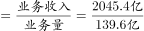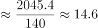元，即低于15元。

故正确答案为A。

---

### 第 7 题　qid 4737723 · 平均数

2014年，平均每件快递业务收入较上年增长最快的是：

- **A**. 同城　✅
- **B**. 异地
- **C**. 国际及港澳台
- **D**. 无法确定

**答案**：A

**官方解析**

根据题干“2014年，平均每件快递业务收入较上年增长最快······”，可判定本题为平均数的增长率问题。定位文字材料第二段可知：2014年，全年同城快递业务量同比增长55.1%（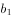）；实现业务收入同比增长59.8%（）。全年异地快递业务量同比增长52.0%（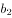）；实现业务收入同比增长36.4%（）。全年国际及港澳台快递业务量同比增长24.7%（）；实现业务收入同比增长16.7%（）。根据公式：平均数的增长率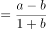，则2014年各选项平均每件快递业务收入较上年的增长率分别为：

同城：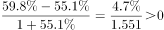；

异地：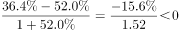；

国际及港澳台：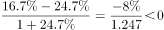。

则2014年，平均每件快递业务收入较上年增长最快的是同城。

故正确答案为A。

---

### 第 8 题　qid 4737727 · 平均数

在东部、中部、西部地区中，2014年平均每件快递业务收入高于整体业务收入的有（    ）个。

- **A**. 0
- **B**. 1
- **C**. 2　✅
- **D**. 3

**答案**：C

**官方解析**

根据题干“······2014年平均每件快递业务收入高于整体业务收入的有······”，可判定本题为现期平均数问题。

方法一：定位文字材料第一、三段可知：2014年我国快递服务企业业务量完成139.6亿件；快递业务收入完成2045.4亿元。全年东部地区完成快递业务量114.5亿件；实现业务收入1694.3亿元。中部地区完成快递业务量14.8亿件；实现业务收入191.6亿元。西部地区完成快递业务量10.3亿件；实现业务收入159.5亿元。根据公式：平均数，则全国平均每件快递业务收入为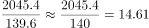元，东部地区平均每件快递业务收入为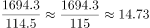元＞14.61元，符合题意；中部地区平均每件快递业务收入为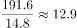元＜14.61元，不符合题意；西部地区平均每件快递业务收入为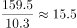元＞14.61元，符合题意，故2014年平均每件快递业务收入高于整体业务收入的有东部和西部，共2个地区。

方法二：定位文字材料第三段可知：2014年，东、中、西部地区快递业务量比重分别为82.0%、10.6%和7.4%，快递业务收入比重分别为82.8%、9.4%和7.8%。根据公式：部分=整体×比重，平均数，则东部地区平均每件快递业务收入为：＞我国平均每件快递业务收入，符合题意；

中部地区平均每件快递业务收入为：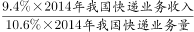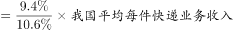＜我国平均每件快递业务收入，不符合题意；

西部地区平均每件快递业务收入为：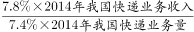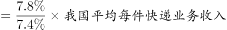＞我国平均每件快递业务收入，符合题意。

则2014年平均每件快递业务收入高于整体业务收入的有东部和西部，共2个地区。

故正确答案为C。

---

### 第 9 题　qid 4737735 · 比重

2014年快递业务量占比相差最大的是：

- **A**. 异地、国有
- **B**. 中部、同城
- **C**. 西部、国际及港澳台
- **D**. 东部、外资　✅

**答案**：D

**官方解析**

根据题干“2014年快递业务量占比相差最大的是”，结合材料时间为2014年，可判定本题为现期比重问题。定位文字材料第二、三、四段可得：2014年，同城、异地、国际及港澳台快递业务量占全部比例分别为25.4%、72.3%和2.3%；东、中、西部地区快递业务量比重分别为82.0%、10.6%和7.4%；国有、民营、外资快递企业业务量市场份额分别为13.4%、85.6%和1.0%。快递业务量占比的差值分别为，A项：72.3%-13.4%=58.9%；B项：25.4%-10.6%=14.8%；C项：7.4%-2.3%=5.1%；D项：82.0%-1.0%=81%，即2014年快递业务量占比相差最大的是D项。
故正确答案为D。

---

### 第 10 题　qid 4737739 · 综合

关于我国快递业务发展情况，能够从上述材料推出的是：

- **A**. 2013年我国快递服务企业业务量超过100亿件
- **B**. 2014年快递业务收入增速超过邮政行业总收入　✅
- **C**. 2014年国有快递业务收入超过民营的2成
- **D**. 2014年中部地区的业务量及收入增速均超过西部地区

**答案**：B

**官方解析**

A项：定位文字材料第一段，2014年我国快递服务企业业务量完成139.6亿件，同比增长51.9%。根据公式：基期量，故2013年我国快递服务企业业务量亿件，错误；

B项：定位文字材料第一段，快递业务收入占邮政行业总收入的比重为63.9%，比上年提高7.3个百分点。根据两期比重比较结论，当a＞b时比重上升，反推当比重上升时，a＞b，即2014年快递业务收入增速超过邮政行业总收入，正确；

C项：定位文字材料第四段，全年国有快递企业实现业务收入300亿元；民营快递企业实现业务收入1541亿元。，故2014年国有快递业务收入未超过民营的2成，错误；

D项：定位文字材料第三段，中部地区完成快递业务量14.8亿件，同比增长49.2%；实现业务收入191.6亿元，同比增长44.3%。西部地区完成快递业务量10.3亿件，同比增长42.4%；实现业务收入159.5亿元，同比增长45.3%。49.2%＞42.4%，故2014年中部地区的业务量增速超过西部地区；44.3%＜45.3%，故2014年中部地区的业务收入增速未超过西部地区，错误。

故正确答案为B。

---

## 材料 3

        2015年某市全年用于研究与试验发展（R&amp;D）经费支出925亿元，与上年同期相比增长了11%，增速较全国高出1.8个百分点。该市R&amp;D经费支出在该市生产总值中占比为3.7%，比全国水平高出1.6个百分点。

        全年受理专利申请100006件，比上年增长22.5%，其中受理发明专利申请46976件，增长20%。全年专利授权量为60623件，增长20.1%，其中发明专利授权量为17601件，增长51.5%。至年末，全市有效发明专利达69982件。全市科技小巨人企业和小巨人培育企业共1427家，高新技术企业6071家，技术先进型服务企业253家。年内全市认定和复审高新技术企业2089家。年内认定高新技术成果转化项目613项，其中电子信息、生物医药、新材料等重点领域项目占83.4%。至年末，共认定高新技术成果转化项目10500项。全年经认定登记的各类技术交易合同2.25万件，比上年下降10.8%；合同成交金额707.99亿元，增长6.0%。

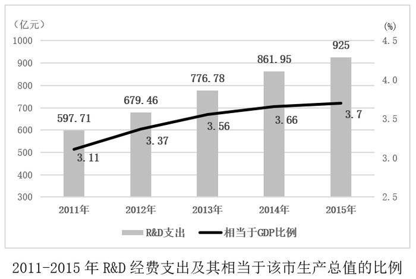

### 第 11 题　qid 4737815 · 比重

若该市R&D经费支出占全国同类经费支出的6.5%，则2015年该市生产总值约占国内生产总值的：

- **A**. 1%-2%
- **B**. 3%-4%　✅
- **C**. 5%-6%
- **D**. 6%-7%

**答案**：B

**官方解析**

根据题干“2015年······占······”，结合材料时间为2015年，可判定本题为现期比重问题。定位文字材料第一段可得：2015年该市R&amp;D经费支出在该市生产总值中占比为3.7%，比全国水平高出1.6个百分点。根据公式：比重，可得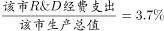，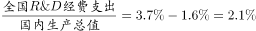，又由题干可知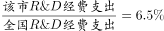，则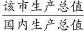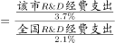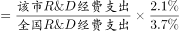，在3%-4%之间。

故正确答案为B。

---

### 第 12 题　qid 4737823 · 增长

2015年该市发明专利授权增长数量约占专利授权总增长量的：

- **A**. 3成
- **B**. 4成
- **C**. 5成
- **D**. 6成　✅

**答案**：D

**官方解析**

根据题干“2015年······占······”，结合材料时间为2015年，可判定本题为现期比重问题。定位文字材料第二段可得：2015年全年专利授权量为60623件，增长20.1%，其中发明专利授权量为17601件，增长51.5%。根据公式：，可得2015年该市发明专利授权增长数量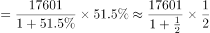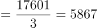件，专利授权总增长量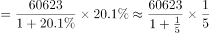件。根据公式：，可得2015年该市发明专利授权增长数量占专利授权总增长量的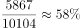，即约占6成。

故正确答案为D。

---

### 第 13 题　qid 4737828 · 平均数

2015年，该市平均每件经认定登记的技术合同成交额较上年增长了：

- **A**. 12%
- **B**. 16%
- **C**. 19%　✅
- **D**. 23%

**答案**：C

**官方解析**

根据题干“2015年······平均每件······较上年增长了”，结合选项为百分数，可判定本题为平均数的增长率问题。定位文字材料第二段可得：2015年全年经认定登记的各类技术交易合同2.25万件，比上年下降10.8%（b）；合同成交金额707.99亿元，增长6.0%（a）。根据公式：平均数的增长率，可得2015年，该市平均每件经认定登记的技术合同成交额较上年增长了。

故正确答案为C。

---

### 第 14 题　qid 4737839 · 增长

2011-2015年，该市R&D经费支出增速高于该市生产总值的有（    ）年。

- **A**. 1
- **B**. 3
- **C**. 2
- **D**. 4　✅

**答案**：D

**官方解析**

根据题干“2011-2015年······增速高于······的有（    ）年”，结合图形材料中给出2011-2015年R&D经费支出相当于该市生产总值的比例，可判定本题为两期比重比较问题。定位图形材料可知，2011-2015年，该市R&D经费支出相当于该市生产总值的比例依次为3.11%、3.37%、3.56%、3.66%、3.7%，即2012、2013、2014、2015年，R&D经费支出占该市生产总值的比重均高于上年，根据两期比重比较结论，当a＞b时，比重上升，可知若比重上升，则a＞b，因此这四年该市的R&D经费支出增速（a）＞生产总值增速（b）。
故正确答案为D。

---

### 第 15 题　qid 4737843 · 综合

根据上述材料，以下说法可以推出的是：

- **A**. 
2014年，全国经费同比增速为9.2%

- **B**. 
2015年，该市专利申请授权率超过4成
　✅
- **C**. 
2015年，技术先进型服务企业数量超过小巨人企业和小巨人培育企业之和的20%

- **D**. 
2015年，电子信息、生物医药、新材料等重点领域项目不到500个

**答案**：B

**官方解析**

A项：材料中未给出“2014年全国R&amp;D经费”的相关数据，无法推出其2014年的同比增速，错误；

B项：定位文字材料第二段，全年受理专利申请100006件······全年专利授权量为60623件。故2015年，专利申请授权率，超过4成，正确；

C项：定位文字材料第二段，至年末······全市科技小巨人企业和小巨人培育企业共1427家······技术先进型服务企业253家。小巨人企业和小巨人培育企业之和的20%=1427×20%=285.4＞253，错误；

D项：定位文字材料第二段，年内认定高新技术成果转化项目613项，其中电子信息、生物医药、新材料等重点领域项目占83.4%。根据公式：部分量=总量×比重，则电子信息、生物医药、新材料等重点领域项目=613×83.4%511个＞500个，错误。

故正确答案为B。

---

## 材料 4

        2015年，全国电话用户净增121.1万户，总数达到15.37亿户，增长0.1%，比上年回落2.5个百分点。其中，移动电话用户净增1964.5万户，总数达13.06亿户，移动电话用户普及率达95.5部／百人。固定电话用户总数2.31亿户。

        2015年，2G移动电话用户减少1.83亿户，是上年净减数的1.5倍，占移动电话用户的比重由上年的54.7%下降至39.9%。4G移动电话用户新增28894.1万户，总数达38622.5万户。

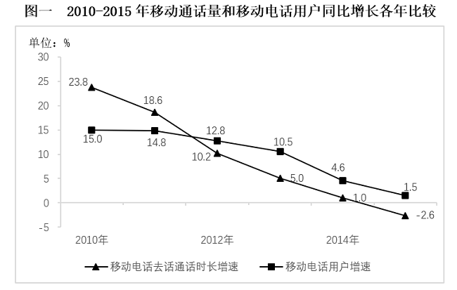

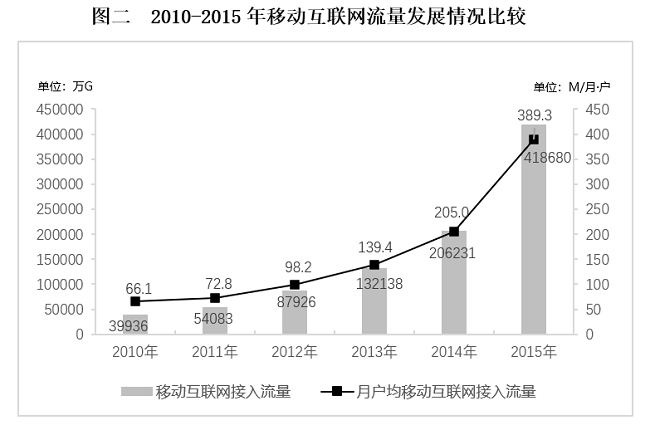

### 第 16 题　qid 4737852 · 增长

与上年相比，2015年固定电话用户数约下降了：

- **A**. 7.4%　✅
- **B**. 8.7%
- **C**. 10.7%
- **D**. 17.6%

**答案**：A

**官方解析**

根据题干“与上年相比······约下降了”，结合选项为百分数，可判定本题为一般增长率问题。定位文字材料第一段可得：2015年，全国电话用户净增121.1万户······移动电话用户净增1964.5万户······固定电话用户总数2.31亿户。因全国电话用户净增量=移动电话用户净增量+固定电话用户净增量，故2015年固定电话用户净增量=121.1-1964.5=-1843.4万户。代入公式：增长率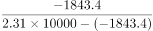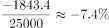，即约下降了7.4%。

故正确答案为A。

---

### 第 17 题　qid 4737854 · 综合

2013年全国2G移动电话用户数约为多少亿户？

- **A**. 5.6
- **B**. 6.2
- **C**. 7.5
- **D**. 8.3　✅

**答案**：D

**官方解析**

根据题干“2013年······约为多少亿户”，结合材料时间为2015年，可判定本题为基期计算问题。定位文字材料第一、二段可得：2015年，全国移动电话用户总数达13.06亿户；2015年，2G移动电话用户减少1.83亿户，是上年净减数的1.5倍，占移动电话用户的比重由上年的54.7%下降至39.9%。根据公式：部分=整体×比重，可得2015年全国2G移动电话用户数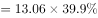亿户，2015年全国2G移动电话用户减少1.83亿户，是上年净减数的1.5倍，则2014年全国2G移动电话用户减少量亿户，根据公式：基期量=现期量−增长量，则2013年全国2G移动电话用户数=5.2−（−1.83）−（−1.22）=8.25亿户，与D项最接近。

故正确答案为D。

---

### 第 18 题　qid 4737857 · 增长

2010-2015年，每个移动电话用户去话通话时长同比增长率低于3%有几年？

- **A**. 3
- **B**. 2
- **C**. 4　✅
- **D**. 1

**答案**：C

**官方解析**

根据题干“2010-2015年，每个移动电话用户去话通话时长同比增长率······”，可判定本题为平均数的增长率问题。定位图一可得2010-2015年移动电话去话通话时长同比增速（a）和移动电话用户同比增速（b）。根据公式：平均数的增长率，代入数据可得，2010年：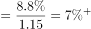；2011年：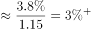；2012-2015年，由于移动电话去话通话时长同比增速（a）均小于移动电话用户同比增速（b），则平均数的增长率均同比下降，即增速小于0，故2012-2015年每个移动电话用户去话通话时长同比增长率均低于3%。符合要求的有2012年、2013年、2014年、2015年，共计4年。

故正确答案为C。

---

### 第 19 题　qid 4737860 · 增长

移动互联网接入流量增长最快的那一年，年户均移动互联网接入流量同比增长了（    ）M。

- **A**. 180
- **B**. 2200　✅
- **C**. 60
- **D**. 720

**答案**：B

**官方解析**

根据题干“······同比增长了······M”，可判定本题为增长量计算问题。定位图二可得2010-2015年每年移动互联网接入流量及月户均移动互联网接入流量。根据公式：增长率，越大，增长率越大，观察数据，仅有2015年移动互联网接入流量的，其他年份均小于2，所以2015年是增长最快的年份；根据公式：增长量=现期量-基期量，故2015年年户均移动互联网接入流量同比增长量M，与B项最接近。

故正确答案为B。

---

### 第 20 题　qid 4737862 · 综合

根据材料，以下说法正确的一项是：

- **A**. 2015年全国人口接近13.5亿人
- **B**. 2015年，4G移动电话用户中，新入4G用户占比近7成
- **C**. 移动电话去话通话时长与移动电话用户同比增长率差值最小是2012年　✅
- **D**. 2015年移动互联网接入流量较5年前翻了4番

**答案**：C

**官方解析**

A项：定位文字材料第一段可得：2015年全国移动电话用户总数为13.06亿户，移动电话用户普及率达95.5部／百人。则2015年全国人口数亿人，错误；

B项：定位文字材料第二段可得：2015年，4G移动电话用户新增28894.1万户，总数达38622.5万户。根据公式：比重，则2015年新入4G用户占4G移动电话用户的占比为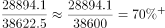，则2015年新入4G用户占4G移动电话用户的占比超过7成，错误；

C项：定位图一可得：2010-2015年移动电话去话通话时长增速与移动电话用户增速。则2010-2015年两者增速差值分别为23.8%-15%=8.8%、18.6%-14.8%=3.8%、12.8%-10.2%=2.6%、10.5%-5%=5.5%、4.6%-1.0%=3.6%、1.5%-（-2.6%）=4.1%，故移动电话去话通话时长与移动电话用户同比增长率差值最小是2012年，正确；

D项：定位图二可得：2015年移动互联网接入流量为418680万G，2010年移动互联网接入流量为39935万G。则所求倍数倍，而翻四番应为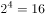倍，错误。

故正确答案为C。

---

### 第 21 题　qid 4737645 · 比重

一个人徒步上山，体重加上负重一共有175斤，其中负重占28%，下山时体力不支，需要减轻部分负重，使得负重的占比为10%。请问下山的负重比上山的负重减少了多少斤？（假定体重全程都没有发生改变）

- **A**. 14
- **B**. 35　✅
- **C**. 49
- **D**. 126

**答案**：B

**官方解析**

根据题意，上山时负重为175×28%=49斤，可得其体重为175-49=126斤。设下山时负重x斤，可知：，解得x=14。故下山的负重比上山的负重减少了49-14=35斤。

故正确答案为B。

---
