# 2017年重庆市选调优秀大学生到基层工作考试《行测》题

> 资料分析 · 10 题 · 选调 2017

## 材料 1

        2014年，国家下拨农村义务教育经费保障资金为878.97亿元，2013、2014年依次增长、。

        2014年，农村、城市小学生均预算内事业性经费分别比2010年增长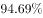、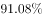，农村小学增幅超过城市；农村、城市初中生均预算内事业性经费分别比2010年增长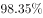、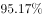，农村增长幅度高出城市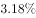。2014年，农村、城市小学生均预算内公用教育经费支出分别比2010年增长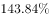、，农村小学增幅超过城市；2014年，农村、城市初中生均预算内公用教育经费支出分别比2010年增长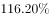、，农村增长幅度高出城市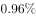。

        2014年，全国小学生均校舍建筑面积为6.85平方米，比2010年增长；全国初中生均校舍建筑面积为11.99平方米，比2010年增长。其中全国小学生均教学与辅助用房面积增长，初中增长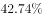；全国小学生均生活用房面积增长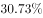，初中增长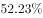；全国小学生均体育馆面积增长，初中增长。

        据对全国14省（区、市）10万余名中小学生的抽样调查显示（以小学四年级、初中二年级为代表，以下同），2010—2014年，每周课时数超过30节的小学比例由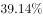下降到，每学期统一考试次数超过1次的小学比例由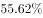下降到，每天在校时间超过6小时的小学比例由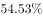下降到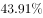，每天家庭作业时间超过1小时的学生比例由下降到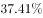，每天体育锻炼时间超过1小时的学生比例由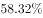上升到。

### 第 1 题　qid 2261597 · 增长

与2012年相比，2014年国家下拨农村义务教育经费保障资金增长（  ）。

- **A**. 6.45
- **B**. 7.38
- **C**. 8.53
- **D**. 8.66　✅

**答案**：D

**官方解析**

根据题干“与2012年相比，2014年······增长······”，判断本题为间隔增长率问题。定位材料第一段可知，2013年国家下拨农村义务教育经费保障资金增长率为，2014年增长率为，代入间隔增长率公式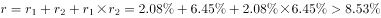。

故正确答案为D。

---

### 第 2 题　qid 2261598 · 增长

下列各项中，农村增幅超过城市最多的是：

- **A**. 小学生均预算内事业性经费
- **B**. 初中生均预算内事业性经费
- **C**. 小学生均预算内公用教育经费支出　✅
- **D**. 初中生均预算内公用教育经费支出

**答案**：C

**官方解析**

根据题干“增幅超过……最多”，判断本题为增长率比较问题，比对材料发现增长率差值材料已经给出，则本题为直接查找数据类型题目。定位材料第二段，A选项，小学生均预算内事业性经费农村增幅超过城市；B选项，初中生均预算内事业性经费农村增幅超过城市；C选项，小学生均预算内公用教育经费支出农村增幅超过城市；初中生均预算内公用教育经费支出农村增长幅度高出城市。判断可知，增幅超过城市最多的为C选项。

故正确答案为C。

---

### 第 3 题　qid 2261599 · 综合

2010年全国初中生均校舍建筑面积比2010年全国小学生均校舍建筑面积大（  ）平方米。

- **A**. 3.25　✅
- **B**. 3.86
- **C**. 4.12
- **D**. 5.14

**答案**：A

**官方解析**

根据题干“2010年全国初中生……比2010年全国小学生……大……平方米”，结合材料所给时间为2011年，可判定本题为基期计算问题。定位材料第三段可得：2014年，全国小学生均校舍建筑面积为6.85平方米，比2010年增长；全国初中生均校舍建筑面积为11.99平方米，比2010年增长。则题干所求  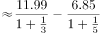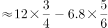，与A项最接近。

故正确答案为A。

---

### 第 4 题　qid 2261600 · 综合

2010-2014年，表现学生课业负担的下列各项指标中，变化最小的是：

- **A**. 每周课时数超过30节的小学比例
- **B**. 每天家庭作业时间超过1小时的学生比例
- **C**. 每天在校时间超过6小时的小学比例　✅
- **D**. 每天体育锻炼时间超过1小时的学生比例

**答案**：C

**官方解析**

由题干“变化最小”和选项“比例”，判断本题为比重比较问题。定位材料第四段，A选项：每周课时数超过30节的小学比例由下降到，变化了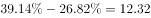个百分点。

B选项：每天家庭作业时间超过1小时的学生比例由下降到，变化了个百分点。

C选项：每天在校时间超过6小时的小学比例由下降到，变化了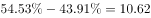个百分点。

D选项：每天体育锻炼时间超过1小时的学生比例由上升到，变化了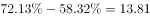个百分点。变化最小的是C选项。

故正确答案为C。

---

### 第 5 题　qid 2261601 · 综合

下列说法不正确的是：

- **A**. 2010-2014年这5年来，小学生课业负担总体呈现下降趋势
- **B**. 教育经费支出城乡差距仍在进一步扩大　✅
- **C**. 全国均校舍面积大幅增加，办学条件改善
- **D**. 义务教育经费投入明显增加，办学经费得到保障

**答案**：B

**官方解析**

A项：定位材料最后一段，发现每周课时数超过30节的小学比例、每学期统一考试次数超过1次的小学比例、每天在校时间超过6小时的小学比例、每天家庭作业时间超过1小时的学生比例都是下降的，说明2010-2014年这5年来，小学生课业负担总体呈现下降趋势，说法正确。

B项：定位材料第二段，农村的增幅均比城市的高，说明城乡差距在缩小，说法错误。

C项：定位材料第三段，2014年全国小学生均校舍建筑面积为6.85平方米，比2010年增长；全国初中生均校舍建筑面积为11.99平方米，比2010年增长。说明校舍面积大幅增加，办学条件得到改善，正确。

D项：定位材料第一段，2014年，国家下拨农村义务教育经费保障资金为878.97亿元，2013、2014年依次增长、。说明义务教育经费投入增加，办学经费得到保障，正确。

本题为选非题，故正确答案为B

---

## 材料 2

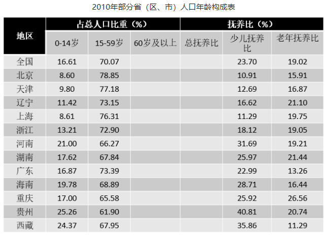

        其中“少儿抚养比”为0～14岁人口数和15～59岁人口数的比值；“老年抚养比”为60岁及以上人口数和15～59岁人口数的比值；“总抚养比”为“少儿抚养比”和“老年抚养比”之和。

### 第 6 题　qid 2261602 · 增长

已知2010年全国0～14岁人口为22253万人，到2015年全国总人口达到137349万人，那么，2015年全国总人口比2010年增加（    ）。

- **A**. 0.86
- **B**. 1.91
- **C**. 2.52　✅
- **D**. 3.14

**答案**：C

**官方解析**

根据题干“······2015年全国总人口比2010增加······”，可判定本题为增长率问题。定位表格可得：2010年全国0-14岁占总人口的比重为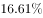，根据题干，2010年全国0～14岁人口为22253万人，到2015年全国总人口达到137349万人。那么2010年全国总人口，则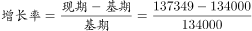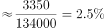。 

故正确答案为C。

---

### 第 7 题　qid 2261603 · 综合

如果将60岁及以上人口数与0～14岁人口数的比值定义为老少比，那么下列地区中老少比最高的地区是：

- **A**. 北京
- **B**. 上海　✅
- **C**. 重庆
- **D**. 广东

**答案**：B

**官方解析**

选项中四个地区的老少比如下：A项，北京：；B项，上海：；C项，重庆：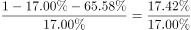；D项，广东：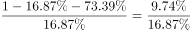，比较数字大小，明显上海的老少比接近2，是四个地区中最高的。

故正确答案为B。

---

### 第 8 题　qid 2261604 · 综合

根据0～14岁，15～59岁，60岁以上人口数绘制饼图，以下这个饼图最有可能是下列哪个地区的人口年龄构成图？

- **A**. 浙江　✅
- **B**. 北京
- **C**. 西藏
- **D**. 海南

**答案**：A

**官方解析**

观察题目中的饼状图，0-14岁与≥60岁的占比相差不多。

A项，浙江：0-14岁占比，15-59岁占比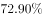，60岁占比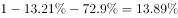，0-14岁与≥60岁的占比相差不多，正确；

B项，北京：0-14岁占比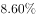，15-59岁占比，60岁占比，错误；

C项，西藏：0-14岁占比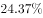，15-59岁占比，60岁占比，错误；

D项，海南：0-14岁占比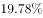，15-59岁占比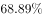，60岁占比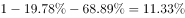，错误。

故正确答案为A。

---

### 第 9 题　qid 2261605 · 比重

人口老龄化是指总人口中因年轻人口数量减少，年长人口数量增加而导致的老年人口比例相应增长的动态。国际上通常把60岁以上的人口占总人口比重达到或65岁以上人口占总人口的比重达到作为国家或地区进入老龄化社会的标准。那么依据该标准，上述省（区、市）中进入老龄化社会的共有几个？

- **A**. 9
- **B**. 10　✅
- **C**. 11
- **D**. 12

**答案**：B

**官方解析**

60岁以上的人口占总人口比重达到，即0-14岁和15-59岁的占比之和小于即可。定位表格第二列和第三列，经简单口算有10个地区满足条件，分别为：北京、天津、辽宁、上海、浙江、河南、湖南、海南、重庆、贵州，则进入老龄化社会的省（区、市）共有10个。

故正确答案为B。

---

### 第 10 题　qid 2261606 · 综合

根据资料不能推出的是：

- **A**. 辽宁的60岁及以上人口占比明显高于全国
- **B**. 西藏的60岁及以上人口占比最低
- **C**. 北京的总抚养比最低，主要是0～14岁人口比重小
- **D**. 重庆的60岁及以上人口占比最高，所以重庆的老年人口最多　✅

**答案**：D

**官方解析**

A项：定位表格，辽宁的60岁及以上人口占比：，全国60岁及以上人口占比：，，正确。

B项：定位表格，要找出60岁及以上占比最低的地区，反之找到0-14岁和15-59岁之和最大的地区即可。西藏地区：，观察其他地区，两者之和在90%附近的还有广东和海南地区，广东地区：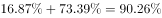，海南地区：，因此西藏地区60岁及以上占比的人最少，正确。

C项：定位表格，北京的总抚养比为，是总抚养比最低的地区，而且0-14岁的比重最小，正确。

D项：定位表格，重庆市60岁以上人口占比最高，但总人口数未知，因此不能推出重庆老年人口最多，错误。

本题为选非题，故正确答案为D项。

---
