# 2017年黑龙江省公务员录用考试《行测》题（公检法卷）

> 资料分析 · 20 题 · 黑龙江 2017

## 材料 1

        2014年，某市全年实现社会消费品零售总额261.38亿元，比上年增长。按经营地统计，城镇消费品零售总额为178.6亿元，比上年增长，乡村消费品零售总额82.78亿元，比上年增长。按消费形态统计，批发业增长，零售业增长。

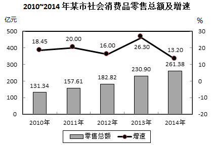

        全年消费价格总水平比上年增长。其中家庭设备用品及维修服务类累计下降；食品类、烟酒类、衣着类、医疗保健及个人用品类、交通与通信类、娱乐教育文化用品及服务类、居住类累计分别上升、、、、、、。

### 第 1 题　qid 2051166 · 综合

2013年，该市城镇消费品零售总额约为多少亿元？

- **A**. 120.5
- **B**. 157.4　✅
- **C**. 178.6
- **D**. 206.5

**答案**：B

**官方解析**

由题干“2013年……总额约为……亿元”，而且材料给出的时间为2014年，可判定此题为基期计算问题。定位文字第一段，可知2014年城镇消费品零售总额为178.6亿元，增长率为，代入基期计算公式，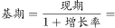亿元，与B项最接近。

故正确答案为B。

---

### 第 2 题　qid 2051168 · 综合

与2009年相比，2014年该市社会消费品零售总额增量最接近多少亿元？

- **A**. 130
- **B**. 140
- **C**. 150　✅
- **D**. 160

**答案**：C

**官方解析**

由题干“与2009年相比，2014年……增量最接近”，可判定此题为增长量计算问题。定位图表可得，2010年社会消费品零售总额为131.34亿元，增长率为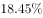，2014年社会消费品零售总额为261.38亿元。代入基期计算公式计算2009年数据，亿元，则2014年比2009年的亿元，与C项最接近。

故正确答案为C。

---

### 第 3 题　qid 2051184 · 增长

能准确反映2011-2014年间该市社会消费品零售总额同比增量的变化趋势的折线图是：

- **A**. 

　✅
- **B**. 

- **C**. 

- **D**. 

**答案**：A

**官方解析**

由题干“同比增量的变化趋势”，可判定此题为增长量比较问题。定位图表，可得2010-2014年历年零售总额数据，根据增长量公式：，可得：

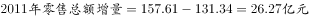；

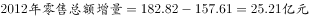；

；

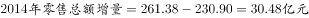。

观察数据可知，2013年（第三年）增量最高，2014年比2011和2012年都高，排除C、D项；2011和2012年很接近，但2011年要比2012年高，所以排除B项。

故正确答案为A。

---

### 第 4 题　qid 2051194 · 增长

把不同的消费类型按该市2014年消费价格水平上涨幅度从高到低排列，以下正确的是：

- **A**. 居住类、衣着类、食品类、家庭设备用品及维修服务类
- **B**. 衣着类、居住类、家庭设备用品及维修服务类、食品类
- **C**. 居住类、衣着类、家庭设备用品及维修服务类、食品类
- **D**. 衣着类、居住类、食品类、家庭设备用品及维修服务类　✅

**答案**：D

**官方解析**

由题干“上涨幅度从高到低排列”，而且在材料中可以直接找出对应的上涨幅度数据，可判定此题为简单计算中的排序类题目。定位第二段文字材料，衣着类（）、居住类（）、食品类（）、家庭设备用品及维修服务类（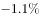)，D项的排序符合从高到低的要求。

故正确答案为D。

---

### 第 5 题　qid 2051204 · 综合

关于该市社会消费品零售状况，能够从上述资料推出的是：

- **A**. 
2014年批发业销售额占社会消费品零售总额比重低于上年水平

- **B**. 
2010到2014年间，社会消费品零售总额增速慢于的年份有4个

- **C**. 
2013到2014年社会消费品零售总额之和高于前3年之和
　✅
- **D**. 
2014年烟酒类消费品价格增速快于居民消费总水平增速

**答案**：C

**官方解析**

A项，定位文字材料第一段，可知批发业销售额增长率，社会消费品零售总额增长率，根据两期比重差公式，因为，故比重上升，2014年比重高于上年水平，错误；

B项，定位图表，根据折线图和数据标签可知，2010年-2014年，只有2010、2012、2014这3年的增长率慢于，错误；

C项，定位图表，2013年和2014年的总额之和为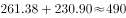亿元，前三年之和为亿元，，正确；

D项，定位文字材料第二段，可知2014年烟酒类消费品价格增速为，而居民消费总水平增速为，前者慢于后者，错误。

故正确答案为C。

---

## 材料 2

        2014年，上海市全年实现金融业增加值3268.43亿元，比上年增长。

        全年新增各类金融单位96家。其中，货币金融服务单位37家；资本市场服务单位40家。至年末，全市各类金融单位达到1336家。其中，货币金融服务单位601家；资本市场服务单位292家；保险业单位363家。

        至年末，全市中外资金融机构本外币各项存款余额73882.45亿元，比年初增加4612.96亿元；贷款余额47915.81亿元，比年初增加3424.23亿元。

        全年通过上海证券市场股票筹资3962.59亿元，比上年增长；发行公司债2955.2亿元，比上年下降。至年末，上海证券市场上市证券3758只，比上年增加972只，其中股票1039只，增加42只。

        全年金融市场（包括外汇市场）交易总额达到786.66万亿元，比上年增长。上海证券交易所各类有价证券总成交金额128.15万亿元，增长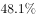。其中，股票成交金额37.72万亿元，增长。上海期货交易所总成交金额126.47万亿元，增长。中国金融期货交易所总成交金额164.02万亿元，增长。银行间市场总成交金额361.51万亿元，增长。上海黄金交易所总成交金额6.51万亿元，增长。

### 第 6 题　qid 2051122 · 综合

2014年，上海市全年新增货币金融服务单位在当年新增的各类金融单位中占（  ）。

- **A**. 两成多
- **B**. 三成多　✅
- **C**. 四成多
- **D**. 五成多

**答案**：B

**官方解析**

由题干“2014年······在······中占”，结合材料所给年份是2014年，可判定该题是现期比重问题。定位文字材料第二段，“2014全年新增各类金融单位96家。其中，货币金融服务单位37家”，可得所求比重（三成多）。

故正确答案为B。

---

### 第 7 题　qid 2051126 · 综合

2014年间，上海市中外资金融机构本外币存贷款差（  ）。

- **A**. 增加了1千多亿元　✅
- **B**. 增加了2万多亿元
- **C**. 减少了1千多亿元
- **D**. 减少了2万多亿元

**答案**：A

**官方解析**

题目所求“2014年间······存贷款差增加了或者减少了······”，即2014年和2013年的存贷款之差。假设14年存贷款之差为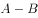，且14年存款增量为，贷款增量为，则13年存贷款之差为，则2014年和2013年的存贷款之差为，即增长量之差。定位文字材料第三段，“2014年末，全市中外资金融机构本外币各项存款余额比年初增加4612.96亿元；贷款余额比年初增加3424.23亿元”，所以2014年间上海市中外资金融机构本外币存贷款差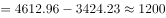亿元，即增加了1千多亿元。

故正确答案为A。

---

### 第 8 题　qid 2051132 · 增长

2014年上海市股票成交金额比2013年增加约（  ）万亿元。

- **A**. 10
- **B**. 12
- **C**. 15　✅
- **D**. 18

**答案**：C

**官方解析**

由题干“2014年······比2013年增加······万亿元”，可判定该题为增长量计算问题。定位文字材料最后一段，“2014年股票成交金额37.72万亿元，增长”，所以2014年上海市股票成交金额比2013年的增长量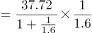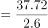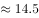，与C项最接近。

故正确答案为C。

---

### 第 9 题　qid 2051136 · 增长

以下金融市场中，2014年成交金额同比增量最高的是（  ）。

- **A**. 上海证券交易所　✅
- **B**. 中国金融期货交易所
- **C**. 上海黄金交易所
- **D**. 上海期货交易所

**答案**：A

**官方解析**

由题干“2014年······同比增量最高的是······”，可判定该题是增长量比较问题。定位文字材料最后一段，“上海证券交易所各类有价证券总成交金额128.15万亿元，增长”“上海期货交易所总成交金额126.47万亿元，增长”“中国金融期货交易所总成交金额164.02万亿元，增长”“上海黄金交易所总成交金额6.51万亿元，增长”，可得2014年上海证券交易所成交金额同比增量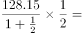万亿元；2014年中国金融期货交易所成交金额同比增量万亿元；2014年上海黄金交易所成交金额同比增量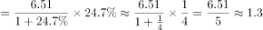万亿元；2014年上海期货交易所总成交金额同比增量万亿元，所以2014年上海证券交易所成交金额同比增量最高。

故正确答案为A。

---

### 第 10 题　qid 2051140 · 综合

能够从上述资料中推出的是（  ）。

- **A**. 2013年全年，上海市实现金融业增加值3000多亿元
- **B**. 2013年上海市证券交易所各类有价证券总成交额中，股票成交金额占比高于2014年
- **C**. 2014年末，上海市资本市场服务单位数量不到货币金融服务单位数量的一半　✅
- **D**. 2014年间，上海市银行间市场月均成交金额超过31万亿元

**答案**：C

**官方解析**

A项：定位文字材料第一段，“2014年，上海市全年实现金融业增加值3268.43亿元，比上年增长”，所以2013年上海市实现金融业增加值，错误；

B项：定位文字材料最后一段，上海证券交易所各类有价证券总成交金额增长，股票成交金额增长，则比重上升，故2014年股票成交金额占比2013年股票成交金额占比，错误；

C项：定位文字材料第二段，货币金融服务单位601家，资本市场服务单位292家，，所以2014年末上海市资本市场服务单位数量不到货币金融服务单位数量的一半，正确；

D项：定位文字材料最后一段，2014年间上海市银行间市场月均成交金额万亿元，所以2014年间上海市银行间市场月均成交金额低于31万亿元，错误。

故正确答案为C。

---

## 材料 3

        2012年全年货物进出口总额38668亿美元，比上年增长。其中，出口20489亿美元，增长；进口18178亿美元，增长。

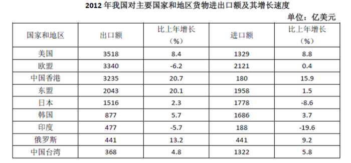

### 第 11 题　qid 2051124 · 比重

表中2012年进口数量最高的商品，其当年进口额占全国进口总额的比重为（  ）。

- **A**. 

- **B**. 

　✅
- **C**. 

- **D**. 

**答案**：B

**官方解析**

由题干“2012年······占······比重”，可知本题为现期比重问题。定位表格材料可知，2012年进口数量最高的商品为铁矿砂及其精矿（74355万吨）。定位文字和表格材料可知，2012年全年货物进口总额为18178亿美元，铁矿砂及其精矿的进口金额为956亿美元，故所求比重为：。

故正确答案为B。

---

### 第 12 题　qid 2051128 · 增长

2012年我国主要商品的进口数量和金额都比去年增长的有（  ）种。

- **A**. 5
- **B**. 6
- **C**. 7　✅
- **D**. 8

**答案**：C

**官方解析**

数值比去年增长，即增长率大于0，定位表格材料可知，2012年我国进口数量和金额的增长率都大于0的有：谷物及谷物粉、大豆、食用植物油、氧化铝、煤（包括褐煤）、原油、未锻造的铜及铜材，共7种。
故正确答案为C。

---

### 第 13 题　qid 2051130 · 综合

2012年间我国的贸易顺逆差关系与上年不同的国家或者地区是（    ）。

- **A**. 东盟　✅
- **B**. 日本
- **C**. 美国
- **D**. 欧盟

**答案**：A

**官方解析**

由题干“2012年间我国的贸易顺逆差关系与上年不同”可知本题为基期和差问题。定位表格材料，贸易顺逆差关系与上年不同，即为一年是顺差、一年是逆差。逐项验证答案：

东盟：2012年出口额和进口额分别为2043、1958，出口额进口额，为贸易顺差；

2011年出口额和进口额分别为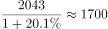、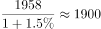，出口额进口额，为贸易逆差，故东盟两年的贸易顺逆差关系不同。A项满足题意，无需验证剩余选项。

故正确答案为A。

---

### 第 14 题　qid 2051134 · 综合

表中2012年对华进出口贸易额最高的国家或者地区，其贸易额是表中2012年对华贸易额最低的国家或地区的（    ）倍。

- **A**. 5.5
- **B**. 7.3
- **C**. 8.2　✅
- **D**. 12.8

**答案**：C

**官方解析**

由题干“2012年······是······倍”，可知本题为现期倍数问题。定位表格材料可知，进出口贸易额最高的地区是欧盟：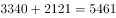亿美元，进出口贸易额最低的国家是印度：亿美元，故所求倍数为：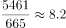倍。

故正确答案为C。

---

### 第 15 题　qid 2051138 · 综合

能够从上述资料推出的是（    ）。

- **A**. 2012年我国全年货物进出口顺差额低于上年水平
- **B**. 2011年我国煤（包括褐煤）进口量高于原油进口量
- **C**. 2012年日本对华货物贸易额高于上年水平
- **D**. 2012年我国进口钢材的平均每吨价格超过1000美元　✅

**答案**：D

**官方解析**

A项：2012年我国全年货物进出口顺差额为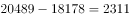亿美元；2011年我国全年货物进出口顺差额为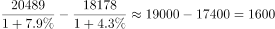亿美元，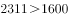，则2012年我国全年货物进出口顺差额高于上年水平，错误；

B项：2011年我国煤（包括褐煤）进口数量为万吨；2011年我国原油进口数量为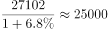万吨，则2011年我国煤（包括褐煤）进口数量低于原油进口数量，错误；

C项：2012年日本对华货物贸易额进口额出口额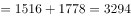亿美元；2011年日本对华货物贸易额进口额出口额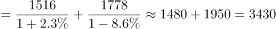亿美元，，则2012年日本对华货物贸易额低于上年水平，错误；

D项：2012年我国进口钢材的平均每吨价格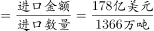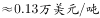，正确。

故正确答案为D。

---

## 材料 4

        某年度某机构关于中国宠物主人消费行为及倾向调查回收的10680份有效问卷显示：女性养宠者占，宠物主人为“80-90后”占。将宠物定义为“孩子”“亲人”“朋友”和“宠物”的分别为、、和。的人月开销在100元以内，的人开销在101至500元之间，而花费在501至1000元之间的达到，月消费1000元以上的人群达到。在购买物品方面，购买宠物食物的人数达到有效问卷总人数的，其次为药品、保健品，以及日用品、玩具、服饰五项，均接近。宠物主人外出时，四成“委托亲朋照顾”，三成“一起带走”，委托寄养还不到。在训练方面，的宠物处于自主训练或放任生长的状态，但近一半人希望爱宠得到专业训练。在购买渠道方面，的被访问者选择综合电商平台，选择线下综合商店或专卖店者为，选择宠物类垂直电商平台的占，但其复购率更高。值得注意的是，目前宠物主人对购物类O2O服务有选择意向的不足。

### 第 16 题　qid 2051084 · 比重

问卷中，男性养宠者占养宠人群的比重为：

- **A**. 

- **B**. 

- **C**. 

　✅
- **D**. 

**答案**：C

**官方解析**

根据问题中“男性养宠者占养宠人群的比重”可判定此题为现期比重问题。定位文字材料首句，“女性养宠者占”，则男性养宠物者占比为。

故正确答案为C。

---

### 第 17 题　qid 2051086 · 综合

问卷中对宠物没有花费的人数约为：

- **A**. 38
- **B**. 36
- **C**. 34
- **D**. 32　✅

**答案**：D

**官方解析**

由题干“问卷中对宠物没有花费的人数约为”，而且材料中给出不同开销人员占比及问卷总人数，问没有花费的人数，可判定此题为现期比重问题。定位材料中“的人月开销在100元以内，的人……”，可知有消费的人占比为，则没有花费的人数占比为，所以，没有花费的人数总人数没有花费的人数占比人。

故正确答案为D。

---

### 第 18 题　qid 2051088 · 综合

问卷中，选择综合电商平台和选择购物类O2O服务的消费者人数之比为：

- **A**. 
小于

- **B**. 
大于

- **C**. 
小于

- **D**. 
大于
　✅

**答案**：D

**官方解析**

由题干“……和……人数之比”，可知本题为比值计算问题。定位文字材料“的被访问者选择综合电商平台……对购物类O2O服务有选择意向的不足”，则两者之比为：，分母不足，分母变小，分数值变大，故两者之比大于。

故正确答案为D。

---

### 第 19 题　qid 2051090 · 综合

问卷中，在药品、保健品，以及日用品、玩具、服饰方面有花销的总人次最可能有：

- **A**. 6408
- **B**. 9612
- **C**. 16020
- **D**. 32040　✅

**答案**：D

**官方解析**

由题干“······方面有花销的总人次······”，定位材料“回收的10680份有效问卷”“购买宠物食物的人数达到有效问卷总人数的，其次为药品、保健品，以及日用品、玩具、服饰五项，均接近”，可知本题为现期比重问题。，故药品、保健品、日用品、玩具、服饰这五项部分量的总和。

故正确答案为D。

---

### 第 20 题　qid 2051092 · 综合

根据问卷，下列判断错误的是：

- **A**. 
只有的宠物接受过训练，专业训练消费潜力巨大
　✅
- **B**. 
绝大部分宠物主人对宠物的定义超越了宠物本身

- **C**. 
月均消费在101-1000元的是宠物消费的主流

- **D**. 
购物类O2O服务的市场还有待培育

**答案**：A

**官方解析**

逐项分析如下：

A项：定位文字材料后半段，“在训练方面，的宠物处于自主训练或放任生长的状态”，则自主训练的宠物占比小于，但自主训练和专业训练都属于训练，所以接受过训练的宠物占比小于，有可能超过，故A项说法“只有的宠物接受过训练”与其不符，错误；

B项：定位材料前半段，对宠物的定义超越宠物本身，定义为“孩子”“亲人”“朋友”的比重分别占到、、，合计占比超过，可以认定为“绝大部分宠物主人”，正确；

C项：定位材料前半段，101至500元和501至1000元的消费人群占比分别为和，合计占比超过，可以认定为“主流”，正确；

D项：定位材料最后一句，对购物类O2O服务有选择意向的不足，说明有超过的人暂时没有选择意向，符合“市场有待培育”，正确。

本题为选非题，故正确答案为A。

---
