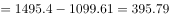

# 2018年421联考《行测》题（吉林乙级）（网友回忆版）

> 资料分析 · 1 题 · 吉林 2018

## 材料 1

<b>根据下面资料回答96-100题。</b>

        2017年8月24日，全国工商联发布《2017中国民营企业500强》榜单。2016年，民营企业500强出口总额出现大幅回升，达到1495.4亿美元，占我国出口总额的，较2015年增加395.79亿美元，增幅为，海外投资项目达到1659项，增长；投资总额达515.32亿美元；进行海外投资的企业数量也比2015年的201家增加了113家。

        据统计，民营企业500强中，共有210家企业参与“一带一路”建设。从地区分布看，有144家企业分别位于浙江、江苏、广东、山东和福建等东部沿海经济发达地区。从行业分布看，有121家企业为制造业企业，有25家建筑业企业。另外，有287家民营企业在未来三年对于“一带一路”有投资意向，比2015年增加28家，比2015年提高5.6个百分点。

### 第 1 题　qid 2188101 · 综合

2016年与2014年相比，民营企业500强出口总额呈现出：

- **A**. 增量提高、增速变大
- **B**. 增量减少、增速变小　✅
- **C**. 增量减少、增速变大
- **D**. 增量提高、增速变小

**答案**：B

**官方解析**

定位图形材料可得：2014年民营企业500强出口总额增量亿美元，2016年民营企业500强出口总额增量亿美元，可以看出2016年与2014年相比，增量减少。2014年增速，2016年增速，可以看出增速变小。

故正确答案为B。

---
