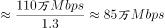
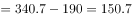
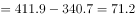
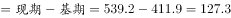

# 2018年421联考《行测》题（四川卷）（网友回忆版）

> 资料分析 · 15 题 · 四川 2018

## 材料 1

        2015年末，我国规模以上高技术制造业共有企业26894家，比2010年增加1077家；占规模以上制造业企业数的比重为，比2010年提高1.3个百分点。2015年末，我国高技术制造业从业人员1293.7万人，比2010年增长；占全部制造业从业人员的比重为，比2010年提高2.9个百分点。

        2015年我国高技术制造业实现主营业务收入116048.9亿元，比2010年增长；占全部制造业企业的比重为，比2010年提高0.8个百分点。2015年我国高技术制造业实现利润总额7233.7亿元，比2010年增长，增幅比其他制造业平均水平高出11.5个百分点；高技术制造业利润总额占全部制造业的比重为，比2010年提高0.5个百分点。

        2015年我国规模以上高技术制造业投入研发经费2034.3亿元，比2010年增长，增幅比其他制造业平均水平高8.7个百分点。2015年我国高技术制造业申请发明专利7.4万件，比2010年增长；实现新产品销售收入3.1万亿元，比2010年增长。

### 第 1 题　qid 2188568 · 增长

2015年，我国高技术制造业主营业务收入比2010年增加约多少万亿元？

- **A**. 5
- **B**. 6　✅
- **C**. 7
- **D**. 8

**答案**：B

**官方解析**

根据题干“······增加······万亿元”，可判定本题为增长量计算问题。定位文字第二段材料可知：“2015年我国高技术制造业实现主营业务收入116048.9亿元，比2010年增长。”与2010年相比，2015年我国高技术制造业主营业务收入的增长量，与B项最为接近。

故正确答案为B。

---

### 第 2 题　qid 2188572 · 综合

2010年，我国制造业实现利润总额约多少万亿元？

- **A**. 1.3
- **B**. 1.7
- **C**. 2.2　✅
- **D**. 2.8

**答案**：C

**官方解析**

根据题干“2010年······万亿元”，结合材料时间为2015年，可判定本题为基期计算问题。定位文字第二段材料：“2015年我国高技术制造业实现利润总额7233.7亿元，比2010年增长”，则2010年我国高技术制造业实现利润总额亿元；“高技术制造业利润总额占全部制造业的比重为，比2010年提高0.5个百分点”，则2010年高技术制造业利润总额占全部制造业的比重为；故2010年我国制造业实现利润总额万亿元。

故正确答案为C。

---

### 第 3 题　qid 2188573 · 综合

2010年，我国高技术制造业实现新产品销售收入约多少万亿元？

- **A**. 1.4　✅
- **B**. 1.5
- **C**. 1.6
- **D**. 1.7

**答案**：A

**官方解析**

根据题干“2010年······万亿元”，结合材料时间为2015年，可判定本题为基期计算问题。定位文字第三段材料：“实现新产品销售收入3.1万亿元，比2010年增长。”故2010年，我国高技术制造业实现新产品销售收入万亿元，与A项最为接近。

故正确答案为A。

---

### 第 4 题　qid 2188575 · 增长

与2010年相比，2015年下列高技术制造业的指标中哪项增长最快？

- **A**. 利润总额
- **B**. 新产品销售收入
- **C**. 主营业务收入
- **D**. 申请发明专利数　✅

**答案**：D

**官方解析**

定位第二段、第三段材料可知：2015年我国高技术制造业实现利润总额比2010年增长、新产品销售收入比2010年增长、主营业务收入比2010年增长、申请发明专利比2010年增长。所以增长最快的是申请专利发明数。

故正确答案为D。

---

### 第 5 题　qid 2188577 · 综合

根据上述资料，下列说法错误的是：

- **A**. 2010年，我国高技术制造业申请发明专利达3万件　✅
- **B**. 2010年末，高技术制造业从业人员占全部制造业从业人员的比重为12.2%
- **C**. 2015年末，我国规模以上制造企业数是规模以上高技术制造业企业数的10倍以上
- **D**. 2015年，我国规模以上高技术制造业投入的研发经费比2010年增加了1000亿元以上

**答案**：A

**官方解析**

A项：定位材料第三段：2015年我国高技术制造业申请发明专利7.4万件，比2010年增长。故2010年高技术制造业申请发明专利数万件，错误；

B项：定位材料第一段：2015年末，我国高技术制造业从业人员占全部制造业从业人员的比重为，比2010年提高2.9个百分点。故2010年末高技术制造业从业人员占全部制造业从业人员的比重为，正确；

C项：定位材料第一段：2015年末，我国规模以上高技术制造业共有企业26894家，占规模以上制造业企业数的比重为。则，故，即我国规模以上制造业企业数是规模以上高技术制造业企业数的10倍以上，正确；

D项：定位材料第三段：2015年我国规模以上高技术制造业投入研发经费2034.3亿元，比2010年增长。，即增加了1000亿元以上，正确。

本题为选非题，故正确答案为A。

---

## 材料 2

### 第 6 题　qid 2188580 · 平均数

2013～2015年，试验发展经费支出年平均增加：

- **A**. 不到800亿元
- **B**. 800多亿元
- **C**. 900多亿元　✅
- **D**. 1000亿元以上

**答案**：C

**官方解析**

根据题干“2013～2015年······年平均增加”，结合选项带单位，可判定本题为年均增长量问题。定位表格材料可知，2013年的试验发展为10022.5亿元，2015年试验发展为11925.1亿元。故2013～2015年试验发展经费支出年平均增加量=亿元，C项符合。

故正确答案为C。

---

### 第 7 题　qid 2188582 · 综合

2015年，我国研究与试验发展经费投入强度（研究与试验发展经费支出与国内生产总值之比）约为：

- **A**. 

- **B**. 

　✅
- **C**. 

- **D**. 

**答案**：B

**官方解析**

根据题干“2015年······（······与······之比）”，结合材料给出2015年的数值，可判定本题为比值计算问题。定位表格材料可知，2015年国内生产总值为689052.0亿元，研究与试验发展经费支出为14169.9亿元。故投入强度=。

故正确答案为B。

---

### 第 8 题　qid 2188583 · 增长

2013～2015年间，企业研究与试验发展经费支出同比增量大于1000亿元的年份有几个？

- **A**. 0
- **B**. 1　✅
- **C**. 2
- **D**. 3

**答案**：B

**官方解析**

根据题干“2013～2015年间……同比增量”，可判定本题为增长量计算问题。定位表格材料倒数第三行，由增长量=现期-基期可得，2013年增长量=9075.8-7842.2=1233.6亿元，2014年增长量=10060.6-9075.8=984.8亿元，2015年增长量=10881.3-10060.6=820.7亿元。综上，2013～2015年企业研究与试验发展经费支出同比增量大于1000亿元的年份仅有2013年1个。
故正确答案为B。

---

### 第 9 题　qid 2188584 · 比重

2012～2015年，基础研究经费支出占全国研究与试验发展经费支出比重最大的年份是：

- **A**. 2012年
- **B**. 2013年
- **C**. 2014年
- **D**. 2015年　✅

**答案**：D

**官方解析**

根据题干“2012～2015年，······占······比重”,可判定本题为现期比重问题。定位表格材料可得：各年份比重，故2012年；2013年；2014年；2015年，因此2015年基础研究经费支出占全国研究与试验发展经费支出比重最大。

故正确答案为D。

---

### 第 10 题　qid 2188585 · 综合

根据资料，下列选项错误的是：

- **A**. 2012～2015年，基础研究经费支出年均不到600亿元
- **B**. 2013～2015年，应用研究经费支出年增量逐年增大
- **C**. 2015年，企业的研究与试验发展经费支出比政府属研究机构高5倍多　✅
- **D**. 2012～2015年，我国高校的研究与试验发展经费支出呈逐年递增趋势

**答案**：C

**官方解析**

A项：定位表格材料可得：2012～2015年，基础研究经费年均支出亿元，不到600亿元，正确；

B项：定位表格材料可得：各年份应用研究经费支出年增量分别为 2013年增量亿元；2014年增量亿元；2015年增量亿元，因此2013～2015年应用研究经费支出年增量逐年增大，正确；

C项：定位表格材料可得：2015年企业的研究与试验发展经费为10881.3亿元；政府属研究机构为2136.5亿元；故所求倍数为倍，选项描述为企业的研究与试验发展经费比政府属研究机构高5倍多，即前者是后者的6倍多，与结果不符，错误；

D项：定位表格材料最后一行可得：2012～2015年，我国高校的研究与试验发展经费支出是逐年增加的，正确。

本题为选非题，故正确答案为C。

---

## 材料 3

<b>根据以下资料，回答96～100题。</b>

### 第 11 题　qid 2188587 · 增长

2010～2015年间，中国国际出口带宽增速高于的年份有多少个？

- **A**. 1
- **B**. 2
- **C**. 3　✅
- **D**. 4

**答案**：C

**官方解析**

定位折线图可知，2010~2015年间，中国国际出口带宽增速高于的年份有：2012年（）、2013年（）和2015年（），共3个。

故正确答案为C。

---

### 第 12 题　qid 2188588 · 综合

2009年，中国国际出口带宽最接近以下哪个数字？

- **A**. 71万Mbps
- **B**. 87万Mbps　✅
- **C**. 97万Mbps
- **D**. 128万Mbps

**答案**：B

**官方解析**

根据题干“2009年，······最接近······”，结合材料所给时间是2010年，可判定本题为基期计算问题。定位柱状图可知，2010年中国国际出口带宽是109.9万Mbps，增速是。故2009年中国国际出口带宽，与B项最接近。

故正确答案为B。

---

### 第 13 题　qid 2188589 · 比重

以下各图，最能体现2015年中国移动提供的国际出口带宽（黑色部分）在主要运营商骨干网络国际出口带宽中所占比例的是：

- **A**. A
- **B**. B　✅
- **C**. C
- **D**. D

**答案**：B

**官方解析**

根据题干“······2015年······在······所占比例”，结合材料时间是2015年，可判定本题为现期比重问题。定位表格可知：中国移动提供的国际出口宽带是645073Mbps；主要运营商骨干网络国际出口带宽是5392116Mbps。故2015年中国移动提供的国际出口国际带宽在主营商骨干网络国际出口带宽中所占的比例是，略小于，观察选项图形，与B项最接近。

故正确答案为B。

---

### 第 14 题　qid 2188591 · 增长

2010～2015年，中国国际出口带宽增速最高的年份，其增量比增速最低的年份的增量：

- **A**. 多71.2万Mbps
- **B**. 少71.2万Mbps
- **C**. 多79.5万Mbps　✅
- **D**. 少79.5万Mbps

**答案**：C

**官方解析**

根据题干“2010～2015年间，······增量比······增量多/少······”，结合选项带单位，可判定本题为增长量计算问题。定位折线图可知，中国国际出口带宽增速最高为，对应年份为2013年，万Mbps；增速最低为，对应年份为2014年，万Mbps。故中国国际出口带宽增速最高的年份，其增量比增速最低的年份的增量多万Mbps。

故正确答案为C。

---

### 第 15 题　qid 2188592 · 综合

能够从上述资料中推出的是：

- **A**. 2015年中国国际出口带宽比2010年增长了5倍
- **B**. 2010～2015年，中国国际出口带宽的增速逐年上升
- **C**. 2010～2015年间，中国国际出口带宽增量最高的两年相邻
- **D**. “十二五”(2011～2015年)期间中国国际出口带宽年均增长80万Mbps以上　✅

**答案**：D

**官方解析**

A项：定位图形材料，中国国际出口带宽2015年为539.2万Mbps，2010年为109.9万Mbps，故2015年中国国际出口带宽比2010年增长了倍，错误；

B项：定位图形材料，2010～2015年，中国国际出口带宽的增速在2011年和2014年出现下降，并非逐年上升，错误；

C项：定位图形材料，2013年中国国际出口带宽增量万Mbps，其增量最高；2015年中国国际出口带宽增量万Mbps，其增量为第二高。故中国国际出口带宽增量最高的两年分别为2013年和2015年，并非相邻年份，错误；

D项： 定位图形材料，中国国际出口带宽2015年为539.2万Mbps，2010年为109.9万Mbps，故“十二五”(2011～2015年)期间中国国际出口带宽年均增长量万Mbps，即年均增长80万Mbps以上，正确。

故正确答案为D。

---
