# 2018年421联考《行测》题（山东卷）（网友回忆版）

> 资料分析 · 20 题 · 山东 2018

## 材料 1

        2017年1～4月份，全国社会消费品网上零售额19180亿元，同比增长。其中，实物商品网上零售额14617亿元，增长。在实物商品网上零售额中，吃、穿和用类商品零售额分别增长，和。

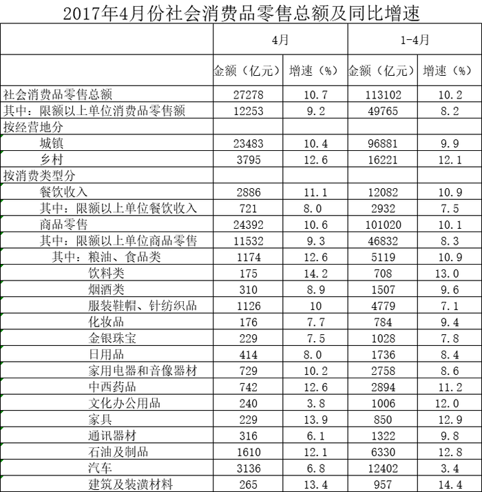

### 第 1 题　qid 2187819 · 比重

2017年1～4月份，实物商品网上零售额占社会消费品零售总额的比重约为：

- **A**. 

　✅
- **B**. 
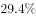

- **C**. 

- **D**. 
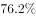

**答案**：A

**官方解析**

根据题干“2017年1-4月份······占······比重约为”，可判定本题为现期比重问题。定位文字材料可知：“2017年1-4月份，实物商品网上零售额14617亿元。”定位表格材料可知：“2017年1-4月份，社会消费品零售总额113102亿元。”故2017年1-4月份，实物商品网上零售额占社会消费品零售总额的比重，与A项最为接近。

故正确答案为A。

---

### 第 2 题　qid 2187827 · 综合

2017年4月份，城镇消费品零售额约是乡村消费品零售额的多少倍？

- **A**. 1.2倍
- **B**. 5.2倍
- **C**. 5.9倍
- **D**. 6.2倍　✅

**答案**：D

**官方解析**

根据题干“2017年4月份······是······的多少倍”，可判定本题为现期倍数问题。定位表格材料可知：“2017年4月份，城镇消费品零售额23483亿元，乡村消费品零售额3795亿元。”故城镇消费品零售额约是乡村消费品零售额的倍数为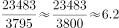。

故正确答案为D。

---

### 第 3 题　qid 2187833 · 增长

2017年4月份，表中各类商品限额以上单位零售额同比增量最多的是：

- **A**. 服装鞋帽、针纺织品
- **B**. 石油及制品
- **C**. 汽车　✅
- **D**. 家用电器和音像器材

**答案**：C

**官方解析**

根据题干“2017年4月份······同比增量最多的是”，可判定本题为增长量比较问题。定位表格材料可知：“2017年4月份，服装鞋帽、针纺织品1126亿元，增速为；石油及制品1610亿元，增速为；汽车3136亿元，增速为；家用电器和音像器材729亿元，增速为”。根据增长量比较口诀“大大则大”，石油及制品的现期量和增长率均大于服装鞋帽、针纺织品与家用电器和音像器材，所以石油及制品的增长量大于服装鞋帽、针纺织品与家用电器和音像器材。

根据增长量计算公式：，计算比较石油及制品和汽车的增长量。

石油及制品的增长量；

汽车的增长量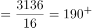。

故2017年4月份，表中各类商品限额以上单位零售额同比增量最多的是汽车。

故正确答案为C。

---

### 第 4 题　qid 2187835 · 综合

2016年1～3月份，限额以上单位消费品零售额的绝对量约为多少万亿元？

- **A**. 3.0
- **B**. 3.5　✅
- **C**. 4.0
- **D**. 4.5

**答案**：B

**官方解析**

根据题干所求“2016年1～3月份，限额以上单位消费品零售额的绝对量”，结合材料数据时间为2017年1～4月和4月，可判定本题为基期和差问题。定位表格材料可得，2017年1～4月限额以上单位消费品零售额为49765亿元，增速为；2017年4月限额以上单位消费品零售额为12253亿元，增速为。故2016年1～3月份限额以上单位消费品零售额的绝对量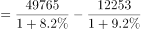万亿，与B项接近。

故正确答案为B。

---

### 第 5 题　qid 2187843 · 综合

能够从上述资料中推出的是：

- **A**. 
2017年1～4月份，限额以上单位餐饮收入同比增速快于限额以下单位餐饮收入

- **B**. 
2017年1～4月份，非实物类社会消费品网上零售额为5000多亿元

- **C**. 
2017年4月份，粮油、食品类限额以上单位商品零售额占限额以上单位商品零售总额的一成多
　✅
- **D**. 
2017年第一季度烟酒类限额以上单位商品零售额同比增速不超过

**答案**：C

**官方解析**

A项：定位表格材料，2017年1～4月份，餐饮收入总额同比增速为，限额以上单位餐饮收入同比增速为。，根据混合增长率原理：整体增速居中但不正中，故2017年1～4月份，限额以下单位餐饮收入同比增速大于，即限额以上单位餐饮收入同比增速慢于限额以下单位餐饮收入，错误；

B项：定位文字材料，2017年1～4月份全国社会消费品网上零售额19180亿元，其中，实物商品网上零售额14617亿元。故2017年1～4月份，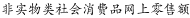亿元，不到5000亿元，错误；

C项：定位表格材料，2017年4月份，粮油、食品类限额以上单位商品零售额为1174亿元；2017年4月份限额以上单位商品零售总额为11532亿元。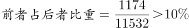，即所占比重超过一成，正确；

D项，定位表格材料，2017年1～4月烟酒类限额以上单位商品零售额同比增速为；2017年4月烟酒类限额以上单位商品零售额同比增速为。，根据混合增长率原理：整体增速居中但不正中，故2017年一季度烟酒类限额以上单位商品零售额同比增速大于，错误。

故正确答案为C。

---

## 材料 2

        2016年，J省规模以上工业取水量为86.4亿立方米，比上年增长。其中，直接采自江、河、淡水湖、水库等的地表淡水68.1亿立方米，比上年增长，所占比重比上年下降0.4个百分点；自来水取水量15.9亿立方米，同比增长。 

        2016年，规模以上工业重复用水量168.4亿立方米，比上年增长；重复用水利用率，比上年提高0.1个百分点。其中，石油加工、黑色金属冶炼及压延加工、电力和化学原料等4个行业的重复用水总量占规模以上工业的，重复用水利用率分别为、、和。全年用新水量超过2亿立方米的5个行业用新水量合计19.1亿立方米，占总用新水量的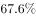，比重比上年下降0.9个百分点。

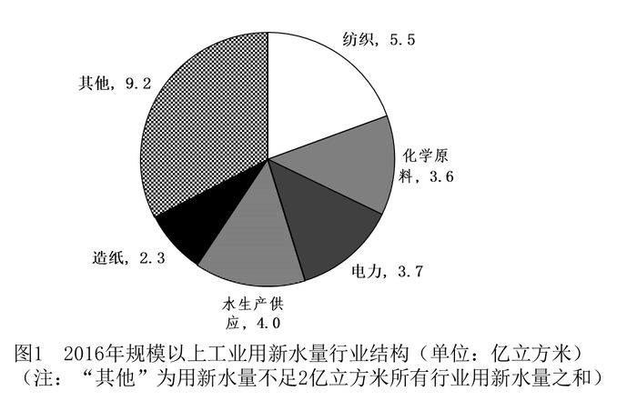

### 第 6 题　qid 2187862 · 综合

J省2015年规模以上工业取水量约为多少亿立方米？

- **A**. 90
- **B**. 83　✅
- **C**. 74
- **D**. 65

**答案**：B

**官方解析**

根据题干“2015年······为多少亿立方米”，结合材料时间为2016年，可判定本题为基期计算问题。定位文字材料第一段可知，2016年J省规模以上工业取水量为86.4亿立方米，增长率为。由可得，J省2015年规模以上工业取水量亿立方米。

故正确答案为B。

---

### 第 7 题　qid 2187867 · 比重

J省2016年规模以上工业自来水取水量占总取水量的比重比上年：

- **A**. 提高0.3个百分点　✅
- **B**. 下降0.3个百分点
- **C**. 提高4个百分点
- **D**. 下降4个百分点

**答案**：A

**官方解析**

根据题干“2016年······占······比重比上年······”，结合选项为百分点，可判定本题为两期比重计算问题。定位文字材料第一段可知，2016年J省规模以上工业取水量为86.4亿立方米，增长率为；自来水取水量15.9亿立方米，增长率为。由两期比重结论可知：由于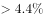，故比重应为提高，排除B、D两项；两期比重差值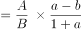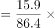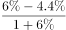个百分点，只有A项满足。

故正确答案为A。

---

### 第 8 题　qid 2187870 · 比重

2016年J省用新水量最多的2个行业，用新水量占全省规模以上工业用新水总量的比重相差约多少个百分点？

- **A**. 5.3　✅
- **B**. 6.7
- **C**. 7.9
- **D**. 9.5

**答案**：A

**官方解析**

方法一：根据“2016年······占······的比重”，结合材料时间为2016年，可判定本题为现期比重问题。定位图形材料1可知，用新水量最多的2个行业为纺织业和水生产供应业，新水量分别为5.5亿立方米、4.0亿立方米。定位文字材料第二段可知，全年用新水量超过2亿立方米的5个行业用新水量为19.1亿立方米，占总用新水量的。根据可得，全省规模以上用新水总量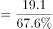。故比重差值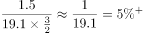，即5.3个百分点，与A项最接近。

方法二：根据“2016年······占······的比重”，结合材料时间为2016年，可判定本题为现期比重问题。定位文字材料第二段可知，全年用新水量超过2亿立方米的5个行业用新水量合计19.1亿立方米。定位图形材料1可知，用新水量最多的2个行业为纺织业和水生产供应业，新水量分别为5.5亿立方米、4.0亿立方米，其他行业新水量为9.2亿立方米。故比重差值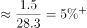，即5.3个百分点，与A项最接近。

方法三：根据“2016年······占······的比重”，结合材料时间为2016年，可判定本题为现期比重问题。定位图形材料1可知，用新水量最多的2个行业为纺织业和水生产供应业，新水量分别为5.5亿立方米、4.0亿立方米，所以亿立方米，定位文字材料第二段可知，全年用新水量超过2亿立方米的5个行业用新水量为19.1亿立方米，占总用新水量的。那么1.91亿立方米，占总用新水量的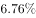，故1.5亿立方米占总用新水量的比重肯定明显小于，根据选项排除B、C、D三项，A项当选。

故正确答案为A。

---

### 第 9 题　qid 2187872 · 综合

J省2016年规模以上工业地表淡水取水量比地下淡水取水量高：

- **A**. 68亿立方米以上
- **B**. 67亿多立方米　✅
- **C**. 66亿多立方米
- **D**. 66亿立方米以下

**答案**：B

**官方解析**

方法一：根据题干“J省2016年规模以上工业地表淡水取水量比地下淡水取水量高”，结合材料图2分别给出2016年规模以上工业取水水源占比，且文字材料部分已知2016年规模以上工业取水量即总体，所以可以判定本题为现期比重问题。定位文字材料第一段可得：“2016年，J省规模以上工业取水量为86.4亿立方米，比上年增长。其中，直接采自江、河、淡水湖、水库等的地表淡水68.1亿立方米”；定位图2可得：地下淡水取水量为；根据，故2016年规模以上工业地表淡水取水量地下淡水取水量亿立方米，与B项最接近。

方法二：根据题干“J省2016年规模以上工业地表淡水取水量比地下淡水取水量高”，结合材料图2分别给出2016年规模以上工业取水水源占比，且文字材料部分已知2016年规模以上工业取水量即总体，所以可以判定本题为现期比重问题。定位图2可得：地表淡水取水量占比为，地下淡水取水量为；定位文字材料第一段可得：“2016年J省规模以上工业取水量为86.4亿立方米”。根据，故2016年规模以上工业地表淡水取水量地下淡水取水量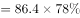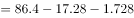亿立方米，与B项最接近。

故正确答案为B。

---

### 第 10 题　qid 2187876 · 综合

能够从上述资料中推出的是：

- **A**. 
用新水量第4名的行业，重复用水利用率不到
　✅
- **B**. 
2015年规模以上工业重复用水利用率为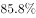

- **C**. 
2016年电力行业重复用水利用率高于石油加工行业

- **D**. 
2016年规模以上工业从其他水源取水不到1亿立方米

**答案**：A

**官方解析**

A项：定位饼状图1可得，2016年规模以上工业用新水量行业结构中用新水量第4名的行业为化学原料行业；定位文字材料第二段可得化学原料重复用水利用率为，不到，正确；

B项：定位文字材料第二段可得：2016年规模以上工业重复用水利用率为，比上年提高0.1个百分点。故2015年规模以上工业重复用水利用率，错误；

C项：定位文字材料第二段可得：2016年电力行业重复用水利用率为，石油加工行业为，电力行业低于石油加工行业，与选项描述不符，错误；

D项：定位饼状图2可得：2016年规模以上工业从其他水源取水占比为，定位文字材料第一段可得：2016年J省规模以上工业取水量为86.4亿立方米，故2016年规模以上工业从其他水源取水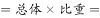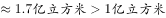，错误。

故正确答案为A。

---

## 材料 3

根据所给资料，回答111～115题。

注：该影片上映时间为7月27日。

排片占比=当日该影片上映场次÷当日全国所有影片上映场次×100%

上座率=（当日该影片上映场次数×当日该影片场均观影人数）÷（当日该影片上映场次数×放映厅平均座位数）×100%

### 第 11 题　qid 2187889 · 综合

已知7月29日为星期六，问A影片8月6日票房至少要达到多少亿元，才能在上映后第二个周末（星期六和星期日）的票房不低于第一个周末票房的1.25倍？

- **A**. 4.1
- **B**. 4.25
- **C**. 4.3
- **D**. 4.45　✅

**答案**：D

**官方解析**

根据题干“······不低于······的1.25倍”，结合材料时间，可判定本题为现期倍数问题。第二个周末（星期六和星期日）的票房不低于第一个周末票房的1.25倍，即第二个周末的票房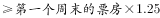，定位柱状图可得：第一个周末（7月29日-7月30日）的票房是：亿元；则第二周末（8月5日-8月6日）的票房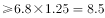亿元；8月5日A影片票房是：4.05亿元；故A影片8月6日票房至少要达到：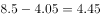亿元。

故正确答案为D。

---

### 第 12 题　qid 2187890 · 综合

8月3日，除A影片之外的其他影片票房总额在以下哪个范围内？

- **A**. 不到1.6亿元
- **B**. 在1.6亿～2.2亿元之间　✅
- **C**. 在2.2～2.8亿元之间
- **D**. 高于2.8亿元

**答案**：B

**官方解析**

根据题干“8月3日，除A影片之外的其它影片票房总额······”，结合柱状图可知8月3日A影片占当日全国总票房的比例，可判定本题为现期比重问题。定位柱状图：8月3日A影片单日票房为2.28亿元，占当日全国总票房的比例为，故除A影片之外的其它影片票房总额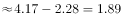亿元，在1.6~2.2亿元之间。

故正确答案为Ｂ。

---

### 第 13 题　qid 2187891 · 增长

7月28日～8月5日间，A影片票房环比增速最快的单日，当日A影片占全国总票房的比例在该影片上映10天内排名：

- **A**. 第7　✅
- **B**. 第6
- **C**. 第5
- **D**. 第4

**答案**：A

**官方解析**

根据题干“······环比增速最快的······”，可判定本题为一般增长率问题。定位柱状图发现:7月31日、8月2日、8月3日票房是环比下降的，故只需比较剩余日期的环比增长率。根据公式：，7月28日环比增长率；7月29日环比增长率；7月30日环比增长率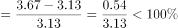；8月1日环比增长率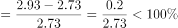；8月4日环比增长率；8月5日环比增长率。由上述数据可知7月28日的环比增长最快。结合柱状图中的票房比例可知，7月28日A片占全国总票房的比例在该影片上映10天内排名为第7。

故正确答案为A。

---

### 第 14 题　qid 2187892 · 综合

如全国所有放映厅座位数相同，则8月5日B影片观影人次数约是C影片的多少倍？

- **A**. 3
- **B**. 4　✅
- **C**. 5
- **D**. 6

**答案**：B

**官方解析**

根据题干“······8月5日······约是······的多少倍”，与材料时间一致，可判定本题为现期倍数问题。定位表格材料及备注可知：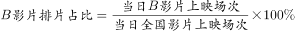，。

故，；

同理，，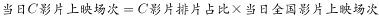。

因全国所有放映厅座位数相同，故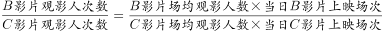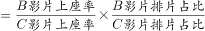，即8月5日B影片观影人次数是C影片的倍数约为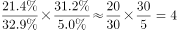。

故正确答案为B。

---

### 第 15 题　qid 2187893 · 倍数

以下信息中，能够从上述资料中推出的有几条？

①A影片上映第6～10日票房之和高于前5日票房之和

②8月2日全国总票房高于8月1日水平

③8月5日B影片票房占当日全国总票房的以上

④8月5日A影片的上映场次是E影片的20多倍

- **A**. 1
- **B**. 2
- **C**. 3　✅
- **D**. 4

**答案**：C

**官方解析**

①定位图形材料，A影片上映第6～10日票房之和为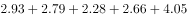亿元，前5日票房之和为亿元，故A影片上映第6～10日票房之和高于前5日票房之和，正确；

②定位图形材料，8月2日全国总票房亿元，8月1日全国总票房亿元，故8月2日全国总票房低于8月1日水平，错误；

③定位图形材料，8月5日全国总票房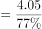 ，故B影片票房占全国总票房的比重约为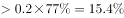，即8月5日B影片票房占当日全国总票房的以上，正确；

④定位表格材料及备注，A影片排片占比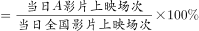，故当日A影片上映场次，同理，当日E影片上映场次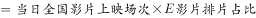，则当日，即20多倍，正确。

综上所述①③④正确。

故正确答案为C。

---

## 材料 4

        2016年，我国境内民用航空（颁证）机场共218个（不含香港、澳门和台湾地区，以下简称境内机场）。

        2016年我国境内机场全年完成旅客吞吐量101635.7万人次，比上年增长。分航线看，国内航线完成91401.7万人次，增长；其中内地至香港、澳门和台湾地区航线完成2764.5万人次，下降。国际航线完成10234.0万人次，增长。

        全年完成货邮吞吐量1510.4万吨，比上年增长。分航线看，国内航线完成974.0万吨，增长；其中内地至香港、澳门和台湾地区航线完成93.6万吨，增长。国际航线完成536.4万吨，增长。

        全年完成飞机起降923.8万架次，比上年增长；其中运输架次为793.5万架次，增长。分航线看，国内航线完成842.8万架次，增长；其中内地至香港、澳门和台湾地区航线完成20.3万架次，下降。国际航线完成81.0万架次，增长。

        2016年，年旅客吞吐量1000万人次以上的机场有28个，较上年净增2个，完成旅客吞吐量占全部境内机场旅客吞吐量的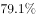。年旅客吞吐量200～1000万人次的机场有21个，较上年净减1个，完成旅客吞吐量占全部境内机场旅客吞吐量的。年旅客吞吐量200万人次以下的机场有169个，较上年净增7个，完成旅客吞吐量占全部境内机场旅客吞吐量的。

### 第 16 题　qid 2187853 · 比重

2016年我国国内航线完成旅客吞吐量占总旅客吞吐量的比重比国内航线完成货邮吞吐量占总货邮吞吐量的比重：

- **A**. 高5个百分点
- **B**. 高25个百分点　✅
- **C**. 低5个百分点
- **D**. 低25个百分点

**答案**：B

**官方解析**

根据题干“2016年······占······的比重······”，结合材料时间为2016年，可判定本题为现期比重问题。定位文字材料第二段可得：“2016年我国境内机场全年完成旅客吞吐量101635.7万人次，国内航线完成91401.7万人次”，定位文字材料第三段可得：“全年完成货邮吞吐量1510.4万吨，国内航线完成974.0万吨”。根据公式：，故所求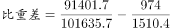，即高26个百分点，与B项最接近。

故正确答案为B。

---

### 第 17 题　qid 2187857 · 比重

2016年我国完成的所有民用飞机起降中，不承担运输任务的架次数占比约为：

- **A**. 

- **B**. 

- **C**. 

　✅
- **D**. 

**答案**：C

**官方解析**

根据题干“2016年······中······占比”，结合材料时间为2016年，可判定本题为现期比重问题。定位文字材料第四段可得：“全年完成飞机起降923.8万架次，其中运输架次为793.5万架次”。根据公式：，故不承担运输任务的架次数，与C选项最接近。

故正确答案为C。

---

### 第 18 题　qid 2187859 · 平均数

2016年我国平均每个境内民用航空机场日均完成国内航线飞机起降约多少架次？

- **A**. 75
- **B**. 91
- **C**. 106　✅
- **D**. 124

**答案**：C

**官方解析**

根据题干“2016年平均每······日均完成······架次”，结合材料时间为2016年，可判定本题为现期平均数问题。定位文字材料第一段可得：“我国境内民用航空机场共218个；定位文字材料第四段可得：国内航线完成842.8万架次”。2016年是闰年，故2016年我国平均每个境内民用航空机场日均完成国内航线飞机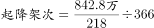架次，与C项最接近。

故正确答案为C。

---

### 第 19 题　qid 2187865 · 平均数

假设2016年全年旅客吞吐量1000万人次以上的机场的平均旅客吞吐量为，全年旅客吞吐量200万人次以下的机场平均旅客吞吐量为，则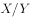的值约为：

- **A**. 15
- **B**. 29
- **C**. 40
- **D**. 59　✅

**答案**：D

**官方解析**

根据题干“······的值约为”，可判定本题为比值计算问题。定位文字材料最后一段：“2016年，年旅客吞吐量1000万人次以上的机场有28个······完成旅客吞吐量占全部境内机场旅客吞吐量的······年旅客吞吐量200万人次以下的机场有169个······完成旅客吞吐量占全部境内机场旅客吞吐量的”；定位文字材料第二段：“2016年我国境内机场全年完成旅客吞吐量101635.7万人次”。则1000万人次以上的机场的平均吞吐量，200万人次以下的机场平均旅客吞吐量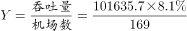。故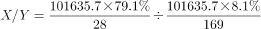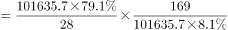，与D项最接近。

故正确答案为D。

---

### 第 20 题　qid 2187869 · 综合

关于我国境内机场运输状况，能够从上述资料中推出的是：

- **A**. 2016年内地至香港、澳门、台湾地区旅客和货物吞吐量均同比下降
- **B**. 2016年我国国际航线货邮吞吐量同比增速快于旅客吞吐量增速
- **C**. 2015年我国旅客吞吐量200万人次以上的机场为50个
- **D**. 2015年我国境内民用航空机场为210个　✅

**答案**：D

**官方解析**

A项：材料中并未给出2016年内地至香港、澳门和台湾地区货物吞吐量相关数据，无法推出；

B项：定位文字材料第三段，2016年我国国际航线货邮吞吐量增长；定位文字材料第二段，2016年我国国际航线旅客吞吐量增长。所以2016年我国国际航线货邮吞吐量同比增速慢于旅客吞吐量增速，错误；

C项：定位文字材料最后一段，2016年年旅客吞吐量1000万人次以上的机场有28个，较上年净增2个，年旅客吞吐量200～1000万人次的机场有21个，较上年净减1个。则2015年我国旅客吞吐量200万人次以上的机场为个，错误；

D项：定位文字材料第一段，2016年，我国境内民用航空（颁证）机场共218个；定位文字最后一段，2016年，年旅客吞吐量1000万人次以上的机场有28个，较上年净增2个，年旅客吞吐量200～1000万人次的机场有21个，较上年净减1个，年旅客吞吐量200万人次以下的机场有169个，较上年净增7个。所以2015年我国境内民用航空机场为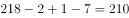个，正确。

故正确答案为D。

注：A项，若将货物吞吐量理解为材料中的货邮吞吐量，结合材料数据内地至香港、澳门和台湾地区货物吞吐量完成93.6万吨，增长，可得货物吞吐量同比上升，A项均下降说法也错误。

---
