# 2018年421联考《行测》题（山西卷）（网友回忆版）

> 资料分析 · 15 题 · 山西 2018

## 材料 1

<b>根据以下资料，回答以下问题。</b>

        2017年第一季度，某省农林牧渔业增加值361.78亿元，比上年同期增长，高于上年同期0.2个百分点。具体情况如下：

        该省种植业增加值119.21亿元，比上年同期增长。其中蔬菜种植面积358.80万亩，比上年同期增加18.23万亩，蔬菜产量471.42万吨，增长；茶叶种植面积679.53万亩，比上年同期增加19.79万亩，茶叶产量2.30万吨，增长。

        该省林业增加值34.84亿元，比上年同期增长。

        该省畜牧业增加值176.64亿元，比上年同期增长，增速比上年同期加快2.1个百分点。其中生猪存栏增速由上年同期的下降转为增长，出栏增速由上年同期的下降转为增长；猪牛羊禽肉产量67.80万吨，比上年同期增长；禽蛋产量5.33万吨，增长；牛奶产量1.40万吨，增长。

        该省渔业增加值9.22亿元，比上年同期增长。全省水产品产量7.68万吨，比上年同期增长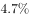，其中，养殖水产品产量7.3万吨，增长。

        该省农林牧渔服务业增加值21.87亿元，比上年同期增长。

### 第 1 题　qid 2188457 · 增长

2015年第一季度，该省农林牧渔业增加值与下列哪一项最为接近？

- **A**. 320亿元　✅
- **B**. 340亿元
- **C**. 360亿元
- **D**. 380亿元

**答案**：A

**官方解析**

根据题干“2015年第一季度，该省农林牧渔业增加值······”，结合材料为2017年第一季度，可判定本题为间隔基期问题。定位文字材料第一段“2017年第一季度，某省农林牧渔业增加值361.78亿元，比上年同期增长，高于上年同期0.2个百分点”，可得2016年增长率，则根据间隔增长率公式可得2017年第一季度比2015年第一季度的增长率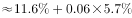。则2015年第一季度，该省农林牧渔业增加值为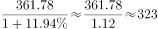亿元，与A项最接近。

故正确答案为A。

---

### 第 2 题　qid 2187786 · 平均数

2016年第一季度，该省平均每亩蔬菜种植地产出蔬菜多少吨？

- **A**. 1.26
- **B**. 1.29　✅
- **C**. 1.31
- **D**. 1.35

**答案**：B

**官方解析**

根据题干“2016年第一季度······平均每亩······多少吨”，结合材料时间为2017年第一季度，可判定本题为基期平均数问题。定位材料第二段：其中蔬菜种植面积358.80万亩，比上年同期增加18.23万亩，蔬菜产量471.42万吨，增长7.5%。可得2016年第一季度蔬菜种植面积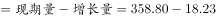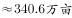，则2016年第一季度平均每亩蔬菜种植地产出蔬菜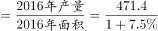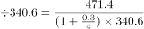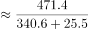。

故正确答案为B。

---

### 第 3 题　qid 2187795 · 增长

2017年第一季度，该省生猪出栏增速比上年同期：

- **A**. 
加快

- **B**. 
加快

- **C**. 
加快
　✅
- **D**. 
加快

**答案**：C

**官方解析**

定位材料第四段：“出栏增速由上年同期的下降转为增长”，可得，2017年第一季度该省生猪出栏增速为，2016年第一季度该省生猪出栏增速为。故2017年第一季度，该省生猪出栏增速比上年同期加快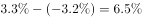。

故正确答案为C。

---

### 第 4 题　qid 2187799 · 比重

2017年第一季度，该省占农林牧渔业增加值比重超过三成的包括：

- **A**. 种植业、渔业
- **B**. 林业、畜牧业
- **C**. 种植业、畜牧业　✅
- **D**. 农林牧渔服务业、林业

**答案**：C

**官方解析**

根据题干“2017年第一季度······比重超过······”，结合材料所给时间为2017年第一季度，可判定本题为现期比重问题。定位材料第一段：“2017年第一季度，某省农林牧渔业增加值361.78亿元”，可得，占农林牧渔业增加值比重超过三成即亿元。定位材料可知增加值超过108.6亿元的包括种植业（119.21亿元）、畜牧业（176.64亿元）。

故正确答案为C。

---

### 第 5 题　qid 2187824 · 综合

能够从上述资料中推出或计算出的是：

- **A**. 
2017年该省农林牧渔服务业增加值

- **B**. 
2016年第一季度全国农林牧渔业增加值

- **C**. 
2017年第一季度该省水产品产量中非养殖水产品产量与2016年第一季度持平

- **D**. 
若2017年该省林业增加值每个季度的环比增长率不低于，则2017年该省林业增加值将超过150亿元
　✅

**答案**：D

**官方解析**

A项：定位材料第六段，给出的是2017年第一季度该省农林牧渔服务业增加值与增长率，没有与2017年全年相关的数据，故无法计算；

B项：定位材料第一段，给出的是2017年第一季度该省农林牧渔业增加值，没有与全国相关的数据，故无法计算；

C项：定位材料第五段可知，2017年第一季度全省水产品产量比上年同期增长，养殖水产品产量同比增长。根据混合增长率“整体增速大小居中”的结论，则非养殖水产品的增速也为。增速为正，说明2017年第一季度非养殖水产品产量比2016年第一季度上升了，错误；

D项：定位材料第三段可知，2017年第一季度该省林业增加值为34.84亿元，若每季度环比增长率不低于，则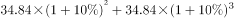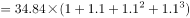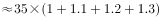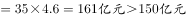，正确。

故正确答案为D。

注：D项计算量较大，故A、B、C排除后直接选D即可。

---

## 材料 2

        2016年，我国全年完成邮电业务收入总量43344亿元，比上年增长。其中，邮政业务收入7397亿元，增长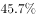；电信业务收入35947亿元，增长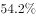。邮政业全年完成邮政函件业务36.2亿件，包裹业务0.3亿件，快递业务量312.8亿件；快递业务收入3974亿元。电信业全年新增移动电话交换机容量7318万户，达到218384万户。2016年末全国电话用户总数152856万户（电话包括固定电话和移动电话两种），其中移动电话用户132193万户。移动电话普及率上升至96.2部/百人。固定互联网宽带接入用户29721万户，比上年增加3774万户，其中固定互联网光纤宽带接入用户22766万户，比上年增加7941万户；移动宽带用户94075万户，增加23464万户。移动互联网接入流量93.6亿G，比上年增长。互联网上网人数7.31亿人，增加4299万人，其中手机上网人数6.95亿人，增加7550万人。互联网普及率达到，其中农村地区互联网普及率达到。软件和信息技术服务业完成软件业务收入48511亿元，比上年增长。 

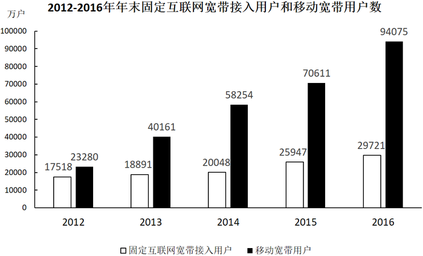

### 第 6 题　qid 2187787 · 比重

2016年我国快递业务收入占邮电业务收入总量的比重为：

- **A**. 
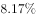

- **B**. 
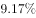
　✅
- **C**. 
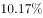

- **D**. 
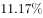

**答案**：B

**官方解析**

由题干“2016年······占······的比重为”，结合材料时间为2016年，判定此题为现期比重问题。定位文字材料可知，2016年，我国全年完成邮电业务收入总量43344亿元，快递业务收入3974亿元。根据比重公式可得，比重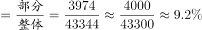，B项最为接近。

故正确答案为B。

---

### 第 7 题　qid 2187792 · 增长

2013～2016年期间，我国移动宽带用户数同比增长最快的年份是：

- **A**. 2013年　✅
- **B**. 2014年
- **C**. 2015年
- **D**. 2016年

**答案**：A

**官方解析**

由题干“2013～2016年…同比增长最快的年份是”，判定此题为一般增长率问题。定位统计图可知，2012年我国移动宽带用户数为23280万户，2013年为40161万户，2014年为58254万户，2015年为70611万户，2016年为94075万户。根据增长率公式，增长率，可得2013～2016年我国移动宽带用户数同比增长率分别为：

2013：；2014：；2015：；2016：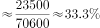。因此2013～2016年我国移动宽带用户数同比增长最快的年份为2013年。

故正确答案为A。

---

### 第 8 题　qid 2188730 · 平均数

2012～2016年期间，我国固定互联网宽带接入用户的平均数是：

- **A**. 18425万户
- **B**. 22425万户　✅
- **C**. 25425万户
- **D**. 27425万户

**答案**：B

**官方解析**

根据题干“……平均数是”，结合题干时间均在材料中给出，可判定本题为现期平均数问题。根据表格可得，2012~2016年我国固定互联网宽带接入用户数分别为17518、18891、20048、25947、29721万户。故2012～2016年我国固定宽带接入用户数的平均数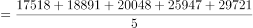，B项最接近。

故正确答案为B。

---

### 第 9 题　qid 2188468 · 比重

2016年末，全国固定电话用户占电话用户总数的比重约为：

- **A**. 

　✅
- **B**. 

- **C**. 
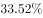

- **D**. 

**答案**：A

**官方解析**

根据题干“2016年末······占······的比重”，可判定本题为现期比重问题。定位文字材料“2016年末全国电话用户总数152856万户（电话包括固定电话和移动电话两种），其中移动电话用户132193万户”，可得全国固定电话用户占电话用户总数的比重，与A项最接近。

故正确答案为A。

---

### 第 10 题　qid 2187804 · 综合

关于我国邮电业务情况的说明，下列说法正确的是：

- **A**. 2015年末，我国固定互联网光纤宽带接入用户与移动宽带用户的差额低于50000户
- **B**. 2016年固定互联网宽带接入用户同比增长率高于移动宽带用户增长率
- **C**. 2016年末，我国使用固定电话的总人数比移动电话的多
- **D**. 2016年我国城市地区互联网普及率已超过一半　✅

**答案**：D

**官方解析**

A项：定位文字材料和图表，2016年固定互联网光纤宽带接入用户22766万户，比上年增加7941万户；2015年移动宽带用户70611万户。根据基期量，则2015年固定互联网光纤宽带接入用户，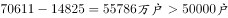，错误；

B项：定位文字材料和图表，2016年固定互联网宽带接入用户比上年增加3774万户，2015年固定互联网宽带接入用户数为25947万户；2016年移动宽带用户比上年增加23464万户，2015年移动宽带用户70611万户。根据增长率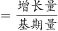，则2016年我国固定互联网宽带接入用户同比增长率，移动宽带用户增长率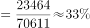，，错误；

C项：定位文字材料，2016年末全国电话用户总数152856万户（电话包括固定电话和移动电话两种），其中移动电话用户132193万户。固定电话用户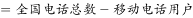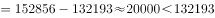，故2016年末我国使用固定电话的总人数比移动电话的少，错误；

D项：定位文字材料，互联网普及率达到，其中农村地区互联网普及率达到。农村地区互联网普及率和城市地区互联网普及率混合为互联网普及率，根据“混合居中”，可得农村地区互联网普及率（）互联网普及率（）城市地区互联网普及率，故城市地区互联网普及率超过一半，正确。

故正确答案为D。

---

## 材料 3

        2017年上半年，全国居民人均可支配收入12932元，比上年同期名义增长，其中，城镇居民人均可支配收入18332元，增长（以下如无特别说明，均为同比名义增长）；农村居民人均可支配收入6562元，增长。

        按收入来源分，2017年上半年，全国居民人均工资性收入7435元，增长，占全国居民人均可支配收入的比重为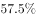；人均经营净收入2117元，增长，占全国居民人均可支配收入的比重为；人均财产净收入1056元，增长，占全国居民人均可支配收入的比重为；人均转移净收入2324元，增长，占全国居民人均可支配收入的比重为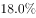。

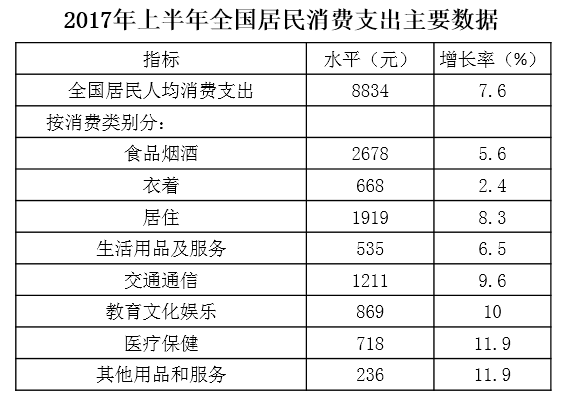

### 第 11 题　qid 2188713 · 平均数

2016年上半年，城镇居民人均可支配收入约为多少万元？

- **A**. 1.4
- **B**. 1.7　✅
- **C**. 2.1
- **D**. 2.3

**答案**：B

**官方解析**

由题干“2016年上半年······约为多少万元”，结合材料所给时间为2017年，判定此题为基期计算问题。定位文字材料第一段“2017年上半年······城镇居民人均可支配收入18332元，增长”，代入基期计算公式，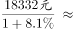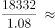万元。

故正确答案为B。

---

### 第 12 题　qid 2188466 · 平均数

2016年上半年，全国居民人均工资性收入占全国居民人均可支配收入的比重约为：

- **A**. 

- **B**. 

　✅
- **C**. 

- **D**. 

**答案**：B

**官方解析**

由题干“2016年上半年······占······的比重约为”，而材料数据时间为2017年，判定此题为基期比重问题。定位文字材料第一段“2017年上半年，全国居民人均可支配收入12932元，比上年同期名义增长”，定位文字材料第二段“2017年上半年，全国居民人均工资性收入7435元，增长，占全国居民人均可支配收入的比重为”，代入基期比重公式，略大于。

故正确答案为B。

---

### 第 13 题　qid 2188727 · 平均数

2017年上半年，人均财产净收入比上年约增加多少元？

- **A**. 92　✅
- **B**. 102
- **C**. 112
- **D**. 122

**答案**：A

**官方解析**

由题干“2017年上半年······比上年约增加多少元”，判定此题为增长量计算问题。定位文字材料第二段“人均财产净收入1056元，增长”。代入公式，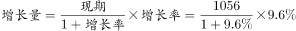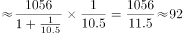。

故正确答案为A。

---

### 第 14 题　qid 2188469 · 增长

2017年上半年，全国居民消费支出主要数据按消费类别分，其指标的增长率超过全国居民人均消费支出水平增长率的有几个？

- **A**. 4
- **B**. 5　✅
- **C**. 6
- **D**. 7

**答案**：B

**官方解析**

定位表格，可知全国居民消费支出增长率为，按消费类别分，超过全国居民消费支出增长率的有居住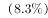、交通通信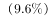、教育文化娱乐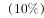、医疗保健、其他用品和服务，共5个。 

故正确答案为B。

---

### 第 15 题　qid 2188470 · 综合

关于2017年上半年全国居民收入和消费支出主要数据情况，下列说法正确的是：

- **A**. 生活用品及服务消费支出水平不足交通通信消费支出水平的二分之一　✅
- **B**. 城镇居民人均可支配收入超过农村居民人均可支配收入的3倍
- **C**. 人均财产净收入同比增长率低于人均经营净收入同比增长率
- **D**. 居住消费支出同比增长率高于医疗保健消费支出同比增长率

**答案**：A

**官方解析**

A项：定位表格，可知生活用品及服务消费支出为535元，交通通讯消费支出为1211元。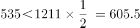，正确；

B项：定位文字材料第一段，可知城镇居民人均可支配收入为18332元，农村居民人均可支配收入为6562元。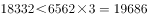，错误；

C项：定位文字材料第二段，可知人均财产净收入同比增长率＞人均经营净收入同比增长率，错误；

D项：定位表格，可知居住消费支出同比增长率＜医疗保健消费支出同比增长率，错误。

故正确答案为A。

---
