# 2018年421联考《行测》题（江西卷）（网友回忆版）

> 资料分析 · 20 题 · 江西 2018

## 材料 1

根据以下资料，回答116~120题。

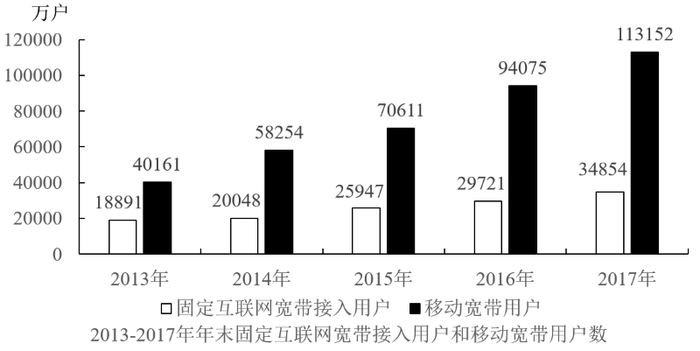

### 第 1 题　qid 2188378 · 综合

下列描述正确的是：

- **A**. 
移动宽带用户数的年增长速度连续四年均比固定互联网宽带接入用户数的快

- **B**. 
2017年移动宽带用户数和固定互联网宽带接入用户数的总和，比2013年增长了约2.5倍

- **C**. 
2013一2017年固定互联网宽带接入用户数的年均增长率为
　✅
- **D**. 
2013一2017年固定互联网宽带接入用户数的年增长速度最慢的年份是2015年

**答案**：C

**官方解析**

A项：定位图形材料可知，2014-2017年移动宽带用户数的增长速度分别为：

2014年：；

2015年：；

2016年：；

2017年：。

2014-2017年固定互联网宽带接入用户数的增长速度分别为：

2014年：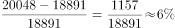；

2015年：；

2016年：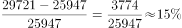；

2017年：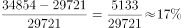。

2015年，移动宽带用户数的增长速度小于固定互联网宽带接入用户数的增长速度，错误；

B项：定位图形材料可知，2013年和2017年移动宽带用户数和固定互联网宽带接入用户数的总和分别为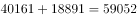、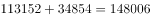，所以2017年比2013年增长了约倍，错误；

C项：定位图形材料可知，2013年和2017年固定互联网宽带接入用户数分别为18891、34854。代入年均增长率公式：（n为年份差），即，将代入，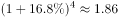，与1.85非常接近，正确；

D项：由A项计算结果可知，2013-2017年固定互联网宽带接入用户数的年增长速度最快的年份是2015年，错误。

故正确答案为C。

备注：C项计算过难，可通过排除A、B、D三项选出正确答案。 

---

### 第 2 题　qid 2188379 · 增长

2013一2017年固定互联网宽带接入用户数的年增长速度最快的年份是：

- **A**. 2014
- **B**. 2015　✅
- **C**. 2016
- **D**. 2017

**答案**：B

**官方解析**

根据题干“2013-2017年······增长速度最快的年份是”，可判定本题为一般增长率比较问题。由116题计算结果可知，2013-2017年固定互联网宽带接入用户数的年增长速度最快的年份是2015年。
故正确答案为B。

---

### 第 3 题　qid 2188381 · 综合

移动宽带用户数超过固定互联网宽带接入用户数三倍的有几年？

- **A**. 1
- **B**. 2　✅
- **C**. 3
- **D**. 4

**答案**：B

**官方解析**

根据题干“······三倍的有几年”，可判定本题为现期倍数问题。定位图形材料可知，2013-2017年移动宽带用户数分别为40161、58254、70611、94075、113152，固定互联网宽带接入用户数分别为18891、20048、25947、29721、34854。则2013年-2017年的倍数分别为：2013年：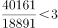，2014年：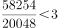，2015年：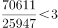，2016年：，2017年：。所以移动宽带用户数超过固定互联网宽带接入用户数三倍的有2年。

故正确答案为B。

---

### 第 4 题　qid 2188386 · 增长

2013一2017年移动宽带用户数的年均增长率为：

- **A**. 

- **B**. 

- **C**. 

　✅
- **D**. 

**答案**：C

**官方解析**

根据题干“2013-2017年······年均增长率为”，可判定本题为年均增长率问题。由图形材料可知：2013年移动宽带用户数为40161，2017年移动宽带用户数为113152。代入公式：（n为年份差），即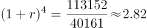，优先选取整数代入，将C项代入，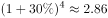，与2.82非常接近，当选。

故正确答案为C。

---

### 第 5 题　qid 2188387 · 增长

2013一2017年移动宽带用户数的年增长速度最快的年份是：

- **A**. 2014　✅
- **B**. 2015
- **C**. 2016
- **D**. 2017

**答案**：A

**官方解析**

根据题干“2013-2017年……年增长速度最快的年份是”，可判定本题为一般增长率比较问题。由116题计算结果可知移动宽带用户数增长速度最快的年份是2014年。
故正确答案为A。

---

## 材料 2

<b>根据以下资料，回答</b><b>121-125题。</b>

### 第 6 题　qid 2188305 · 综合

假设该高校在2015年的教职工总数为2500人，其中女性占，则该校男博士人数为：

- **A**. 120
- **B**. 125
- **C**. 130
- **D**. 135　✅

**答案**：D

**官方解析**

根据题干“2015年……男博士人数”，结合表格材料给出男博士比率，可判定本题为现期比重问题。由题干可知，2015年总人数为2500人，女性占，故男性人数为人。定位表格材料可知，2015年男博士比率为，由可得，该校男博士人数=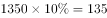人。

故正确答案为D。

---

### 第 7 题　qid 2188329 · 综合

2015年该高校的博士比率为：

- **A**. 

- **B**. 

- **C**. 

- **D**. 
不能确定
　✅

**答案**：D

**官方解析**

根据题干“2015年该高校的博士比率”，结合表格材料给出男博士和女博士两个部分的比率，可判定本题为混合比重问题。定位表格材料可知，2015年男博士比率为，女博士比率为，可知博士比率在到之间。由于本题无男女性职工总人数的具体数值或比例关系，故无法计算该高校的博士比率。

故正确答案为D。

---

### 第 8 题　qid 2188341 · 综合

男女博士比率最接近的是哪一年？

- **A**. 2011
- **B**. 2012
- **C**. 2013　✅
- **D**. 2014

**答案**：C

**官方解析**

定位表格材料可知，男女博士比率差，2011年为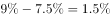，2012年为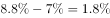，2013年为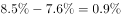，2014年为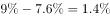。比较可知，2013年比率差值最小，即男女博士比率最接近。

故正确答案为C。

---

### 第 9 题　qid 2188348 · 增长

2011-2015年女博士比率相比上一年有所增加的有几年？

- **A**. 1
- **B**. 2
- **C**. 3　✅
- **D**. 4

**答案**：C

**官方解析**

定位表格材料可得：2011年-2015年女博士比率相比上一年有所增加的年份有2011年、2013年、2015年共3个年份。
故正确答案为C。

---

### 第 10 题　qid 2188354 · 综合

下列不正确的是：

- **A**. 男博士比率下降的有2年
- **B**. 女博士比率下降的有2年
- **C**. 男博士比率和女博士比率增加最快的都是2017年
- **D**. 男博士比率和女博士比率同时下降的都是2011年　✅

**答案**：D

**官方解析**

A项：定位表格可得：男博士比率下降的有2012年、2013年共两个年份，正确；

B项：定位表格可得：女博士比率下降的只有2012年一个年份，错误；

C项：定位表格可得：2017年男博士比率增加，2016年男博士比率增加，2015年男博士比率增加，2014年男博士比率增加，2013年男博士比率增加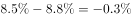，2012年男博士比率增加，2011年男博士比率增加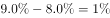，故2017年男博士比率增加最快。

2017年女博士比率增加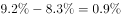，2016年女博士比率增加，2015年女博士比率增加，2014年女博士比率增加，2013年女博士比率增加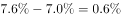，2012年女博士比率增加，2011年女博士比率增加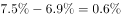，故2017年女博士比率增加最快。所以2017年男博士比率和女博士比率均为增加最快的年份，正确；

D项：2011年男博士比率和女博士比率均为上升，与选项描述不符，错误。

本题为选非题，故正确答案为B和D。

备注：根据考生回忆，B和D选项都不正确。

---

## 材料 3

根据以下资料，回答126～130题。

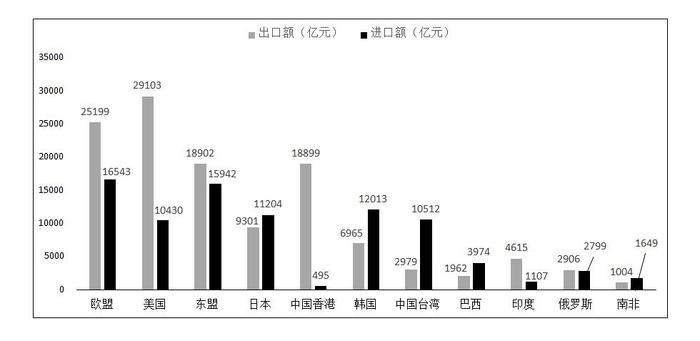

        2017年对主要国家和地区货物进出口额

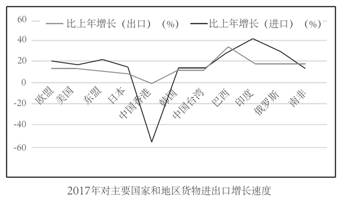

### 第 11 题　qid 2188307 · 综合

2017年进口额排前三的国家或地区进口额之和是：

- **A**. 44498亿元　✅
- **B**. 43689亿元
- **C**. 43889亿元
- **D**. 45689亿元

**答案**：A

**官方解析**

定位柱状图可得，进口额排前三的国家或地区分别是：欧盟、东盟和韩国。故2017年进口额排前三的国家或地区进口额之和是：亿元。

故正确答案为A。

---

### 第 12 题　qid 2188318 · 增长

2017年进口额比上年增长和出口额比上年增长最快的国家或地区分别为：

- **A**. 东盟和巴西
- **B**. 印度和巴西　✅
- **C**. 巴西和印度
- **D**. 俄罗斯和巴西

**答案**：B

**官方解析**

定位折线图可得：进口额比上年增长最快的国家是印度；出口额比上年增长最快的国家是巴西。
故正确答案为B。

---

### 第 13 题　qid 2188325 · 综合

2017年对我国的进出口总额最多的国家或地区为：

- **A**. 欧盟　✅
- **B**. 美国
- **C**. 东盟
- **D**. 中国香港

**答案**：A

**官方解析**

柱状图是我国对其它国家或地区的进、出口额，分别对应其它国家或地区对我国的出、进口额。定位柱状图数据可得：

欧盟对我国的进口额是25199亿元，对我国的出口额是16543亿元，则欧盟对我国的进出口总额是：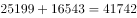亿元；

美国对我国的进口额是29103亿元，对我国的出口额是10430亿元，则美国对我国的进出口总额是：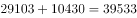亿元；

东盟对我国的进口额是18902亿元，对我国的出口额是15942亿元，则东盟对我国的进出口总额是：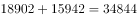亿元；

中国香港对我国进口额是18899亿元，对我国出口额是495亿元，则中国香港对我国的进出口总额是：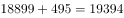亿元；

由上述数据可知欧盟是对我国的进出口总额最多的地区。

故正确答案为A。

---

### 第 14 题　qid 2188336 · 综合

2017年我国进口额和出口额最多的国家或地区分别为：

- **A**. 欧盟和东盟
- **B**. 美国和东盟
- **C**. 欧盟和美国　✅
- **D**. 美国和欧盟

**答案**：C

**官方解析**

定位柱状图，2017年我国进口额最多的地区为欧盟，出口额最多的国家为美国。
故正确答案为C。

---

### 第 15 题　qid 2188345 · 增长

2017年进口额比上年增长明显超过的国家或地区有几个？

- **A**. 2
- **B**. 3
- **C**. 4　✅
- **D**. 5

**答案**：C

**官方解析**

定位折线图，2017年进口额比上年增长明显超过20%的国家或地区有东盟、巴西、印度和俄罗斯，共有4个。
故正确答案为C。

---

## 材料 4

        2017年全国居民人均可支配收入25974元，比上年增长，扣除价格因素，实际增长，2017年全国居民人均消费支出18323元，比上年增长，扣除价格因素，实际增长。按常住地分，城镇居民人均消费支出24445元，增长，扣除价格因素，实际增长；农村居民人均消费支出10955元，增长，扣除价格因素，实际增长。恩格尔系数为，比上年下降，其中城镇为，农村为。

### 第 16 题　qid 2188293 · 平均数

2016年城镇居民人均消费支出是多少元？

- **A**. 23482
- **B**. 23083　✅
- **C**. 17383
- **D**. 10257

**答案**：B

**官方解析**

根据题干“2016年城镇居民人均消费支出”，结合材料时间为2017年，可判定本题为基期计算问题。定位文字材料可得：“2017年城镇居民人均消费支出24445元，增长”。根据公式：，故2016年城镇居民人均消费支出元，与B项最接近。

故正确答案为B。

---

### 第 17 题　qid 2188311 · 平均数

食品烟酒和居住分别占居民人均消费支出的百分比为：

- **A**. 
，
　✅
- **B**. 
，

- **C**. 
，

- **D**. 
，

**答案**：A

**官方解析**

根据题干“······占······的百分比”，可判定本题为现期比重问题。定位文字材料可得：“2017年全国居民人均消费支出18323元”；定位图形材料可得：食品烟酒5374元、居住4107元。根据公式：，故食品烟酒占居民人均消费支出的百分比，居住占居民人均消费支出的百分比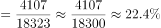，与A项最接近。

故正确答案为A。

---

### 第 18 题　qid 2188320 · 平均数

2017年全国居民人均消费支出前三位的总和是多少元？

- **A**. 11567
- **B**. 11887
- **C**. 11980　✅
- **D**. 11998

**答案**：C

**官方解析**

定位图形材料可得：2017年全国居民人均消费支出前三位分别是：食品烟酒5374元、居住4107元、交通通信2499元。故前三位的总和元。

故正确答案为C。

---

### 第 19 题　qid 2188335 · 平均数

2017年教育文化娱乐支出占居民人均可支配收入的百分比是：

- **A**. 

　✅
- **B**. 

- **C**. 

- **D**. 

**答案**：A

**官方解析**

根据题干“2017年······占······的百分比是”，结合材料时间2017年，判定本题为现期比重问题。定位文字材料可知，“2017年全国居民人均可支配收入25974元”；定位图形材料可知，教育文化娱乐支出2086元。故所求占比为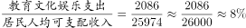。

故正确答案为A。

---

### 第 20 题　qid 2188346 · 综合

2016年全国居民的恩格尔系数为：

- **A**. 

- **B**. 

- **C**. 

- **D**. 

　✅

**答案**：D

**官方解析**

定位文字材料可得：“2017年全国居民······恩格尔系数为，比上年下降”，故2016年全国居民的恩格尔系数为。

故正确答案为D。

备注：

1.恩格尔系数自身是率，一般不会讨论“率”的增长率，所以材料中的“比上年下降”应当理解为“下降0.8个百分点”。

2.资料分析中涉及的数据都是统计局发布的真实数据，2016年我国居民的恩格尔系数的官方数据就是。

---
