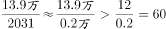
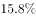
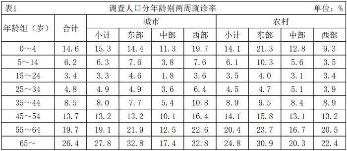
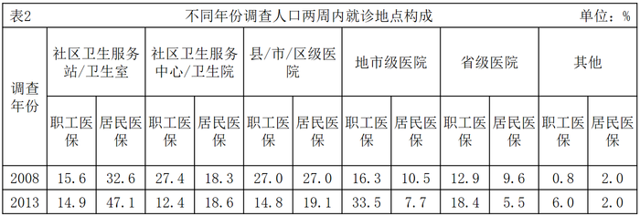
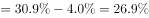
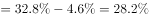
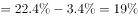
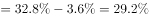
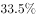
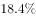

# 2018年421联考《行测》题（甘肃卷）（网友回忆版）

> 资料分析 · 15 题 · 甘肃 2018

## 材料 1

根据以下资料，回答下列小题。

        2016年，全国平均气温，较常年平均气温偏高，为1951年以来第三高，仅次于2015年（）和2007年（）。2016年四季气温均偏高，其中夏季气温为历史最高；除1月偏低、11月接近常年同期外，其余各月均偏高，其中12月偏高，为历史同期最高。全国31个省（区、市）中，仅黑龙江平均气温较常年偏低，其他省（区、市）气温均偏高，其中青海、甘肃、河南和贵州4省均为1951年以来的历史最高。

        2016年，全国年降水量范围为3.5毫米（新疆托克逊）～3494.4毫米（安徽黄山），全国平均降水量730.0毫米，较常年（629.9毫米）偏多，比2015年偏多，为1951年以来最多。2月和8月降水偏少，3月接近常年同期，其余各月均偏多，其中1月偏多，10月偏多，均为历史同期最多。

### 第 1 题　qid 2187610 · 平均数

1951-2016年间，全国年平均气温最高的年份是：

- **A**. 1998年
- **B**. 2007年
- **C**. 2015年　✅
- **D**. 2016年

**答案**：C

**官方解析**

定位文字第一段材料可知：“2016年，全国平均气温……为1951年以来第三高，仅次于2015年（）和2007年（）”，故1951-2016年间，全国年平均气温最高的年份是2015年。

故正确答案为C。

---

### 第 2 题　qid 2187615 · 平均数

2015年全国平均降水量为：

- **A**. 730.0毫米
- **B**. 646.0毫米　✅
- **C**. 629.9毫米
- **D**. 612.6毫米

**答案**：B

**官方解析**

根据题干“2015年全国平均降水量为……”，结合文字材料时间为2016年，可判定本题为基期计算问题。定位文字第二段材料可知：“2016年，全国平均降水量730.0毫米……比2015年偏多。”故2015年全国平均降水量毫米。

故正确答案为B。

---

### 第 3 题　qid 2187617 · 综合

与常年同期相比，2016年降水偏少的月份是：

- **A**. 1月和10月
- **B**. 3月和12月
- **C**. 2月和8月　✅
- **D**. 2月和10月

**答案**：C

**官方解析**

定位文字材料第二段可知，2016年全国年降水量，2月和8月降水偏少。
故正确答案为C。

---

### 第 4 题　qid 2187622 · 平均数

下列可由所给资料得出的数据有：
①2016年各季度气温均值
②青海、甘肃、河南和贵州4省平均气温偏高率
③2015年全国年降水范围
④2016年1月、10月月降水量之差

- **A**. 0个　✅
- **B**. 1个
- **C**. 2个
- **D**. 3个

**答案**：A

**官方解析**

①：定位文字材料第一段可得，“2016年四季气温均偏高，其中夏季气温为历史最高；除1月偏低、11月接近常年同期外，其余各月均偏高，其中12月偏高，为历史同期最高。”关于2016年各季度气温均值并无相关具体数据，故无法得出；

②：定位文字材料第一段可得，“全国31个省（区、市）······，其中青海、甘肃、河南和贵州4省均为1951年以来的历史最高”，无气温相关数据，故无法得出；

③：定位文字材料第二段可得，“2016年，全国年降水量范围为3.5毫米（新疆托克逊）～3494.4毫米（安徽黄山）”，只能得出2016年全国年降水范围，无其他相关数据，故无法得出；

④：定位文字材料第二段可得，“2月和8月降水偏少，······其中1月偏多、10月偏多，均为历史同期最高”，无2016年1月和10月降水量相关数据，故无法得出。

①②③④均无法得出。

故正确答案为A。

---

### 第 5 题　qid 2188758 · 综合

下列能够从所给资料推出的是：

- **A**. 2016年，青海、甘肃、河南和贵州是全国平均气温最高的省份
- **B**. 1951～2016年，全国年均气温总体呈上升趋势　✅
- **C**. 1951～2016年，降水偏多的年份气温就偏低
- **D**. 2016年全国各地年降水量差异不大

**答案**：B

**官方解析**

A项：定位文字材料第一段可知：“青海、甘肃、河南和贵州4省均为1951年以来的历史最高”，其平均气温为本省历史最高，并非是全国平均气温最高的省份，错误；
B项：定位第一个图形材料可知，全国年均气温总体呈上升趋势，正确；
C项：定位两个图形材料可知，2016年降水量最高，其气温也偏高，与降水偏多的年份气温就偏低矛盾，错误；
D项：定位文字材料第二段可知：“2016年，全国降水量范围为3.5毫米（新疆托克逊）-3494.4毫米（安徽黄山）”，与2016年全国各地年降水量差异不大矛盾，错误。
故正确答案为B。

---

## 材料 2

<b>根据以下资料，回答下列小题。</b>

        2016年，全年原创首演剧目1423个，扶持了100名京剧、地方戏表演艺术家向200名青年演员传授经典折子戏。第十一届中国艺术节共汇聚67台参评参演剧目和1000余件美术作品，观众达40万人次。国家艺术基金2016年共有966个项目获得立项资助，较2015年增长了，资助资金总额7.3亿元。

        2016年末全国共有艺术表演团体12301个，比上年末增加1514个，从业人员33.27万人，增加3.08万人。其中各级文化部门所属的艺术表演团体2031个，占；从业人员11.52万人，占。

        全年全国艺术表演团体共演出230.60万场，比上年增长，其中赴农村演出151.60万场，增长；国内观众11.81亿人次，增长，其中农村观众6.21亿人次，比上年增长；总收入311.23亿元，比上年增长，其中演出收入130.86亿元，增长。

        全年全国各级文化部门所属艺术表演团体共组织政府采购公益演出13.90万场，观众1.17亿人次。利用流动舞台车演出11.31万场次，观众10381万人次。中央直属院团全年开展公益性演出1335场，其中赴老少边穷地区演出241场，面向老红军、留守儿童等演出132场。

        年末全国共有艺术表演场馆2285个，观众坐席数168.93万个。全年馆内艺术演出19.09万场次，增长；艺术演出观众3098万人次，增长。其中各级文化部门所属艺术表演场馆1265个，全年共举行艺术演出6.81万场次，增长，艺术演出观众2589万人次，增长。

        年末全国国有美术馆462个，比上年末增加44个，从业人员4597人，增加502人。全国共举办展览6146次，比上年增长，参观人次3237万，增长。

### 第 6 题　qid 2187625 · 综合

2015年末，全国拥有艺术表演团体的数量是：

- **A**. 10787个　✅
- **B**. 12301个
- **C**. 14237个
- **D**. 22031个

**答案**：A

**官方解析**

根据题干“2015年末······的数量是”，结合材料时间是2016年末，可判定本题为基期计算问题。定位材料第二段可得：“2016年末全国艺术表演团体12301个，比上年末增加1514个”。故2015年末全国拥有艺术表演团体的数量是：个。

故正确答案为A。

---

### 第 7 题　qid 2188888 · 比重

在2015年全国艺术表演团体演出场次中，赴农村演出占比约为：

- **A**. 

- **B**. 

- **C**. 

　✅
- **D**. 

**答案**：C

**官方解析**

根据题干“在2015年······中，······占比约为”，结合材料时间是2016年，可判定本题为基期比重问题。定位材料第三段可得：“全年全国艺术表演团体共演出230.60万场，比上年增长，其中赴农村演出151.60万场，增长”。根据基期比重公式可得：，略大于1，则最终结果略大于，C项最为接近。

故正确答案为C。

---

### 第 8 题　qid 2187629 · 平均数

在2016年中，下列平均场次观众最多的是：

- **A**. 全国艺术表演团体演出　✅
- **B**. 全国艺术表演团体赴农村演出
- **C**. 全国艺术表演场馆馆内艺术演出
- **D**. 全国各级文化部门所属艺术表演场馆艺术演出

**答案**：A

**官方解析**

根据题干“在2016年中······平均······最多的是”，结合材料时间是2016年，可判定本题为现期平均数问题。

A项：定位材料第三段可得：“全年全国艺术表演团体共演出230.60万场，······国内观众11.81亿人次······”。故全国艺术表演团体演出平均场次观众为：；

B项：定位材料第三段可得：“······其中赴农村演出151.60万场，······其中农村观众6.21亿人次······”。故全国艺术表演团体赴农村演出平均场次观众为：；

C项：定位材料第五段可得：“······全年馆内艺术演出19.09万场次······艺术演出观众3098万人次······”。故全国艺术表演场馆馆内艺术演出平均场次观众为：；

D项：定位材料第五段可得：“······全年共举行艺术演出6.81万场次······艺术演出观众2589万人次······”。故全国各级文化部门所属艺术表演场馆艺术演出平均场次观众为：。

综上比较A项最多。

故正确答案为A。

---

### 第 9 题　qid 2188891 · 平均数

2016年，全国艺术表演团体平均从业人员数和各级文化部门所属艺术表演团体从业人员平均数之比约为：

- **A**. 1:0.346
- **B**. 6:1
- **C**. 1:2　✅
- **D**. 2:3

**答案**：C

**官方解析**

根据题干“2016年，······和······之比约为······”，可判定本题为比值计算问题。定位文字材料第二段可得：“2016年末全国共有艺术表演团体12301个，从业人员33.27万人······各级文化部门所属艺术表演团体2031个，从业人员11.52万人”。故2016年全国艺术表演团体平均从业人员数和各级文化部门所属艺术表演团体从业人员平均数之比约为，即比约为1:2。

故正确答案为C。

---

### 第 10 题　qid 2188892 · 综合

从上述资料可以推断，在2016年：

- **A**. 第十一届中国艺术节取得空前成功
- **B**. 我国艺术创作演出的经济效益显著
- **C**. 我国艺术表演团体演出收益较2015年减少
- **D**. 平均每个文化部门所属艺术表演团体组织政府采购公益性演出场次超过60场　✅

**答案**：D

**官方解析**

A项：定位文字材料第一段，“第十一届中国艺术节共汇聚67台参评参演剧目和1000余件美术作品，观众达40万人次”，未出现其他数据，无法推出，错误；

B项：材料未出现艺术创作演出的相关数据，无法推出，错误；

C项：定位文字材料第三段，“全年全国艺术表演团体······其中演出收入130.86亿元，增长”，故我国艺术表演团体演出收益较2015年增加，并非减少，且若将艺术表演团体演出收益理解为利润，材料中同样未出现相关数据，无法推出，错误；

D项：定位文字材料第二段，“······其中各级文化部门所属的艺术表演团体2031个”，及第四段“全年全国各级文化部门所属艺术表演团体共组织政府采购公益演出13.90万场”，故平均每个文化部门所属艺术表演团体组织政府采购公益性演出场次约为，即超过60场，正确。

故正确答案为D。

---

## 材料 3

根据以下资料，回答以下各题。

        两周就诊率被定义为每百人中两周内因病或身体不适寻求各级医疗机构治疗服务的人次数。第五次国家卫生服务调查结果显示，调查地区居民两周就诊率为，其中城市地区为，农村地区为。城市地区，东部、中部、西部两周就诊率分别为、、；农村地区，东部、中部、西部两周就诊率分别为、、。

### 第 11 题　qid 2187643 · 综合

从调查人口分年龄别进行分析，两周就诊率随年龄组从低到高的变化是：

- **A**. 先下降而后上升　✅
- **B**. 持续上升
- **C**. 持续下降
- **D**. 保持水平不变

**答案**：A

**官方解析**

定位材料表格1第二列可知，0~4岁、5~14岁、15~24岁就诊率持续下降；25~34岁、35~44岁、45~54岁、55~64岁、65~岁就诊率持续上升。故两周就诊率随年龄组从低到高的变化趋势为先下降而后上升。
故正确答案为A。

---

### 第 12 题　qid 2187644 · 综合

从调查人口分年龄别进行分析，两周就诊率最大值与最小值相差最大的地区是：

- **A**. 东部农村地区
- **B**. 东部城市地区
- **C**. 西部农村地区
- **D**. 西部城市地区　✅

**答案**：D

**官方解析**

定位材料表格1结合选项可知，两周就诊率最大值与最小值相差，东部农村地区，东部城市地区，西部农村地区，西部城市地区。比较可得，西部城市地区两周就诊率最大值与最小值相差最大。

故正确答案为D。

---

### 第 13 题　qid 2187645 · 综合

在2013年，参加职工医保的调查者两周就诊的最主要去向是：

- **A**. 社区卫生服务中心/卫生院
- **B**. 县/市/区级医院
- **C**. 地市级医院　✅
- **D**. 省级医院

**答案**：C

**官方解析**

定位表格材料表2可知，2013年参加职工医保的调查者两周就诊地点中，社区卫生服务中心/卫生院、县/市/区级医院、地市级医院、省级医院就诊人数占总人数的比重分别为、、、，所以就诊人数最多的是去地市级医院，即两周就诊的主要去向是地市级医院。

故正确答案为C。

---

### 第 14 题　qid 2189136 · 综合

下列说法错误的是：

- **A**. 较之2008年，2013年有职工医保的调查者在县/市/区级医院医疗机构的两周内就诊比重减少是因为流向了地市级及以上级别的医院
- **B**. 县/市/区级医院医疗机构和社区卫生服务中心/卫生院在拥有居民医保、职工医保的调查人员的两周就诊率中扮演着重要角色
- **C**. 高年龄段的被调查者两周就诊率随年龄增长而快速增长
- **D**. 西部地区被调查者的身体健康状况相比中、东部地区较差　✅

**答案**：D

**官方解析**

A项：定位表格材料表2知，相对于2008年，2013年职工医保的各就诊地点中，只有地市级医院、省级医院和其他比重上升，其他就诊地点比重下降，所以主要流向了地市级及以上级别的医院，正确；

B项：定位表格材料表2知，2008年，县/市/区级医院医疗机构和社区卫生服务中心/卫生院的职工医保就诊率分别为、，居民医保就诊率分别为、；2013年，县/市/区级医院医疗机构和社区卫生服务中心/卫生院的职工医保就诊率分别为、，居民医保就诊率分别为、。由此可以判断县/市/区级医院医疗机构和社区卫生服务中心/卫生院在拥有居民医保、职工医保的调查人员的两周就诊率中扮演着重要角色，正确；

C项：定位表格材料表1知，35岁及以上的高年龄组随着年龄增长，就诊率是逐年增加，且快速增长，正确；

D项：定位文字材料，已知城市和农村地区东中西部每百人中两周内的就诊率，其中城市地区西部地区就诊率最高，中部地区就诊率最低，农村地区东部地区就诊率最高，西部地区就诊率最低，由于材料并未给出东、中、西部城市地区和农村地区人数比，故无法推出西部地区就诊率低于中、东部地区，也无法推出西部地区被调查者健康状况相比中、东部地区较差，错误。

本题为选非题，故正确答案为D。

---

### 第 15 题　qid 2187642 · 综合

关于第五次国家卫生服务调查中调查地区的两周就诊率，下列说法正确的是：

- **A**. 农村地区高于城市地区
- **B**. 东部地区最高，西部地区最低
- **C**. 从城市地区来看，东部最高，西部最低
- **D**. 从农村地区来看，东部最高，西部最低　✅

**答案**：D

**官方解析**

A项：定位文字材料可知，城市地区的就诊率为，农村地区的就诊率为，故农村地区低于城市地区，错误；

C项：定位文字材料可知，城市地区，东部地区的就诊率为，中部地区的就诊率为，西部地区的就诊率为，故城市地区西部地区的就诊率最高，中部地区的就诊率最低，错误；

D项：定位文字材料可知，农村地区，东部地区就诊率为，中部地区就诊率为，西部地区就诊率为，故农村地区东部就诊率最高，西部地区就诊率最低，正确；

B项：根据C项和D项，城市地区西部地区就诊率最高，中部地区就诊率最低，农村地区东部地区就诊率最高，西部地区就诊率最低，由于材料并未给出东、中、西部城市地区和农村地区人数比，故无法推出就诊率东部地区最高，西部地区最低，错误。

故正确答案为D。

---
