# 2018年421联考《行测》题（福建卷）（网友回忆版）

> 资料分析 · 15 题 · 福建 2018

## 材料 1

根据以下资料，回答下列小题。

        2016年，全国平均气温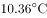，较常年平均气温偏高，为1951年以来第三高，仅次于2015年（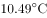）和2007年（）。2016年四季气温均偏高，其中夏季气温为历史最高；除1月偏低、11月接近常年同期外，其余各月均偏高，其中12月偏高，为历史同期最高。全国31个省（区、市）中，仅黑龙江平均气温较常年偏低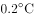，其他省（区、市）气温均偏高，其中青海、甘肃、河南和贵州4省均为1951年以来的历史最高。

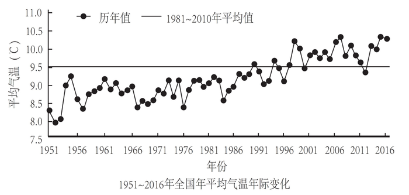

        2016年，全国年降水量范围为3.5毫米（新疆托克逊）～3494.4毫米（安徽黄山），全国平均降水量730.0毫米，较常年（629.9毫米）偏多，比2015年偏多，为1951年以来最多。2月和8月降水偏少，3月接近常年同期，其余各月均偏多，其中1月偏多，10月偏多，均为历史同期最多。

### 第 1 题　qid 2187610 · 平均数

1951-2016年间，全国年平均气温最高的年份是：

- **A**. 1998年
- **B**. 2007年
- **C**. 2015年　✅
- **D**. 2016年

**答案**：C

**官方解析**

定位文字第一段材料可知：“2016年，全国平均气温……为1951年以来第三高，仅次于2015年（）和2007年（）”，故1951-2016年间，全国年平均气温最高的年份是2015年。

故正确答案为C。

---

### 第 2 题　qid 2187612 · 平均数

2016年全国31个省（区、市）中，平均气温较常年偏低的是：

- **A**. 新疆
- **B**. 黑龙江　✅
- **C**. 重庆
- **D**. 贵州

**答案**：B

**官方解析**

定位文字第一段材料可知：“全国31个省（区、市）中，仅黑龙江平均气温较常年偏低，其他省（区、市）气温均偏高。”故2016年全国31个省（区、市）中，平均气温较常年偏低的是黑龙江。

故正确答案为B。

---

### 第 3 题　qid 2187615 · 平均数

2015年全国平均降水量为：

- **A**. 730.0毫米
- **B**. 646.0毫米　✅
- **C**. 629.9毫米
- **D**. 612.6毫米

**答案**：B

**官方解析**

根据题干“2015年全国平均降水量为……”，结合文字材料时间为2016年，可判定本题为基期计算问题。定位文字第二段材料可知：“2016年，全国平均降水量730.0毫米……比2015年偏多。”故2015年全国平均降水量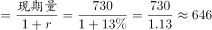毫米。

故正确答案为B。

---

### 第 4 题　qid 2187617 · 综合

与常年同期相比，2016年降水偏少的月份是：

- **A**. 1月和10月
- **B**. 3月和12月
- **C**. 2月和8月　✅
- **D**. 2月和10月

**答案**：C

**官方解析**

定位文字材料第二段可知，2016年全国年降水量，2月和8月降水偏少。
故正确答案为C。

---

### 第 5 题　qid 2187622 · 平均数

下列可由所给资料得出的数据有：
①2016年各季度气温均值
②青海、甘肃、河南和贵州4省平均气温偏高率
③2015年全国年降水范围
④2016年1月、10月月降水量之差

- **A**. 0个　✅
- **B**. 1个
- **C**. 2个
- **D**. 3个

**答案**：A

**官方解析**

①：定位文字材料第一段可得，“2016年四季气温均偏高，其中夏季气温为历史最高；除1月偏低、11月接近常年同期外，其余各月均偏高，其中12月偏高，为历史同期最高。”关于2016年各季度气温均值并无相关具体数据，故无法得出；

②：定位文字材料第一段可得，“全国31个省（区、市）······，其中青海、甘肃、河南和贵州4省均为1951年以来的历史最高”，无气温相关数据，故无法得出；

③：定位文字材料第二段可得，“2016年，全国年降水量范围为3.5毫米（新疆托克逊）～3494.4毫米（安徽黄山）”，只能得出2016年全国年降水范围，无其他相关数据，故无法得出；

④：定位文字材料第二段可得，“2月和8月降水偏少，······其中1月偏多、10月偏多，均为历史同期最高”，无2016年1月和10月降水量相关数据，故无法得出。

①②③④均无法得出。

故正确答案为A。

---

## 材料 2

<b>根据以下资料，回答下列小题。</b>

        2016年，全年原创首演剧目1423个，扶持了100名京剧、地方戏表演艺术家向200名青年演员传授经典折子戏。第十一届中国艺术节共汇聚67台参评参演剧目和1000余件美术作品，观众达40万人次。国家艺术基金2016年共有966个项目获得立项资助，较2015年增长了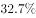，资助资金总额7.3亿元。

        2016年末全国共有艺术表演团体12301个，比上年末增加1514个，从业人员33.27万人，增加3.08万人。其中各级文化部门所属的艺术表演团体2031个，占；从业人员11.52万人，占。

        全年全国艺术表演团体共演出230.60万场，比上年增长，其中赴农村演出151.60万场，增长；国内观众11.81亿人次，增长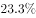，其中农村观众6.21亿人次，比上年增长；总收入311.23亿元，比上年增长，其中演出收入130.86亿元，增长。

        全年全国各级文化部门所属艺术表演团体共组织政府采购公益演出13.90万场，观众1.17亿人次。利用流动舞台车演出11.31万场次，观众10381万人次。中央直属院团全年开展公益性演出1335场，其中赴老少边穷地区演出241场，面向老红军、留守儿童等演出132场。

        年末全国共有艺术表演场馆2285个，观众坐席数168.93万个。全年馆内艺术演出19.09万场次，增长；艺术演出观众3098万人次，增长。其中各级文化部门所属艺术表演场馆1265个，全年共举行艺术演出6.81万场次，增长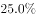，艺术演出观众2589万人次，增长。

        年末全国国有美术馆462个，比上年末增加44个，从业人员4597人，增加502人。全国共举办展览6146次，比上年增长，参观人次3237万，增长。

### 第 6 题　qid 2187625 · 综合

2015年末，全国拥有艺术表演团体的数量是：

- **A**. 10787个　✅
- **B**. 12301个
- **C**. 14237个
- **D**. 22031个

**答案**：A

**官方解析**

根据题干“2015年末······的数量是”，结合材料时间是2016年末，可判定本题为基期计算问题。定位材料第二段可得：“2016年末全国艺术表演团体12301个，比上年末增加1514个”。故2015年末全国拥有艺术表演团体的数量是：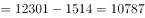个。

故正确答案为A。

---

### 第 7 题　qid 2188888 · 比重

在2015年全国艺术表演团体演出场次中，赴农村演出占比约为：

- **A**. 

- **B**. 

- **C**. 

　✅
- **D**. 
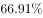

**答案**：C

**官方解析**

根据题干“在2015年······中，······占比约为”，结合材料时间是2016年，可判定本题为基期比重问题。定位材料第三段可得：“全年全国艺术表演团体共演出230.60万场，比上年增长，其中赴农村演出151.60万场，增长”。根据基期比重公式可得：，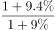略大于1，则最终结果略大于，C项最为接近。

故正确答案为C。

---

### 第 8 题　qid 2188651 · 综合

与2015年相比，2016年国家艺术基金获立项资助项目、国有美术馆数量、艺术表演场馆艺术演出场次均为：

- **A**. 匀速发展
- **B**. 小幅增长　✅
- **C**. 大幅萎缩
- **D**. 持续增长

**答案**：B

**官方解析**

定位文字材料的第一段、第五段和最后一段可得，艺术基金获立项资助项目较2015年增长了；艺术表演场馆艺术演出场次比上年增长；国有美术馆462个，比上年末增加44个。可知三者均为增长，排除C项；材料只给出2016年的同比增长情况，没有2015年的同比增长情况，推不出匀速或持续增长，排除A、D两项。

故正确答案为B。

---

### 第 9 题　qid 2187629 · 平均数

在2016年中，下列平均场次观众最多的是：

- **A**. 全国艺术表演团体演出　✅
- **B**. 全国艺术表演团体赴农村演出
- **C**. 全国艺术表演场馆馆内艺术演出
- **D**. 全国各级文化部门所属艺术表演场馆艺术演出

**答案**：A

**官方解析**

根据题干“在2016年中······平均······最多的是”，结合材料时间是2016年，可判定本题为现期平均数问题。

A项：定位材料第三段可得：“全年全国艺术表演团体共演出230.60万场，······国内观众11.81亿人次······”。故全国艺术表演团体演出平均场次观众为：；

B项：定位材料第三段可得：“······其中赴农村演出151.60万场，······其中农村观众6.21亿人次······”。故全国艺术表演团体赴农村演出平均场次观众为：；

C项：定位材料第五段可得：“······全年馆内艺术演出19.09万场次······艺术演出观众3098万人次······”。故全国艺术表演场馆馆内艺术演出平均场次观众为：；

D项：定位材料第五段可得：“······全年共举行艺术演出6.81万场次······艺术演出观众2589万人次······”。故全国各级文化部门所属艺术表演场馆艺术演出平均场次观众为：。

综上比较A项最多。

故正确答案为A。

---

### 第 10 题　qid 2188891 · 平均数

2016年，全国艺术表演团体平均从业人员数和各级文化部门所属艺术表演团体从业人员平均数之比约为：

- **A**. 1:0.346
- **B**. 6:1
- **C**. 1:2　✅
- **D**. 2:3

**答案**：C

**官方解析**

根据题干“2016年，······和······之比约为······”，可判定本题为比值计算问题。定位文字材料第二段可得：“2016年末全国共有艺术表演团体12301个，从业人员33.27万人······各级文化部门所属艺术表演团体2031个，从业人员11.52万人”。故2016年全国艺术表演团体平均从业人员数和各级文化部门所属艺术表演团体从业人员平均数之比约为，即比约为1:2。

故正确答案为C。

---

## 材料 3

<b>根据以下资料，回答下列问</b><b>题。</b>

        某研究设计院向不同岗位级别职工支付的工资额以及该院职工人员结构资料分别如图1和图2。根据资料回答问题。

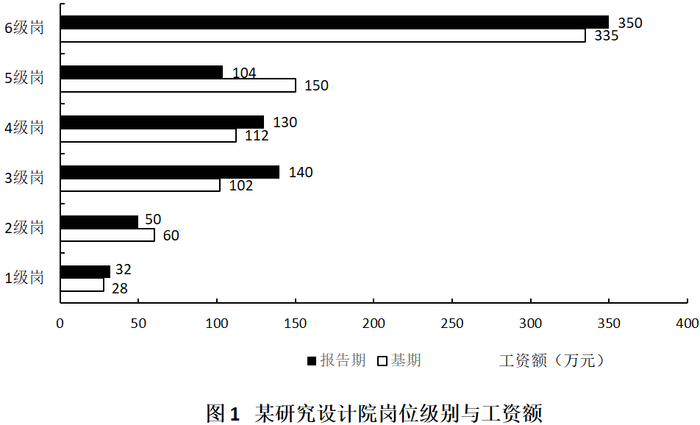

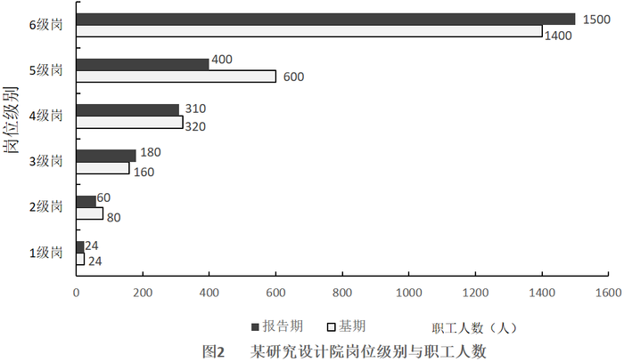

### 第 11 题　qid 2188116 · 平均数

该研究设计院报告期人均工资最高的是：

- **A**. 1级岗　✅
- **B**. 2级岗
- **C**. 3级岗
- **D**. 4级岗

**答案**：A

**官方解析**

根据题干“……人均工资最高”，判定为比值比较题型。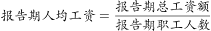。定位统计图，分别计算四个选项的报告期人均工资。

A项：1级岗报告期总工资额为32万元，报告期职工人数为24人。1级岗报告期人均工资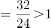

B项：2级岗报告期总工资额为50万元，报告期职工人数为60人。2级岗报告期人均工资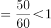

C项：3级岗报告期总工资额为140万元，报告期职工人数为180人。3级岗报告期人均工资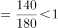

D项：4级岗报告期总工资额为130万元，报告期职工人数为310人。4级岗报告期人均工资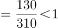

比较四个选项，报告期人均工资最高的是1级岗。

故正确答案为A。

---

### 第 12 题　qid 2188118 · 增长

该研究设计院报告期工资总额较基期的增长率为：

- **A**. 

- **B**. 

　✅
- **C**. 
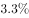

- **D**. 

**答案**：B

**官方解析**

根据题干“……报告期工资总额较基期的增长率为”，判定为一般增长率题型。定位统计图1，分别计算报告期与基期的工资总额。报告期工资总额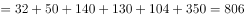万元，基期工资总额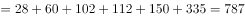万元。根据公式，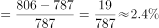。

故正确答案为B。

---

### 第 13 题　qid 2188119 · 综合

下列岗位中，报告期职工人数较基期变化幅度最小的是：

- **A**. 2级岗
- **B**. 3级岗
- **C**. 4级岗　✅
- **D**. 5级岗

**答案**：C

**官方解析**

根据题干“……变化幅度最小的是”，判定为一般增长率比较问题。根据公式，变化幅度不计正负，变化幅度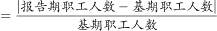。定位统计图2，分别计算四个选项职工人数变化幅度：

A项：2级岗报告期职工人数为60，基期职工人数为80，2级岗变化幅度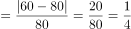；

B项：3级岗报告期职工人数为180，基期职工人数为160，3级岗变化幅度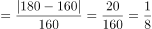；

C项：4级岗报告期职工人数为310，基期职工人数为320，4级岗变化幅度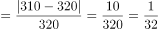；

D项：5级岗报告期职工人数为400，基期职工人数为600，5级岗变化幅度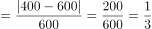。

比较四个选项，4级岗报告期职工人数较基期变化幅度最小。

故正确答案为C。

---

### 第 14 题　qid 2188120 · 平均数

在基期中，超过全院人均工资的岗位有：

- **A**. 1、2、3级岗　✅
- **B**. 2、3、5级岗
- **C**. 4、5、6级岗
- **D**. 1、3、5级岗

**答案**：A

**官方解析**

根据题干“在基期中，······人均工资······”，可判定本题为平均数问题。要求超过全院人均工资的岗位，则只需要比较6级岗位中平均工资排名前三的即可。

定位图1可得：1、2、3、4、5、6级岗的工资额分别为28、60、102、112、150、335万元，定位图2可得：1、2、3、4、5、6级岗的职工人数分别为24、80、160、320、600、1400人，1级岗人均工资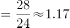万元/人，2级岗人均工资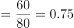万元/人，3级岗人均工资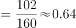万元/人，4级岗人均工资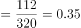万元/人，5级岗人均工资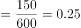万元/人，6级岗人均工资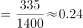万元/人，排名前三的为1级、2级、3级。

故正确答案为A。

---

### 第 15 题　qid 2188887 · 综合

下列说法正确的是：

- **A**. 在基期中，6级岗工资总额大于1~5级岗位工资总额之和
- **B**. 报告期职工数较基期减少主要是因为2、4级岗位职工数的减少
- **C**. 与各级同类数据相比，报告期的1级岗位职工数和6级岗位职工工资总额较基期变化幅度最小　✅
- **D**. 职工数按岗位1~6级，由上向下排列，并不呈现金字塔结构

**答案**：C

**官方解析**

A项，定位图1，基期6级别的工资总额为335万元，1~5级的工资总额为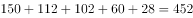万元，前者小于后者，错误；

B项，定位图2， 1~6级别人数的增长量分别为0、-20、20、-10、-200、100，其中2级和5级的人数减少最多，故报告期人数减少主要因为2、5级而非2、4级，错误；

C项，定位图2，1级别的职工数没有变化，即变化幅度为0，小于其他所有级别人数；定位图1，1~6级别的工资总额变化幅度分别为：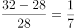；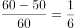；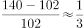；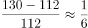；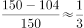；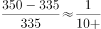；第6级别的变化幅度明显最小，正确；

D项，定位图2，报告期和基期的职工数从1~6级逐级递增，按岗位1~6级，由上向下排列，呈现金字塔结构，错误。

故本题正确答案为C。

---
