# 2018年421联考《行测》题（陕西卷）（网友回忆版）

> 资料分析 · 20 题 · 陕西 2018

## 材料 1

<b>根据以下资料，回答66—70题。</b>

        2017年，某省全省园林水果面积1987.30万亩，比上年增长。其中，苹果的挂果面积为726.21万亩，同比增长；梨的挂果面积为61.29万亩，同比增长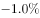；柑桔的挂果面积为40.26万亩，同比增长；桃的挂果面积为45.05万亩，同比增长；猕猴桃的挂果面积为64.76万亩，同比增长；葡萄的挂果面积为54.05万亩，同比增长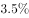；枣的挂果面积为262.74万亩，同比增长；柿子的挂果面积为37.80万亩，同比增长；杏的挂果面积为45.42万亩，同比增长；石榴的挂果面积为6.51万亩，同比增长；樱桃的挂果面积为10.92万亩，同比增长。

        2017年，该省全省园林水果产量1801.02万吨，增长。其中，苹果的产量为1153.94万吨，同比增长；梨的产量为110.37万吨，同比增长；柑桔的产量为54.06万吨，同比增长为；桃的产量为84.61万吨，同比增长；猕猴桃的产量为138.97万吨，同比增长；葡萄的产量为68.15万吨，同比增长；枣的产量为87.23万吨，同比增长；柿子的产量为40.63万吨，同比增长；杏的产量为20.21万吨，同比增长；石榴的产量为10.34万吨，同比增长；樱桃的产量为13.66万吨，同比增长。

### 第 1 题　qid 2188145 · 综合

2017年，该省单位面积产量最高的水果是（  ）。

- **A**. 梨
- **B**. 苹果
- **C**. 桃
- **D**. 猕猴桃　✅

**答案**：D

**官方解析**

根据题干“2017年该省单位面积产量最高的水果是······”，可判定此题为现期平均数问题。定位文字材料第一段“2017年苹果的挂果面积为726.21万亩,梨的挂果面积为61.29万亩，桃的挂果面积为45.05万亩，猕猴桃的挂果面积为64.76万亩”。

定位文字材料第二段“2017年苹果的产量为1153.94万吨，梨的产量为110.37万吨，桃的产量为84.61万吨，猕猴桃的产量为138.97万吨”。

根据平均数公式：单位面积产量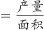可得：

苹果的单位面积产量,

梨的单位面积产量,

桃的单位面积产量，

猕猴桃的单位面积产量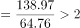，因此2017年单位面积产量最高的水果是猕猴桃。

故正确答案为D。

---

### 第 2 题　qid 2188148 · 综合

2017年，该省挂果面积最大水果的总产量约是挂果面积最小水果的总产量的（  ）倍。

- **A**. 112　✅
- **B**. 84
- **C**. 57
- **D**. 28

**答案**：A

**官方解析**

根据题干“2017年，该省······是······的多少倍”，可判定此题为现期倍数问题。定位文字材料第一段，可直接找出该省挂果面积最大的水果是苹果（726.21万亩），挂果面积最小的水果是石榴（6.51万亩）；由此定位文字材料第二段“苹果的产量为1153.94万吨”和“石榴的产量为10.34万吨”，则2017年，该省挂果面积最大水果的总产量是挂果面积最小水果的总产量的倍，与A项最为接近。

故正确答案为A。

---

### 第 3 题　qid 2188149 · 增长

2017年，该省挂果面积同比增速最高水果的单位面积产量约为（  ）斤/亩。

- **A**. 332
- **B**. 445
- **C**. 664　✅
- **D**. 1075

**答案**：C

**官方解析**

根据题干“2017年，······的单位面积产量约为······斤/亩”，可判定此题为现期平均数问题。定位文字材料第一段，可直接找出该省挂果面积同比增速最高的水果是枣（），定位文字材料第一段“枣的挂果面积为262.74万亩”和第二段“枣的产量为87.23万吨”，可求得2017年枣的单位面积产量为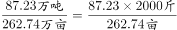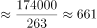斤/亩，与C项最接近。

故正确答案为C。

---

### 第 4 题　qid 2188152 · 综合

2017年，单位面积产量超过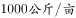的水果共有（  ）种。

- **A**. 8
- **B**. 9　✅
- **C**. 10
- **D**. 11

**答案**：B

**官方解析**

根据题干“2017年，单位面积产量······”，结合材料时间为2017年，可判定本题为现期平均数问题。定位材料第一段和第二段，可分别得知各类水果的挂果面积和产量。

根据公式：单位面积产量=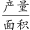，可分别得出各类水果的单位面积产量：

苹果：吨/亩、梨：吨/亩、柑桔：吨/亩、桃：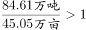吨/亩、猕猴桃：吨/亩、葡萄：吨/亩、枣：吨/亩、柿子：吨/亩、杏：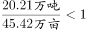吨/亩、石榴：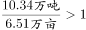吨/亩、樱桃：吨/亩。1吨/亩=1000公斤/亩，故各类水果中单位面积产量超过1000公斤/亩的水果有：苹果、梨、柑桔、桃、猕猴桃、葡萄、柿子、石榴、樱桃，共9个。

故正确答案为B。

---

### 第 5 题　qid 2188156 · 综合

根据上述资料，下列说法中不正确的一项是（  ）。

- **A**. 2017年，共有5种水果的单位面积产量同比有所降低
- **B**. 2017年，单位面积产量及同比增速均最低的水果是同一种水果
- **C**. 2016年，单位面积产量低于柿子的水果仅有两种
- **D**. 2016年，单位面积产量从高到低的水果排序是苹果、柑桔、葡萄、樱桃　✅

**答案**：D

**官方解析**

A项：定位材料第一段和第二段，可以分别得知各类水果挂果面积和产量的同比增速，根据结论：当产量同比增速面积同比增速时，单位面积产量同比降低，可知2017年，各类水果单位面积产量同比有所降低的水果有：猕猴桃（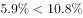）、葡萄（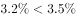）、枣（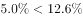）、杏（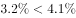）、樱桃（），共5种，正确；

B项：根据第69题，可知2017年单位面积产量最低的水果是枣（0.3吨/亩）；根据公式：单位面积产量同比增速=，当时，单位产量同比增速为负数，则各类水果中单位面积产量的同比增速为负数的水果分别为：猕猴桃（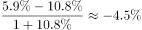）、葡萄（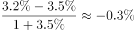）、枣（）、杏（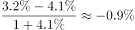）、樱桃（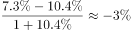），最小的是枣，正确；

C项：根据公式：基期单位面积产量=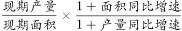，可知2016年各类水果的单位面积产量分别为：苹果（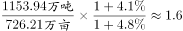吨/亩）、梨（吨/亩）、柑桔（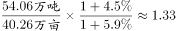吨/亩）、桃（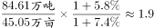吨/亩）、猕猴桃（吨/亩）、葡萄（吨/亩）、枣（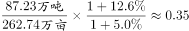吨/亩）、柿子（吨/亩）、杏（吨/亩）、石榴（吨/亩）、樱桃（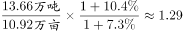吨/亩），则2016年，单位面积产量低于柿子（1吨/亩）的水果有：枣（0.3吨/亩）、杏（0.4吨/亩），共两种，正确；

D项：根据C选项计算可知：2016年樱桃单位面积产量（1.29吨/亩）＞葡萄（1.26吨/亩），错误。

本题为选非题，故正确答案为D。

---

## 材料 2

<b>二、根据以下资料，回答</b><b>71--75题。</b>

        2017年，我国电信业务收入12620亿元，比上年增长，增速同比提高1个百分点。其中，2017年全年固定通信业务收入完成3549亿元，比上年增长，在电信业务收入中占比为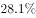。2017年，在固定通信业务中固定数据及互联网业务收入达到1971亿元，比上年增长，拉动电信业务收入增长1.4个百分点，对全行业业务收入增长贡献率达。2017年全年移动通信业务实现收入9071亿元，比上年增长，在电信业务收入中占比为。2017年，在移动通信业务中移动数据及互联网业务收入5489亿元，比上年增长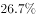，对收入增长贡献率达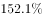。

### 第 6 题　qid 2188151 · 增长

2017年我国电信业务收入同比增加了大约（  ）亿元。

- **A**. 681
- **B**. 759　✅
- **C**. 808
- **D**. 818

**答案**：B

**官方解析**

根据题干“2017年······同比增加了大约······亿元”，可判定本题为增长量计算问题。定位文字材料：“2017年我国电信业务收入12620亿元，比上年增长”，故2017年我国电信业务收入同比增长量亿元，与B项最接近。

故正确答案为B。

---

### 第 7 题　qid 2188157 · 综合

2017年固定数据及互联网业务收入占电信业务收入的（  ）。

- **A**. 

- **B**. 

- **C**. 

- **D**. 

　✅

**答案**：D

**官方解析**

根据题干“2017年······占······”，可判定本题为现期比重问题。定位文字材料可知，2017年我国电信业务收入12620亿元，固定数据及互联网业务收入为1971亿元，故所求的比重。

故正确答案为D。

---

### 第 8 题　qid 2188159 · 比重

2017年移动数据及互联网业务收入在电信业务收入中的比重比2016年提高了大约（  ）。

- **A**. 

　✅
- **B**. 

- **C**. 

- **D**. 

**答案**：A

**官方解析**

根据题干“2017年······比重比2016年提高了大约······”，可判定本题为两期比重计算问题。定位文字材料可知，移动数据及互联网业务收入()5489亿元，同比增速()，电信业务收入()12620亿元，同比增速()。代入两期比重差值公式，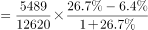，即提高了6.9个百分点，与A项最接近。

故正确答案为A。

---

### 第 9 题　qid 2188160 · 增长

2017年移动数据及互联网业务收入拉动电信业务收入增长约（    ）个百分点。

- **A**. 7.2
- **B**. 8.2
- **C**. 9.7　✅
- **D**. 10.7

**答案**：C

**官方解析**

根据题干“拉动······增长······个百分点”，可判定本题为拉动增长率问题。定位材料文字部分可得：移动数据及互联网业务收入5489亿元，比上年增长26.7%，可计算出移动数据及互联网业务收入增长量=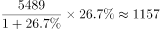；定位材料文字部分可得：我国电信业务收入12620亿元，比上年增长，可计算出电信业务收入基期量=，故移动数据及互联网业务收入拉动电信业务收入增长的百分点=，与C项最接近。

故正确答案为C。

---

### 第 10 题　qid 2188164 · 综合

根据以上资料，下列说法中正确的一项是（  ）。

- **A**. 
2013-2017年，移动通信业务收入在我国电信业务收入中的占比均高于
　✅
- **B**. 
2013-2017年，移动数据及互联网业务收入在移动通信业务收入中的占比均高于

- **C**. 
2013-2017年，固定数据及互联网业务收入在固定通信业务收入中的占比均高于

- **D**. 
2013-2017年，固定通信业务收入的年度同比增速均高于同年我国电信业务收入的年度同比增速

**答案**：A

**官方解析**

A项：定位文字材料可知，2017年移动通信业务收入在我国电信业务收入中的占比为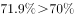；定位图表可知各年移动通信业务收入和我国电信业务收入的增速，则2016年的比重为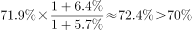，2015年的比重为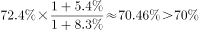，2014年的比重为，2013年的比重为，正确。

B项：定位文字材料可知，2017年移动数据及互联网业务收入在移动通信业务收入中的占比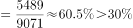；定位图表可知各年移动数据及互联网业务收入和移动通信业务收入的增速，则2016年的比重为，2015年的比重为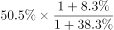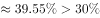，2014年的比重为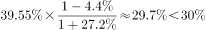，错误。

C项：定位文字材料可知，2017年固定数据及互联网业务收入在固定通信业务收入中的占比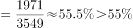；2017年固定数据及互联网收入和固定通信业务收入的增速分别为、，则2016年的比重为，错误。

D项：定位图表，只有2014年、2015年和2017年固定通信业务收入增速高于电信业务收入增速，其余年份均不满足，错误。

故正确答案为A。

---

## 材料 3

根据以下资料，回答76—80题。

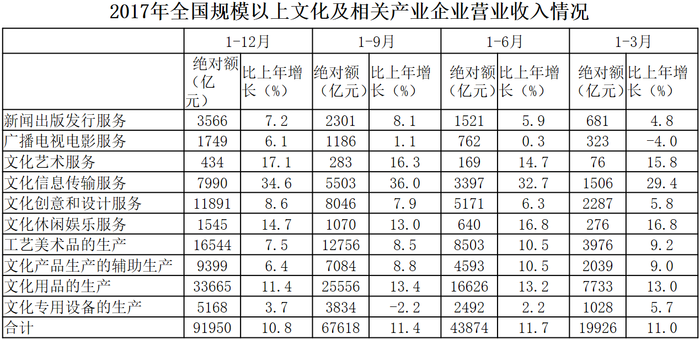

### 第 11 题　qid 2188207 · 增长

2017年全国规模以上文化及相关产业企业营业收入合计数比2016年增加了大约（  ）亿元。

- **A**. 8936
- **B**. 8963　✅
- **C**. 9836
- **D**. 9863

**答案**：B

**官方解析**

根据题干“······增加了大约（    ）亿元”，判定为增长量计算题型。定位统计表，可得：2017年全国规模以上文化及相关产业企业营业收入合计数为91950亿元，比上年增长。选项差距非常小，需要精确计算。根据公式，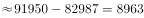亿元。

故正确答案为B。

---

### 第 12 题　qid 2188208 · 增长

2017年（  ）的全国规模以上文化及相关产业企业营业收入合计数的同比增速最高。

- **A**. 第一季度
- **B**. 第二季度　✅
- **C**. 第三季度
- **D**. 第四季度

**答案**：B

**官方解析**

根据题干“······同比增速最高”，判定为增长率比较题型，结合表中数据，没有给出四个季度单独的增长率，需要通过混合增长率来进行定性比较。定位统计表，可得：2017年全国规模以上文化及相关产业企业营业收入合计数1-3月同比增速为，1-6月同比增速为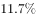，1-9月同比增速为，1-12月同比增速为。

根据混合增长率结论：“混合居中但不中，偏向基数大”。分别判断四个季度：

第一季度：第一季度同比增速即为1-3月同比增速，为；

第二季度：因为1-6月同比增速（）高于1-3月（），混合居中，所以4-6月同比增速1-6月同比增速（）1-3月（）。即第二季度同比增速；

第三季度：因为1-9月同比增速（）低于1-6月（），混合居中，所以7-9月同比增速1-9月同比增速（）1-6月（）。即第三季度同比增速；

第四季度：因为1-12月同比增速（）低于1-9月（），混合居中，所以10-12月同比增速1-12月同比增速（）1-9月（）。即第四季度同比增速。

综上，第二季度同比增速最高。

故正确答案为B。

---

### 第 13 题　qid 2188209 · 增长

2017年第四季度（  ）产业的企业营业收入的环比增速最小。

- **A**. 工艺美术品的生产　✅
- **B**. 文化产品生产的辅助生产
- **C**. 文化用品的生产
- **D**. 文化专用设备的生产

**答案**：A

**官方解析**

根据题干“······环比增速最小”，判定为一般增长率比较题型。根据公式，，第四季度环比增速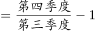，通过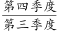比较大小。分别计算四个选项：

A项：工艺美术品的生产1-12月绝对额为16544亿元，1-9月绝对额为12756亿元，1-6月绝对额为8503亿元。所以工艺美术品的生产第四季度绝对额为亿元，第三季度绝对额为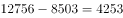亿元。工艺美术品的生产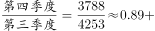；

B项：文化产品生产的辅助生产1-12月绝对额为9399亿元，1-9月绝对额为7084亿元，1-6月绝对额为4593亿元。所以文化产品生产的辅助生产第四季度绝对额为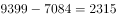亿元，第三季度绝对额为亿元。文化产品生产的辅助生产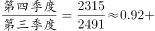；

C项：文化用品的生产1-12月绝对额为33665亿元，1-9月绝对额为25556亿元，1-6月绝对额为16626亿元。所以文化用品的生产第四季度绝对额为亿元，第三季度绝对额为亿元。文化用品的生产；

D项：文化专用设备的生产1-12月绝对额为5168亿元，1-9月绝对额为3834亿元，1-6月绝对额为2492亿元。所以文化专用设备的生产第四季度绝对额为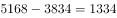亿元，第三季度绝对额为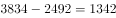亿元。文化专用设备的生产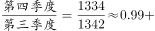。

比较四个选项，A项工艺美术品的生产2017年第四季度企业营业收入环比增速最小。

故正确答案为A。

---

### 第 14 题　qid 2188210 · 增长

2017年第三季度（  ）个产业的企业营业收入实现环比下降。

- **A**. 4
- **B**. 5
- **C**. 6　✅
- **D**. 7

**答案**：C

**官方解析**

定位统计表可得：2017年1-9月、1-6月、1-3月各产业的企业营业收入，那么第三季度的营业收入为，第二季度的营业收入为，可得：

新闻出版发行服务的第三季度营业收入为亿元，第二季度营业收入为亿元，，环比下降，满足；

广播电视电影服务的第三季度营业收入为亿元，第二季度营业收入为亿元，，环比下降，满足；

文化艺术服务的第三季度营业收入为亿元，第二季度营业收入为亿元，，环比上升，不满足；

文化信息传输服务第三季度营业收入为亿元，第二季度营业收入为亿元，，环比上升，不满足；

文化创意和设计服务第三季度营业收入为亿元，第二季度营业收入为亿元，，环比下降，满足；

文化休闲娱乐服务第三季度营业收入为亿元，第二季度营业收入为亿元，，环比上升，不满足；

工艺美术品的生产第三季度营业收入为亿元，第二季度营业收入为亿元，，环比下降，满足；

文化产品生产的辅助生产第三季度营业收入为亿元，第二季度营业收入为亿元，，环比下降，满足；

文化用品的生产第三季度营业收入为亿元，第二季度营业收入为亿元，，环比上升，不满足；

文化专用设备的生产第三季度营业收入为亿元，第二季度营业收入为亿元，，环比下降，满足。

满足条件的有6个。

故正确答案为C。

---

### 第 15 题　qid 2188214 · 综合

根据上述资料，下列说法中不正确的一项是（  ）。

- **A**. 
2016年第二季度所有产业的企业营业收入的环比增速都大于

- **B**. 
2017年第二季度所有产业的企业营业收入的环比增速都大于

- **C**. 
2016年第二季度到第四季度全国规模以上文化及相关产业企业营业收入合计数的环比增速均为正值

- **D**. 
2017年第二季度到第四季度全国规模以上文化及相关产业企业营业收入合计数的环比增速均为正值
　✅

**答案**：D

**官方解析**

观察选项，发现A、B、C三项的计算量特别大，先看D项。

D项：2017年第二季度全国规模以上文化及相关产业企业营业收入合计数为亿元，第一季度营业收入合计数为19926亿元，，第二季度的环比增速为正值；第三季度营业收入合计数为亿元，，第三季度的环比增速为负值，并非均为正值，错误。

本题为选非题，故正确答案为D。

---

## 材料 4

根据以下资料，回答81-85题。

        2017年，全国规模以上工业企业实现主营业务收入116.5万亿元，比上年增长；全国规模以上工业企业发生主营业务成本98.9万亿元，增长；全国规模以上工业企业实现利润总额75187.1亿元，比上年增长，增速比2016年加快12.5个百分点；全国规模以上工业企业主营业务收入利润率（利润总额/主营业务收入）为，比上年提高0.54个百分点。

        2017年，全国规模以上工业企业每百元主营业务收入中的成本为84.92元，比上年减少0.25元；每百元主营业务收入中的费用为7.77元，减少0.2元；每百元资产实现的主营业务收入（）为108.4元，增加3.7元；人均主营业务收入（）为131.5万元，增加15万元。 

### 第 16 题　qid 2188167 · 增长

2017年全国规模以上工业企业实现利润总额比2015年增加了（  ）亿元。

- **A**. 13049
- **B**. 13409
- **C**. 17917　✅
- **D**. 17971

**答案**：C

**官方解析**

由题干“2017年······比2015年增加多少亿元”，判定此题为间隔增长量问题。定位文字材料“2017年…全国规模以上工业企业实现利润总额75187.1亿元，比上年增长，增速比2016年加快12.5个百分点”，可得2016年全国规模以上工业企业实现利润总额增长率，根据间隔增长率公式可得，。选项差距非常小，需要精确计算。根据公式，。C选项最接近。

故正确答案为C。

---

### 第 17 题　qid 2188168 · 综合

2017年经济类型按主营业务收入利润率由低到高的排序是（  ）。

- **A**. 私营企业  股份制企业  国有控股企业  外商及港澳台商投资企业　✅
- **B**. 股份制企业  国有控股企业  集体企业  外商及港澳台商投资企业
- **C**. 私营企业  国有控股企业  股份制企业  集体企业
- **D**. 股份制企业  私营企业  集体企业  外商及港澳台商投资企业

**答案**：A

**官方解析**

由题干“2017年…主营业务收入利润率”， 结合表格材料已知2017年主营业务收入及利润总额，判定此题为现期比重问题。定位表格材料，根据利润率公式，，可得各经济类型规模以上工业企业主营业务利润率分别为：

国有控股企业：；集体企业：；股份制企业：；外商及港澳台商投资企业：；私营企业：。结合选项，只有A项正确。

故正确答案为A。

---

### 第 18 题　qid 2188169 · 综合

2017年，员工人数最多的经济类型是（  ）。

- **A**. 国有控股企业
- **B**. 股份制企业　✅
- **C**. 外商及港澳台商投资企业
- **D**. 私营企业

**答案**：B

**官方解析**

由题干“2017年，员工人数最多的经济类型”，结合表格材料已知2017年主营业务收入及人均主营业务收入，判定此题为现期平均数问题。由，可得，因此各主要经济类型规模以上工业企业员工数分别为：

国有控股企业：；股份制企业：；外商及港澳台商投资企业：；私营企业：；所以员工人数最多的经济类型为股份制企业。

故正确答案为B。

---

### 第 19 题　qid 2188170 · 综合

2017年，在主要经济类型中（  ）的负债绝对额是最大的。

- **A**. 国有控股企业
- **B**. 股份制企业　✅
- **C**. 外商及港澳台商投资企业
- **D**. 私营企业

**答案**：B

**官方解析**

根据题干“2017年，在主要经济类型中……负债绝对额是最大的”，结合表格公式：，需要通过负债率和资产总额计算得出，且结合材料时间为现期，判定本题为现期比重问题。定位文字材料和表格可知，，，则，表格已知各经济类型的主营业务收入、每百元资产实现的主营业务收入、资产负债率。国有控股企业负债绝对额亿元，股份制企业负债绝对额亿元，外商及港澳台商投资企业负债绝对额亿元，私营企业负债绝对额亿元，故股份制企业负债绝对额最高。

故正确答案为B。

---

### 第 20 题　qid 2188171 · 综合

根据上述资料，下列说法中正确的一项是（  ）。

- **A**. 
2016年所有经济类型的规模以上工业企业主营业务收入利润率均低于其2017年的主营业务收入利润率

- **B**. 
2016年所有经济类型的规模以上工业企业每百元主营业务收入的成本均高于其2017年每百元主营业务收入的成本

- **C**. 
2016年国有控股规模以上工业企业的实现利润总额占该年所有经济类型规模以上工业企业的实现利润总额合计数的以上

- **D**. 
2016年国有控股规模以上工业企业的主营业务收入占该年所有经济类型规模以上工业企业的主营业务收入合计数的以上
　✅

**答案**：D

**官方解析**

A项：选项主体为所有经济类型规模以上工业企业的数据，表格只给出了主要经济类型规模以上工业企业的数据，数据不全，无法推出全部，错误；

B项：选项主体为所有经济类型规模以上工业企业的数据，表格只给出了主要经济类型规模以上工业企业的数据，数据不全，无法推出全部，错误；

C项：定位文字材料、柱状图和表格可知，2017年规模以上工业企业实现利润总额75187.1亿元，比上年增长，2017年国有控股企业利润总额16651.2亿元，比上年增长。根据，故2016年国有控股规模实现利润总额占所有经济类型规模以上工业企业的利润总额，错误；

D项：定位文字材料、柱状图和表格可知，2017年，全国规模以上工业企业实现主营业务收入116.5万亿元，比上年增长，2017年国有控股企业主营业务收入258367.4亿元，比上年增长。根据基期比重，故2016年国有控股规模以上工业企业的主营业务收入占所有经济类型规模以上工业企业的主营业务收入合计数的比重，正确。

故正确答案为D。

---
