# 2018年上海市公务员录用考试《行测》题（A类）（网友回忆版）

> 资料分析 · 2 题 · 上海 2018

## 材料 1

        2017年8月，国内汽车产销分别完成209.3万辆和218.6万辆，产销量分别比上月增长和，同比分别增长和。当月新能源汽车产销分别完成7.2万辆和6.8万辆，同比分别增长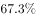和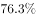。

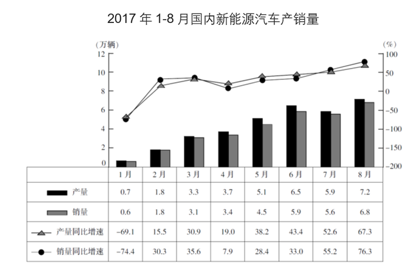

### 第 1 题　qid 2395237 · 增长

2017年1-8月，有（    ）个月新能源汽车产量同比增长率高于销量同比增长率。

- **A**. 3
- **B**. 4　✅
- **C**. 5
- **D**. 6

**答案**：B

**官方解析**

由题干可知本题是找新能源汽车产量同比增长率高于销量同比增长率的月份数，可判定本题为直接找数问题。定位图形材料，新能源汽车产量同比增长率高于销量同比增长率的有1、4、5、6月，总共4个月。
故正确答案为B。

---

### 第 2 题　qid 2395239 · 增长

下列结论中，能够从上述资料中推出的有（    ）个。
①2017年8月新能源汽车销量占汽车销量比重同比上升
②2017年第二季度新能源汽车产量是第一季度的3倍多 
③2016年8月新能源汽车销量高于6月水平 
④2017年1-8月新能源汽车累计产量和累计销量在同一个月内超过10万辆

- **A**. 1
- **B**. 2　✅
- **C**. 3
- **D**. 4

**答案**：B

**官方解析**

①：定位文字和表格材料可得，2017年8月新能源汽车销量同比增速为，2017年8月国内汽车销量同比增速为。根据两期比重结论，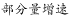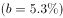，比重上升，正确；

②：定位表格材料可得，2017年1-8月每月的新能源汽车产量，第一季度总产量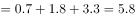万辆，第二季度产量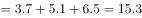万辆，2017年第二季度新能源汽车产量是第一季度的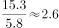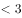，错误；

③：定位表格材料可知，2017年8月新能源汽车销量6.8万辆，同比增速为，2017年6月新能源汽车销量5.9万辆，同比增速为,。根据公式：，可得2016年8月新能源汽车销量万辆，2016年6月新能源汽车销量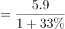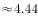万辆，2016年8月新能源汽车销量低于6月水平，错误；

④：定位表格材料可知，2017年1-8月每月的新能源汽车产量和销量，通过计算，前五个月的累计产量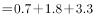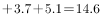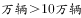，前五个月的累计销量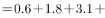，则累计产量和累计销量均在5月内超过10万辆，正确。

故正确答案为B。

---
