# 2018年北京市公务员录用考试《行测》题（网友回忆版）

> 资料分析 · 20 题 · 北京 2018

## 材料 1

<b>一、根据下列统计资料回答问题</b>

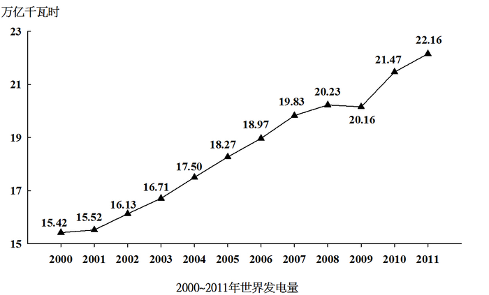

### 第 1 题　qid 2136970 · 增长

2001～2011年间，有      年世界发电量较上年增长1万亿千瓦时以上。

- **A**. 1　✅
- **B**. 2
- **C**. 3
- **D**. 4

**答案**：A

**官方解析**

根据题干“…增长1万亿千瓦时以上…”，可判定本题为增长量计算问题。定位折线图，可得每年世界发电量；根据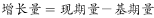，可得，仅有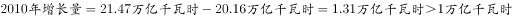，因此只有一年世界发电量较上年增长1万亿千瓦时以上，A项符合。

故正确答案为A。

---

### 第 2 题　qid 2136978 · 比重

2000～2011年间，燃煤发电量占世界发电量比重最高的年份，天然气发电量占世界发电量的比重在2000～2011年间排第     名。

- **A**. 3
- **B**. 4
- **C**. 5　✅
- **D**. 6

**答案**：C

**官方解析**

定位统计表，可得，2000～2011年间，燃煤发电量占世界发电量比重最高为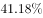，对应年份为2007年；当年天然气发电量占世界发电量的比重为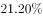，在2000～2011年间排第5名，C项符合。

故正确答案为C。

---

### 第 3 题　qid 2136988 · 综合

2009年世界水力发电量约比核能发电量高      万亿千瓦时。

- **A**. 0.5　✅
- **B**. 1.2
- **C**. 2.8
- **D**. 5.5

**答案**：A

**官方解析**

根据题干“2009年世界水力发电量约比核能发电量高…”，材料给出2009年世界发电量，水力以及核能发电量分别占世界发电量的比重，判定本题为现期比重问题。定位统计图：“2009年世界发电量为20.16万亿千瓦时”；定位统计表：“2009年水力发电量占世界发电量的比重为，核能发电量占世界发电量的比重为”，代入可得，2009年世界水力发电量约比核能发电量，与A项最为接近。

故正确答案为A。

---

### 第 4 题　qid 2137006 · 综合

三峡大坝2010年完成发电量843.70亿千瓦时，约占世界水力发电量的：

- **A**. 

- **B**. 

　✅
- **C**. 

- **D**. 

**答案**：B

**官方解析**

由题干“三峡大坝2010年完成发电量······占世界水力发电量······”，可判定本题为现期比重问题。定位折线图，2010年世界总的发电量为21.47万亿千瓦时。定位表格材料，2010年水力发电量占世界发电量的比重为。若三峡大坝2010年完成发电量843.70亿千瓦时，约占世界水力发电量的比重为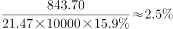。

故正确答案为B。

---

### 第 5 题　qid 2137018 · 综合

能够从上述资料中推出的是：

- **A**. 
2000～2005年，每年燃煤发电量都超过天然气发电量的2倍

- **B**. 
2005年世界发电量较2004年增长了以上

- **C**. 
2011年其他发电量是2000年其他发电量的之间

- **D**. 
2000～2010年间，石油发电量占世界发电量比重逐年下降
　✅

**答案**：D

**官方解析**

A项：定位折线图，2005年世界发电量为18.27万亿千瓦时。定位表格材料，2005年燃煤发电量占世界发电量的比重为，天然气发电量占世界发电量的比重为。则2005年燃煤发电量为天然气发电量的倍数为，错误；

B项：定位折线图，2004年世界发电量为17.50万亿千瓦时，2005年世界发电量为18.27万亿千瓦时。则2005年世界发电量较2004年增长率为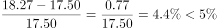，错误；

C项：定位折线图，2000、2011年世界发电量分别为15.42万亿千瓦时、 22.16万亿千瓦时。定位表格材料，2000、2011年其他发电量占世界发电量的比重分别为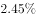、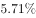，则2011年其他发电量与2000年其他发电量的倍数关系为，错误；

D项：定位表格材料倒数第二列，2000-2010年石油发电量占世界发电量的比重逐年下降（本题比较范围不包括2011年），正确。

故正确答案为D。

---

## 材料 2

<b>二、根据下列统计资料回答问题</b>

       2015年1～11月，北京市20个文化创意产业功能区实现收入7019.8亿元，同比增长，高于全市文化创意产业收入平均增速1.2个百分点，占全市文化创意产业收入的比重为。其中文化科技融合示范功能区实现收入3772.5亿元，同比增长，占20个功能区总收入的；文化金融融合功能区实现收入436.5亿元，同比增长，占20个功能区总收入的。

       传媒影视板块中，CBD-定福庄国际传媒产业走廊功能区、新媒体产业功能区、影视产业功能区分别增长、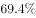和，三个功能区收入合计占20个功能区总收入的；文化休闲板块中，北京老字号品牌文化推广功能区、主题公园功能区分别增长和1.5倍，两个功能区收入合计占20个功能区总收入的。

        2015年1～11月，规模以上互联网信息服务行业实现收入856.5亿元，同比增长，高于全市文化创意产业平均增速15.2个百分点；数字内容服务和其他互联网服务行业分别实现收入17.8亿元和6.3亿元，同比分别增长和；全市重点互联网出版单位实现收入373.2亿元，同比增长。

### 第 6 题　qid 2136874 · 综合

2015年1～11月，北京全市文化创意产业收入在以下哪个范围内？

- **A**. 
低于1万亿元

- **B**. 
在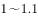万亿元之间
　✅
- **C**. 
在万亿元之间

- **D**. 
高于1.2万亿元

**答案**：B

**官方解析**

由题干“2015年1～11月，北京全市文化创意产业收入在以下哪个范围内”结合材料给出2015年北京市20个文化创意产业功能区实现收入及其占全市文化创意产业收入的比重，可判定此题为现期比重问题。定位材料第一段“2015年1～11月，北京市20个文化创意产业功能区实现收入7019.8亿元······占全市文化创意产业收入的比重为。”故2015年1～11月，北京全市文化创意产业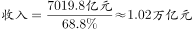，。

故正确答案为B。

---

### 第 7 题　qid 2136888 · 比重

2015年1～11月，文化科技融合示范功能区实现收入占全市文化创意产业收入的比重约比文化金融融合功能区高多少个百分点？

- **A**. 69
- **B**. 48
- **C**. 33　✅
- **D**. 25

**答案**：C

**官方解析**

由题干“2015年1～11月，······占······的比重约比······高多少个百分点”且材料为2015年，判定此题为现期比重问题，定位材料第一段“2015年1～11月，北京市20个文化创意产业功能区······占全市文化创意产业收入的比重为。其中文化科技融合示范功能区，······占20个功能区总收入的；文化金融融合功能区······占20个功能区总收入的。”可知2015年1～11月，文化科技融合示范功能区实现收入占全市文化创意产业收入的比重比文化金融融合功能区高：，即高了33个百分点。

故正确答案为C。

---

### 第 8 题　qid 2136894 · 增长

按照各功能区2015年1～11月的收入增速从高到低的顺序，以下选项中排序正确的是（  ）

- **A**. CBD-定福庄国际传媒产业走廊功能区、新媒体产业功能区、影视产业功能区
- **B**. 北京老字号品牌文化推广功能区、主题公园功能区、新媒体产业功能区
- **C**. 主题公园功能区、北京老字号品牌文化推广功能区、影视产业功能区
- **D**. 新媒体产业功能区、影视产业功能区、北京老字号品牌文化推广功能区　✅

**答案**：D

**官方解析**

定位材料第二段“传媒影视板块中，CBD-定福庄国际传媒产业走廊功能区、新媒体产业功能区、影视产业功能区分别增长、和，······；文化休闲板块中，北京老字号品牌文化推广功能区、主题公园功能区分别增长和1.5倍，”可知CBD-定福庄国际传媒产业走廊功能区收入增速为；新媒体产业功能区收入增速为；影视产业功能区收入增速为；北京老字号品牌文化推广功能区收入增速为；主题公园功能区收入增速为1.5倍即。选项中符合从高到低排序的只有D项。

故正确答案为D。

---

### 第 9 题　qid 2136898 · 增长

2015年1～11月，规模以上互联网信息服务行业月均同比约增收多少亿元？

- **A**. 13
- **B**. 14　✅
- **C**. 20
- **D**. 30

**答案**：B

**官方解析**

由题目问“2015年1～11月，······月均同比约增收多少亿元”判定本题为现期平均数的增长量计算问题。定位材料第三段“2015年1～11月，规模以上互联网信息服务行业实现收入856.5亿元，同比增长”，2015年1～11月的，则1～11月的月均。

故正确答案为B。

---

### 第 10 题　qid 2136914 · 综合

关于2015年1～11月北京市文化创意产业收入，能够从上述资料中推出的是：

- **A**. 
20个文化创意产业功能区之外的文化创意产业收入增速为

- **B**. 
北京老字号品牌文化推广功能区、主题公园功能区总收入为300多亿元

- **C**. 
上年同期文化科技融合示范功能区收入占20个功能区比重低于
　✅
- **D**. 
其他互联网服务行业同比收入增量多于数字内容服务行业

**答案**：C

**官方解析**

A项：由材料第一段“20个文化创意产业功能区实现收入同比增长，高于全市文化创意产业收入平均增速1.2个百分点，占全市文化创意产业收入的比重为”可得全市文化创意产业收入，20个文化创意产业功能区之外的文化创意产业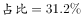。根据“混合增长率居中且偏向基期值较大的”结论可得，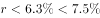，且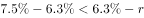，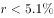，错误；

B项：由材料第一段可得“北京市20个文化创意产业功能区实现收入7019.8亿元”，由材料第二段可得“北京老字号品牌文化推广功能区、主题公园功能区收入合计占20个功能区总收入的”则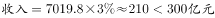，错误；

C项：由材料第一段可得“20个文化创意产业功能区实现收入同比增长，······文化科技融合示范功能区实现收入3772.5亿元，同比增长，占20个功能区总收入的”，根据两期比重公式，比重分子增长率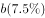，比重上升，故上年同期比重小于今年，正确；

D项：由材料第三段可得“数字内容服务和其他互联网服务行业分别实现收入17.8亿元和6.3亿元，同比分别增长和”，数字内容服务增量：，其他互联网服务业增量：，数字内容服务增量更大，错误。

故正确答案为C。

---

## 材料 3

<b>三、根据下列统计资料回答问题 </b>

      2016年，某市全年实现工业增加值3884.9亿元，比上年增长。其中，规模以上工业增加值增长。在规模以上工业中，国有控股企业增加值增长；股份合作企业、外商及港澳台企业增加值分别增长和；高技术制造业、现代制造业、战略性新兴产业增加值分别增长、和。规模以上工业实现销售产值17447.3亿元，增长。其中，内销产值16500.4亿元，增长；出口交货值946.9亿元，下降。

       规模以上工业企业实现利润1549.3亿元，比上年下降。重点行业中，电力、热力生产和供应业实现利润490.1亿元，下降；汽车制造业实现利润367.8亿元，增长；医药制造业实现利润150.7亿元，增长；计算机、通信和其他电子设备制造业实现利润84.8亿元，增长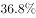；专用设备制造业实现利润73.9亿元，增长。

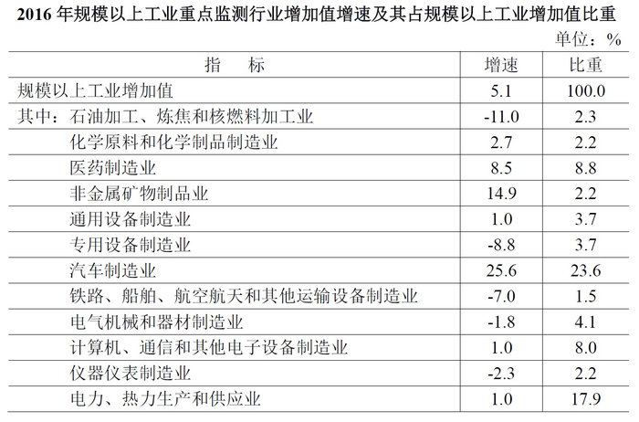

### 第 11 题　qid 2136882 · 综合

2015年该市规模以上专用设备制造业约实现利润多少亿元？

- **A**. 22
- **B**. 33
- **C**. 43　✅
- **D**. 55

**答案**：C

**官方解析**

根据题干所求“2015年该市规模以上专用设备制造业约实现利润”，材料数据为2016年，可判定此题为基期计算问题。定位文字材料第二段，2016年，“专用设备制造业实现利润73.9亿元，增长”。代入公式：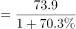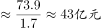。

故正确答案为C。

---

### 第 12 题　qid 2136896 · 比重

2016年该市规模以上医药制造业利润占规模以上工业企业利润的比重，比其增加值占规模以上工业增加值的比重约：

- **A**. 高不到2个百分点　✅
- **B**. 高2个百分点以上
- **C**. 低不到2个百分点
- **D**. 低2个百分点以上

**答案**：A

**官方解析**

根据题干所求“2016年······占······的比重，比······占······的比重约”，选项为百分点变化，材料数据为2016年，可判定此题为现期比重比较问题。定位文字材料第二段，“规模以上工业企业实现利润1549.3亿元······医药制造业实现利润150.7亿元”，则医药制造业利润占规模以上工业企业利润的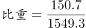，定位表格可得，其增加值占规模以上工业增加值的比重为。所以医药制造业利润占规模以上工业企业利润的比重，比其增加值占规模以上工业增加值的比重约高，即高不到2个百分点。

故正确答案为A。

---

### 第 13 题　qid 2136902 · 比重

在该市规模以上工业重点监测行业中，有几个行业2016年增加值占规模以上工业增加值的比重高于上年水平？

- **A**. 2
- **B**. 3　✅
- **C**. 4
- **D**. 5

**答案**：B

**官方解析**

根据题干所求“有几个行业2016年······占······的比重高于上年水平”，可判定此题为两期比重比较问题。根据两期比重结论，当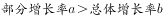时，可判定比重上升。定位表格可得，2016年规模以上工业增加值增速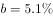，行业增加值增速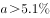的有：医药制造业（）、非金属矿物制品业（）、汽车制造业（），共3个行业。

故正确答案为B。

---

### 第 14 题　qid 2136906 · 增长

该市以下4个产业中，哪个产业2016年增加值增量最高？

- **A**. 医药制造业
- **B**. 非金属矿物制品业
- **C**. 汽车制造业　✅
- **D**. 电力、热力生产和供应业

**答案**：C

**官方解析**

由题干“哪个产业2016年增加值增量最高”，可判定本题为增长量比较问题。定位材料，表格中给了各个产业的增速和其占规模以上工业增加值的比重，故可结合各产业的比重判断其规模以上工业增加值。总量相同，产业所占比重越大，则其工业增加值也就越大。在四个选项中，汽车制造业增加值所占的比重最大，因此可知汽车制造业的工业增加值最大，且由于汽车制造业增加值增速也最大，根据增长量比较中“大大则大”的原则，可知汽车制造业的增加值增量最高。

故正确答案为C。

---

### 第 15 题　qid 2136920 · 综合

能够从上述资料中推出的是：

- **A**. 
2016年该市规模以下工业增加值增速快于规模以上工业增加值增速

- **B**. 
2016年该市规模以上工业出口交货值占销售产值的比重超过
　✅
- **C**. 
2015年该市电力、热力生产和供应业实现利润450多亿元

- **D**. 
2015年该市通用设备制造业增加值不低于专用设备制造业增加值

**答案**：B

**官方解析**

A项：根据文字材料可知该市工业增加值的增速为，而规模以上工业增加值增速为。该市工业分成规模以上工业和规模以下工业两个部分，因此该市工业增加值的增速是由规模以上工业增加值的增速和规模以下工业增加值的增速混合得到，根据混合增速居中，可知规模以下工业增加值的增速应小于，因此2016年规模以下工业增加值增速慢于规模以上工业增加值增速，A项错误；

B项：根据文字材料可知2016年规模以上工业实现销售产值17447.3亿元，出口交货值946.9亿元，比重为，B项正确；

C项：根据文字材料可知2016年电力、热力生产和供应业实现利润490.1亿元，下降，则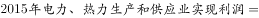，C项错误；

D项：根据表格材料可知2016年通用设备制造业增加值和专用设备制造业增加值所占的比重均为，故二者2016年的增加值相等。，，由于二者2016年增加值即现期量相同，所以2015年通用设备制造业增加值小于2015年专用设备制造业增加值，D项错误。

故正确答案为B。

---

## 材料 4

       2016年B市有农村低保户数28925户，低保人数为46779人；全年累计支出农村低保资金38402.0万元。农村五保供养人数4474人，其中：集中五保供养人数1711人，分散供养人数2763人；全年累计支出农村五保供养资金5668.7万元，比上年增加支出596.3万元。

       2016年B市有城市低保户数48802户，低保人数为81882人；全年累计支出城市低保资金80215.8万元。

### 第 16 题　qid 2136850 · 平均数

2015年B市为每位农村五保人员平均支出的五保供养金约为：

- **A**. 0.8万元
- **B**. 1.1万元　✅
- **C**. 1.3万元
- **D**. 2.1万元

**答案**：B

**官方解析**

文字材料中给的是2016年的数据，而题干为“2015年B市为每位农村五保人员平均支出的五保供养金为······”，可知本题为基期平均数问题。根据“农村五保供养金”定位文字材料第一段 “全年累计支出农村五保供养资金5668.7万元，比上年增加支出596.3万元”，可知2015年B市支出农村五保供养金为万元；由表格可知2015年B市农村五保人数为4451人，则2015年B市为每位农村五保人员平均支出的五保供养金约为万元。

故正确答案为B。

---

### 第 17 题　qid 2136854 · 综合

2007～2016年期间，B市城市低保人数和农村低保人数相差最大的年份是：

- **A**. 2007年　✅
- **B**. 2009年
- **C**. 2013年
- **D**. 2016年

**答案**：A

**官方解析**

根据题干“B市城市低保人数和农村低保人数相差最大的年份”可知，本题为简单加减计算问题。定位到表格，可得2007年、2009年、2013年、2016年B市城市低保人数和农村低保人数分别相差、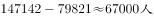、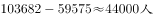、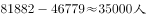，故2007年B市城市低保人数和农村低保人数相差最大。

故正确答案为A。

---

### 第 18 题　qid 2136856 · 增长

2008～2016年，农村低保人数和五保人数均比上年有所下降的有：

- **A**. 7年
- **B**. 6年
- **C**. 5年
- **D**. 4年　✅

**答案**：D

**官方解析**

根据题干“2008～2016年农村低保人数和五保人数均比上年有所下降的”可知，本题在图表中直接找到对应的数比较大小即可。定位到表格可知，农村低保人数和五保人数均比上年有所下降的为2010年、2011年、2012年、2013年，共4年。
故正确答案为D。

---

### 第 19 题　qid 2136858 · 增长

以下折线图反映的是哪个时间段B市城市和农村低保总人数同比下降量的变化趋势？

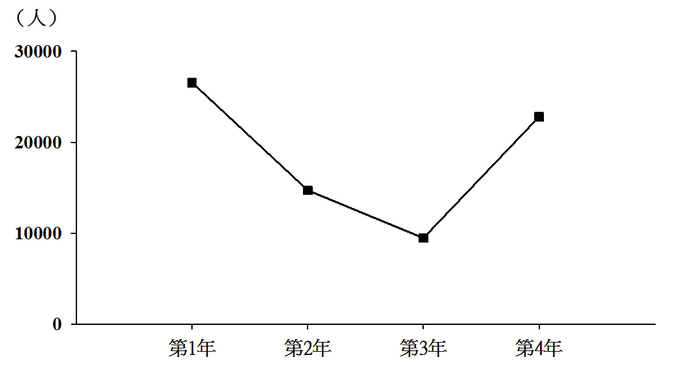

- **A**. 2010～2013年
- **B**. 2011～2014年　✅
- **C**. 2012～2015年
- **D**. 2013～2016年

**答案**：B

**官方解析**

根据题干所求“······同比下降量的变化趋势”，可判定此题为增长量相关问题；通过题干中所给折线图可以读取第1年-第4年的下降量的大概数值，所以可以通过计算每个选项中第1年-第4年下降量的数值来排除选项，属于增长量计算问题。

通过折线图可知，第1年的同比下降量在20000-30000人之间，先通过第1年的下降量来排除选项。定位表格中的数据可知：

A项，2010～2013年，第1年为2010年，城市和农村低保总人数同比下降量约为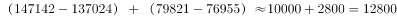人；

B项，2011～2014年，第1年为2011年，城市和农村低保总人数同比下降量约为人；

C项，2012～2015年，第1年为2012年，城市和农村低保总人数同比下降量约为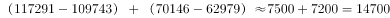人；

D项，2013～2016年，第1年为2013年，城市和农村低保总人数同比下降量约为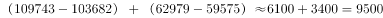人。

A、C、D三项中第1年的下降量均不在20000-30000人之间，和折线图不符，均排除。

故正确答案为B。

---

### 第 20 题　qid 2136860 · 综合

能够从上述资料中推出的是：

- **A**. 2016年农村分散五保供养人数比集中五保供养人数多一倍
- **B**. 2007～2016年城市低保人数呈逐年下降趋势
- **C**. 2016年农村低保人数比上年减少了一成以上
- **D**. 2007～2016年间城市低保户数最多的年份是2009年　✅

**答案**：D

**官方解析**

A项：定位文字材料第一段：“集中五保供养人数1711人，分散供养人数2763人”，所以分散五保供养人数比集中五保供养人数多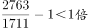，即不足一倍，错误；

B项：定位表格，2008年城市低保人数为145075人，2009年城市低保人数为147142人，所以2008-2009年人数上升，并不是逐年下降，错误；

C项：定位表格，2016年农村低保人数为46779人，2015年农村低保人数为48850人，所以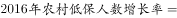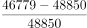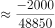，首位商不到1，所以减少不足一成，错误；

D项：定位表格，城市低保户数2009年为74609户，其余年份均低于74609户，所以2009年城市低保户数最多，正确。

故正确答案为D。

---
