# 2018年吉林省选调生录用考试《行测》试题（网友回忆版）

> 资料分析 · 5 题 · 选调 2018

## 材料 1

根据下面资料回答101-105题：

        2017年7月24日，国家新闻出版广电总局发布的《2016年新闻出版产业分析报告》指出，2016年全国出版、印刷和发行服务实现营业收入23595.8亿元，较2015年增加1939.9亿元，增长。其中，数字出版实现营业收入5720.85亿元，比2015年增长，对全行业营业收入增长贡献超三分之二。

        2016年，全国共出版图书、期刊、报纸、音像制品和电子出版物512.53亿册（份、盒、张）。其中，出版图书49.99万种，重版、重印23.75万种。

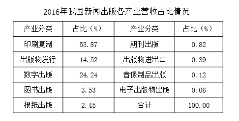

### 第 1 题　qid 2187526 · 综合

2016年与2015年相比，我国新闻出版产业营业收入：

- **A**. 增量提高、增速变大　✅
- **B**. 增量减少、增速变大
- **C**. 增量提高、增速变小
- **D**. 增量减少、增速变小

**答案**：A

**官方解析**

根据题干“2016年与2015年相比，我国新闻出版产业营业收入”，结合选项“增量······，增速······”，可判定此题为增长量比较和增长率比较问题。定位材料中的统计图，2016年新闻出版产业营业收入为23595.8亿元，2015年新闻出版产业营业收入为21655.9亿元，2014年新闻出版产业营业收入为19967.1亿元，则2016年我国新闻出版产业营业收入的增量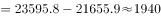亿元，2015年我国新闻出版产业营业收入的增量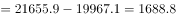亿元，所以2016年与2015年相比，我国新闻出版产业营业收入增量提高。2016年我国新闻出版产业营业收入的增速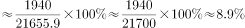，2015年我国新闻出版产业营业收入的增速，则2016年与2015年相比，我国新闻出版产业营业收入增速变大。

故正确答案为A。

---

### 第 2 题　qid 2187528 · 综合

2016年我国图书重版、重印率约为：

- **A**. 

- **B**. 
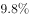

- **C**. 

- **D**. 
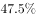
　✅

**答案**：D

**官方解析**

根据题干“2016年我国图书重版、重印率约为”，可判定此题为现期比重问题。定位文字材料第二段“其中，出版图书49.99万种，重版、重印23.75万种”，根据比重公式：，可求得2016年我国图书重版、重印率，与D项最接近。

故正确答案为D。

---

### 第 3 题　qid 2187530 · 综合

2016年我国音像制品出版业营业收入约为：

- **A**. 47亿元
- **B**. 28亿元　✅
- **C**. 12亿元
- **D**. 62亿元

**答案**：B

**官方解析**

根据题干“2016年我国音像制品出版业营业收入约为”，结合材料中统计表已知音像制品出版业营业收入所占比重，可判定此题为现期比重问题。定位文字材料第一段“2016年全国出版、印刷和发行服务实现营业收入23595.8亿元”和统计表中已知音像制品出版业营业收入所占比重为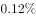，根据比重公式：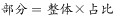，可得2016年我国音像制品出版业营业收入约为亿元，与B项最接近。

故正确答案为B。

---

### 第 4 题　qid 2187532 · 综合

2016年与2012年相比，我国数字出版业营收和新闻出版产业营收：

- **A**. 二者同步增长
- **B**. 后者增长快于前者
- **C**. 前者增长快于后者　✅
- **D**. 二者均出现下降态势

**答案**：C

**官方解析**

根据题干“2016年与2012年相比······”结合选项为增长率比较，可判定本题为一般增长率问题。定位材料统计图可得：数字出版业2016年营收5720.85亿元，2012年营收1935.5亿元；新闻出版业2016年营收23595.8亿元，2012年营收16635.5亿元。故2016年与2012年相比，我国数字出版业营收增长率，新闻出版业营收增长率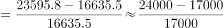，通过比较可得：2016年与2012年相比，我国数字出版业营收增长速度（）&gt;我国新闻出版业营收增长速度（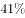）。

故正确答案为C。

---

### 第 5 题　qid 2187533 · 综合

从上述资料中可以得出：

- **A**. 2012-2016年间，我国数字出版业营收增量保持增长势头　✅
- **B**. 2016年，对我国新闻出版产业营收增长贡献最大的是印刷复制业
- **C**. 2016年，我国数字出版业营收占新闻出版产业营收的比例超过三分之二
- **D**. 2016年图书出版物营收与电子出版物营收相当

**答案**：A

**官方解析**

A项：定位材料统计图，可知数字出版业营收增量为：2013年（）2014年（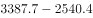）2015年（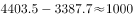）2016年（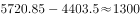），可见增量保持增长势头，正确；

B项：定位材料第一段，可知2016年数字出版实现营业收入对全行业营业收入增长贡献（增长贡献率指部分增量在总体增量中所占的比例）超三分之二，则印刷复制业对全行业营业收入增长贡献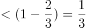，故印刷复制业对全行业营业收入增长贡献数字出版业对全行业营业收入增长贡献，错误；

C项：定位表格，可知2016年我国数字出版业营收占新闻出版产业营收的比例为，小于三分之二，错误；

D项：定位材料统计表，可知2016年图书出版物营收占比（）电子出版物营收占比（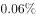），故2016年图书出版物营收电子出版物营收，错误。

故正确答案为A。

备注：A项严格意义上来说需要用我国数字出版业2013年营收增量与2012年营收增量进行比较，虽无法求出2012年营收增量，但其他年份均满足，勉强符合“2012-2016年间，我国数字出版业营收增量保持增长势头”，加上其余三个选项均存在明显错误，综合考虑只能选择A项。

---
