# 2018年四川省公务员录用考试《行测》题（下半年）（网友回忆版）

> 资料分析 · 15 题 · 四川 2018

## 材料 1

 

### 第 1 题　qid 2280935 · 增长

2017年下半年煤炭进口量同比增速最高的月份，当月煤炭进口量比上月约：

- **A**. 
下降

- **B**. 
下降

- **C**. 
上升
　✅
- **D**. 
上升

**答案**：C

**官方解析**

由题干“当月煤炭进口量比上月约”，结合选项为上升/下降+%，可判定本题为一般增长率问题。定位图1，2017年下半年（7-12月）煤炭进口量同比增速最高的月份是2017年9月份，对应增长率为，进口量为2708万吨，上个月即2017年8月，进口量为2527万吨，故当月进口量比上月增长了。

故正确答案为C。

---

### 第 2 题　qid 2280937 · 平均数

2017年下半年，我国平均每月进口原油：

- **A**. 不到3300万吨
- **B**. 在3300～3400万吨之间
- **C**. 在3400～3500万吨之间　✅
- **D**. 超过3500万吨

**答案**：C

**官方解析**

方法一：由题干“2017下半年，我国平均每月进口原油……”，可判定本题为现期平均数问题。定位图2，2017年下半年我国原油进口量即2017年7月～12月的原油进口量分别为3474、3398、3701、3103、3704、3370万吨，平均每月进口原油量=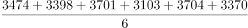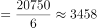万吨，在3400～3500万吨之间。

方法二：削峰填谷，定位图2，2017年下半年我国原油进口量即2017年7月～12月的原油进口量分别为3474、3398、3701、3103、3704、3370万吨，以3400为基准，分别作差为74、-2、301、-297、304、-30，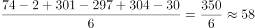，平均数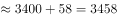万吨，在3400～3500万吨之间。

故正确答案为C。

---

### 第 3 题　qid 2280938 · 平均数

2017年9月和10月，我国原油进口金额分别为136亿美元和121.4亿美元，10月平均每吨原油的进口价格较9月：

- **A**. 上升了不到50美元　✅
- **B**. 上升了50美元以上
- **C**. 下降了不到50美元
- **D**. 下降了50美元以上

**答案**：A

**官方解析**

由题干“10月平均每吨原油的进口价格较9月”，结合选项为上升/下降+单位，可判定本题为平均数的增长量问题。定位图2可知，2017年9月和10月，我国原油进口量分别为3701万吨和3103万吨；由题干可知，2017年9月和10月，我国原油进口金额分别为136亿美元和121.4亿美元。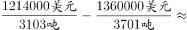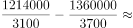，则2017年10月平均每吨原油进口价格较9月上升了不到50美元。

故正确答案为A。

---

### 第 4 题　qid 2280940 · 增长

2017年4月～2018年4月间，原油进口量同比增速超过煤炭进口量同比增速的月份有多少个？

- **A**. 3
- **B**. 5
- **C**. 8
- **D**. 10　✅

**答案**：D

**官方解析**

定位统计图1、统计图2进行比较可知，原油进口量同比增速超过煤炭进口量同比增速的月份有：2017年4月、6月、7月、8月、9月、10月、11月、12月，2018年1月、4月，共计10个月份。
故正确答案为D。

---

### 第 5 题　qid 2280941 · 综合

能够从上述资料中推出的是：

- **A**. 2017年4月，我国原油进口量低于上月水平　✅
- **B**. 2017年4季度，我国煤炭进口量高于上季度水平
- **C**. 2018年1月，我国原油进口量同比增长700万吨以上
- **D**. 2017年2～4季度我国煤炭进口量最高的月份，进口量同比增速也最高

**答案**：A

**官方解析**

A项：定位统计图2可知，2018年3月我国原油进口量为3917万吨，同比增速为，根据，2017年3月我国原油进口量为万吨。2017年4月原油进口量为3439万吨，低于上月水平，正确；

B项：定位统计图1可知，2017年3季度（7-9月）煤炭进口量为万吨，2017年4季度（10-12月）煤炭进口量为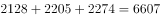万吨，则4季度低于上季度水平，错误；

C项：定位统计图2可知，2018年1月原油进口量4064万吨，同比增速，根据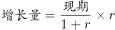，2018年1月原油进口量同比增量为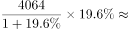万吨，错误；

D项：定位统计图1可知，2017年2～4季度（4-12月）煤炭进口量最高的月份为2017年9月，而同比增速最高的月份是2017年5月，错误。

故正确答案为A。

---

## 材料 2

### 第 6 题　qid 2280930 · 增长

2018年1～2月出口额同比增速最快的两个经济特区，同期进口额之比约为：

- **A**. 1:4
- **B**. 1:7
- **C**. 1:11　✅
- **D**. 1:17

**答案**：C

**官方解析**

根据题干“2018年1～2月······之比”，结合材料给出2018年1～2月的数值，可判定本题为比值计算问题。定位表格材料可知，2018年1～2月出口额同比增速最快的两个经济特区为珠海经济特区和深圳经济特区，它们同期进口额分别为186.3亿元和2064.7亿元，两者之比约为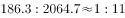。

故正确答案为C。

---

### 第 7 题　qid 2280931 · 比重

已知2018年1～2月全国进出口总额为45158亿元。则同期5大经济特区进出口总额占全国进出口总额的比重约为：

- **A**. 

- **B**. 

　✅
- **C**. 

- **D**. 

**答案**：B

**官方解析**

由题干“2018年1～2月······比重约为”，可判定本题为现期比重问题。定位图表可得5大经济特区进口额和出口额，对其求和：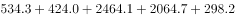。代入公式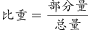，可得：5大经济特区进出口总额占全国进出口总额的比重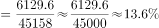，最接近B选项。

故正确答案为B。

---

### 第 8 题　qid 2280933 · 增长

将各经济特区按2018年1～2月进口额同比增量从低到高排序，以下正确的是：

- **A**. 汕头经济特区<深圳经济特区<厦门经济特区
- **B**. 珠海经济特区<汕头经济特区<深圳经济特区
- **C**. 厦门经济特区<珠海经济特区<深圳经济特区　✅
- **D**. 海南经济特区<厦门经济特区<汕头经济特区

**答案**：C

**官方解析**

根据题干“······同比增量从低到高排序······”，可判定本题为增长量比较问题。定位表格可知选项中5大经济特区2018年1～2月进口额以及同比增速。

根据增长量比较大小的结论“大大则大，一大一小百化分”：

深圳经济特区的进口额和同比增速都是5大经济特区中最大的，则深圳经济特区进口额同比增量是最大的，A中深圳排第二，排除A选项；

珠海经济特区的进口额和同比增速都比汕头经济特区要大，则珠海经济特区进口额同比增量大于汕头经济特区，排除B选项；

厦门经济特区进口额为424.0亿元，同比增速，珠海经济特区进口额为186.3亿元，同比增速。代入公式增长量，厦门经济特区的同比增量为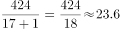亿元，珠海经济特区的同比增量为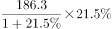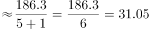亿元，则厦门经济特区&lt;珠海经济特区，C选项正确；

汕头经济特区的进口额为23.8亿元，同比增速，则汕头经济特区进口额增量为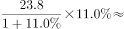亿元，则汕头经济特区&lt;厦门经济特区，排除D选项。

故正确答案为C。

---

### 第 9 题　qid 2280936 · 增长

2018年2月，表中进口额环比下降速度最快的经济特区是：

- **A**. 汕头经济特区　✅
- **B**. 珠海经济特区
- **C**. 厦门经济特区
- **D**. 海南经济特区

**答案**：A

**官方解析**

根据题干“2018年2月···环比下降速度最快···”判定本题为一般增长率问题。定位表格材料可得，2018年1～2月，汕头经济特区、珠海经济特区、厦门经济特区、海南经济特区的进口额分别为23.8亿元、186.3亿元、424.0亿元、53.1亿元；2018年2月，汕头经济特区、珠海经济特区、厦门经济特区、海南经济特区的进口额分别为6.5亿元、67.5亿元、181.2亿元、23.7亿元。代入公式: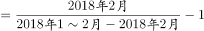可得：

汕头经济特区环比增长率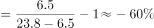；

珠海经济特区环比增长率；

厦门经济特区环比增长率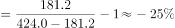；

海南经济特区环比增长率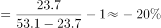。

则汕头经济特区环比增长率下降速度最快。

故正确答案为A。

---

### 第 10 题　qid 2280943 · 综合

能够从上述资料中推出的是：

- **A**. 
2017年1～2月，海南经济特区出口额高于汕头经济特区

- **B**. 
2018年1～2月，深圳经济特区进出口额同比增速高于

- **C**. 
2018年1～2月，进出口额之差高于100亿元的经济特区有且仅有2个

- **D**. 
2018年1～2月，珠海经济特区出口额占5大经济特区比重高于上年同期
　✅

**答案**：D

**官方解析**

A项：定位表格材料可得，2018年1～2月，海南经济特区出口额为22亿元，增长率为，汕头经济特区出口额为59.1亿元，增长率为，根据公式:可得，2017年1～2月，海南经济特区出口额为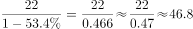亿元，汕头经济特区出口额为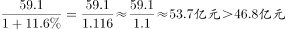，所以2017年1～2月，海南经济特区出口额低于汕头经济特区，错误。

B项：定位表格材料可得，2018年1～2月，深圳经济特区进口额为2064.7亿元，增长率为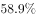，出口额为2464.1亿元，增长率为，根据混合增长率居中不正中，偏向基期量大的可得，出口额基期量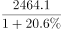＞进口额基期量，增长率位于与之间，则混合增长率低于，错误。

C项：定位表格材料可得，2018年1～2月，厦门经济特区进出口额差值为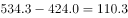亿元、深圳经济特区进出口额差值为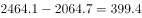亿元、珠海经济特区进出口额差值为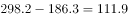亿元、汕头经济特区进出口额差值为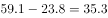亿元、海南经济特区进出口额差值为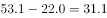亿元，则进出口额之差高于100亿元的经济特区有3个，错误。

D项：定位表格材料可得，2018年1～2月，厦门经济特区、深圳经济特区、珠海经济特区、汕头经济特区、海南经济特区出口额增长率分别为、、、、，根据混合增长率居中原则，5大经济特区混合增长率位于之间，根据两期比重比较原则，当珠海经济特区出口额增长率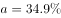＞5大经济特区混合增长率b（和之间）时，珠海经济特区出口额比重高于上年同期，正确。

故正确答案为D。

---

## 材料 3

        2018年3月，国内手机市场出货量3018.5万部，同比下降，2018年1～3月，国内手机市场出货量8737.0万部，同比下降。3月，国内上市新机型80款，同比下降，2018年1～3月，上市新机型206款，同比下降。

        2018年3月，国内4G手机出货量2808.5万部，同比下降，其中4G全网通手机占比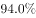；4G上市新机型67款，同比下降，其中4G全网通手机占比。1～3月，4G手机出货量8195.6万部，同比下降，其中4G全网通手机占比；4G上市新机型156款，同比下降，其中4G全网通手机占比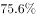。

        2018年3月，国产品牌手机出货量2699.5万部，同比下降；上市新机型78款，同比下降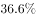。1～3月，国产品牌手机出货量7586.4万部，同比下降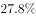；上市新机型190款，同比下降。

        2018年3月，智能手机出货量为2808.3万部，同比下降。1～3月，智能手机出货量为8187.0万部，同比下降。3月，上市智能手机新机型68款，同比下降，其中支持安卓操作系统的手机67款。2018年1～3月，上市智能手机新机型158款，同比下降,其中支持安卓操作系统的手机152款。

### 第 11 题　qid 2280972 · 综合

2017年1～3月，国内手机市场手机月均出货量：

- **A**. 低于0.3亿部
- **B**. 在0.3～0.36亿部之间
- **C**. 在0.36～0.42亿部之间　✅
- **D**. 高于0.42亿部

**答案**：C

**官方解析**

由题干“2017年1~3月······月均出货量”，结合材料时间为2018年，判定本题为基期平均数问题。定位材料第一段可得“2018年1～3月，国内手机市场出货量8737.0万部，同比下降”。代入公式：， 2017年1～3月，国内手机市场出货量，则2017年1～3月，国内手机市场手机月均出货量为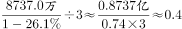亿部。

故正确答案为C。

---

### 第 12 题　qid 2280981 · 综合

2018年1～2月上市4G非全网通手机新机型多少款？

- **A**. 19　✅
- **B**. 27
- **C**. 38
- **D**. 46

**答案**：A

**官方解析**

由材料第二段“2018年3月，国内4G上市新机型67款，其中4G全网通手机占比。1～3月，4G上市新机型156款，其中4G全网通手机占比”，结合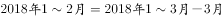；非全网通手机新机型，判断本题为现期比重问题。代入公式：。2018年1～2月上市4G非全网通手机新机型有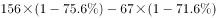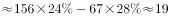款。

故正确答案为A。

---

### 第 13 题　qid 2280996 · 增长

2018年1～2月，国产品牌手机出货量同比约下降了：

- **A**. 

- **B**. 

- **C**. 

　✅
- **D**. 

**答案**：C

**官方解析**

由文字材料第三段“2018年3月，国产品牌手机出货量2699.5万部，同比下降。1～3月，国产品牌手机出货量7586.4万部，同比下降”，，故2018年1~3月国产品牌手机出货量增长率为2018年1~2月和3月的混合增长率，判定本题为混合增长率问题。根据混合增长率问题结论，混合居中不正中，可得：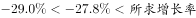，排除D项；根据混合增长率偏向基期量较大的一方，可得：，解得：，排除A、B两项。

故正确答案为C。

---

### 第 14 题　qid 2281002 · 比重

在①国内4G手机出货量、②国产品牌手机出货量、③智能手机出货量中，2018年1～3月出货量占全国手机出货量比重高于上年水平的有几类？

- **A**. 0　✅
- **B**. 1
- **C**. 2
- **D**. 3

**答案**：A

**官方解析**

根据题干“2018年······占······比重高于上年水平······”，可以判定本题为两期比重问题。由两期比重比较结论可知，部分占整体比重高于上年即为部分增长率大于总体增长率。定位文字材料可得2018年1~3月，国内手机市场出货量、国内4G手机出货量、国产品牌手机出货量、智能手机出货量分别同比增长、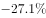、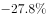，，可得国内4G手机出货量、国产品牌手机出货量、智能手机出货量同比增长率均低于国内手机市场出货量同比增长率（），故国内4G手机出货量、国产品牌手机出货量、智能手机出货量所占比重均低于上年水平。

故正确答案为A。

---

### 第 15 题　qid 2281016 · 平均数

以下信息中，能够从上述资料中推出的有几条？

①2017年3月，国内手机市场上市新机型100多款

②2018年3月，智能手机出货量高于1～3月平均水平

③2018年3月，4G全网通手机出货量是4G非全网通手机的16倍多

④2018年1～3月上市的智能手机新机型中，以上不支持安卓操作系统

- **A**. 1
- **B**. 2　✅
- **C**. 3
- **D**. 4

**答案**：B

**官方解析**

①：定位文字材料第一段，“3月，国内上市新机型80款，同比下降”，代入基期计算公式：可得2017年3月，国内手机市场上市新机型，正确；

②：定位文字材料第四段，“2018年3月，智能手机出货量为2808.3万部，1~3月，智能手机出货量为8187.0万部”，则2018年1~3月智能手机平均每月出货量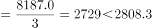，正确；

③：定位文字材料第二段，“2018年3月，国内4G手机出货量2808.5万部，其中4G全网通手机占比”，可得国内4G非全网通手机占国内4G手机出货量比重为，则4G全网通手机出货量是4G非全网通手机的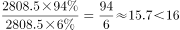倍，错误；

④：定位文字材料第四段，“2018年1~3月，上市智能手机新机型158款，其中支持安卓操作系统的手机152款”，代入公式：可得，不支持安卓操作系统的智能手机新机型占上市智能手机新机型的比重为，错误。

正确的为①②，共2个。

故正确答案为B。

---
