# 2018年国家公务员录用考试《行测》题（副省级网友回忆版）

> 资料分析 · 20 题 · 国考 2018

## 材料 1

<b>根据以下资料，回答下列5题。</b>

        2016年“一带一路”沿线64个国家GDP之和约为12.0万亿美元，占全球GDP的；人口总数约为32.1亿人，占全球总人口的；对外贸易总额（）约为71885.6亿美元，占全球贸易总额的。

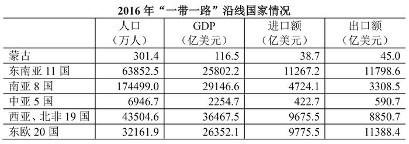

### 第 1 题　qid 2133492 · 综合

2016年全球贸易总额约为多少万亿美元？

- **A**. 28
- **B**. 33　✅
- **C**. 40
- **D**. 75

**答案**：B

**官方解析**

由题干“2016年全球贸易总额”，结合材料“占全球贸易总额的”，可判定此题为现期比重问题。定位文字材料，“对外贸易总额（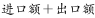）约为71885.6亿美元，占全球贸易总额的”，可得，2016年全球贸易总额。

故正确答案为B。

---

### 第 2 题　qid 2133494 · 平均数

2016年“一带一路”沿线国家中，东欧20国的人均GDP约是中亚5国的多少倍？

- **A**. 2.5　✅
- **B**. 3.6
- **C**. 5.3
- **D**. 11.7

**答案**：A

**官方解析**

由题干“2016年······是······的多少倍”，材料已知时间为2016年，可判定此题为现期倍数问题。定位统计表：“东欧20国的人口为32161.9万人，GDP为26352.1亿美元，中亚5国的人口为6946.7万人，GDP为2254.7亿美元”，可得，东欧20国的，中亚5国的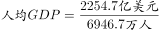，故2016年“一带一路”沿线国家中，东欧20国的人均GDP约是中亚5国的倍，与A项最为接近。

故正确答案为A。

---

### 第 3 题　qid 2133496 · 综合

“一带一路”沿线主要区域中，2016年进口额与出口额数值相差最大的是：

- **A**. 东南亚11国
- **B**. 南亚8国
- **C**. 西亚、北非19国
- **D**. 东欧20国　✅

**答案**：D

**官方解析**

定位统计表，东南亚11国进口额与出口额数值差亿美元；南亚8国进口额与出口额数值差亿美元；西亚、北非19国进口额与出口额数值差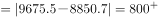亿美元；东欧20国进口额与出口额数值差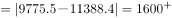亿美元；故“一带一路”沿线主要区域中，2016年进口额与出口额数值相差最大的是东欧20国，D项符合。

故正确答案为D。

---

### 第 4 题　qid 2133500 · 综合

2016年，蒙古GDP约占全球总体GDP的：

- **A**. 
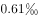

- **B**. 

- **C**. 
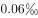

- **D**. 

　✅

**答案**：D

**官方解析**

由题干“2016年，蒙古约占全球······”，可判定本题为现期比重问题。

定位表格第一行，“蒙古GDP为116.5亿美元”；定位文字材料第一段，“2016年，‘一带一路’沿线64个国家GDP之和约为12.0万亿美元，占全球GDP的”。可知，，则2016年蒙古GDP约占全球GDP总体的比重。

故正确答案为D。

---

### 第 5 题　qid 2133504 · 综合

关于“一带一路”沿线国家2016年状况，能够从上述资料中推出的是：

- **A**. 
超过六成人口集中在南亚地区

- **B**. 
东南亚和南亚国家GDP之和占全球的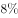以上

- **C**. 
平均每个南亚国家对外贸易额超过1000亿美元
　✅
- **D**. 
平均每个东欧国家的进口额高于平均每个西亚、北非国家的进口额

**答案**：C

**官方解析**

A项：定位表格第三行，南亚8国人口为174499.0万人；定位文字材料第一段，“一带一路”人口总数约为32.1亿人，则南亚人口占“一带一路”总人口比重为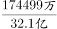，则南亚人口未超过“一带一路”沿线国家的六成，错误。

B项：定位表格第二、第三行，东南亚和南亚国家GDP分别为25802.2亿美元、29146.6亿美元。定位文字材料第一段：“2016年‘一带一路’沿线64个国家GDP之和约为12.0万亿美元，占全球GDP的”，东南亚和南亚国家GDP占“一带一路”沿线国家的比重，即东南亚和南亚国家GDP之和占全球的比重小于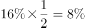，错误。

C项：定位表格第三行，南亚8国的进口额与出口额分别为4724.1亿美元、3308.5亿美元，则平均每个南亚国家对外贸易额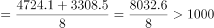亿美元，正确。

D项：定位表格最后两行，平均每个东欧国家的进口额，平均每个西亚、北非国家的进口额。即平均每个东欧国家的进口额低于平均每个西亚、北非国家的进口额，错误。

故正确答案为C。

---

## 材料 2

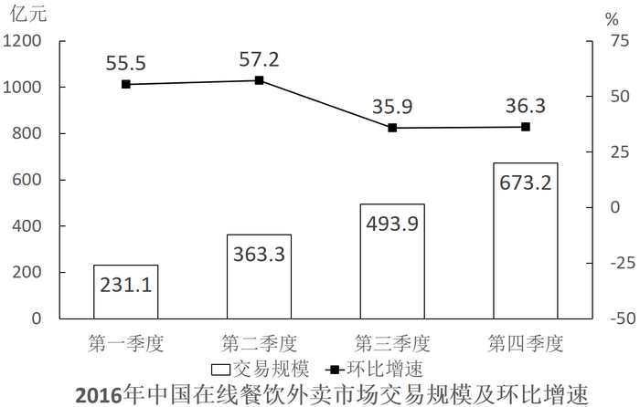

### 第 6 题　qid 2133476 · 增长

2016年在线旅游市场交易规模约比上年增加了：

- **A**. 
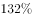

- **B**. 

- **C**. 
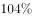

- **D**. 

　✅

**答案**：D

**官方解析**

由题干“2016年比上年增加了……”且选项为百分数，可判定本题为一般增长率问题。定位表格材料可知，在线旅游市场交易规模2015年为4487.2亿元，2016年为6138.0亿元。根据公式，2016年在线旅游市场交易规模约比上年增加了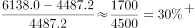，与D项最接近。

故正确答案为D。

---

### 第 7 题　qid 2133480 · 比重

2015年第四季度在线餐饮外卖市场交易规模占全年交易规模的比重约为：

- **A**. 
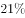

- **B**. 
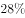
　✅
- **C**. 

- **D**. 

**答案**：B

**官方解析**

根据题干所求“2015年……占……比重”，结合材料，可判定此题为基期比重问题。定位图形材料，2016年第一季度在线餐饮外卖市场交易规模为231.1亿元，环比增速，表格材料中，2015年在线餐饮外卖市场交易规模530.6亿元。可计算出，2015年第四季度在线餐饮外卖市场交易规模占全年交易规模的比重约为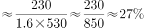，B项最接近。

故正确答案为B。

---

### 第 8 题　qid 2133482 · 增长

如按2016年移动出行市场同比增长趋势估算，2018年该市场规模将为：

- **A**. 接近5000亿元
- **B**. 6000多亿元
- **C**. 8000多亿元　✅
- **D**. 超过1万亿元

**答案**：C

**官方解析**

根据题干所求“如按2016年……同比增长趋势估算，2018年……”，可判定此题为现期计算问题。定位表格材料，2015年移动出行市场交易规模为999.0亿元，2016年移动出行市场交易规模为2038.0亿元。可计算出，2016年移动出行市场增长率为，2018年该市场规模将为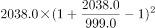亿元。

故正确答案为C。

---

### 第 9 题　qid 2133484 · 增长

以下哪项最能准确描述2016年生活服务电商市场中，三个不同细分市场交易规模同比增量的比例关系？

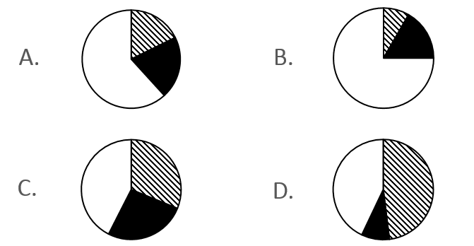

- **A**. A
- **B**. B
- **C**. C　✅
- **D**. D

**答案**：C

**官方解析**

由题干“同比增量的比例关系”，可判定本题为增长量的计算问题。定位图表可知，2016年，在线餐饮外卖市场的同比增量为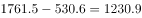亿元；移动出行市场同比增量为亿元；在线旅游市场同比增量为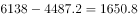亿元。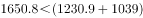，即最大的增量小于另外两者之和，且三者之间不存在明显倍数关系。分析选项，A、B项最大的比另两个加和还大，排除；D项第二大是第三大的几倍，不满足，排除。

故正确答案为C。

---

### 第 10 题　qid 2133488 · 综合

能够从上述资料中推出的是：

- **A**. 2015～2016年在线旅游市场总规模超过1万亿元　✅
- **B**. 2016年每个季度的在线餐饮外卖市场环比增量都高于100亿元
- **C**. 2016年移动出行市场月均交易规模比2015年高100多亿元
- **D**. 2016年下半年在线餐饮外卖市场规模比上半年高1倍以上

**答案**：A

**官方解析**

A项：定位表格，2016年，在线旅游市场规模为6138亿元，2015年，在线旅游市场规模为4487.2亿元，2015～2016年在线旅游市场总规模为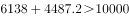亿元，正确；

B项：定位图表，2016年在线餐饮外卖市场交易规模第一季度为231.1亿元，环比增长率为，故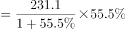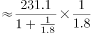，错误；

C项：定位表格可得，2016年移动出行市场交易规模为2038亿元，2015年移动出行市场交易规模为999亿元。故2016年移动出行市场月均交易规模比2015年高：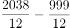亿元，错误；

D项：2016年下半年在线餐饮外卖市场规模比上半年高1倍以上，即下半年是上半年的2倍多，定位图表，下半年市场规模为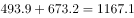亿元，上半年为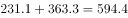亿元，倍，错误。

故正确答案为A。

---

## 材料 3

<b>根据以下资料，回答下列5题。</b>

        2016年，全国城市公园数量排名前五的省份依次是广东、浙江、江苏、山东和云南，公园数量分别为3512个、1171个、942个、828个和683个。其中，广东省的公园面积达到65318公顷，占全国公园面积的比重超过；公园绿地面积达到89591公顷，占全国公园绿地面积的比重约为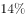。

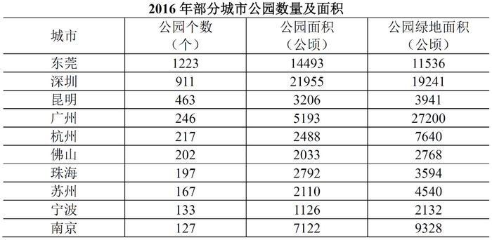

注：公园绿地指具有公园作用的所有绿地的统称，即公园性质的绿地，并非公园中的绿地面积，包括综合公园、专类公园、带状公园、街旁游乐园和社区公园等。

### 第 11 题　qid 2133472 · 平均数

2016年，佛山市平均每个公园的面积约为多少公顷？

- **A**. 10　✅
- **B**. 15
- **C**. 20
- **D**. 25

**答案**：A

**官方解析**

由题干“2016年······佛山市平均每个公园······”，可判定本题为现期平均数问题。定位表格材料，佛山市公园个数202个，公园面积2033公顷。故2016年，佛山市平均每个公园的面积。

故正确答案为A。

---

### 第 12 题　qid 2133474 · 综合

2016年，全国公园绿地面积约为多少万公顷？

- **A**. 200
- **B**. 640
- **C**. 20
- **D**. 64　✅

**答案**：D

**官方解析**

由题干“2016年，全国公园绿地面积······”以及文字材料“······占全国公园绿地面积比重约为······”可判定本题为现期比重问题。定位文字材料可知，2016年，广东公园绿地面积89591公顷，占全国比重约为。故2016年，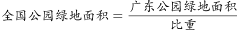，最接近D项。

故正确答案为D。

---

### 第 13 题　qid 2133478 · 综合

表中公园面积大于公园绿地面积的城市有几个？

- **A**. 1
- **B**. 2　✅
- **C**. 3
- **D**. 4

**答案**：B

**官方解析**

定位表格材料可知，；，其余均为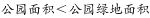。一共两个城市满足条件。

故正确答案为B。

---

### 第 14 题　qid 2133486 · 综合

2016年，杭州公园数量约占浙江省公园总数的：

- **A**. 

　✅
- **B**. 

- **C**. 

- **D**. 

**答案**：A

**官方解析**

由题干“2016年，······约占······的比重”，可判定本题为现期比重问题。定位文字材料，浙江省公园数量1171个；定位表格材料，杭州公园数量217个，故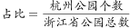，最接近A项。

故正确答案为A。

---

### 第 15 题　qid 2133490 · 综合

关于表中城市公园数量及面积，能够从上述资料中推出的是：

- **A**. 平均每个公园面积最大的城市是深圳
- **B**. 公园绿地面积最大的城市，其公园面积排第3
- **C**. 昆明市公园数量多于云南其他城市公园数量之和　✅
- **D**. 珠海和佛山两市公园面积之和为400多公顷

**答案**：C

**官方解析**

A项：定位表格材料，深圳公园面积为21955公顷，深圳公园个数为911个，故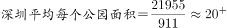；南京公园面积为7122公顷，公园个数127个，故，因此，深圳并不是最大，错误；

B项：定位表格材料，公园绿地面积最大的城市是广州，公园面积排序为：深圳（21955）、东莞（14493）、南京）（7122）、广州（5193）······，广州排名第四，不是第三，错误；

C项：定位文字材料，云南公园数量为683个；定位表格，昆明市公园数量为463个，所以云南其他城市公园数量为，即昆明市公园数量多于云南其他城市公园数量之和，正确；

D项：定位表格材料，珠海公园面积为2792公顷、佛山公园面积2033公顷，故两市公园面积之和为，约为4000多公顷，不是400多，错误。

故正确答案为C。

---

## 材料 4

        2017年1～2月，全国造船完工936万载重吨，同比增长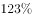；承接新船订单221万载重吨，同比增长。2月末，手持船舶订单9207万载重吨，同比下降，比2016年末下降。 

        2017年1～2月，全国完工出口船907万载重吨，同比增长；承接出口船订单191万载重吨，同比增长。2月末，手持出口船订单8406万载重吨，同比下降。

        2017年1～2月，53家重点监测的造船企业（以下简称重点企业）造船完工912万载重吨，同比增长。承接新船订单197万载重吨，同比增长。2月末，手持船舶订单8874万载重吨，同比下降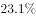。

        2017年1～2月，重点企业完工出口船886万载重吨，同比增长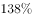；承接出口船订单171万载重吨，同比增长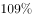。2月末，手持出口船订单8129万载重吨，同比下降。

### 第 16 题　qid 2133502 · 综合

2016年末全国手持船舶订单较同年2月末：

- **A**. 
降低
　✅
- **B**. 
降低

- **C**. 
增加

- **D**. 
增加

**答案**：A

**官方解析**

由题干“2016年末······较同年2月末”，选项为增加/降低百分数，可判定本题为一般增长率计算问题。根据文字材料第一段“（2017年）2月末手持船舶订单9207万载重吨，同比下降，比2016年末下降”可知，现期量2016年末手持船舶订单为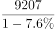万载重吨，基期量2016年2月末手持船舶订单为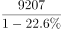万载重吨。代入增长率公式：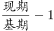，则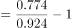，因此增速为降低。

故正确答案为A。

---

### 第 17 题　qid 2133506 · 比重

设2017年1～2月出口船完工量占全国造船完工量比重为，同期出口船承接订单量占全国承接新船订单量比重为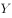，2月末手持出口船订单量占全国手持船舶订单量比重为，则有：

- **A**. 

- **B**. 

　✅
- **C**. 

- **D**. 

**答案**：B

**官方解析**

由题干“······占······的比重为······”，可判定本题为现期比重问题。定位文字材料第一段可知，“2017年1~2月，全国造船完工936万载重吨······承接新船订单221万载重吨······2月末，手持船舶订单9207万载重吨”。定位文字材料第二段可知，“2017年1~2月，全国完工出口船907万载重吨······承接出口船订单191万载重吨······2月末，手持出口船订单8406万载重吨”。则三个比重分别为，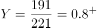，，最小，只有B选项符合。

故正确答案为B。

---

### 第 18 题　qid 2133508 · 增长

2017年1～2月，重点企业下列指标中同比增速最快的是：

- **A**. 造船完工量
- **B**. 承接新船订单量
- **C**. 出口船完工量　✅
- **D**. 承接出口船订单量

**答案**：C

**官方解析**

由题干可知“同比增速最快”可知为增长率比较问题，材料中已经给出了各个主体的增长率，由此可判定本题为直接找数问题。定位文字材料第三、四段可知，2017年1~2月重点企业造船完工量同比增速为、承接新船订单量同比增速为、出口船完工量同比增速为、承接出口船订单量同比增速为，最大，则同比增速最快的是出口船完工量。

故正确答案为C。

---

### 第 19 题　qid 2133510 · 综合

2017年1~2月，非重点企业出口船完工量约占全国出口船完工量的：

- **A**. 

　✅
- **B**. 

- **C**. 
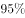

- **D**. 
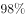

**答案**：A

**官方解析**

由题干“2017年1~2月，······约占······”，可判定本题为现期比重的问题。定位文字材料第二段，全国出口船完工量为907万载重吨，材料中未直接给出非重点企业出口船完工量，第四段给出重点企业出口船完工量为886万载重吨，则非重点企业出口船完工量为万载重吨，因此非重点企业出口船完工量约占全国出口船完工量的比重为。

故正确答案为A。

---

### 第 20 题　qid 2133514 · 综合

能够从上述资料中推出的是：

- **A**. 2016年末，重点企业手持船舶订单不到9000万载重吨
- **B**. 2017年1～2月，非重点企业承接出口船订单约30万载重吨
- **C**. 2017年2月末，重点企业手持船舶订单同比降幅低于全国平均水平
- **D**. 2017年2月末，重点企业手持出口船订单占全国比重低于上年同期　✅

**答案**：D

**官方解析**

A项：材料中未给出2016年末重点企业手持船舶订单的相关数据，无法推出，错误；

B项：定位材料第二段可知，2017年1~2月，全国承接出口船订单191万载重吨；定位材料第四段可知，2017年1~2月，重点企业承接出口船订单171万载重吨，则非重点企业承接出口船订单为万载重吨，错误；

C项：定位文字材料第一段可知，2017年2月末全国手持船舶订单同比下降；定位文字材料第三段可知，重点企业手持船舶订单同比下降，下降幅度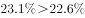，则重点企业手持船舶订单同比降幅高于全国平均水平，错误；

D项：两期比重问题，只需要比较部分增长率和总体增长率的大小即可。定位材料第四段可知，2017年2月末，重点企业手持出口船订单同比增长率为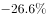；定位材料第二段可知，全国手持出口船订单同比增长率为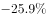，部分增长率小于整体增长率，则比重低于上年同期，正确。

故正确答案为D。

---
