# 2018年山东省选调应届优秀高校毕业生到基层工作笔试行政职业能力测验

> 资料分析 · 10 题 · 选调 2018

## 材料 1

        2017年，原油和天然气生产一降一升。受国际原油市场和国内石油生产开采条件变化等多种因素影响，国内原油产量下降。在相关环保政策和“煤改气”工程的拉动下，天然气需求旺盛；加之非居民用天然气价格下调，企业用气积极性提高，天然气生产持续快速增长。

1.原油生产下降，进口保持较快增长

        2017年，我国原油产量19151万吨，比上年下降，降幅较上年收窄2.8个百分点。2012年以来，原油生产基本稳定，近两年虽略有减产，但仍保持在1.9亿吨以上。

        2017年在国内原油减产、原油加工能力增加等因素推动下，原油进口量突破4亿吨。原油进口量与国内产量之比持续扩大，由2012年的1.3：1扩大到2.2：1。

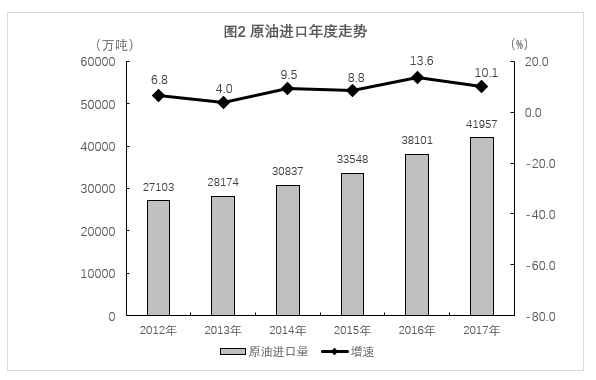

        原油加工量稳步增长。随着国内新增炼厂相继投产，地方炼厂原油进口量增加，2017年原油加工量及成品油生产稳步增长。2017年原油加工量5.7亿吨，比上年增长，增速比上年加快2.2个百分点。成品油生产方面，汽油、煤油和柴油分别比上年增长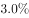、和。

        自2015年开始，获得原油进口权和进口原油使用权的地方炼厂连续两年增加，地方炼厂占原油加工份额不提高。2017年，非国有控股企业原油加工量占全部的比重为，比上年提高了1.8个百分点。

2.天然气生产和进口快速增长 

        受《加快推进天然气利用的意见》《京津冀及周边地区2017年大气污染防治工作方案》等相关政策以及煤炭消费减量替代工作、工业和民用“煤改气”工程全力推进影响，国内天然气消费需求旺盛，拉动天然气产量快速增长。2017年，天然气产量1480.3亿立方米，比上年增长，增速较上年加快6.5个百分点；与2012年相比，产量增加374.3亿立方米，年均增长。

        天然气进口持续快速增长。2017年，天然气进口946.3亿立方米，比上年增长；进口量与国内产量之比由2012年的0.4：1扩大到0.6：1。

### 第 1 题　qid 2661073 · 综合

2011年，我国的原油产量是：

- **A**. 20280万吨
- **B**. 20281万吨
- **C**. 20282万吨　✅
- **D**. 20283万吨

**答案**：C

**官方解析**

根据题干“2011年，我国的原油产量是”，结合材料时间为2012-2017年，可判定本题为基期计算问题。定位图1可得，2012年我国原油产量20748万吨，同比增长。则2011年我国的原油产量万吨，与C项最接近。

故正确答案为C。

---

### 第 2 题　qid 2661075 · 综合

从2012年到2017年，我国原油产量环比变化最大的年份是：

- **A**. 2016年　✅
- **B**. 2015年
- **C**. 2012年
- **D**. 2017年

**答案**：A

**官方解析**

根据题干“从2012年到2017年······产量环比变化最大的年份是”，可判定本题为增长量比较问题。定位图1可得2012年-2017年我国原油产量及2012年我国原油产量的同比增速，根据公式：增长量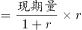，增长量=现期量-基期量，变化量即增长量的绝对值，则2012年到2017年，我国原油产量的变化量分别为：

2012年：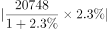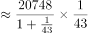万吨；

2013年：万吨；

2014年：万吨；

2015年：万吨；

2016年：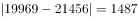万吨；

2017年：万吨。

综上，从2012年到2017年，我国原油产量环比变化最大的年份是2016年。

故正确答案为A。

备注：以年为统计单位时，同比、环比均是和上一年做比较，故同比变化量就是环比变化量。

---

### 第 3 题　qid 2661076 · 综合

从2012年到2017年，我国原油产量极差和原油进口量极差之比是：

- **A**. 1：6
- **B**. 1：6.44　✅
- **C**. 1：6.5
- **D**. 1：6.4

**答案**：B

**官方解析**

根据题干“从2012年到2017年···和···极差之比是”，可判定本题为比值计算问题。定位图1可得，2012-2017年我国原油产量最高值为21456万吨，最低值为19151万吨；定位图2可得，2012-2017年我国原油进口量最高值为41957万吨，最低值为27103万吨。则原油产量极差为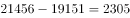万吨，进口量极差为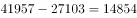万吨，极差之比为2305：148541：6.44。

故正确答案为B。

备注：极差为统计术语，用以表示某项数据最大值与最小值之间的差距。

---

### 第 4 题　qid 2661077 · 平均数

从2012年到2017年，我国平均天然气产量和平均天然气进口量之差是：

- **A**. 660亿立方米
- **B**. 661亿立方米
- **C**. 662亿立方米　✅
- **D**. 663亿立方米

**答案**：C

**官方解析**

根据题干“从2012年到2017年，我国平均···和平均···之差是”，结合材料给出2012-2017年相关数据，可判定本题为现期平均数问题。定位图3、图4可得，2012-2017年我国天然气产量分别为1106、1209、1302、1346、1369、1480亿立方米，天然气进口量分别为421、525、591、611、746、946亿立方米。则所求平均数之差为亿立方米。

故正确答案为C。

---

### 第 5 题　qid 2661079 · 综合

2015年，我国的原油加工量大约是：

- **A**. 5.58亿吨
- **B**. 5.54亿吨
- **C**. 5.43亿吨
- **D**. 5.28亿吨　✅

**答案**：D

**官方解析**

根据题干“2015年，我国的原油加工量大约是”，结合材料给出2017年加工量，可判定本题为间隔基期计算问题。定位文字材料第四段可得，2017年原油加工量5.7亿吨，比上年增长，增速比上年加快2.2个百分点。可知2016年原油加工量同比增速为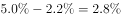，则2017年相对于2015年的间隔增长率，2015年原油加工量亿吨。

故正确答案为D。

---

## 材料 2

        我国自2013年1月开始按照《环境空气质量标准》（GB3095-2012）开展空气质量监测和评价，2018年1月部分城市的评价结果如下表：

        2018年1月部分城市空气质量综合指数与各项污染物指标月均浓度及排名情况

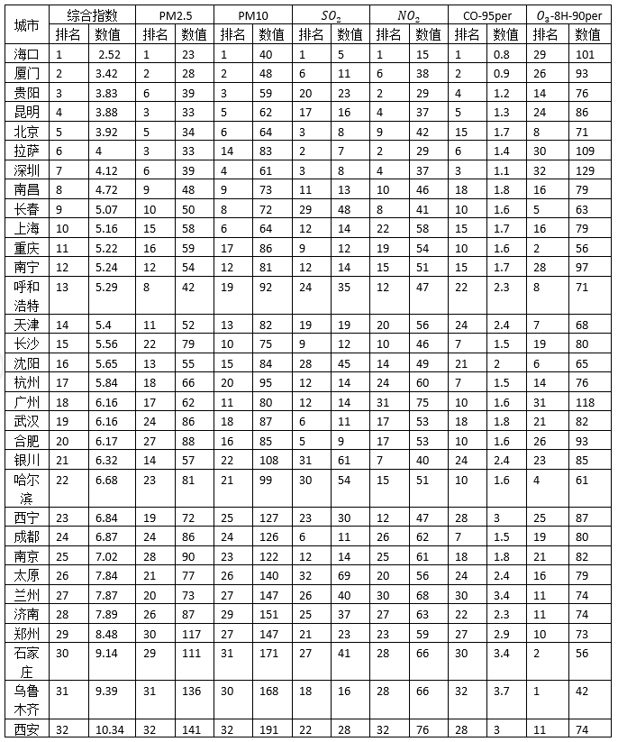

### 第 6 题　qid 2661083 · 综合

在表中所列32个城市中空气质量综合指数最后三名的城市月均PM2.5均值比前三名的城市月均PM2.5均值约高出多少倍？

- **A**. 2.31
- **B**. 3.31　✅
- **C**. 4.31
- **D**. 5.31

**答案**：B

**官方解析**

根据题干“······比······约高出多少倍”，可判定本题为现期倍数问题。定位表格可得空气质量综合指数最后三名的城市月均PM2.5数值分别是111、136、141，均值为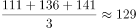；前三名的城市月均PM2.5数值分别是23、28、39，均值为。则最后三名的城市月均PM2.5均值比前三名的城市月均PM2.5均值约高倍，与B项最接近。

故正确答案为B。 

---

### 第 7 题　qid 2661084 · 综合

在表中所列32个城市中各项空气质量指标的极差的最大值和最小值分别是：

- **A**. 118，7.82
- **B**. 118，2.9
- **C**. 151，7.82
- **D**. 151，2.9　✅

**答案**：D

**官方解析**

定位表格可知：综合指数的第1名和第32名分别是2.52、10.34，极差为；PM2.5数值的第1名和第32名分别是23、141，极差为；PM10数值的第1名和第32名分别是40、191，极差为；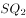数值的第1名和第32名分别是5、69，极差为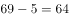；数值的第1名和第32名分别是15、76，极差为；数值的第1名和第32名分别是0.8、3.7，极差为；数值的第1名和第32名名分别是42、129，极差为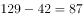。则表中所列32个城市中各项空气质量指标的极差的最大值和最小值分别是151与2.9。

故正确答案为D。 

---

### 第 8 题　qid 2661087 · 综合

2018年1月，北京、上海、广州三城市空气质量各项指标及排名的折线图，正确的是：

- **A**. 

- **B**. 

- **C**. 

- **D**. 

　✅

**答案**：D

**官方解析**

定位表格第2列可知：北京、上海、广州三城市综合指数的排名分别为5、10、18，只有D项符合。
故正确答案为D。

---

### 第 9 题　qid 2661089 · 综合

2018年1月，北京、上海、广州三城市空气质量各项指标的柱形图正确的是：

- **A**. 
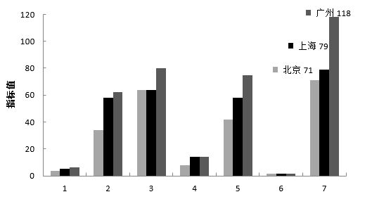
　✅
- **B**. 

- **C**. 

- **D**. 
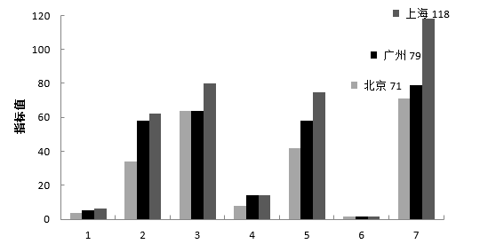

**答案**：A

**官方解析**

定位表格最后1列可知，北京、上海、广州三城市的数值分别为71、79、118，只有A项符合。

故正确答案为A

---

### 第 10 题　qid 2661090 · 综合

在表中所列32个城市中，空气质量的各项指标的相对差异最大的指标是（    ），相对差异是（    ）倍。

- **A**. 
，5.13

- **B**. 
PM2.5，5.13

- **C**. 
，12.8
　✅
- **D**. 
PM2.5，12.8

**答案**：C

**官方解析**

根据题干“······相对差异最大的指标是（    ），相对差异是（    ）倍”，可判定本题为现期倍数问题。结合选项，只需要比较和PM2.5两项即可。定位表格可知：PM2.5数值的第1名和第32名分别是23、141，相对差异为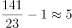；数值的第1名和第32名分别是5、69，相对差异为。则表中所列32个城市中空气质量的各项指标的相对差异最大的指标是，相对差异是12.8倍。

故正确答案为C。

---
